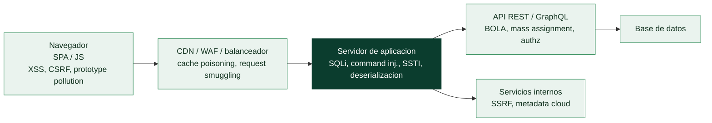

# Clase 086 — Arquitectura web moderna y superficie de ataque

> Parte: **4 — Seguridad de aplicaciones web** · Fuente: *The Web Application Hacker's Handbook (Stuttard & Pinto)*
> ⏱️ Duración estimada: **90 min** · Nivel: **Fundamentos**

---

## 🎯 Objetivo

Entender cómo está construida una aplicación web moderna —navegador, SPA, API, backend, base de datos, servicios cloud— y aprender a dibujar su **superficie de ataque** completa. Sin este mapa mental, el resto de la parte se convierte en probar payloads a ciegas; con él, cada prueba tiene un porqué.

## 📚 Resultados de aprendizaje

Al finalizar, el alumno podrá:

1. **Describir** los componentes de una arquitectura web moderna y su flujo de datos.
2. **Identificar** puntos de entrada (parámetros, cabeceras, cookies, cuerpos JSON, WebSockets).
3. **Diferenciar** controles de seguridad del lado cliente y del lado servidor.
4. **Construir** un diagrama de superficie de ataque a partir de la observación del tráfico HTTP.
5. **Clasificar** activos por sensibilidad para priorizar el testing.

## 🗺️ Temas

| # | Tema | Por qué importa |
|---|------|-----------------|
| 1 | Modelo cliente-servidor y HTTP/HTTPS | Es el canal de todo ataque web |
| 2 | SPA vs. render en servidor (SSR) | Cambia dónde vive la lógica y el estado |
| 3 | APIs REST/GraphQL como backend | La API suele ser la superficie real |
| 4 | Autenticación, sesiones y tokens | Frontera entre anónimo y privilegiado |
| 5 | Proxies, CDN, WAF y balanceadores | Añaden capas que alteran las peticiones |
| 6 | Servicios cloud y metadata | Amplían el impacto de fallos como SSRF |
| 7 | Puntos de entrada de datos | Cada input es un vector potencial |

## 🧠 Explicación en profundidad

### Cada componente que añade funcionalidad añade superficie de ataque

Una aplicación web moderna ya no es un servidor sirviendo páginas. Es una cadena de piezas
—navegador, CDN, WAF, balanceador, servidor de aplicación, API, base de datos, servicios
cloud— y **cada una procesa la entrada del usuario de una forma distinta**, lo que la
convierte en un punto de ataque potencial. Entender esa arquitectura no es un preámbulo
teórico: es lo que permite razonar *dónde* puede fallar algo. Una inyección SQL vive en el
servidor de aplicación; un XSS, en el navegador; un SSRF, en la capacidad del backend de
hacer peticiones; un cache poisoning, en la CDN. Sin el mapa, cada vulnerabilidad de las 29
clases siguientes parecería un truco aislado en lugar de una consecuencia de la arquitectura.



### El desplazamiento al cliente lo cambió todo

La web clásica renderizaba en el servidor (**SSR**): cada clic pedía una página nueva. La web
moderna es en buena parte **SPA** (*single-page application*): el servidor entrega un paquete
de JavaScript que se ejecuta en el navegador y habla con el backend mediante **APIs**
(REST o GraphQL) que devuelven datos, no HTML. Ese cambio tiene dos consecuencias de
seguridad enormes. Primero, **mucha lógica vive ahora en el cliente**, es decir, en un
entorno que el atacante controla por completo: cualquier validación hecha solo en el
navegador es decorativa, porque se salta hablando directamente con la API. Segundo, la
**superficie de ataque se movió a las APIs**, que son endpoints estructurados y a menudo mal
protegidos —de ahí que las clases 110 y 111 les dediquen atención propia—.

La regla que atraviesa toda la parte nace aquí: **nunca confíes en el cliente**. Todo lo que
llega del navegador —parámetros, cabeceras, cookies, cuerpo JSON, orden de los campos— es
entrada potencialmente hostil, y la validación y la autorización de verdad tienen que
ocurrir en el **servidor**.

### Los intermediarios: defensa y nueva superficie a la vez

Entre el usuario y la aplicación hay hoy varias capas que no existían antes. Una **CDN**
cachea contenido cerca del usuario; un **WAF** filtra peticiones con patrones maliciosos
conocidos; un **balanceador** reparte carga. Son defensas útiles, pero introducen su propia
superficie: un WAF se puede **evadir** (codificando el payload de forma que no coincida con
sus firmas pero sí sea interpretado por el backend), una CDN mal configurada permite
**cache poisoning** (clase 112), y la discrepancia entre cómo el proxy y el backend
interpretan una misma petición habilita el **request smuggling** (clase 112). Un principio
que conviene fijar: un WAF **reduce** el ruido y frena lo automático, pero **no sustituye**
al código seguro; tratarlo como la defensa principal es un error clásico.

### Los puntos de entrada de datos, y la joya de la nube

Toda vulnerabilidad web empieza en un **punto de entrada**: un sitio por donde el atacante
mete datos que la aplicación procesa. Enumerarlos es el primer paso de cualquier prueba:
parámetros de URL y de formulario, cabeceras HTTP (incluidas `User-Agent`, `Referer`,
`X-Forwarded-For`), cookies, el cuerpo de las peticiones (JSON, XML, multipart), los campos
de una API y hasta partes de la propia ruta. Y un caso especial que la arquitectura cloud
hizo crítico: el **servicio de metadatos** (`169.254.169.254` en la mayoría de proveedores),
una dirección interna que devuelve credenciales y configuración de la instancia. Si el
backend puede ser inducido a pedirle algo a esa dirección —un SSRF, clase 099—, entrega las
llaves de la infraestructura. Tener el mapa de entradas y de servicios internos es lo que
convierte el pentest web de un tanteo a ciegas en una búsqueda dirigida.

## 📖 Definiciones y características

- **Superficie de ataque**: conjunto de todos los puntos donde un atacante puede introducir o extraer datos. Característica clave: crece con cada parámetro, endpoint y cabecera nuevos.
- **Punto de entrada (input)**: cualquier valor controlable por el cliente (query string, body, header, cookie, path). Característica: todo input no confiable debe validarse en el servidor.
- **Frontera de confianza**: línea que separa lo que controla el cliente de lo que controla el servidor. Característica: los controles del cliente son cosméticos, no de seguridad.
- **SPA (Single Page Application)**: app que renderiza en el navegador y habla con una API. Característica: el código fuente JS es visible y revela endpoints.
- **Endpoint de API**: URL que expone una operación del backend. Característica: suele tener menos protección visual pero igual necesidad de autorización.
- **Metadata endpoint (cloud)**: servicio interno (169.254.169.254) que entrega credenciales temporales. Característica: alcanzable vía SSRF si no se protege.

## 📔 Glosario

| Término | Definición concisa |
|---------|--------------------|
| Cliente-servidor | El navegador pide, el servidor responde sobre HTTP/HTTPS |
| SSR | Renderizado en servidor; cada acción pide una página nueva |
| SPA | Aplicación de una página; JS en el cliente habla con una API |
| API REST / GraphQL | Backend que devuelve datos estructurados, no HTML |
| Nunca confíes en el cliente | La validación real ocurre en el servidor |
| CDN | Red de distribución que cachea contenido cerca del usuario |
| WAF | Firewall de aplicación que filtra peticiones maliciosas |
| Evasión de WAF | Codificar el payload para no coincidir con sus firmas |
| Balanceador | Reparte la carga entre servidores |
| Punto de entrada | Lugar por donde el atacante introduce datos |
| Cabecera HTTP | Metadato de la petición; también es entrada del usuario |
| Servicio de metadatos | `169.254.169.254`; devuelve credenciales de la instancia |
| Superficie de ataque | Conjunto de todos los puntos de entrada y componentes |
| Backend | Servidor de aplicación y sus servicios internos |

## 🧰 Herramientas y preparación

Trabajaremos en un **laboratorio aislado y autorizado**. Nunca escanees aplicaciones de terceros sin permiso explícito.

- Navegador con DevTools (Firefox o Chromium).
- **Burp Suite Community** o **OWASP ZAP** como proxy.
- **OWASP Juice Shop** en local vía Docker:

```bash
docker run --rm -d -p 3000:3000 bkimminich/juice-shop
# Abrir http://localhost:3000
```

## 🧪 Laboratorio guiado

> ⚠️ Ética: solo sobre Juice Shop en tu propia máquina.

1. Levanta Juice Shop y abre `http://localhost:3000`.
2. Abre DevTools → pestaña **Network**. Recarga y observa las llamadas a `/rest/` y `/api/`.
3. Anota cada endpoint distinto en una tabla: método, ruta, parámetros, si requiere token.
4. Inspecciona el **JavaScript** cargado (Sources): busca rutas de API embebidas y roles (`admin`, `accounting`).
5. Configura el navegador para pasar por Burp (proxy `127.0.0.1:8080`). Instala el certificado CA de Burp.
6. Repite la navegación con Burp interceptando: revisa **HTTP history** y filtra por `In-scope`.
7. Dibuja el diagrama: cliente → API (`/rest`, `/api`) → base de datos → servicios (mail, upload). Marca fronteras de confianza.
8. Clasifica endpoints por sensibilidad (login, perfil, pedidos, admin) del 1 al 3.

## ✍️ Ejercicios

1. Lista 10 puntos de entrada distintos en Juice Shop (incluye cabeceras y cookies).
2. Identifica qué controles de seguridad son de cliente (validación JS) y cuáles de servidor.
3. Encuentra en el JS un endpoint que no aparece navegando por la UI.
4. Marca en tu diagrama dónde entra un token de sesión y hasta dónde viaja.
5. Investiga qué es el endpoint de metadata en AWS/GCP/Azure y por qué es sensible.
6. Compara la superficie de ataque de una SPA vs. una app SSR clásica.

## 📝 Reto verificable

Entrega un **diagrama de superficie de ataque** de Juice Shop con al menos 12 puntos de entrada, fronteras de confianza señaladas y una tabla de endpoints priorizada.
**Criterio de aceptación**: el diagrama incluye cliente, API, datos y servicios; cada endpoint tiene método, autenticación requerida (sí/no) y nivel de sensibilidad 1–3.

## ⚠️ Errores comunes

| Síntoma / mensaje | Causa y cómo arreglar |
|-------------------|------------------------|
| Burp no ve tráfico HTTPS | Falta instalar el CA de Burp en el navegador |
| "Confiar solo en la UI" | Endpoints ocultos en el JS; revisa Sources y sitemap |
| Se ignoran cabeceras y cookies | Son inputs válidos; inclúyelos en el mapa |
| Escanear fuera del laboratorio | Ilegal sin permiso; limita el scope en Burp |
| Confundir HTTP/2 con HTTP/1 | Afecta a ataques de smuggling; identifica el protocolo |

## ❓ Preguntas frecuentes

**❓ ¿Por qué no basta con la validación del formulario?**
Porque corre en el cliente y se puede desactivar o saltar con un proxy. La seguridad se decide en el servidor.

**❓ ¿La superficie de ataque de una API es distinta a la de la web?**
Es la misma lógica, pero la API suele exponer más operaciones y menos protecciones cosméticas, así que a menudo es más fértil.

**❓ ¿Necesito Burp Professional?**
No para empezar. Community cubre esta parte; Pro añade el scanner automático y algunas utilidades de Intruder.

## 🔗 Referencias

- Stuttard & Pinto, *The Web Application Hacker's Handbook*, cap. 1–4.
- OWASP WSTG — Information Gathering: <https://owasp.org/www-project-web-security-testing-guide/>
- MDN — Cómo funciona la web: <https://developer.mozilla.org/es/docs/Learn/Getting_started_with_the_web/How_the_Web_works>
- OWASP Juice Shop: <https://owasp.org/www-project-juice-shop/>

## 📥 Material descargable

- 📄 [Guía en PDF](./clase-086-guia.pdf) — versión imprimible de esta clase.
- 🎞️ [Presentación (PPTX)](./clase-086-presentacion.pptx) — deck para proyectar en clase.

## ⬅️ Clase anterior

[Clase 085 — Reporte profesional de pentest](../../parte-3-hacking-etico-y-pentesting-metodologia/085-reporte-profesional-de-pentest/README.md)

## ➡️ Siguiente clase

[Clase 087 — OWASP Top 10: panorama general](../087-owasp-top-10-panorama-general/README.md)
