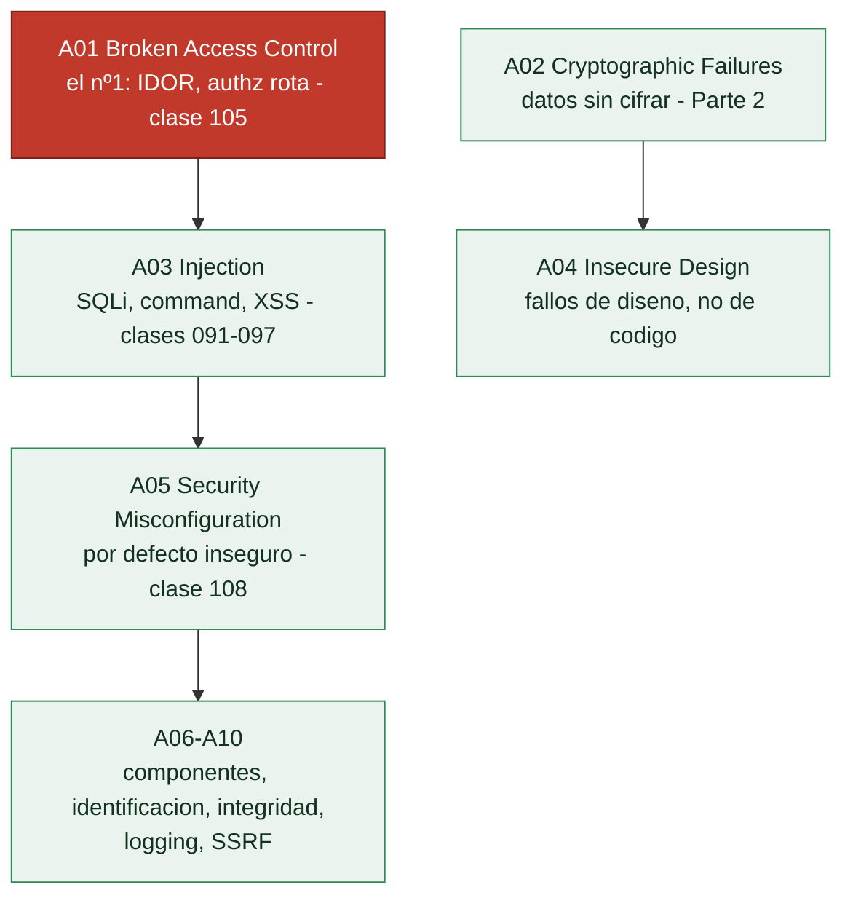

# Clase 087 — OWASP Top 10: panorama general

> Parte: **4 — Seguridad de aplicaciones web** · Fuente: *OWASP Top 10 (2021)*
> ⏱️ Duración estimada: **75 min** · Nivel: **Fundamentos**

---

## 🎯 Objetivo

Dominar el **OWASP Top 10 (2021)** como marco de referencia y taxonomía: qué representa cada categoría, cómo se relacionan entre sí y cómo usarlo para estructurar una auditoría web. Es el mapa que da nombre y contexto a todo lo que atacaremos en el resto de la parte.

## 📚 Resultados de aprendizaje

Al finalizar, el alumno podrá:

1. **Enumerar** las 10 categorías del OWASP Top 10 2021 y su significado.
2. **Mapear** una vulnerabilidad concreta a su categoría correspondiente.
3. **Explicar** los cambios respecto a la versión 2017 y por qué ocurrieron.
4. **Priorizar** hallazgos usando el enfoque de riesgo de OWASP.
5. **Distinguir** el Top 10 de estándares más exhaustivos como ASVS y WSTG.

## 🗺️ Temas

| # | Tema | Por qué importa |
|---|------|-----------------|
| 1 | A01 Broken Access Control | La categoría más frecuente hoy |
| 2 | A02 Cryptographic Failures | Datos sensibles mal protegidos |
| 3 | A03 Injection (incluye XSS) | Clásico de alto impacto |
| 4 | A04 Insecure Design | Fallos de arquitectura, no de código |
| 5 | A05 Security Misconfiguration | Defaults inseguros omnipresentes |
| 6 | A06–A10 | Componentes, auth, integridad, logging, SSRF |
| 7 | Metodología de riesgo OWASP | Convierte hallazgos en prioridades |

## 🧠 Explicación en profundidad

### Un mapa consensuado del riesgo web, no una lista de bugs

El **OWASP Top 10** es el documento de referencia de la seguridad web: un consenso de la
industria, revisado cada pocos años (la edición vigente es la de 2021), sobre las diez
**categorías** de riesgo más críticas en aplicaciones web. Es importante entender qué es y
qué no es. **No** es una lista de vulnerabilidades concretas ni un estándar de cumplimiento
exhaustivo; es un instrumento de **concienciación y priorización** que agrupa fallos por su
naturaleza. Su valor para esta parte es doble: ordena las 30 clases dándoles un marco común,
y es el vocabulario con el que un informe de pentest web se comunica con desarrolladores y
dirección.

La metodología detrás importa: las categorías se ordenan combinando **prevalencia** (con qué
frecuencia aparecen), **explotabilidad**, **detectabilidad** e **impacto**, a partir de
datos reales de cientos de miles de aplicaciones. Por eso el orden cambia entre ediciones y
refleja cómo evoluciona el ecosistema.

### Las tres primeras concentran la mayoría del daño

**A01 Broken Access Control** encabeza la lista de 2021 tras subir desde el quinto puesto, y
su ascenso cuenta una historia: el fallo más extendido no es técnico-sofisticado, es
**dejar que un usuario acceda a lo que no le corresponde** —ver el pedido de otro cambiando
un número (IDOR), llamar a una función de administración sin ser administrador—. Es barato de
explotar, difícil de detectar automáticamente y de impacto directo. **A02 Cryptographic
Failures** (antes "Sensitive Data Exposure") agrupa los datos sensibles mal protegidos: sin
cifrar en tránsito o en reposo, con algoritmos rotos, con claves mal gestionadas —todo lo de
la Parte 2 visto desde el fallo—. **A03 Injection** —que en 2021 **absorbió el XSS**— cubre
que datos del usuario acaben interpretados como código o comando: SQL, comandos del sistema,
LDAP, y el propio XSS.

### Diseño, configuración y el resto

**A04 Insecure Design** fue una categoría nueva en 2021 con una idea potente: hay fallos que
**no** son bugs de implementación sino de **diseño**, ausencias de un control que nunca se
pensó. No se arreglan parcheando código; se arreglan con modelado de amenazas antes de
programar. **A05 Security Misconfiguration** recoge lo inseguro por defecto: paneles
expuestos, cabeceras ausentes, permisos excesivos, mensajes de error verbosos. El resto
—A06 componentes vulnerables, A07 fallos de identificación y autenticación, A08 fallos de
integridad de software y datos, A09 fallos de registro y monitorización, **A10 SSRF**
(añadido por votación de la comunidad, clase 099)— completa el cuadro.

La conclusión práctica que ordena la parte: el Top 10 es el **índice mental** con el que se
aborda cualquier aplicación. Ante un objetivo nuevo, recorrerlo categoría por categoría
—"¿tiene control de acceso roto? ¿inyecciones? ¿mala configuración?"— garantiza cobertura y
evita el sesgo de ir solo a la vulnerabilidad que uno domina. Para una checklist más
exhaustiva y verificable existe **OWASP ASVS** (clase 115), pero el Top 10 es el punto de
partida de todo pentest web.

## 📖 Definiciones y características

- **OWASP Top 10**: documento de concienciación con las 10 categorías de riesgo web más críticas. Característica: es un punto de partida, no una checklist completa.
- **Categoría de riesgo**: agrupación de vulnerabilidades por causa raíz común. Característica: una CWE puede caer en varias categorías.
- **Broken Access Control (A01)**: usuarios acceden a datos/funciones fuera de sus permisos. Característica: subió al puesto 1 en 2021.
- **Insecure Design (A04)**: fallo por diseño, no por implementación. Característica: no se corrige con un parche puntual.
- **SSRF (A10)**: el servidor hace peticiones a destinos controlados por el atacante. Característica: entró como categoría propia por su relevancia en cloud.
- **Riesgo = probabilidad × impacto**: fórmula que OWASP usa para ordenar. Característica: guía la priorización, no la sustituye por criterio.

## 📔 Glosario

| Término | Definición concisa |
|---------|--------------------|
| OWASP Top 10 | Consenso de las diez categorías de riesgo web más críticas |
| Categoría de riesgo | Agrupación de fallos por naturaleza, no un bug concreto |
| Prevalencia | Con qué frecuencia aparece un fallo en aplicaciones reales |
| A01 Broken Access Control | Acceder a lo que no corresponde; el nº1 de 2021 |
| A02 Cryptographic Failures | Datos sensibles mal protegidos |
| A03 Injection | Datos interpretados como código; incluye XSS desde 2021 |
| A04 Insecure Design | Fallo de diseño, no de implementación |
| A05 Security Misconfiguration | Inseguro por defecto o mal configurado |
| A06 Componentes vulnerables | Dependencias con fallos conocidos |
| A07 Fallos de autenticación | Identificación y gestión de sesión débiles |
| A08 Fallos de integridad | Software o datos sin verificar |
| A09 Fallos de registro | Falta de logging y monitorización |
| A10 SSRF | Server-Side Request Forgery; añadido por la comunidad |
| OWASP ASVS | Estándar de verificación más detallado que el Top 10 |

## 🧰 Herramientas y preparación

- Documento **OWASP Top 10 2021** (online, gratuito).
- **OWASP Juice Shop** (cada reto está etiquetado con su categoría).
- Hoja de cálculo o plantilla para mapear hallazgos → categoría → severidad.

## 🧪 Laboratorio guiado

> Ejercicio aplicado de taxonomía y priorización (no ofensivo aún).

1. Abre el sitio oficial del Top 10 2021 y lee la ficha de cada categoría (A01–A10).
2. Crea una tabla con columnas: categoría, ejemplo real, CWE asociada, control preventivo.
3. En Juice Shop, abre el **Score Board** (`/#/score-board`) y filtra retos por categoría.
4. Elige 5 retos de categorías distintas y anota a qué A0X pertenecen y por qué.
5. Para cada uno, redacta en una frase el impacto de negocio si se explotara.
6. Ordena tus 5 hallazgos hipotéticos por riesgo (probabilidad × impacto) y justifica.
7. Compara tu orden con la severidad que sugiere el propio reto.

## ✍️ Ejercicios

1. Asocia cada una de estas CWE a su categoría: CWE-89, CWE-79, CWE-352, CWE-918, CWE-611.
2. Explica por qué "Injection" absorbió a XSS en 2021.
3. Da un ejemplo propio de Insecure Design que no sea un bug de código.
4. Diferencia A05 (misconfiguration) de A06 (componentes vulnerables) con un caso.
5. Justifica por qué Broken Access Control encabeza la lista.
6. Propón un control preventivo para cada categoría del Top 10.

## 📝 Reto verificable

Entrega una **matriz Top 10** con las 10 categorías, un ejemplo concreto por cada una, su CWE principal y un control de mitigación.
**Criterio de aceptación**: las 10 categorías están cubiertas, los ejemplos son distintos y realistas, y cada control mitiga la causa raíz (no solo el síntoma).

## ⚠️ Errores comunes

| Síntoma / mensaje | Causa y cómo arreglar |
|-------------------|------------------------|
| Tratar el Top 10 como checklist completa | Es concienciación; usa ASVS/WSTG para cobertura |
| Confundir categoría con vulnerabilidad | Una categoría agrupa muchas CWE |
| Ignorar A04 por ser "abstracta" | El diseño inseguro es causa de muchos bugs |
| Priorizar solo por moda | Prioriza por riesgo en tu contexto |
| Usar la versión 2017 | Cambió el orden y las categorías; usa 2021 |

## ❓ Preguntas frecuentes

**❓ ¿El Top 10 basta para certificar seguridad?**
No. Es concienciación. Para verificación usa OWASP ASVS y para testing la WSTG.

**❓ ¿Con qué frecuencia cambia?**
Cada 3–4 años aproximadamente, según datos de la industria y encuestas.

**❓ ¿Dónde encaja XSS ahora?**
Dentro de A03 Injection desde 2021, porque comparte causa raíz: datos no confiables interpretados como código.

## 🔗 Referencias

- OWASP Top 10 2021: <https://owasp.org/Top10/>
- OWASP ASVS: <https://owasp.org/www-project-application-security-verification-standard/>
- MITRE CWE: <https://cwe.mitre.org/>
- OWASP Risk Rating Methodology: <https://owasp.org/www-community/OWASP_Risk_Rating_Methodology>

## 📥 Material descargable

- 📄 [Guía en PDF](./clase-087-guia.pdf) — versión imprimible de esta clase.
- 🎞️ [Presentación (PPTX)](./clase-087-presentacion.pptx) — deck para proyectar en clase.

## ⬅️ Clase anterior

[Clase 086 — Arquitectura web moderna y superficie de ataque](../086-arquitectura-web-moderna-y-superficie-de-ataque/README.md)

## ➡️ Siguiente clase

[Clase 088 — Burp Suite: configuración y flujo de trabajo](../088-burp-suite-configuracion-y-flujo-de-trabajo/README.md)
