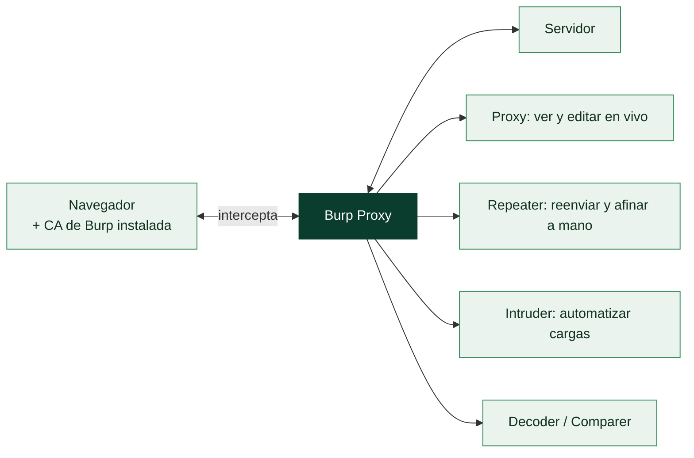

# Clase 088 — Burp Suite: configuración y flujo de trabajo

> Parte: **4 — Seguridad de aplicaciones web** · Fuente: *The Web Application Hacker's Handbook (Stuttard & Pinto)*
> ⏱️ Duración estimada: **120 min** · Nivel: **Fundamentos**

---

## 🎯 Objetivo

Instalar, configurar y dominar el flujo de trabajo de **Burp Suite**, la navaja suiza del pentesting web. Al terminar sabrás interceptar, modificar, repetir y automatizar peticiones HTTP con soltura, la base operativa de casi todas las clases siguientes.

## 📚 Resultados de aprendizaje

Al finalizar, el alumno podrá:

1. **Configurar** el proxy de Burp y el certificado CA en el navegador.
2. **Interceptar y modificar** peticiones y respuestas en tiempo real.
3. **Usar Repeater** para iterar sobre una petición manualmente.
4. **Automatizar** payloads con Intruder y ataques de tipo sniper/cluster bomb.
5. **Definir un scope** y organizar el trabajo con el HTTP history y el sitemap.

## 🗺️ Temas

| # | Tema | Por qué importa |
|---|------|-----------------|
| 1 | Proxy e interceptación | Núcleo del control del tráfico |
| 2 | Certificado CA y HTTPS | Sin él no ves tráfico cifrado |
| 3 | Target, scope y sitemap | Mantiene el trabajo ordenado y legal |
| 4 | Repeater | Prueba manual y precisa de payloads |
| 5 | Intruder | Automatización de fuzzing y fuerza bruta |
| 6 | Decoder y Comparer | Codificación y diffing de respuestas |
| 7 | Extensiones (BApp Store) | Amplían capacidades (JWT, autorize) |

## 🧠 Explicación en profundidad

### El proxy que se pone en medio de tu propio navegador

La herramienta central del pentesting web es un **proxy de interceptación**, y Burp Suite es
el estándar de la industria. La idea es sencilla y poderosa: Burp se coloca **entre tu
navegador y el servidor**, de modo que cada petición y cada respuesta pasa por él y se puede
**ver, pausar, modificar y reenviar**. Eso derriba de un golpe la principal barrera de la
seguridad web —que la lógica del cliente parece intocable—: con Burp, todo lo que el
navegador envía es material moldeable antes de llegar al servidor, así que cualquier
validación hecha en el JavaScript se salta editando la petición directamente.

Para interceptar tráfico **HTTPS** hay un detalle imprescindible: Burp genera su propia
**autoridad certificadora (CA)**, y hay que instalar su certificado en el navegador como
confiable. Sin eso, el navegador —que hace lo correcto— rechaza la conexión porque ve que
alguien se ha interpuesto (es, literalmente, un man-in-the-middle consentido, clase 040). Con
el certificado instalado, Burp descifra, muestra y recifra el tráfico de forma transparente.



### Repeater e Intruder: las dos herramientas que se usan a diario

El **Proxy** captura el tráfico, pero el trabajo real ocurre en dos módulos. **Repeater** es
el banco de pruebas manual: se envía una petición ahí, se modifica un parámetro, se reenvía y
se compara la respuesta —una y otra vez—. Es donde se confirma una inyección SQL a mano, se
prueba un IDOR cambiando un identificador, se afina un payload de XSS. Su virtud es el
**control total y la reproducibilidad**: cada prueba es deliberada y se puede repetir exacta.

**Intruder** automatiza lo que Repeater hace a mano: toma una petición, marca posiciones de
inyección y prueba **listas de cargas** en ellas. Sirve para fuerza bruta, fuzzing de
parámetros, enumeración de IDs. Sus modos —Sniper (una posición a la vez), Battering ram
(la misma carga en todas), Pitchfork y Cluster bomb (combinaciones)— cubren distintos
patrones de ataque. Un aviso: en la edición **Community** de Burp, Intruder está
**limitado en velocidad** a propósito; el trabajo automatizado serio usa la Professional o
herramientas dedicadas.

### El resto del arsenal, y la lección de fondo

**Decoder** codifica y descodifica (URL, Base64, hex, HTML) —imprescindible porque la web
codifica datos en todas partes, como en la clase 020—; **Comparer** resalta diferencias
entre dos respuestas, clave para detectar inyecciones ciegas donde el único indicio es un
cambio sutil. Y el **BApp Store** es el catálogo de extensiones que amplían Burp (autorize
para probar control de acceso, Turbo Intruder para ataques a alta velocidad, etc.).

Antes de nada se define el **target scope**: la lista de dominios que se está autorizado a
probar. Configurarlo bien no es opcional: limita las herramientas automáticas a lo permitido
y evita el error grave de escanear algo fuera de alcance (clase 067). La lección que resume
el módulo es que Burp no "hackea" nada por sí solo: es un **instrumento de observación y
manipulación** que amplifica el criterio del analista. Quien entiende HTTP y las
vulnerabilidades usa Burp para verificarlas con precisión; quien no, solo genera ruido.

## 📖 Definiciones y características

- **Proxy interceptor**: intermediario que captura el tráfico entre navegador y servidor. Característica: permite pausar y editar cada petición.
- **Repeater**: herramienta para reenviar una petición modificada N veces. Característica: ideal para afinar un payload manualmente.
- **Intruder**: motor de automatización con posiciones de payload. Característica: modos sniper, battering ram, pitchfork y cluster bomb.
- **Scope**: definición de qué hosts están dentro del test. Característica: evita tocar sistemas no autorizados.
- **Match/Replace**: reglas que reescriben peticiones/respuestas automáticamente. Característica: útil para persistir cabeceras o tokens.
- **Collaborator**: servidor externo de Burp para detectar interacciones out-of-band. Característica: revela SSRF/blind ciegos (solo en Pro).

## 📔 Glosario

| Término | Definición concisa |
|---------|--------------------|
| Proxy de interceptación | Se sitúa entre navegador y servidor para ver y editar el tráfico |
| Burp Suite | Proxy de pentesting web estándar de la industria |
| CA de Burp | Certificado propio que hay que instalar para interceptar HTTPS |
| Interceptar | Pausar una petición para modificarla antes de enviarla |
| Target scope | Dominios autorizados; limita las herramientas automáticas |
| Sitemap | Árbol del contenido descubierto del objetivo |
| Repeater | Reenvío manual y reproducible de peticiones |
| Intruder | Automatiza cargas sobre posiciones marcadas |
| Sniper / Cluster bomb | Modos de Intruder según posiciones y combinaciones |
| Payload | Carga que se prueba en una posición de inyección |
| Decoder | Codifica y descodifica (URL, Base64, hex, HTML) |
| Comparer | Resalta diferencias entre dos respuestas |
| BApp Store | Catálogo de extensiones de Burp |
| Edición Community | Versión gratuita con Intruder limitado en velocidad |

## 🧰 Herramientas y preparación

- **Burp Suite Community** (gratuita) o **Professional**.
- Navegador dedicado al testing (perfil separado) o el navegador embebido de Burp.
- Laboratorio local: **Juice Shop** o **DVWA**.

```bash
# Exportar el certificado CA: en Burp → Proxy → Options → Import/Export CA cert
# Importarlo en Firefox: Preferencias → Certificados → Ver certificados → Importar
```

## 🧪 Laboratorio guiado

> ⚠️ Solo contra tus propios laboratorios.

1. Instala Burp y configura el listener en `127.0.0.1:8080` (Proxy → Options).
2. Apunta el navegador a ese proxy o usa el **navegador embebido** de Burp (más simple).
3. Exporta e instala el **certificado CA** para ver HTTPS sin advertencias.
4. Navega Juice Shop; observa el tráfico en **Proxy → HTTP history**.
5. Define el **scope**: Target → Site map → clic derecho en el host → *Add to scope*. Activa "show only in-scope".
6. Intercepta un login (Proxy → Intercept ON), modifica un campo y reenvíalo.
7. Envía esa petición a **Repeater** (Ctrl+R) y prueba variaciones del parámetro.
8. Envíala a **Intruder**: marca una posición de payload, carga una lista y lanza un ataque sniper.
9. Usa **Decoder** para codificar/decodificar en Base64 y URL, y **Comparer** para diferenciar dos respuestas.

## ✍️ Ejercicios

1. Configura Match/Replace para añadir una cabecera personalizada a toda petición.
2. Usa Intruder en modo cluster bomb sobre dos parámetros a la vez.
3. Filtra el HTTP history para ver solo respuestas con código 500.
4. Guarda un item de historia y anótalo en la pestaña de Comentarios.
5. Instala una extensión del BApp Store (p. ej. "JSON Web Tokens").
6. Explica la diferencia entre sniper y pitchfork con un ejemplo.

## 📝 Reto verificable

Automatiza con **Intruder** un ataque de fuerza bruta al login de DVWA con una lista de 50 contraseñas y detecta la válida por diferencia en la longitud/código de respuesta.
**Criterio de aceptación**: identificas la credencial correcta a partir de la anomalía en la respuesta y documentas la posición de payload y el filtro usado.

## ⚠️ Errores comunes

| Síntoma / mensaje | Causa y cómo arreglar |
|-------------------|------------------------|
| "Your connection is not private" | CA de Burp no instalado en el navegador |
| No aparece tráfico | Proxy no configurado o listener apagado |
| Intruder muy lento (Community) | Community limita la velocidad; usa listas pequeñas |
| Se testea fuera de scope | Define y activa el scope antes de escanear |
| Repeater no refleja cambios | Olvidaste pulsar "Send" tras editar |

## ❓ Preguntas frecuentes

**❓ ¿Community o Professional?**
Community basta para aprender. Professional añade scanner activo, Intruder sin throttling y Collaborator.

**❓ ¿Burp o ZAP?**
Ambas valen. Burp domina en la industria; ZAP es libre y automatizable. Verás ZAP en la próxima clase.

**❓ ¿Cómo evito tocar sistemas ajenos?**
Define siempre el scope y activa "show only in-scope" y "drop out-of-scope requests".

## 🔗 Referencias

- Stuttard & Pinto, *The Web Application Hacker's Handbook*, cap. 20 (herramientas).
- Documentación oficial de Burp: <https://portswigger.net/burp/documentation>
- PortSwigger Web Security Academy: <https://portswigger.net/web-security>

## 📥 Material descargable

- 📄 [Guía en PDF](./clase-088-guia.pdf) — versión imprimible de esta clase.
- 🎞️ [Presentación (PPTX)](./clase-088-presentacion.pptx) — deck para proyectar en clase.

## ⬅️ Clase anterior

[Clase 087 — OWASP Top 10: panorama general](../087-owasp-top-10-panorama-general/README.md)

## ➡️ Siguiente clase

[Clase 089 — OWASP ZAP](../089-owasp-zap/README.md)
