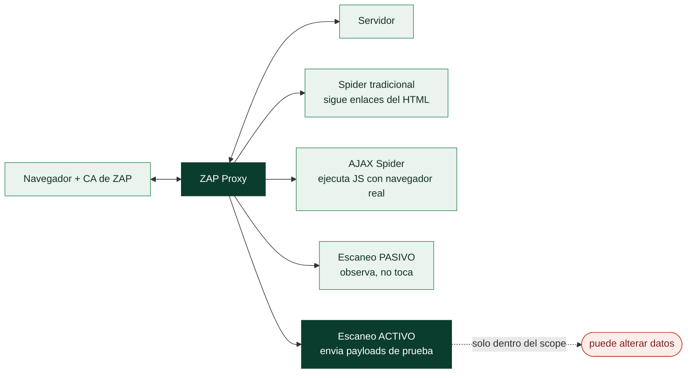

# Clase 089 — OWASP ZAP

> Parte: **4 — Seguridad de aplicaciones web** · Fuente: *OWASP ZAP Documentation* / *Web Security Testing Guide*
> ⏱️ Duración estimada: **90 min** · Nivel: **Fundamentos**

---

## 🎯 Objetivo

Dominar **OWASP ZAP (Zed Attack Proxy)**, la alternativa libre y de código abierto a Burp, con foco en su capacidad de **automatización** (spider, active scan, ZAP en CI/CD). Complementa a Burp: ZAP brilla en escaneo automatizado y en pipelines DevSecOps.

## 📚 Resultados de aprendizaje

Al finalizar, el alumno podrá:

1. **Configurar** ZAP como proxy y capturar tráfico HTTPS.
2. **Ejecutar** un spider tradicional y un AJAX spider sobre una SPA.
3. **Lanzar** un active scan y leer sus alertas por riesgo.
4. **Automatizar** ZAP desde línea de comandos (baseline scan) para CI/CD.
5. **Comparar** ZAP y Burp para elegir la herramienta según el caso.

## 🗺️ Temas

| # | Tema | Por qué importa |
|---|------|-----------------|
| 1 | Proxy y certificado ZAP | Base para interceptar tráfico |
| 2 | Spider tradicional vs. AJAX spider | Las SPAs necesitan el AJAX spider |
| 3 | Passive vs. active scan | Uno observa, otro ataca |
| 4 | Alertas y niveles de riesgo | Priorización de hallazgos |
| 5 | Automation Framework y baseline | Integración en pipelines |
| 6 | Contextos y autenticación | Escaneo autenticado |
| 7 | ZAP vs. Burp | Elegir la herramienta adecuada |

## 🧠 Explicación en profundidad

### La alternativa abierta, y por qué conviene conocer las dos

**OWASP ZAP** (*Zed Attack Proxy*) es el equivalente libre y gratuito de Burp, mantenido por
la comunidad OWASP. Comparte el concepto central —un proxy de interceptación que ve y modifica
el tráfico— y por eso mucho de la clase 088 se traslada directamente: también genera una **CA**
que hay que instalar para HTTPS, también tiene target, sitemap e interceptación manual. La
razón de estudiarlo no es solo tener una opción sin coste, sino que **ZAP brilla donde Burp
Community flaquea**: en automatización. Su escaneo activo es completo y sin las limitaciones
de velocidad de la edición gratuita de Burp, y su **Automation Framework** lo hace idóneo para
integrarse en un pipeline de CI/CD.



### Spider tradicional frente a AJAX spider: por qué hacen falta los dos

Para probar una aplicación hay que descubrir primero sus páginas, y ZAP ofrece dos
**spiders** que responden a las dos arquitecturas de la clase 086. El **spider tradicional**
descarga el HTML y sigue los enlaces que encuentra en él: rápido y suficiente para una web
renderizada en servidor. Pero una **SPA** casi no tiene enlaces en el HTML inicial —el
contenido lo genera el JavaScript al ejecutarse—, así que el spider tradicional apenas ve
nada. Para eso está el **AJAX Spider**, que lanza un navegador real, ejecuta el JavaScript,
hace clic en los elementos y descubre las rutas que solo aparecen tras la interacción. La
regla práctica: sitio clásico, spider tradicional; SPA, AJAX Spider (más lento pero
necesario).

### Pasivo frente a activo: la distinción que evita incidentes

La diferencia más importante de operar cualquier escáner es entre escaneo **pasivo** y
**activo**, y confundirla causa problemas reales. El **escaneo pasivo** solo **observa** el
tráfico que ya generas navegando: detecta cabeceras de seguridad ausentes, cookies sin flags,
información filtrada —todo **sin enviar nada** al servidor más allá de tu navegación normal—.
Es seguro en cualquier entorno. El **escaneo activo** es lo contrario: **envía payloads de
prueba** (comillas para SQLi, scripts para XSS, etc.) para provocar y detectar
vulnerabilidades. Es potente, pero **es intrusivo**: puede crear registros basura, disparar
acciones, e incluso —si encuentra una inyección— alterar o borrar datos. Por eso el escaneo
activo se lanza **solo dentro del scope autorizado** y nunca contra producción sin permiso
explícito, exactamente como marcan las RoE de la clase 067.

### Automatización, y ZAP frente a Burp

El **Automation Framework** y el modo *baseline* de ZAP son su ventaja diferencial: permiten
definir en un fichero un escaneo reproducible —autenticación incluida, mediante **contextos**
que enseñan a ZAP cómo iniciar sesión— y ejecutarlo sin interfaz gráfica, lo que encaja
perfectamente en un pipeline de DevSecOps (Parte 11) para que cada despliegue pase un chequeo
de seguridad automático. En la comparación práctica, ninguno es "mejor": Burp Professional
domina el trabajo **manual** e interactivo por su ergonomía y sus extensiones; ZAP domina el
**automatizado y gratuito**. Muchos profesionales usan los dos, y saber operar ambos es una
ventaja real. La advertencia común a los dos es la misma: un escáner automático encuentra lo
**fácil y conocido**, genera **falsos positivos** que hay que verificar a mano, y **no
sustituye** el análisis manual —las vulnerabilidades de lógica de negocio (clase 109), por
ejemplo, ningún escáner las ve—.

## 📖 Definiciones y características

- **ZAP**: proxy de seguridad web libre mantenido por OWASP. Característica: gratuito, scriptable y apto para CI/CD.
- **Spider**: rastreador que descubre URLs siguiendo enlaces. Característica: no ejecuta JavaScript.
- **AJAX Spider**: rastreador que usa un navegador real para SPAs. Característica: descubre rutas generadas por JS.
- **Passive scan**: análisis no intrusivo del tráfico observado. Característica: seguro, no envía payloads.
- **Active scan**: envía payloads para confirmar vulnerabilidades. Característica: intrusivo, solo con autorización.
- **Baseline scan**: escaneo rápido y no intrusivo pensado para CI. Característica: falla el build si hay alertas nuevas.

## 📔 Glosario

| Término | Definición concisa |
|---------|--------------------|
| OWASP ZAP | Proxy de pentesting web libre y gratuito de OWASP |
| CA de ZAP | Certificado propio para interceptar HTTPS |
| Spider tradicional | Descubre páginas siguiendo enlaces del HTML |
| AJAX Spider | Ejecuta JS con un navegador real para descubrir rutas de SPA |
| Escaneo pasivo | Solo observa el tráfico; no envía nada; seguro |
| Escaneo activo | Envía payloads de prueba; intrusivo; solo dentro del scope |
| Falso positivo | Alerta que no se sostiene al verificarla a mano |
| Alerta | Hallazgo del escáner, con nivel de riesgo |
| Automation Framework | Escaneos reproducibles definidos en fichero |
| Baseline scan | Escaneo rápido y no intrusivo para CI/CD |
| Contexto | Configuración que enseña a ZAP a autenticarse |
| CI/CD | Integración continua donde encaja el escaneo automatizado |
| Escaneo intrusivo | El que puede alterar datos o disparar acciones |
| Análisis manual | Lo que ningún escáner sustituye |

## 🧰 Herramientas y preparación

- **OWASP ZAP** (descarga oficial) o su imagen Docker `zaproxy/zap-stable`.
- Laboratorio: Juice Shop en `http://localhost:3000`.

```bash
# Baseline scan con Docker (no intrusivo)
docker run --rm -t zaproxy/zap-stable zap-baseline.py -t http://host.docker.internal:3000
```

## 🧪 Laboratorio guiado

> ⚠️ Solo contra laboratorios propios.

1. Instala ZAP y arranca en modo *Standard*. Configura el proxy local (por defecto `8080` o `8090`).
2. Instala el certificado raíz de ZAP en el navegador (Options → Network → Server Certificates).
3. Explora Juice Shop manualmente pasando por ZAP para poblar el árbol de sitios.
4. Lanza el **Spider** sobre el host y luego el **AJAX Spider** para capturar rutas de la SPA.
5. Revisa las alertas del **passive scan** que ya se generaron.
6. Lanza un **Active Scan** sobre un endpoint concreto y observa las alertas por color de riesgo.
7. Ejecuta un **baseline scan** con Docker y revisa el reporte de warnings.
8. Exporta un reporte HTML (Report → Generate Report).

## ✍️ Ejercicios

1. Compara el número de URLs descubiertas por spider tradicional vs. AJAX spider.
2. Configura un **Context** con credenciales para un escaneo autenticado.
3. Filtra las alertas por riesgo Alto y explica una de ellas.
4. Ejecuta el baseline scan e interpreta los códigos WARN/FAIL.
5. Escribe un script de ZAP que marque como fuera de scope las URLs de logout.
6. Integra mentalmente el baseline scan en un pipeline: ¿cuándo debe fallar el build?

## 📝 Reto verificable

Genera un **reporte de ZAP** de Juice Shop que incluya al menos 3 alertas de riesgo medio/alto verificadas manualmente (sin falsos positivos).
**Criterio de aceptación**: cada alerta del reporte se confirma reproduciéndola manualmente en el navegador o en Burp, y se descarta al menos un falso positivo justificando por qué.

## ⚠️ Errores comunes

| Síntoma / mensaje | Causa y cómo arreglar |
|-------------------|------------------------|
| Active scan sin resultados en SPA | Faltó el AJAX spider previo |
| Muchos falsos positivos | Verifica manualmente antes de reportar |
| HTTPS con errores de certificado | CA de ZAP no instalado |
| Escaneo bloqueado por WAF/rate limit | Baja el número de hilos del active scan |
| Baseline scan siempre en verde | El scope o el target están mal definidos |

## ❓ Preguntas frecuentes

**❓ ¿ZAP puede sustituir a Burp?**
Para automatización y CI/CD, sí, e incluso mejor. Para pentesting manual fino, muchos prefieren Burp.

**❓ ¿El active scan es peligroso?**
Envía payloads reales; puede alterar datos. Úsalo solo en entornos autorizados y con backups.

**❓ ¿Cómo integro ZAP en CI/CD?**
Con `zap-baseline.py` o `zap-full-scan.py` en un contenedor, haciendo que el pipeline falle según las alertas.

## 🔗 Referencias

- OWASP ZAP: <https://www.zaproxy.org/>
- ZAP Automation Framework: <https://www.zaproxy.org/docs/automate/>
- OWASP WSTG: <https://owasp.org/www-project-web-security-testing-guide/>

## 📥 Material descargable

- 📄 [Guía en PDF](./clase-089-guia.pdf) — versión imprimible de esta clase.
- 🎞️ [Presentación (PPTX)](./clase-089-presentacion.pptx) — deck para proyectar en clase.

## ⬅️ Clase anterior

[Clase 088 — Burp Suite: configuración y flujo de trabajo](../088-burp-suite-configuracion-y-flujo-de-trabajo/README.md)

## ➡️ Siguiente clase

[Clase 090 — Mapeo, spidering y descubrimiento de contenido](../090-mapeo-spidering-y-descubrimiento-de-contenido/README.md)
