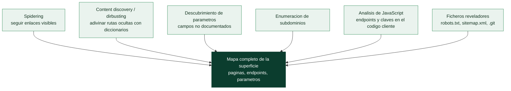

# Clase 090 — Mapeo, spidering y descubrimiento de contenido

> Parte: **4 — Seguridad de aplicaciones web** · Fuente: *The Web Application Hacker's Handbook* / *Bug Bounty Bootcamp (Vickie Li)*
> ⏱️ Duración estimada: **100 min** · Nivel: **Intermedio**

---

## 🎯 Objetivo

Aprender a **mapear exhaustivamente** una aplicación: descubrir directorios, archivos, endpoints ocultos, parámetros y funciones no enlazadas. Un buen mapeo multiplica la superficie de ataque real y suele ser la diferencia entre encontrar un bug crítico o no encontrar nada.

## 📚 Resultados de aprendizaje

Al finalizar, el alumno podrá:

1. **Combinar** spidering pasivo y activo para construir el sitemap.
2. **Aplicar** fuzzing de contenido con diccionarios (dirbusting) de forma eficiente.
3. **Descubrir** parámetros ocultos y endpoints de API no enlazados.
4. **Enumerar** subdominios y virtual hosts relevantes al target.
5. **Priorizar** los hallazgos por probabilidad de contener vulnerabilidades.

## 🗺️ Temas

| # | Tema | Por qué importa |
|---|------|-----------------|
| 1 | Spidering pasivo vs. activo | Base del descubrimiento |
| 2 | Content discovery (dirbusting) | Encuentra lo no enlazado |
| 3 | Diccionarios (SecLists) | Calidad de wordlist = calidad de hallazgos |
| 4 | Descubrimiento de parámetros | Inputs ocultos = bugs ocultos |
| 5 | Enumeración de subdominios | Amplía el scope legítimo |
| 6 | Análisis de JavaScript | Los JS revelan rutas de API |
| 7 | robots.txt, sitemap.xml, .git | Fuentes de rutas sensibles |

## 🧠 Explicación en profundidad

### No puedes probar lo que no has encontrado

Antes de atacar hay que **mapear** la aplicación: descubrir todas sus páginas, endpoints,
parámetros y ficheros. Es la fase de reconocimiento de la clase 068 aplicada a una única
aplicación web, y su premisa es contundente: **la vulnerabilidad crítica está a menudo en la
parte de la aplicación que nadie mira** —un endpoint de administración olvidado, una API
antigua sin autenticación, un fichero de respaldo accesible—. Un pentest que solo prueba lo
que se ve navegando normalmente deja fuera justo donde suelen estar los fallos graves. Por
eso el mapeo combina lo pasivo (seguir enlaces) con lo activo (adivinar lo que no está
enlazado).



### Dirbusting: adivinar lo que no está enlazado

El descubrimiento de contenido (**content discovery** o *dirbusting*) prueba rutas
**probables** contra el servidor —`/admin`, `/backup`, `/api/v1`, `/.env`, `/config.php`— y
observa cuáles responden con algo distinto de un 404. Es fuerza bruta dirigida por
**diccionarios**, y su eficacia depende por completo de la calidad de la lista: por eso
**SecLists** —una colección enorme y curada de nombres de rutas, parámetros y payloads reales—
es el recurso de referencia. Herramientas como `ffuf`, `feroxbuster` o `gobuster` lanzan miles
de peticiones y filtran por código de respuesta, tamaño o número de palabras para separar lo
que existe de lo que no. Un matiz importante: no basta con mirar el código 200; a veces un 403
(prohibido) revela que la ruta **existe** aunque no se pueda acceder, y un 401 indica que hay
algo protegido detrás.

### El JavaScript es un mapa que el propio sitio te entrega

En una aplicación moderna, el **análisis del JavaScript** del cliente es una de las fuentes de
descubrimiento más ricas y más ignoradas. Como toda la lógica de la SPA viaja al navegador,
sus ficheros `.js` contienen —a la vista de cualquiera— la lista de **endpoints de la API** que
la aplicación consume, nombres de parámetros, rutas internas, *feature flags* y, con más
frecuencia de la que debería, **claves y secretos** incrustados por descuido. Extraer las URLs
y los parámetros de esos ficheros (con herramientas como LinkFinder o simplemente leyéndolos)
suele revelar endpoints que ninguna otra técnica encuentra, porque no están enlazados en
ningún sitio salvo dentro del código que los llama.

### Los ficheros que hablan de más

Ciertos ficheros estándar filtran información valiosa por diseño o por descuido. **`robots.txt`**
lista rutas que el dueño **no quiere** que indexen los buscadores —lo que a menudo es
exactamente un índice de las zonas interesantes—. **`sitemap.xml`** enumera páginas. Y el
hallazgo más grave de este tipo es un directorio **`.git`** accesible: si el repositorio de
código quedó expuesto, se puede **descargar el código fuente completo** de la aplicación
—con su lógica, sus rutas y quizá sus secretos en el historial (clase 018)—, lo que convierte
un pentest de caja negra en uno de caja blanca. La enumeración de **subdominios** (clase 068,
con crt.sh) cierra el mapa por arriba, revelando entornos de `dev`, `staging` o `api` que
suelen estar peor protegidos que producción. El resultado de toda esta fase es un **inventario
de la superficie de ataque** sobre el que las 25 clases siguientes tienen dónde trabajar.

## 📖 Definiciones y características

- **Content discovery**: proceso de encontrar recursos no enlazados por fuerza bruta de rutas. Característica: depende de un buen diccionario.
- **Wordlist**: lista de rutas/palabras candidatas. Característica: SecLists es el estándar de facto.
- **Fuzzing de parámetros**: probar nombres de parámetros para descubrir los ocultos. Característica: cambia la respuesta si el parámetro existe.
- **Subdominio**: host bajo el dominio principal. Característica: puede quedar fuera de las protecciones del principal.
- **Virtual host (vhost)**: sitios distintos servidos por la misma IP según la cabecera Host. Característica: se enumeran fuzzeando el Host.
- **Recursión de directorios**: repetir el dirbusting dentro de cada carpeta hallada. Característica: descubre estructuras profundas.

## 📔 Glosario

| Término | Definición concisa |
|---------|--------------------|
| Mapeo | Descubrir toda la estructura de la aplicación antes de atacar |
| Spidering | Descubrimiento siguiendo enlaces visibles |
| Content discovery / dirbusting | Adivinar rutas no enlazadas con diccionarios |
| SecLists | Colección de referencia de rutas, parámetros y payloads |
| ffuf / feroxbuster / gobuster | Herramientas de fuzzing de rutas |
| Código de respuesta | 200, 403, 401… revelan la existencia y protección de una ruta |
| Descubrimiento de parámetros | Encontrar campos de entrada no documentados |
| Análisis de JavaScript | Extraer endpoints y secretos del código cliente |
| LinkFinder | Herramienta que extrae URLs de ficheros JS |
| robots.txt | Lista rutas que el dueño no quiere indexar |
| sitemap.xml | Enumera páginas de la aplicación |
| Directorio `.git` expuesto | Permite descargar el código fuente completo |
| Enumeración de subdominios | Descubre entornos dev/staging/api peor protegidos |
| Inventario de superficie | Resultado del mapeo; base de las pruebas posteriores |

## 🧰 Herramientas y preparación

- **ffuf**, **feroxbuster** o **gobuster** para content discovery.
- **SecLists** (diccionarios).
- **Arjun** para descubrimiento de parámetros; **subfinder**/**amass** para subdominios.
- **LinkFinder**/**gau** para extraer rutas del JavaScript.

```bash
sudo apt install ffuf gobuster
git clone https://github.com/danielmiessler/SecLists
pipx install arjun
```

## 🧪 Laboratorio guiado

> ⚠️ Solo contra tu propio laboratorio (Juice Shop / DVWA) o programas con permiso explícito.

1. Levanta Juice Shop y hazlo pasar por Burp para poblar el sitemap con navegación manual.
2. Ejecuta content discovery con ffuf:

```bash
ffuf -u http://localhost:3000/FUZZ -w SecLists/Discovery/Web-Content/common.txt -mc 200,301,302,403
```

3. Revisa `robots.txt`, `sitemap.xml` y `/ftp` (una ruta famosa de Juice Shop).
4. Extrae rutas embebidas en los archivos `.js` con LinkFinder o grep de patrones `\/rest\/`.
5. Descubre parámetros ocultos en un endpoint con Arjun:

```bash
arjun -u http://localhost:3000/rest/products/search
```

6. Fuzzea la extensión de archivos (`FUZZ.php`, `FUZZ.bak`) buscando backups.
7. Consolida todo en un sitemap enriquecido y marca los endpoints prometedores.

## ✍️ Ejercicios

1. Compara resultados de `common.txt` vs. `directory-list-2.3-medium.txt`.
2. Usa filtros por tamaño (`-fs`) para eliminar respuestas de "not found" personalizadas.
3. Encuentra un endpoint de API en el JS que no aparece navegando.
4. Enumera subdominios de un dominio propio con subfinder.
5. Descubre al menos 3 parámetros ocultos en un endpoint de Juice Shop.
6. Explica por qué un `403` puede ser más interesante que un `404`.

## 📝 Reto verificable

Construye un **inventario de endpoints** de Juice Shop que incluya al menos 5 rutas no descubribles solo navegando (obtenidas por dirbusting, análisis de JS o parámetros ocultos).
**Criterio de aceptación**: cada ruta se acompaña de cómo se descubrió (herramienta + evidencia) y una hipótesis de por qué podría ser vulnerable.

## ⚠️ Errores comunes

| Síntoma / mensaje | Causa y cómo arreglar |
|-------------------|------------------------|
| Todo devuelve 200 | La app tiene "soft 404"; filtra por tamaño con `-fs` |
| Escaneo eterno | Diccionario demasiado grande; empieza por `common.txt` |
| Rate limiting / bloqueo | Baja hilos (`-t`) y añade delays |
| No aparecen rutas de API | Analiza el JavaScript, no solo el HTML |
| Fuzzear fuera de scope | Limita el target a hosts autorizados |

## ❓ Preguntas frecuentes

**❓ ¿Qué diccionario uso?**
Empieza con `common.txt` para rapidez; escala a `directory-list-2.3-medium` si necesitas cobertura. Ajusta al stack (rutas PHP, ASPX, etc.).

**❓ ¿Por qué analizar el JavaScript?**
En SPAs, la mayoría de endpoints de API están referenciados en los bundles JS, no en el HTML navegable.

**❓ ¿El content discovery es intrusivo?**
Genera muchas peticiones y puede disparar alertas o rate limits. Hazlo solo con autorización y controlando la velocidad.

## 🔗 Referencias

- Li, *Bug Bounty Bootcamp*, cap. de reconocimiento.
- SecLists: <https://github.com/danielmiessler/SecLists>
- ffuf: <https://github.com/ffuf/ffuf>
- OWASP WSTG — Content Discovery.

## 📥 Material descargable

- 📄 [Guía en PDF](./clase-090-guia.pdf) — versión imprimible de esta clase.
- 🎞️ [Presentación (PPTX)](./clase-090-presentacion.pptx) — deck para proyectar en clase.

## ⬅️ Clase anterior

[Clase 089 — OWASP ZAP](../089-owasp-zap/README.md)

## ➡️ Siguiente clase

[Clase 091 — Inyección SQL: fundamentos](../091-inyeccion-sql-fundamentos/README.md)
