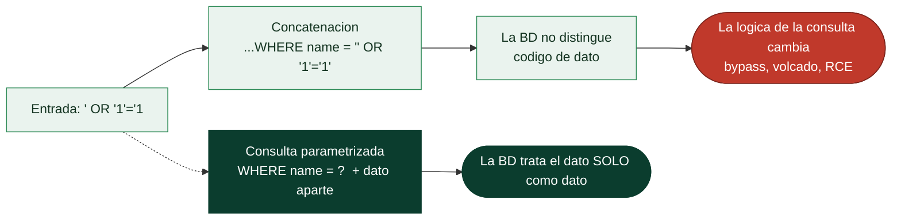

# Clase 091 — Inyección SQL: fundamentos

> Parte: **4 — Seguridad de aplicaciones web** · Fuente: *The Web Application Hacker's Handbook (Stuttard & Pinto)*
> ⏱️ Duración estimada: **120 min** · Nivel: **Intermedio**

---

## 🎯 Objetivo

Comprender a fondo la **inyección SQL (SQLi)**: por qué ocurre, cómo detectarla y cómo explotarla en su forma clásica (in-band). Es la vulnerabilidad emblema de la categoría A03 Injection y una de las de mayor impacto: puede exponer bases de datos completas.

> ⚠️ **Ética**: todo lo aquí descrito se practica únicamente en laboratorios propios (DVWA, Juice Shop) o con autorización explícita por escrito. Inyectar SQL en sistemas ajenos es un delito.

## 📚 Resultados de aprendizaje

Al finalizar, el alumno podrá:

1. **Explicar** cómo la concatenación de entradas produce SQLi.
2. **Detectar** puntos inyectables con pruebas de error y booleanas.
3. **Explotar** SQLi con `UNION SELECT` para extraer datos.
4. **Enumerar** esquema, tablas y columnas de la base de datos.
5. **Recomendar** la corrección: consultas parametrizadas.

## 🗺️ Temas

| # | Tema | Por qué importa |
|---|------|-----------------|
| 1 | Cómo se construye una query vulnerable | Es la causa raíz |
| 2 | Detección: comillas, errores, lógica | Confirmar el punto inyectable |
| 3 | UNION-based injection | Extracción directa de datos |
| 4 | Enumeración del esquema | Saber qué robar y de dónde |
| 5 | Bypass de autenticación con SQLi | Impacto inmediato |
| 6 | Comentarios y sintaxis por motor | MySQL, MSSQL, Postgres difieren |
| 7 | Remediación: prepared statements | Cierre correcto del fallo |

## 🧠 Explicación en profundidad

### La causa raíz: mezclar código y datos en la misma cadena

La inyección SQL nace de un error conceptual que, entendido una vez, explica todas sus
variantes: **construir una consulta concatenando la entrada del usuario con el texto de la
consulta**. Cuando el código hace algo como `"SELECT * FROM users WHERE name = '" + entrada +
"'"`, la base de datos recibe una única cadena en la que **no distingue** qué parte era código
que escribió el programador y qué parte era dato que puso el usuario. Si el usuario introduce
`' OR '1'='1`, la cadena resultante cambia la **lógica** de la consulta, porque sus comillas
cierran el literal y su `OR` altera la condición. Toda la inyección —SQL, comandos, LDAP, la
propia XXE— es la misma historia: datos que cruzan la frontera y se interpretan como código.

De ahí que la solución, que se adelanta ya, sea **separar código y datos de raíz** con
**consultas parametrizadas** (*prepared statements*): la consulta se envía con marcadores
(`WHERE name = ?`) y los datos van aparte, de modo que la base de datos ya sabe que el dato es
solo dato y nunca lo interpreta. La solución **no** es "filtrar comillas": ese enfoque
—llamado *blocklist*— siempre se puede evadir, y perseguirlo es la trampa clásica.



### Detectar: provocar un error o un cambio de lógica

La detección de SQLi busca la señal de que la entrada llegó a la consulta. La sonda clásica es
una **comilla** (`'`): si la aplicación devuelve un error de base de datos, un 500, o cambia su
comportamiento, la entrada está tocando SQL sin sanear. Cuando no hay errores visibles, se
prueba la **lógica**: enviar `' AND '1'='1` (condición verdadera, la página se comporta normal)
frente a `' AND '1'='2` (condición falsa, la página cambia o no devuelve resultados). Esa
diferencia demuestra que la entrada controla la consulta aunque no se vea ningún error, y es la
base de la inyección ciega de la clase siguiente. Un detalle práctico: la **sintaxis de
comentarios** (`--`, `#`, `/* */`) sirve para "cortar" el resto de la consulta original y que
lo que viene después no estorbe.

### UNION: leer datos de otras tablas

La técnica más directa cuando los resultados de la consulta se muestran en la página es la
**inyección basada en UNION**. El operador `UNION SELECT` de SQL combina el resultado de la
consulta original con el de **otra consulta que escribe el atacante**, de modo que se pueden
extraer datos de **cualquier tabla** a la que la base de datos tenga acceso —incluida la de
usuarios y contraseñas—. Requiere dos pasos previos: averiguar **cuántas columnas** devuelve
la consulta original (con `ORDER BY n` o `UNION SELECT NULL,NULL,...`) y **cuáles son de tipo
texto** (para colocar ahí los datos que se quieren leer). Con eso, `UNION SELECT username,
password FROM users` vuelca las credenciales en la propia página. Antes se enumera el **esquema**
—qué tablas y columnas existen— consultando las tablas de metadatos del motor
(`information_schema` en MySQL/PostgreSQL).

### Bypass de autenticación, y por qué el motor importa

El uso más citado de SQLi es el **bypass de login**: si la consulta de autenticación concatena
usuario y contraseña, introducir `admin' --` como usuario convierte la consulta en "selecciona
al usuario admin" y **comenta la comprobación de la contraseña**, entrando sin conocerla. Es el
ejemplo canónico de cómo un cambio de lógica se traduce en impacto directo.

Dos advertencias cierran los fundamentos. La primera: **la sintaxis depende del motor**. MySQL,
PostgreSQL, Microsoft SQL Server y Oracle difieren en los comentarios, en la concatenación de
cadenas, en las funciones y en las tablas de metadatos, así que identificar el motor (por sus
errores, sus funciones) es parte del trabajo. La segunda, que es el mensaje que se lleva al
informe: la **remediación real es la consulta parametrizada** en todo el código, complementada
con ORMs bien usados, mínimo privilegio de la cuenta de base de datos y validación de tipos.
Filtrar entradas es un parche que se evade; parametrizar elimina la clase entera de fallo.

## 📖 Definiciones y características

- **Inyección SQL**: inserción de sintaxis SQL en una entrada que se concatena a una consulta. Característica: rompe la separación entre datos y código.
- **In-band SQLi**: los resultados vuelven por el mismo canal (la respuesta). Característica: la variante más fácil de explotar.
- **UNION-based**: usa `UNION SELECT` para añadir filas controladas. Característica: requiere igualar número y tipo de columnas.
- **Error-based**: fuerza mensajes de error que filtran datos. Característica: depende de que la app muestre errores.
- **Prepared statement**: consulta con parámetros ligados. Característica: separa código de datos y elimina la SQLi.
- **Comentario SQL** (`--`, `#`, `/* */`): trunca el resto de la query. Característica: clave para bypass de login.

## 📔 Glosario

| Término | Definición concisa |
|---------|--------------------|
| Inyección SQL (SQLi) | Datos del usuario interpretados como parte de una consulta |
| Concatenación | Construir la consulta pegando entrada con texto; la causa raíz |
| Consulta parametrizada | Marcadores + datos aparte; la BD no interpreta el dato |
| Prepared statement | Nombre técnico de la consulta parametrizada |
| Blocklist | Filtrar caracteres prohibidos; siempre evadible |
| Sonda con comilla | `'` para provocar un error o cambio y detectar SQLi |
| Prueba lógica | `AND 1=1` vs `AND 1=2` para confirmar sin errores |
| Comentario SQL | `--`, `#`, `/* */`; corta el resto de la consulta |
| UNION-based | `UNION SELECT` para leer datos de otras tablas |
| information_schema | Tablas de metadatos con el esquema de la BD |
| Enumeración de esquema | Descubrir tablas y columnas existentes |
| Bypass de login | `admin' --` para entrar sin contraseña |
| Dependencia del motor | Sintaxis distinta en MySQL, PostgreSQL, MSSQL, Oracle |
| Mínimo privilegio de BD | La cuenta de la app solo con los permisos necesarios |

## 🧰 Herramientas y preparación

- **DVWA** (nivel Low y Medium) o Juice Shop.
- **Burp Suite** para interceptar y editar parámetros.
- Cliente SQL para inspeccionar la base de datos y comprobar tu progreso.

```bash
# DVWA con Docker
docker run --rm -d -p 80:80 vulnerables/web-dvwa
# Login por defecto admin/password, nivel de seguridad "Low"
```

## 🧪 Laboratorio guiado

> ⚠️ Solo en DVWA/Juice Shop propios.

1. En DVWA → *SQL Injection*, introduce `1` y observa la consulta normal.
2. Prueba `1'` y busca un error SQL: confirma que el input llega crudo a la query.
3. Determina el número de columnas con `1' ORDER BY 1-- -`, `ORDER BY 2-- -`, hasta que falle.
4. Extrae datos con UNION:

```sql
1' UNION SELECT user, password FROM users-- -
```

5. Enumera el esquema con `information_schema`:

```sql
1' UNION SELECT table_name, NULL FROM information_schema.tables-- -
```

6. Prueba un **bypass de login** en el formulario de autenticación: `admin'-- -`.
7. Documenta cada payload, la respuesta y el dato exfiltrado.
8. Repite en nivel "Medium" (input por POST, comillas escapadas) y observa las diferencias.

## ✍️ Ejercicios

1. Determina el motor de base de datos por su sintaxis de comentarios y errores.
2. Extrae el hash de la contraseña de `admin` y crackéalo (offline, con hashcat) en tu lab.
3. Consigue el nombre de la base de datos actual con `database()`.
4. Explica por qué `ORDER BY` ayuda a contar columnas.
5. Escribe la versión parametrizada (segura) de la query vulnerable en PHP y en Python.
6. Diferencia UNION-based de error-based con un ejemplo propio.

## 📝 Reto verificable

Extrae **todos los usuarios y hashes** de la tabla `users` de DVWA vía UNION SQLi y luego reescribe la consulta backend de forma segura.
**Criterio de aceptación**: entregas el listado exfiltrado (evidencia), el payload UNION usado y el código corregido con prepared statements que impide la inyección.

## ⚠️ Errores comunes

| Síntoma / mensaje | Causa y cómo arreglar |
|-------------------|------------------------|
| "The used SELECT statements have a different number of columns" | Cuenta mal de columnas; ajusta el UNION |
| No hay error visible | Errores desactivados; pasa a blind (próxima clase) |
| Comilla escapada | Nivel Medium filtra `'`; prueba numérico o encoding |
| UNION devuelve tipos incompatibles | Usa NULL en columnas para igualar tipos |
| Bypass de login no funciona | Sintaxis de comentario incorrecta para el motor |

## ❓ Preguntas frecuentes

**❓ ¿Los ORM me protegen?**
En gran medida, si usas sus métodos parametrizados. Pero el SQL crudo dentro de un ORM vuelve a ser vulnerable.

**❓ ¿Escapar comillas es suficiente?**
No de forma fiable. La defensa correcta son las consultas parametrizadas; el escaping manual es propenso a errores.

**❓ ¿Por qué information_schema es tan útil?**
Es el catálogo estándar que describe tablas y columnas; permite mapear la base de datos sin conocerla de antemano.

## 🔗 Referencias

- Stuttard & Pinto, *The Web Application Hacker's Handbook*, cap. 9 (Injecting into the DB).
- OWASP SQL Injection: <https://owasp.org/www-community/attacks/SQL_Injection>
- PortSwigger SQL injection: <https://portswigger.net/web-security/sql-injection>
- OWASP SQLi Prevention Cheat Sheet.

## 📥 Material descargable

- 📄 [Guía en PDF](./clase-091-guia.pdf) — versión imprimible de esta clase.
- 🎞️ [Presentación (PPTX)](./clase-091-presentacion.pptx) — deck para proyectar en clase.

## ⬅️ Clase anterior

[Clase 090 — Mapeo, spidering y descubrimiento de contenido](../090-mapeo-spidering-y-descubrimiento-de-contenido/README.md)

## ➡️ Siguiente clase

[Clase 092 — Inyección SQL avanzada y ciega (blind)](../092-inyeccion-sql-avanzada-y-ciega-blind/README.md)
