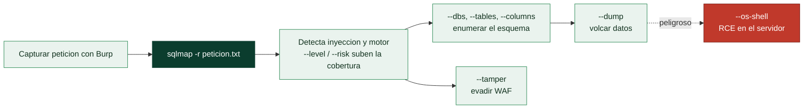

# Clase 093 — SQLMap

> Parte: **4 — Seguridad de aplicaciones web** · Fuente: *sqlmap Documentation* / *The Web Application Hacker's Handbook*
> ⏱️ Duración estimada: **100 min** · Nivel: **Intermedio**

---

## 🎯 Objetivo

Automatizar la detección y explotación de SQLi con **sqlmap**, la herramienta de referencia. Aprenderás a usarla con criterio: alimentarla con peticiones reales de Burp, ajustar niveles/riesgos y extraer datos, sin convertirla en un botón mágico que dispara a ciegas.

> ⚠️ **Ética**: sqlmap solo contra objetivos propios (DVWA, Juice Shop) o con autorización escrita. Un escaneo de sqlmap es intrusivo y puede alterar datos.

## 📚 Resultados de aprendizaje

Al finalizar, el alumno podrá:

1. **Alimentar** sqlmap con una request capturada en Burp (`-r`).
2. **Controlar** el alcance con `--level`, `--risk` y `--technique`.
3. **Enumerar** bases de datos, tablas, columnas y volcar datos.
4. **Automatizar** blind SQLi (booleana, temporal) sin escribir payloads a mano.
5. **Evadir** filtros básicos con tamper scripts, entendiendo sus límites.

## 🗺️ Temas

| # | Tema | Por qué importa |
|---|------|-----------------|
| 1 | Uso básico y `-u` / `-r` | Punto de partida correcto |
| 2 | level y risk | Controlan exhaustividad e intrusividad |
| 3 | Enumeración (`--dbs`, `--tables`) | Descubrir el objetivo |
| 4 | Volcado (`--dump`) | Extracción de datos |
| 5 | Autenticación y cookies | Testear tras el login |
| 6 | Tamper scripts | Evasión de filtros/WAF |
| 7 | `--os-shell` y peligros | Impacto máximo y responsabilidad |

## 🧠 Explicación en profundidad

### La herramienta que automatiza toda la clase anterior

**SQLMap** automatiza la detección y explotación de inyección SQL: prueba decenas de técnicas
(UNION, booleana, temporal, OOB, por errores), identifica el motor, enumera el esquema y vuelca
los datos, todo con una fiabilidad y una velocidad imposibles a mano. Es una herramienta
enormemente potente, y precisamente por eso su clase pone el acento en **usarla con criterio y
con permiso**: SQLMap es intrusiva por naturaleza —envía miles de peticiones que quedan en los
logs y, con ciertas opciones, modifica o extrae datos reales—, así que solo se lanza dentro del
alcance autorizado (clase 067).

El uso más común no es escribir la petición a mano, sino **capturarla con Burp y pasársela a
SQLMap**: `sqlmap -r peticion.txt` toma un fichero con la petición HTTP completa —cabeceras,
cookies de sesión, cuerpo— y prueba la inyección respetando ese contexto. Para un objetivo
sencillo basta `sqlmap -u "http://sitio/item?id=1"`, pero el flujo `-r` es el que funciona en
aplicaciones reales autenticadas.



### level y risk: cobertura contra ruido y contra daño

Dos parámetros gobiernan cuánto se esfuerza SQLMap, y entenderlos evita tanto los falsos
negativos como los incidentes. **`--level`** (1 a 5) amplía **dónde** busca: niveles altos
prueban más puntos de inyección —cabeceras, cookies, `User-Agent`— además de los parámetros
obvios, a costa de muchas más peticiones. **`--risk`** (1 a 3) amplía **qué** prueba: los
niveles altos incluyen payloads más agresivos, como inyecciones basadas en `OR` que, en una
consulta de tipo `UPDATE`, **podrían modificar todas las filas de una tabla**. Por eso el
riesgo por defecto es conservador: subir `--risk` sin entender el contexto puede corromper
datos del cliente. La disciplina es empezar bajo y subir solo lo necesario.

### Enumerar, volcar y evadir

Una vez confirmada la inyección, el flujo de explotación es incremental y se detiene en cuanto
se tiene la prueba necesaria para el informe. **`--dbs`** lista las bases de datos, **`--tables`**
las tablas de una, **`--columns`** las columnas, y **`--dump`** vuelca el contenido. La buena
práctica es **no volcar tablas enteras de datos personales**: para demostrar el impacto basta
con extraer un puñado de registros o solo la estructura, respetando el principio de la clase 067
de no descargar datos sensibles reales más allá de lo imprescindible. Cuando hay un **WAF** por
medio, los **tamper scripts** (`--tamper`) transforman los payloads —cambiando mayúsculas,
insertando comentarios, codificando— para que evadan las firmas del WAF sin dejar de ser SQL
válido; es la evasión de la clase 086 automatizada.

La opción que exige más responsabilidad es **`--os-shell`**, que intenta obtener **ejecución de
comandos en el servidor** aprovechando funcionalidades de la base de datos (como `xp_cmdshell`
en SQL Server o `INTO OUTFILE` para escribir un web shell). Convierte una inyección SQL en un
compromiso completo del sistema, y por eso es también la más peligrosa e intrusiva: se usa solo
cuando el alcance lo autoriza explícitamente y demostrar RCE es un objetivo del engagement. El
cierre de la clase es el de siempre: SQLMap **encuentra y explota** lo que existe, pero entender
la inyección a mano (clases 091–092) es lo que permite interpretar sus resultados, verificar sus
hallazgos y saber cuándo se ha excedido —una herramienta potente en manos que no entienden el
fondo es la forma más rápida de causar un incidente en un cliente—.

## 📖 Definiciones y características

- **sqlmap**: herramienta open source que automatiza SQLi de extremo a extremo. Característica: soporta múltiples motores y técnicas.
- **`--level`** (1–5): cuántos vectores prueba (parámetros, cabeceras). Característica: más nivel = más cobertura y ruido.
- **`--risk`** (1–3): cuán agresivos son los payloads. Característica: riesgo alto puede modificar datos.
- **Técnica (B,E,U,S,T,Q)**: booleana, error, union, stacked, temporal, inline. Característica: se seleccionan con `--technique`.
- **Tamper script**: transforma payloads para evadir filtros. Característica: no sustituye a entender el WAF.
- **`--dump`**: exfiltra el contenido de tablas. Característica: guarda los datos localmente en CSV.

## 📔 Glosario

| Término | Definición concisa |
|---------|--------------------|
| SQLMap | Herramienta que automatiza detección y explotación de SQLi |
| `-u` | Objetivo indicado como URL |
| `-r` | Objetivo tomado de una petición HTTP capturada |
| `--level` (1-5) | Amplía dónde busca (cabeceras, cookies…); más peticiones |
| `--risk` (1-3) | Amplía qué payloads prueba; el alto puede modificar datos |
| `--dbs` | Lista las bases de datos |
| `--tables` / `--columns` | Enumera tablas y columnas |
| `--dump` | Vuelca el contenido de una tabla |
| Volcado mínimo | Extraer solo lo necesario para probar el impacto |
| Cookies / autenticación | Contexto que `-r` preserva para atacar zonas logueadas |
| Tamper script (`--tamper`) | Transforma payloads para evadir un WAF |
| `--os-shell` | Intenta ejecución de comandos; la opción más peligrosa |
| xp_cmdshell / INTO OUTFILE | Vías de RCE desde la base de datos |
| Uso responsable | Solo dentro del alcance autorizado; intrusiva por diseño |

## 🧰 Herramientas y preparación

- **sqlmap** (Python).
- **Burp** para capturar la petición y guardarla como archivo `.txt`.

```bash
sudo apt install sqlmap    # o: git clone https://github.com/sqlmapproject/sqlmap
sqlmap --version
```

## 🧪 Laboratorio guiado

> ⚠️ Solo contra DVWA/Juice Shop propios.

1. En DVWA, captura la petición vulnerable con Burp y guárdala como `req.txt` (clic derecho → *Copy to file*).
2. Lanza sqlmap sobre esa request:

```bash
sqlmap -r req.txt -p id --batch
```

3. Si detecta inyección, enumera bases de datos:

```bash
sqlmap -r req.txt -p id --dbs
```

4. Lista tablas y columnas de la base objetivo:

```bash
sqlmap -r req.txt -p id -D dvwa --tables
sqlmap -r req.txt -p id -D dvwa -T users --columns
```

5. Vuelca los datos sensibles:

```bash
sqlmap -r req.txt -p id -D dvwa -T users -C user,password --dump
```

6. Prueba con autenticación pasando la cookie de sesión (`--cookie`) para DVWA nivel Medium.
7. Sube el nivel/riesgo con cuidado (`--level=3 --risk=2`) y compara detecciones.

## ✍️ Ejercicios

1. Detecta el motor y la versión con `--banner`.
2. Compara resultados con `--technique=BT` vs. la selección automática.
3. Usa `--tamper=space2comment` contra un filtro que bloquea espacios.
4. Volca solo el usuario admin usando `--where`.
5. Explica por qué `--os-shell` es peligroso y cuándo (no) usarlo.
6. Documenta el impacto real del dump: ¿qué datos y qué gravedad?

## 📝 Reto verificable

Con una única request de Burp, usa sqlmap para **volcar la tabla de usuarios** de DVWA y luego reproduce manualmente uno de los payloads que sqlmap generó, entendiéndolo.
**Criterio de aceptación**: entregas el CSV volcado, el comando exacto y una explicación de un payload de sqlmap (no basta con "funcionó").

## ⚠️ Errores comunes

| Síntoma / mensaje | Causa y cómo arreglar |
|-------------------|------------------------|
| "all tested parameters do not appear to be injectable" | Sube `--level`/`--risk` o revisa el parámetro correcto |
| No respeta la sesión | Falta `--cookie` o el token caducó |
| Escaneo eterno | Limita `--technique` y usa `--batch` |
| Datos corruptos por `--risk=3` | Payloads stacked; baja el riesgo |
| Bloqueado por WAF | Prueba tamper scripts adecuados, con permiso |

## ❓ Preguntas frecuentes

**❓ ¿sqlmap sustituye al conocimiento manual?**
No. Automatiza lo tedioso, pero necesitas entender la SQLi para dirigirla, validar resultados y evitar destrozos.

**❓ ¿Por qué empezar con la request de Burp?**
Porque incluye cabeceras, cookies y cuerpo exactos; sqlmap testea todo el contexto real.

**❓ ¿Es seguro usar `--dump` en producción?**
No sin autorización. Extrae datos reales y puede violar privacidad y ley. Solo en labs o con permiso escrito.

## 🔗 Referencias

- sqlmap: <https://sqlmap.org/>
- Wiki de sqlmap: <https://github.com/sqlmapproject/sqlmap/wiki>
- OWASP Testing for SQL Injection (WSTG).

## 📥 Material descargable

- 📄 [Guía en PDF](./clase-093-guia.pdf) — versión imprimible de esta clase.
- 🎞️ [Presentación (PPTX)](./clase-093-presentacion.pptx) — deck para proyectar en clase.

## ⬅️ Clase anterior

[Clase 092 — Inyección SQL avanzada y ciega (blind)](../092-inyeccion-sql-avanzada-y-ciega-blind/README.md)

## ➡️ Siguiente clase

[Clase 094 — Inyección NoSQL](../094-inyeccion-nosql/README.md)
