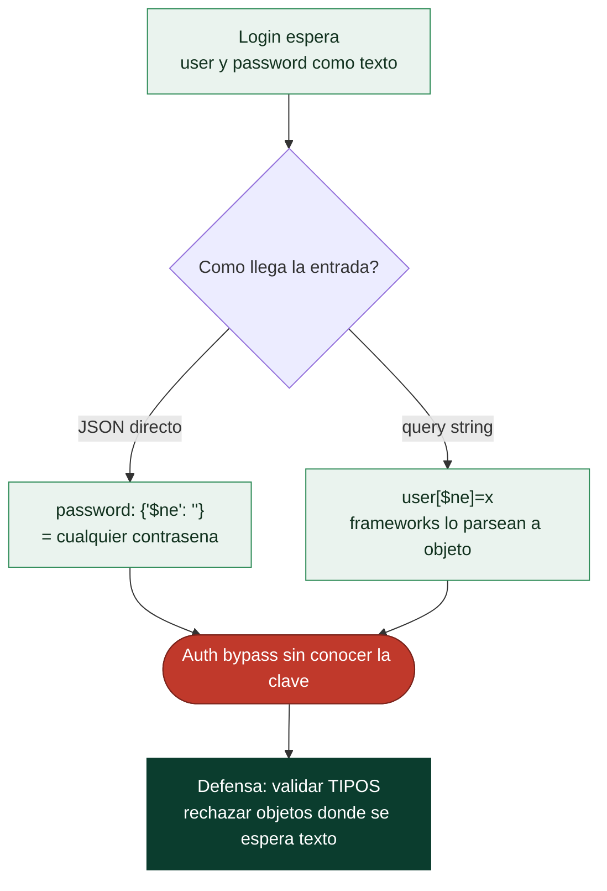

# Clase 094 — Inyección NoSQL

> Parte: **4 — Seguridad de aplicaciones web** · Fuente: *OWASP WSTG* / *Bug Bounty Bootcamp (Vickie Li)*
> ⏱️ Duración estimada: **90 min** · Nivel: **Intermedio**

---

## 🎯 Objetivo

Entender que la inyección **no es exclusiva de SQL**: las bases NoSQL (MongoDB, etc.) tienen sus propios vectores. Aprenderás a explotar operadores de MongoDB y JavaScript del lado servidor para saltar autenticación y extraer datos.

> ⚠️ **Ética**: solo en laboratorios propios o autorizados. Estas técnicas modifican y exfiltran datos reales.

## 📚 Resultados de aprendizaje

Al finalizar, el alumno podrá:

1. **Explicar** por qué el paso de objetos JSON habilita NoSQLi.
2. **Aplicar** operadores MongoDB (`$ne`, `$gt`, `$regex`, `$where`) como payloads.
3. **Saltar** autenticación con inyección de operadores.
4. **Extraer** datos con NoSQLi ciega basada en `$regex`.
5. **Recomendar** validación de tipos y sanitización como defensa.

## 🗺️ Temas

| # | Tema | Por qué importa |
|---|------|-----------------|
| 1 | Modelo de datos NoSQL | Cambia la forma del ataque |
| 2 | Operadores de consulta MongoDB | Los payloads son operadores |
| 3 | Inyección vía JSON vs. query string | El formato altera el vector |
| 4 | Auth bypass con `$ne`/`$gt` | Impacto directo |
| 5 | Blind NoSQLi con `$regex` | Extracción carácter a carácter |
| 6 | `$where` y JS server-side | Ejecución de lógica arbitraria |
| 7 | Defensa: validar tipos | Cierre del fallo |

## 🧠 Explicación en profundidad

### Distinta base de datos, mismo error de fondo

Que una aplicación use MongoDB en lugar de SQL **no la hace inmune a la inyección**: el fallo
raíz —mezclar entrada del usuario con la lógica de la consulta— es el mismo, solo cambia la
forma. En las bases **NoSQL** documentales como MongoDB, las consultas no son cadenas de texto
sino **estructuras de datos** (objetos JSON con operadores), y ahí está la vuelta de tuerca: la
inyección no consiste en romper una cadena con una comilla, sino en **cambiar el tipo o la
estructura** de lo que se envía para introducir **operadores** que la aplicación no esperaba.
Entender esto es clave porque las defensas mentales del programador ("escapo las comillas")
no aplican y dejan un hueco enorme.

### El operador que rompe la autenticación

MongoDB tiene operadores de consulta como `$ne` (distinto de), `$gt` (mayor que), `$regex`
(coincide con) o `$where` (evalúa JavaScript). El ataque clásico convierte un valor simple en
un objeto con uno de esos operadores. Imagina un login que consulta
`{ user: entrada_user, password: entrada_pass }`. Si la aplicación acepta JSON y no valida
tipos, el atacante envía `{ "user": "admin", "password": { "$ne": "" } }`: el operador `$ne ""`
significa "cualquier contraseña distinta de vacío", es decir, **coincide con cualquier
contraseña**, y se entra como admin sin conocerla. Es el `admin' --` de la clase 091 traducido
al mundo NoSQL, y funciona porque el desarrollador esperaba un texto y recibió un objeto.



### Dos vías de entrada, y la inyección ciega

Hay dos formas de colar esos operadores. La directa es una **API que acepta JSON**: ahí el
atacante controla la estructura por completo y puede anidar operadores a voluntad. La menos
obvia, y por eso peligrosa, es la **query string**: muchos frameworks (Express con
`qs`, PHP) **parsean automáticamente** una sintaxis como `user[$ne]=x` convirtiéndola en un
objeto `{ user: { $ne: "x" } }` antes de que llegue a la consulta. Es decir, un parámetro de
URL de apariencia inofensiva se transforma en un operador de MongoDB sin que el atacante
necesite enviar JSON. Este comportamiento sorprende a muchos desarrolladores y es una fuente
recurrente de fallos.

Como en SQL, cuando no se ven los resultados existe la **NoSQLi ciega**: con `$regex` se
pregunta si un valor **empieza por** cierto patrón (`{"password": {"$regex": "^a"}}`) y, según
la aplicación responda a una coincidencia o no, se extrae el dato **carácter a carácter**,
exactamente como la inyección booleana de la clase 092. Y el operador **`$where`** —o
`mapReduce`— es el más grave, porque **evalúa JavaScript en el servidor**: si el atacante
controla lo que se ejecuta ahí, puede pasar de leer datos a ejecutar lógica arbitraria, un
escalón hacia el RCE.

La **defensa** tiene un acento distinto al de SQL y conviene subrayarlo: además de no construir
consultas con entrada sin validar, lo decisivo es **validar los tipos**. Si un campo debe ser
una cadena, hay que **rechazar** explícitamente que llegue un objeto —comprobar
`typeof entrada === 'string'`, usar esquemas de validación como los de Mongoose, y sanear los
operadores `$`—. En NoSQL, la comprobación de tipos no es una buena práctica opcional: es la
barrera que impide el bypass más común.

## 📖 Definiciones y características

- **NoSQL injection**: manipular consultas de bases no relacionales insertando operadores u objetos. Característica: se aprovecha del tipado débil del input.
- **Operador `$ne`**: "not equal". Característica: `{"$ne": null}` casi siempre es verdadero, ideal para bypass.
- **Operador `$regex`**: coincidencia por expresión regular. Característica: permite inferir datos carácter a carácter (blind).
- **`$where`**: ejecuta JavaScript en el servidor Mongo. Característica: potente y peligroso; puede permitir DoS o extracción.
- **Inyección de objeto**: enviar `{"$ne":""}` donde se espera un string. Característica: posible cuando el backend no valida tipos.
- **Type juggling**: confusión de tipos entre cliente y servidor. Característica: base de muchos bypass NoSQL.

## 📔 Glosario

| Término | Definición concisa |
|---------|--------------------|
| NoSQL | Bases no relacionales; MongoDB es documental (JSON) |
| Inyección NoSQL | Alterar la estructura o el tipo de la consulta con operadores |
| Operador de consulta | `$ne`, `$gt`, `$regex`, `$where` de MongoDB |
| `$ne` | "Distinto de"; con `""` coincide con cualquier valor |
| Auth bypass con `$ne` | `password: {$ne: ""}` entra sin conocer la contraseña |
| Confusión de tipo | Enviar un objeto donde se espera una cadena |
| Vía JSON | La API acepta JSON y el atacante controla la estructura |
| Vía query string | `user[$ne]=x` se parsea a objeto automáticamente |
| Parseo de parámetros | Frameworks que convierten la query string en objetos |
| NoSQLi ciega | Extraer datos con `$regex` carácter a carácter |
| `$regex` | Coincidencia por patrón; base de la inyección ciega |
| `$where` | Evalúa JavaScript en el servidor; riesgo de RCE |
| Validación de tipos | Rechazar objetos donde se espera texto; la defensa clave |
| Esquema de validación | Mongoose u otros que fuerzan el tipo de cada campo |

## 🧰 Herramientas y preparación

- **OWASP Juice Shop** (usa MongoDB-like en algunos retos) o un lab **DVNA**/**NodeGoat**.
- **Burp Suite** para editar cuerpos JSON.
- **NoSQLMap** (opcional, para automatizar).

```bash
# NodeGoat como lab NoSQL en Node/Mongo
git clone https://github.com/OWASP/NodeGoat && cd NodeGoat && docker compose up
```

## 🧪 Laboratorio guiado

> ⚠️ Solo en tu laboratorio.

1. Localiza un login que reciba JSON (`{"username":"x","password":"y"}`).
2. Con Burp, cambia el body a inyección de operador:

```json
{"username":"admin","password":{"$ne":""}}
```

3. Observa si se produce el **bypass de autenticación**.
4. Prueba la variante por query string: `username[$ne]=&password[$ne]=`.
5. Para NoSQLi ciega, usa `$regex` para adivinar la contraseña:

```json
{"username":"admin","password":{"$regex":"^a"}}
```

6. Itera el prefijo (`^a`, `^ab`, ...) según la respuesta de login para reconstruir el valor.
7. Si el backend usa `$where`, prueba una condición JS y evalúa el riesgo (sin causar DoS).

## ✍️ Ejercicios

1. Diferencia el payload en JSON del payload en query string para el mismo bypass.
2. Reconstruye una contraseña de 8 caracteres con `$regex` blind.
3. Explica por qué `{"$gt":""}` también funciona como bypass.
4. Escribe la validación en Node que impediría el ataque (comprobar `typeof === 'string'`).
5. Investiga qué hace `$where` y por qué está desaconsejado.
6. Compara conceptualmente SQLi y NoSQLi: similitudes y diferencias.

## 📝 Reto verificable

Consigue un **bypass de autenticación** en un lab NoSQL (NodeGoat/Juice Shop) y luego extrae parcialmente una credencial con NoSQLi ciega por `$regex`.
**Criterio de aceptación**: demuestras el login sin conocer la contraseña y recuperas al menos los primeros caracteres del valor real mediante `$regex`, documentando los payloads.

## ⚠️ Errores comunes

| Síntoma / mensaje | Causa y cómo arreglar |
|-------------------|------------------------|
| El operador no se interpreta | El backend recibe string, no objeto; ajusta Content-Type/formato |
| `$where` bloqueado | Deshabilitado en el servidor; usa otros operadores |
| Regex demasiado lento | Usa anclas `^` y búsqueda incremental |
| Bypass no funciona en query string | La app parsea distinto; prueba notación `param[$ne]` |
| Falsos positivos | Confirma con dos operadores distintos |

## ❓ Preguntas frecuentes

**❓ ¿Por qué el JSON facilita NoSQLi?**
Porque un campo que debería ser string puede convertirse en un objeto con operadores si el servidor no valida el tipo.

**❓ ¿MongoDB es inseguro por diseño?**
No; el problema es el código que pasa input sin validar tipos ni sanitizar. Con validación estricta no hay NoSQLi.

**❓ ¿Sirve sqlmap para NoSQL?**
No. Para NoSQL existe NoSQLMap y payloads manuales; los conceptos son análogos pero la sintaxis difiere.

## 🔗 Referencias

- OWASP Testing for NoSQL Injection (WSTG).
- PortSwigger NoSQL injection: <https://portswigger.net/web-security/nosql-injection>
- MongoDB Query Operators: <https://www.mongodb.com/docs/manual/reference/operator/query/>

## 📥 Material descargable

- 📄 [Guía en PDF](./clase-094-guia.pdf) — versión imprimible de esta clase.
- 🎞️ [Presentación (PPTX)](./clase-094-presentacion.pptx) — deck para proyectar en clase.

## ⬅️ Clase anterior

[Clase 093 — SQLMap](../093-sqlmap/README.md)

## ➡️ Siguiente clase

[Clase 095 — Inyección de comandos del sistema operativo](../095-inyeccion-de-comandos-del-sistema-operativo/README.md)
