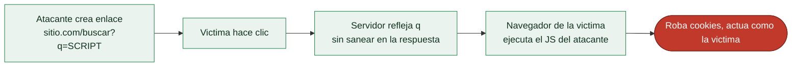

# Clase 096 — Cross-Site Scripting (XSS) reflejado

> Parte: **4 — Seguridad de aplicaciones web** · Fuente: *The Web Application Hacker's Handbook (Stuttard & Pinto)*
> ⏱️ Duración estimada: **110 min** · Nivel: **Intermedio**

---

## 🎯 Objetivo

Comprender y explotar el **XSS reflejado**: cuando la aplicación devuelve input del usuario en la respuesta sin sanitizar, permitiendo ejecutar JavaScript en el navegador de la víctima. Es la puerta de entrada al mundo XSS y a los ataques del lado cliente.

> ⚠️ **Ética**: solo en labs propios (DVWA, Juice Shop, PortSwigger). Ejecutar XSS contra usuarios reales sin permiso es ilegal.

## 📚 Resultados de aprendizaje

Al finalizar, el alumno podrá:

1. **Explicar** el flujo de un XSS reflejado y su impacto.
2. **Identificar** contextos de inyección (HTML, atributo, JS, URL).
3. **Construir** payloads adaptados a cada contexto.
4. **Robar** cookies/tokens en un lab para demostrar impacto.
5. **Recomendar** codificación de salida y CSP como defensa.

## 🗺️ Temas

| # | Tema | Por qué importa |
|---|------|-----------------|
| 1 | Qué es XSS y sus tipos | Base conceptual |
| 2 | Flujo del reflejado | Cómo llega al navegador víctima |
| 3 | Contextos de inyección | El payload depende del contexto |
| 4 | Escape de atributos y JS | Salir del contexto para inyectar |
| 5 | Impacto: robo de sesión | Traducir XSS a daño real |
| 6 | Filtros y su evasión | Realidad de las apps modernas |
| 7 | Defensa: output encoding, CSP | Cierre del fallo |

## 🧠 Explicación en profundidad

### El navegador ejecuta lo que le llega, y ese es el problema

El **Cross-Site Scripting** es la inyección trasladada al navegador: en lugar de que datos del
usuario se interpreten como SQL en la base de datos, se interpretan como **JavaScript en el
navegador de otra víctima**. La causa raíz es idéntica —datos que cruzan la frontera y se
convierten en código— pero el intérprete es el navegador y el impacto se sufre en el **cliente**:
robo de sesión, acciones en nombre de la víctima, keylogging, redirecciones. Que OWASP lo
clasifique dentro de A03 Injection (clase 087) no es casual: es la misma enfermedad en otro
órgano.

Hay tres tipos según cómo llega el payload al navegador, y esta clase cubre el **reflejado**: el
payload viaja en la **petición** (típicamente un parámetro de URL) y el servidor lo **devuelve
sin sanear** en la respuesta inmediata. Como no se almacena, el atacante necesita que la víctima
**haga clic en un enlace** preparado —de ahí que el reflejado se entregue por phishing—.

### El contexto de inyección lo decide todo

La destreza central del XSS es entender el **contexto** en el que la entrada se refleja, porque
determina qué payload funciona y cómo escapar. No es lo mismo que la entrada aparezca entre
etiquetas HTML (`
AQUÍ
`), dentro del valor de un atributo (`<input value="AQUÍ">`),
dentro de un bloque `` o un ``. En un atributo, primero hay que **cerrar
las comillas** del atributo (`">`.
3. Si se filtra ``.
7. Construye la **URL de ataque** completa que un atacante enviaría a la víctima y explica el flujo.

## ✍️ Ejercicios

1. Diseña un payload para contexto de atributo y otro para contexto de script.
2. Evade un filtro que elimina la palabra `script` (mayúsculas, anidado, eventos).
3. Explica por qué HttpOnly no evita el XSS, solo mitiga el robo de cookie.
4. Escribe una CSP que bloquearía tu payload y explica cómo.
5. Diferencia reflejado, almacenado y DOM (adelanto de la próxima clase).
6. Codifica la salida correctamente en un template server-side para eliminar el bug.

## 📝 Reto verificable

Resuelve un lab de XSS reflejado de PortSwigger que requiera **escapar de un contexto** (atributo o script) y ejecutar `alert(document.cookie)`.
**Criterio de aceptación**: el lab queda marcado como resuelto, y explicas el contexto de inyección, el payload y qué codificación de salida lo habría prevenido.

## ⚠️ Errores comunes

| Síntoma / mensaje | Causa y cómo arreglar |
|-------------------|------------------------|
| El payload aparece como texto | Está siendo codificado; busca otro contexto o sink |
| `<script>` no ejecuta | CSP o filtro; usa manejadores de evento |
| alert no salta pero el HTML cambia | Contexto de atributo; cierra la comilla primero |
| Funciona en Burp pero no en el navegador | El navegador codifica la URL; ajusta encoding |
| Cookie no se roba | HttpOnly activo; demuestra impacto de otra forma |

## ❓ Preguntas frecuentes

**❓ ¿XSS reflejado necesita interacción de la víctima?**
Sí: la víctima debe abrir el enlace malicioso. Por eso suele combinarse con phishing.

**❓ ¿La codificación de entrada o de salida?**
De salida, según el contexto donde se escribe. La codificación de entrada es útil pero insuficiente por sí sola.

**❓ ¿CSP elimina el XSS?**
No lo elimina, lo mitiga: aunque el bug exista, una buena CSP puede impedir que el script se ejecute.

## 🔗 Referencias

- Stuttard & Pinto, *The Web Application Hacker's Handbook*, cap. 12.
- OWASP XSS: <https://owasp.org/www-community/attacks/xss/>
- OWASP XSS Prevention Cheat Sheet.
- PortSwigger XSS: <https://portswigger.net/web-security/cross-site-scripting>

## 📥 Material descargable

- 📄 [Guía en PDF](./clase-096-guia.pdf) — versión imprimible de esta clase.
- 🎞️ [Presentación (PPTX)](./clase-096-presentacion.pptx) — deck para proyectar en clase.

## ⬅️ Clase anterior

[Clase 095 — Inyección de comandos del sistema operativo](../095-inyeccion-de-comandos-del-sistema-operativo/README.md)

## ➡️ Siguiente clase

[Clase 097 — XSS almacenado y basado en DOM](../097-xss-almacenado-y-basado-en-dom/README.md)
