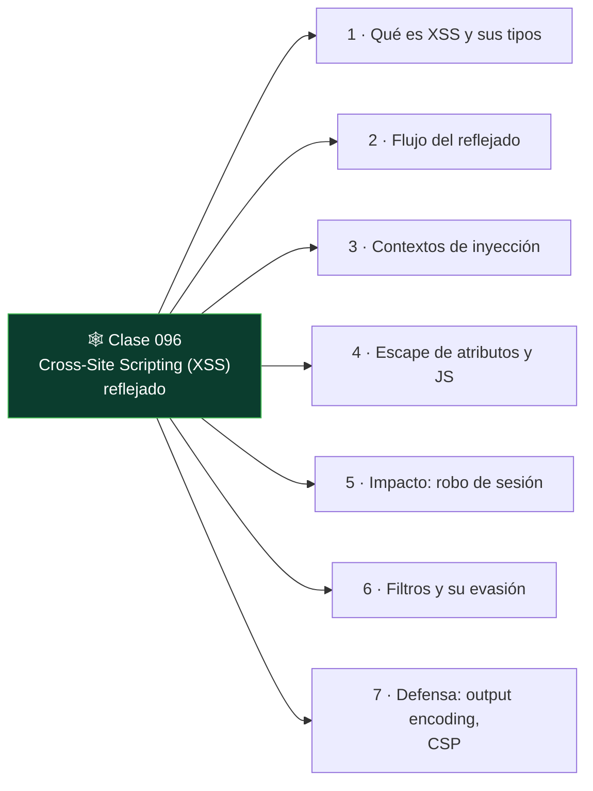

# Clase 096 — Cross-Site Scripting (XSS) reflejado

<!-- cabecera:inicio -->

> 🗂️ Parte: **4 — Seguridad de aplicaciones web** · 📖 Fuente: *The Web Application Hacker's Handbook (Stuttard & Pinto)*
> ⏱️ Duración estimada: **110 min** · 🎚️ Nivel: **Intermedio**

<!-- cabecera:fin -->

---

## 🎯 Objetivo

Comprender y explotar el **XSS reflejado**: cuando la aplicación devuelve input del usuario en la respuesta sin sanitizar, permitiendo ejecutar JavaScript en el navegador de la víctima. Es la puerta de entrada al mundo XSS y a los ataques del lado cliente.

> ⚠️ **Ética**: solo en labs propios (DVWA, Juice Shop, PortSwigger). Ejecutar XSS contra usuarios reales sin permiso es ilegal.

## 📚 Resultados de aprendizaje

Al finalizar, el alumno podrá:

1. **Explicar** el flujo de un XSS reflejado y su impacto.
2. **Identificar** contextos de inyección (HTML, atributo, JS, URL).
3. **Construir** payloads adaptados a cada contexto.
4. **Robar** cookies/tokens en un lab para demostrar impacto.
5. **Recomendar** codificación de salida y CSP como defensa.

## 🗺️ Temas

<!-- mapa:inicio -->

<!-- mapa:fin -->

| # | Tema | Por qué importa |
|---|------|-----------------|
| 1 | Qué es XSS y sus tipos | Base conceptual |
| 2 | Flujo del reflejado | Cómo llega al navegador víctima |
| 3 | Contextos de inyección | El payload depende del contexto |
| 4 | Escape de atributos y JS | Salir del contexto para inyectar |
| 5 | Impacto: robo de sesión | Traducir XSS a daño real |
| 6 | Filtros y su evasión | Realidad de las apps modernas |
| 7 | Defensa: output encoding, CSP | Cierre del fallo |

## 📖 Definiciones y características

- **XSS reflejado**: el payload viaja en la petición y se refleja en la respuesta inmediata. Característica: requiere que la víctima abra un enlace preparado.
- **Contexto de inyección**: dónde aterriza el input (cuerpo HTML, atributo, script, URL). Característica: determina la sintaxis del payload.
- **Output encoding**: codificar caracteres especiales al escribir la salida. Característica: defensa principal contra XSS.
- **CSP (Content Security Policy)**: cabecera que restringe orígenes de script. Característica: mitiga XSS aunque exista el bug.
- **Payload polyglot**: cadena que funciona en varios contextos. Característica: útil para pruebas rápidas.
- **HttpOnly**: flag de cookie que la oculta a JavaScript. Característica: limita el robo de sesión vía XSS.

## 🧰 Herramientas y preparación

- **DVWA** (*XSS reflected*), **Juice Shop**, **PortSwigger labs**.
- **Burp** para probar variaciones y observar reflexiones.
- Navegador con DevTools.

## 🧪 Laboratorio guiado

> ⚠️ Solo en labs propios.

1. En DVWA → *XSS (Reflected)*, envía tu nombre y busca dónde se refleja en el HTML.
2. Prueba el payload básico: ``.
3. Si se filtra ``.
7. Construye la **URL de ataque** completa que un atacante enviaría a la víctima y explica el flujo.

## ✍️ Ejercicios

1. Diseña un payload para contexto de atributo y otro para contexto de script.
2. Evade un filtro que elimina la palabra `script` (mayúsculas, anidado, eventos).
3. Explica por qué HttpOnly no evita el XSS, solo mitiga el robo de cookie.
4. Escribe una CSP que bloquearía tu payload y explica cómo.
5. Diferencia reflejado, almacenado y DOM (adelanto de la próxima clase).
6. Codifica la salida correctamente en un template server-side para eliminar el bug.

## 📝 Reto verificable

Resuelve un lab de XSS reflejado de PortSwigger que requiera **escapar de un contexto** (atributo o script) y ejecutar `alert(document.cookie)`.
**Criterio de aceptación**: el lab queda marcado como resuelto, y explicas el contexto de inyección, el payload y qué codificación de salida lo habría prevenido.

## ⚠️ Errores comunes

| Síntoma / mensaje | Causa y cómo arreglar |
|-------------------|------------------------|
| El payload aparece como texto | Está siendo codificado; busca otro contexto o sink |
| `<script>` no ejecuta | CSP o filtro; usa manejadores de evento |
| alert no salta pero el HTML cambia | Contexto de atributo; cierra la comilla primero |
| Funciona en Burp pero no en el navegador | El navegador codifica la URL; ajusta encoding |
| Cookie no se roba | HttpOnly activo; demuestra impacto de otra forma |

## ❓ Preguntas frecuentes

**❓ ¿XSS reflejado necesita interacción de la víctima?**
Sí: la víctima debe abrir el enlace malicioso. Por eso suele combinarse con phishing.

**❓ ¿La codificación de entrada o de salida?**
De salida, según el contexto donde se escribe. La codificación de entrada es útil pero insuficiente por sí sola.

**❓ ¿CSP elimina el XSS?**
No lo elimina, lo mitiga: aunque el bug exista, una buena CSP puede impedir que el script se ejecute.

## 🔗 Referencias

- Stuttard & Pinto, *The Web Application Hacker's Handbook*, cap. 12.
- OWASP XSS: <https://owasp.org/www-community/attacks/xss/>
- OWASP XSS Prevention Cheat Sheet.
- PortSwigger XSS: <https://portswigger.net/web-security/cross-site-scripting>

## 📥 Material descargable

- 📄 [Guía en PDF](./clase-096-guia.pdf) — versión imprimible de esta clase.
- 🎞️ [Presentación (PPTX)](./clase-096-presentacion.pptx) — deck para proyectar en clase.

## ⬅️ Clase anterior

[Clase 095 — Inyección de comandos del sistema operativo](../095-inyeccion-de-comandos-del-sistema-operativo/README.md)

## ➡️ Siguiente clase

[Clase 097 — XSS almacenado y basado en DOM](../097-xss-almacenado-y-basado-en-dom/README.md)
