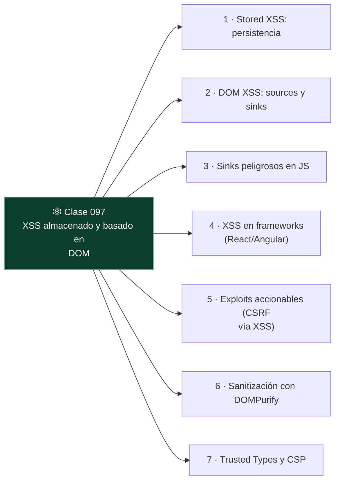

# Clase 097 — XSS almacenado y basado en DOM

<!-- cabecera:inicio -->

> 🗂️ Parte: **4 — Seguridad de aplicaciones web** · 📖 Fuente: *The Web Application Hacker's Handbook* / *Real-World Bug Hunting (Yaworski)*
> ⏱️ Duración estimada: **120 min** · 🎚️ Nivel: **Avanzado**

<!-- cabecera:fin -->

---

## 🎯 Objetivo

Dominar las dos variantes de XSS más peligrosas: el **almacenado (stored)**, que persiste y afecta a todos los usuarios, y el **basado en DOM**, que ocurre íntegramente en el navegador. Aprenderás a rastrear el flujo de datos desde la fuente (source) hasta el punto de ejecución (sink).

> ⚠️ **Ética**: solo en labs propios/autorizados. El stored XSS puede afectar a otros usuarios, así que nunca lo pruebes en producción ajena.

## 📚 Resultados de aprendizaje

Al finalizar, el alumno podrá:

1. **Explotar** XSS almacenado y evaluar su alcance (todos los usuarios).
2. **Rastrear** flujos source→sink en JavaScript para DOM XSS.
3. **Identificar** sinks peligrosos (`innerHTML`, `eval`, `document.write`).
4. **Construir** un exploit que realice acciones en nombre de la víctima.
5. **Aplicar** defensas: sanitización DOM (DOMPurify), APIs seguras.

## 🗺️ Temas

<!-- mapa:inicio -->

<!-- mapa:fin -->

| # | Tema | Por qué importa |
|---|------|-----------------|
| 1 | Stored XSS: persistencia | Afecta a múltiples usuarios |
| 2 | DOM XSS: sources y sinks | Ocurre sin tocar el servidor |
| 3 | Sinks peligrosos en JS | Dónde se ejecuta el código |
| 4 | XSS en frameworks (React/Angular) | Riesgos residuales modernos |
| 5 | Exploits accionables (CSRF vía XSS) | Impacto real más allá del alert |
| 6 | Sanitización con DOMPurify | Defensa práctica en cliente |
| 7 | Trusted Types y CSP | Defensa de plataforma |

## 📖 Definiciones y características

- **Stored XSS**: el payload se guarda en el servidor y se sirve a otros. Característica: no requiere enlace; se dispara solo al ver el contenido.
- **DOM XSS**: el flujo peligroso ocurre en el JavaScript del cliente. Característica: el servidor puede no ver nunca el payload.
- **Source**: entrada controlable en el DOM (`location.hash`, `document.referrer`). Característica: origen del dato no confiable.
- **Sink**: función que ejecuta/inserta datos (`innerHTML`, `eval`). Característica: punto donde detona el XSS.
- **DOMPurify**: librería que sanitiza HTML en el cliente. Característica: defensa fiable frente a DOM XSS.
- **Trusted Types**: API del navegador que restringe asignaciones peligrosas. Característica: previene sinks inseguros por diseño.

## 🧰 Herramientas y preparación

- **Juice Shop** (varios retos de stored/DOM XSS) y **PortSwigger labs**.
- **Burp** y **DevTools** (breakpoints en sinks).
- Extensión mental de "seguir el dato": de dónde viene y dónde acaba.

## 🧪 Laboratorio guiado

> ⚠️ Solo en labs propios.

1. **Stored**: en Juice Shop, busca un campo persistente (comentario, nombre de usuario) y guarda ``.
2. Verifica que el payload se ejecuta al recargar la página desde otra sesión.
3. **DOM XSS**: localiza en el JS un sink como `element.innerHTML = location.hash.slice(1)`.
4. Construye la URL con el payload en el `#hash` y confirma la ejecución.
5. Usa DevTools para poner un breakpoint en el sink y observar el flujo del dato.
6. Escala el impacto: en lugar de `alert`, haz que el script realice una acción autenticada (cambiar email) en el lab.
7. Documenta source, sink, payload y el impacto.

## ✍️ Ejercicios

1. Enumera 5 sinks peligrosos en JavaScript y por qué lo son.
2. Explica por qué el stored XSS es más grave que el reflejado.
3. Encuentra un DOM XSS donde el servidor nunca vea el payload y explícalo.
4. Sanitiza un campo con DOMPurify y demuestra que bloquea tu payload.
5. Investiga cómo React mitiga XSS por defecto y cuándo `dangerouslySetInnerHTML` lo reintroduce.
6. Diseña una CSP con Trusted Types para el lab.

## 📝 Reto verificable

Logra un **XSS almacenado** en Juice Shop que ejecute una acción en nombre de otro usuario (no solo `alert`), y luego propón la corrección con sanitización.
**Criterio de aceptación**: demuestras el payload persistente disparándose en una segunda sesión y realizando una acción, e identificas el source, el sink y la defensa concreta.

## ⚠️ Errores comunes

| Síntoma / mensaje | Causa y cómo arreglar |
|-------------------|------------------------|
| El payload se guarda pero no ejecuta | Se codifica al renderizar; busca otro campo/sink |
| DOM XSS no reproduce | El source no es controlable en ese flujo; revisa el JS |
| React "no permite" XSS | `dangerouslySetInnerHTML` o refs manuales lo reintroducen |
| DOMPurify no bloquea | Config permisiva; revisa allowlist de tags/atributos |
| alert salta solo para ti | Contexto de sesión; prueba en pestaña anónima |

## ❓ Preguntas frecuentes

**❓ ¿Los frameworks modernos eliminan el XSS?**
Reducen mucho el riesgo por escapado automático, pero APIs de escape manual y DOM XSS siguen siendo posibles.

**❓ ¿Cómo encuentro DOM XSS?**
Rastrea sources y sinks en el JavaScript. Herramientas como DOM Invader (de Burp) ayudan a automatizarlo.

**❓ ¿Sanitizar en cliente o servidor?**
Ambos, según el caso. Para HTML enriquecido en el cliente, DOMPurify; en el servidor, codificación de salida por contexto.

## 🔗 Referencias

- Yaworski, *Real-World Bug Hunting*, cap. de XSS.
- OWASP DOM XSS Prevention Cheat Sheet.
- DOMPurify: <https://github.com/cure53/DOMPurify>
- PortSwigger DOM-based XSS: <https://portswigger.net/web-security/cross-site-scripting/dom-based>

## 📥 Material descargable

- 📄 [Guía en PDF](./clase-097-guia.pdf) — versión imprimible de esta clase.
- 🎞️ [Presentación (PPTX)](./clase-097-presentacion.pptx) — deck para proyectar en clase.

## ⬅️ Clase anterior

[Clase 096 — Cross-Site Scripting (XSS) reflejado](../096-cross-site-scripting-xss-reflejado/README.md)

## ➡️ Siguiente clase

[Clase 098 — Cross-Site Request Forgery (CSRF)](../098-cross-site-request-forgery-csrf/README.md)
