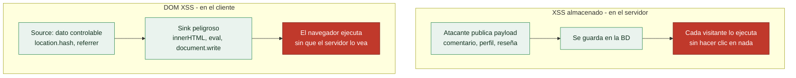

# Clase 097 — XSS almacenado y basado en DOM

> Parte: **4 — Seguridad de aplicaciones web** · Fuente: *The Web Application Hacker's Handbook* / *Real-World Bug Hunting (Yaworski)*
> ⏱️ Duración estimada: **120 min** · Nivel: **Avanzado**

---

## 🎯 Objetivo

Dominar las dos variantes de XSS más peligrosas: el **almacenado (stored)**, que persiste y afecta a todos los usuarios, y el **basado en DOM**, que ocurre íntegramente en el navegador. Aprenderás a rastrear el flujo de datos desde la fuente (source) hasta el punto de ejecución (sink).

> ⚠️ **Ética**: solo en labs propios/autorizados. El stored XSS puede afectar a otros usuarios, así que nunca lo pruebes en producción ajena.

## 📚 Resultados de aprendizaje

Al finalizar, el alumno podrá:

1. **Explotar** XSS almacenado y evaluar su alcance (todos los usuarios).
2. **Rastrear** flujos source→sink en JavaScript para DOM XSS.
3. **Identificar** sinks peligrosos (`innerHTML`, `eval`, `document.write`).
4. **Construir** un exploit que realice acciones en nombre de la víctima.
5. **Aplicar** defensas: sanitización DOM (DOMPurify), APIs seguras.

## 🗺️ Temas

| # | Tema | Por qué importa |
|---|------|-----------------|
| 1 | Stored XSS: persistencia | Afecta a múltiples usuarios |
| 2 | DOM XSS: sources y sinks | Ocurre sin tocar el servidor |
| 3 | Sinks peligrosos en JS | Dónde se ejecuta el código |
| 4 | XSS en frameworks (React/Angular) | Riesgos residuales modernos |
| 5 | Exploits accionables (CSRF vía XSS) | Impacto real más allá del alert |
| 6 | Sanitización con DOMPurify | Defensa práctica en cliente |
| 7 | Trusted Types y CSP | Defensa de plataforma |

## 🧠 Explicación en profundidad

### Almacenado: el payload espera a las víctimas

El **XSS almacenado** (*stored*) es la variante más peligrosa porque el payload se **guarda en el
servidor** —en un comentario, un nombre de perfil, un mensaje, una reseña— y se ejecuta en el
navegador de **cada usuario** que ve ese contenido, **sin necesidad de engañar a nadie con un
enlace**. A diferencia del reflejado (clase 096), no hace falta phishing: la víctima solo tiene
que visitar una página legítima del sitio. Un payload almacenado en un foro popular puede
comprometer a miles de usuarios, e incluso **propagarse** como un gusano si el script publica
más contenido malicioso en nombre de cada víctima que lo ejecuta —así funcionó el histórico
gusano Samy en MySpace—. Su mayor impacto lo hace también el hallazgo más grave de reportar.

### DOM XSS: el servidor ni se entera

El **DOM XSS** es distinto y más sutil: la vulnerabilidad está **enteramente en el JavaScript del
cliente**, sin que el servidor intervenga. Ocurre cuando el código del navegador toma un dato de
una fuente controlable por el atacante —un **source**— y lo pasa, sin sanear, a una función que lo
interpreta como código o HTML —un **sink**—. El modelo mental de *sources y sinks* es la clave de
toda la clase. **Sources** típicos: `location.hash`, `location.search`, `document.referrer`,
`window.name`, un mensaje `postMessage`. **Sinks** peligrosos: `innerHTML` y `outerHTML`
(interpretan HTML), `eval` y `setTimeout` con cadena (interpretan JS), `document.write`, la
asignación de `src`/`href` con `javascript:`. Si un source llega a un sink sin pasar por una
sanitización, hay DOM XSS. Y como todo ocurre en el navegador, **el servidor nunca ve el payload**
—por eso los proxies y escáneres que solo miran el tráfico HTTP lo pasan por alto, y hay que leer
el JavaScript—.

### Los frameworks ayudan, pero no son magia

React, Angular y Vue **escapan por defecto** el contenido que insertan, lo que elimina la mayoría
del XSS clásico —y es una de las razones por las que el XSS reflejado simple es menos común en
aplicaciones modernas—. Pero dejan puertas abiertas que hay que conocer: `dangerouslySetInnerHTML`
en React, `bypassSecurityTrustHtml` en Angular, `v-html` en Vue **desactivan** esa protección a
propósito, y son puntos calientes a revisar. Además, el DOM XSS puede aparecer en cualquier
manipulación manual del DOM que el desarrollador haga por fuera del framework. La regla: los
frameworks reducen el riesgo, pero un `dangerouslySetInnerHTML` con datos del usuario reintroduce
el fallo entero.

### Sanitizar bien, y las defensas modernas

Cuando de verdad hay que **renderizar HTML** proporcionado por el usuario (un editor de texto
enriquecido, por ejemplo), no se puede simplemente codificar —se perdería el formato— y hay que
**sanitizar**: eliminar del HTML todo lo peligroso dejando solo etiquetas seguras. Hacerlo a mano
es un desastre garantizado; la herramienta correcta es **DOMPurify**, una librería robusta y
mantenida que se lleva años de ataques encima. Y las dos defensas modernas de plataforma cierran
el tema: la **CSP** de la clase 096 sigue siendo la red de seguridad, y **Trusted Types** —una
política del navegador— va más allá, obligando a que cualquier dato que llegue a un sink peligroso
pase por una función de sanitización declarada, lo que **elimina el DOM XSS por diseño** en los
navegadores que la soportan. Sanitización con DOMPurify donde haya que renderizar HTML, más CSP y
Trusted Types como defensa de plataforma: esa es la pila completa contra las variantes más
peligrosas del XSS.

## 📖 Definiciones y características

- **Stored XSS**: el payload se guarda en el servidor y se sirve a otros. Característica: no requiere enlace; se dispara solo al ver el contenido.
- **DOM XSS**: el flujo peligroso ocurre en el JavaScript del cliente. Característica: el servidor puede no ver nunca el payload.
- **Source**: entrada controlable en el DOM (`location.hash`, `document.referrer`). Característica: origen del dato no confiable.
- **Sink**: función que ejecuta/inserta datos (`innerHTML`, `eval`). Característica: punto donde detona el XSS.
- **DOMPurify**: librería que sanitiza HTML en el cliente. Característica: defensa fiable frente a DOM XSS.
- **Trusted Types**: API del navegador que restringe asignaciones peligrosas. Característica: previene sinks inseguros por diseño.

## 📔 Glosario

| Término | Definición concisa |
|---------|--------------------|
| XSS almacenado (stored) | El payload se guarda y se ejecuta para cada visitante |
| Persistencia | El payload vive en el servidor sin necesidad de engaño |
| Gusano XSS | Payload que se propaga publicándose a sí mismo |
| DOM XSS | Vulnerabilidad enteramente en el JavaScript del cliente |
| Source | Dato controlable por el atacante (`location.hash`, referrer) |
| Sink | Función que interpreta el dato como código o HTML |
| innerHTML | Sink que interpreta HTML; peligroso con datos del usuario |
| eval / setTimeout | Sinks que interpretan JavaScript |
| Escape por defecto | React/Angular/Vue codifican lo que insertan |
| dangerouslySetInnerHTML | Desactiva el escape de React; punto caliente |
| Sanitización | Eliminar del HTML lo peligroso dejando lo seguro |
| DOMPurify | Librería estándar de sanitización de HTML |
| Trusted Types | Política del navegador que elimina el DOM XSS por diseño |
| CSP | Cabecera que restringe la ejecución de scripts |

## 🧰 Herramientas y preparación

- **Juice Shop** (varios retos de stored/DOM XSS) y **PortSwigger labs**.
- **Burp** y **DevTools** (breakpoints en sinks).
- Extensión mental de "seguir el dato": de dónde viene y dónde acaba.

## 🧪 Laboratorio guiado

> ⚠️ Solo en labs propios.

1. **Stored**: en Juice Shop, busca un campo persistente (comentario, nombre de usuario) y guarda ``.
2. Verifica que el payload se ejecuta al recargar la página desde otra sesión.
3. **DOM XSS**: localiza en el JS un sink como `element.innerHTML = location.hash.slice(1)`.
4. Construye la URL con el payload en el `#hash` y confirma la ejecución.
5. Usa DevTools para poner un breakpoint en el sink y observar el flujo del dato.
6. Escala el impacto: en lugar de `alert`, haz que el script realice una acción autenticada (cambiar email) en el lab.
7. Documenta source, sink, payload y el impacto.

## ✍️ Ejercicios

1. Enumera 5 sinks peligrosos en JavaScript y por qué lo son.
2. Explica por qué el stored XSS es más grave que el reflejado.
3. Encuentra un DOM XSS donde el servidor nunca vea el payload y explícalo.
4. Sanitiza un campo con DOMPurify y demuestra que bloquea tu payload.
5. Investiga cómo React mitiga XSS por defecto y cuándo `dangerouslySetInnerHTML` lo reintroduce.
6. Diseña una CSP con Trusted Types para el lab.

## 📝 Reto verificable

Logra un **XSS almacenado** en Juice Shop que ejecute una acción en nombre de otro usuario (no solo `alert`), y luego propón la corrección con sanitización.
**Criterio de aceptación**: demuestras el payload persistente disparándose en una segunda sesión y realizando una acción, e identificas el source, el sink y la defensa concreta.

## ⚠️ Errores comunes

| Síntoma / mensaje | Causa y cómo arreglar |
|-------------------|------------------------|
| El payload se guarda pero no ejecuta | Se codifica al renderizar; busca otro campo/sink |
| DOM XSS no reproduce | El source no es controlable en ese flujo; revisa el JS |
| React "no permite" XSS | `dangerouslySetInnerHTML` o refs manuales lo reintroducen |
| DOMPurify no bloquea | Config permisiva; revisa allowlist de tags/atributos |
| alert salta solo para ti | Contexto de sesión; prueba en pestaña anónima |

## ❓ Preguntas frecuentes

**❓ ¿Los frameworks modernos eliminan el XSS?**
Reducen mucho el riesgo por escapado automático, pero APIs de escape manual y DOM XSS siguen siendo posibles.

**❓ ¿Cómo encuentro DOM XSS?**
Rastrea sources y sinks en el JavaScript. Herramientas como DOM Invader (de Burp) ayudan a automatizarlo.

**❓ ¿Sanitizar en cliente o servidor?**
Ambos, según el caso. Para HTML enriquecido en el cliente, DOMPurify; en el servidor, codificación de salida por contexto.

## 🔗 Referencias

- Yaworski, *Real-World Bug Hunting*, cap. de XSS.
- OWASP DOM XSS Prevention Cheat Sheet.
- DOMPurify: <https://github.com/cure53/DOMPurify>
- PortSwigger DOM-based XSS: <https://portswigger.net/web-security/cross-site-scripting/dom-based>

## 📥 Material descargable

- 📄 [Guía en PDF](./clase-097-guia.pdf) — versión imprimible de esta clase.
- 🎞️ [Presentación (PPTX)](./clase-097-presentacion.pptx) — deck para proyectar en clase.

## ⬅️ Clase anterior

[Clase 096 — Cross-Site Scripting (XSS) reflejado](../096-cross-site-scripting-xss-reflejado/README.md)

## ➡️ Siguiente clase

[Clase 098 — Cross-Site Request Forgery (CSRF)](../098-cross-site-request-forgery-csrf/README.md)
