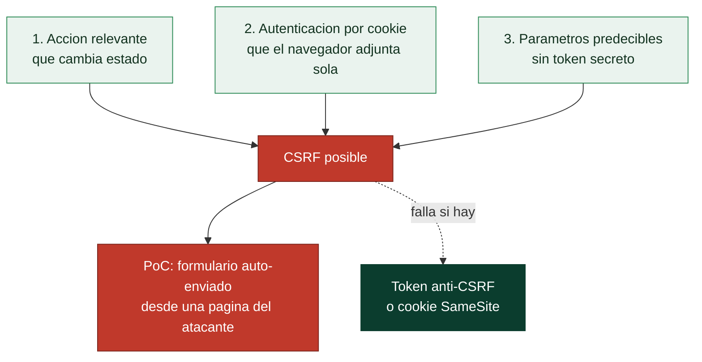

# Clase 098 — Cross-Site Request Forgery (CSRF)

> Parte: **4 — Seguridad de aplicaciones web** · Fuente: *The Web Application Hacker's Handbook (Stuttard & Pinto)*
> ⏱️ Duración estimada: **90 min** · Nivel: **Intermedio**

---

## 🎯 Objetivo

Entender el **CSRF (falsificación de petición entre sitios)**: forzar al navegador de una víctima autenticada a ejecutar acciones no deseadas. Aprenderás a construir PoCs, evaluar cuándo una defensa es efectiva y por qué SameSite y los tokens anti-CSRF funcionan.

> ⚠️ **Ética**: solo en labs propios/autorizados. Un PoC de CSRF ejecuta acciones reales sobre la cuenta de la víctima.

## 📚 Resultados de aprendizaje

Al finalizar, el alumno podrá:

1. **Explicar** las condiciones necesarias para un CSRF explotable.
2. **Construir** un PoC HTML (GET y POST) que dispare la acción.
3. **Evaluar** defensas: tokens anti-CSRF, SameSite, verificación de origen.
4. **Evadir** protecciones débiles (token no validado, método relajado).
5. **Recomendar** la defensa correcta según el contexto.

## 🗺️ Temas

| # | Tema | Por qué importa |
|---|------|-----------------|
| 1 | Cómo funciona el CSRF | Base del ataque |
| 2 | Condiciones necesarias | Cuándo es explotable |
| 3 | PoC con formularios auto-enviados | Construcción del exploit |
| 4 | Tokens anti-CSRF | Defensa clásica |
| 5 | Cookies SameSite | Defensa moderna del navegador |
| 6 | Bypass de defensas débiles | Realidad de las apps |
| 7 | CSRF en APIs JSON | Matices con Content-Type |

## 🧠 Explicación en profundidad

### El navegador manda tus cookies aunque la petición no la hagas tú

El **Cross-Site Request Forgery** explota una decisión de diseño del navegador: cuando una página
—**cualquiera**— hace una petición a un sitio, el navegador **adjunta automáticamente las cookies**
de ese sitio. Eso significa que si estás autenticado en `banco.com` y visitas una página maliciosa,
esa página puede hacer que tu navegador envíe una petición a `banco.com` **con tu cookie de sesión
incluida**, y el banco la procesará como si la hubieras hecho tú. El atacante no roba tu sesión
—como en el XSS— sino que **la usa a ciegas**: consigue que realices una **acción que cambia estado**
(transferir dinero, cambiar tu correo, borrar algo) sin tu intención y sin ver el resultado.

### Las tres condiciones que tienen que darse

El CSRF no es siempre posible; requiere que se cumplan **tres condiciones** a la vez, y entenderlas
es a la vez cómo se detecta y cómo se defiende:



Primero, una **acción que valga la pena** (cambiar estado; leer datos no sirve, porque el atacante
no ve la respuesta). Segundo, que la sesión dependa **solo de cookies** que el navegador envía
automáticamente —si hace falta una cabecera o un token que el atacante no puede poner, no hay
CSRF—. Tercero, que **todos los parámetros de la petición sean predecibles** —si hay un valor
secreto que el atacante no puede adivinar, no puede forjar la petición—. La prueba de concepto
clásica es un **formulario que se auto-envía** con JavaScript alojado en una página del atacante:
cuando la víctima la visita, el formulario dispara la petición a `banco.com` con sus cookies.

### Las dos defensas que rompen las condiciones

Cada defensa ataca una de las condiciones. El **token anti-CSRF** (o *synchronizer token*) ataca la
tercera: el servidor incluye en cada formulario un valor **secreto, único e impredecible** que
debe volver con la petición; como una página de otro origen **no puede leer** ese token (lo impide
la política del mismo origen), no puede forjar una petición válida. Es la defensa clásica y sólida,
siempre que el token se genere bien y se valide en el servidor.

La defensa moderna es el atributo de cookie **`SameSite`**, que ataca la segunda condición diciéndole
al navegador **cuándo** adjuntar la cookie según el origen de la petición. `SameSite=Strict` no la
envía nunca en peticiones que vienen de otro sitio; `SameSite=Lax` —hoy el **valor por defecto** en
los navegadores modernos— la envía solo en navegaciones de nivel superior (hacer clic en un enlace)
pero no en peticiones en segundo plano como el envío de un formulario cross-site. Ese cambio de
defecto ha reducido drásticamente el CSRF clásico, y es la razón por la que hoy es menos común que
hace años —pero no ha desaparecido—.

### Por qué sigue vivo, y los errores de defensa

Conviene no dar el CSRF por muerto. Las defensas **débiles** se evaden: validar solo la cabecera
`Referer` falla porque a veces está ausente y el navegador no siempre la envía; un token que no se
valida en el servidor, o que es el mismo para todos, no protege. Y hay un caso que sorprende: las
**APIs que aceptan JSON** a veces se creen inmunes, pero si el endpoint también acepta
`application/x-www-form-urlencoded` o no comprueba el `Content-Type`, un formulario CSRF clásico
puede alcanzarlo. La combinación recomendada hoy es **`SameSite` como base de plataforma más tokens
anti-CSRF en las acciones sensibles**, defensa en profundidad que cubre tanto los navegadores
modernos como los casos límite.

## 📖 Definiciones y características

- **CSRF**: forzar una acción autenticada usando la sesión de la víctima desde otro sitio. Característica: explota que el navegador envía cookies automáticamente.
- **Token anti-CSRF**: valor impredecible ligado a la sesión que debe acompañar cada acción. Característica: el atacante no puede adivinarlo.
- **SameSite**: atributo de cookie que limita su envío entre sitios. Característica: `Lax`/`Strict` mitigan gran parte del CSRF.
- **Verificación de Origin/Referer**: comprobar el origen de la petición. Característica: defensa complementaria.
- **PoC (Proof of Concept)**: página que dispara la acción automáticamente. Característica: prueba el impacto real.
- **Double-submit cookie**: patrón donde el token va en cookie y en cuerpo. Característica: alternativa sin estado en servidor.

## 📔 Glosario

| Término | Definición concisa |
|---------|--------------------|
| CSRF | Forzar al navegador de la víctima a hacer una acción autenticada |
| Envío automático de cookies | El navegador adjunta la cookie sin importar el origen |
| Acción que cambia estado | Requisito: transferir, cambiar correo, borrar |
| Autenticación por cookie | Requisito: la sesión depende solo de la cookie |
| Parámetros predecibles | Requisito: sin un secreto que el atacante no pueda poner |
| Formulario auto-enviado | PoC clásica alojada en la página del atacante |
| Token anti-CSRF | Valor secreto e impredecible que debe volver con la petición |
| Synchronizer token | Nombre técnico del token anti-CSRF |
| Política del mismo origen | Impide que otro sitio lea el token |
| SameSite | Atributo de cookie que controla su envío cross-site |
| SameSite=Lax | Valor por defecto moderno; no la envía en envíos de fondo |
| SameSite=Strict | No envía la cookie en ninguna petición cross-site |
| Validación de Referer | Defensa débil; el Referer puede faltar |
| CSRF en APIs JSON | Posible si el endpoint acepta formularios o ignora el Content-Type |

## 🧰 Herramientas y preparación

- **PortSwigger labs** de CSRF y **DVWA**.
- **Burp** (Community incluye un generador de PoC de CSRF).
- Un servidor local simple para alojar el PoC en tu laboratorio.

## 🧪 Laboratorio guiado

> ⚠️ Solo en labs propios.

1. En DVWA → *CSRF*, identifica la petición que cambia la contraseña.
2. Comprueba si requiere token anti-CSRF. Si no, es explotable.
3. Genera un PoC con Burp (clic derecho en la request → *Engagement tools → Generate CSRF PoC*).
4. Aloja el PoC en tu servidor de lab y ábrelo con una sesión de víctima activa:

```html
<form action="http://dvwa.local/vulnerabilities/csrf/" method="POST">
  <input type="hidden" name="password_new" value="hacked">
  <input type="hidden" name="password_conf" value="hacked">
  <input type="hidden" name="Change" value="Change">
</form>
<script>document.forms[0].submit()</script>
```

5. Verifica que la contraseña cambió sin la interacción consciente de la víctima.
6. En un lab con token, intenta el **bypass**: quitar el token, reutilizar uno viejo, cambiar método.
7. Prueba el efecto de la cookie `SameSite=Lax` en el ataque.

## ✍️ Ejercicios

1. Construye un PoC GET y otro POST para la misma acción.
2. Explica por qué `SameSite=Strict` puede romper flujos legítimos.
3. Evade un token que se valida solo por presencia (no por valor).
4. Analiza si un endpoint JSON con `Content-Type: application/json` es CSRF-eable.
5. Diseña la defensa: token sincronizado + SameSite + verificación de Origin.
6. Diferencia CSRF de SSRF (nombres parecidos, ataques opuestos).

## 📝 Reto verificable

Resuelve un lab de CSRF de PortSwigger que tenga una **defensa parcial** (token mal validado) y demuestra el cambio de email de la víctima.
**Criterio de aceptación**: el lab queda resuelto, entregas el PoC funcional y explicas exactamente qué debilidad del token permitió el bypass y cómo se corrige.

## ⚠️ Errores comunes

| Síntoma / mensaje | Causa y cómo arreglar |
|-------------------|------------------------|
| El PoC no dispara la acción | Falta el token válido; el endpoint sí lo valida |
| SameSite bloquea el ataque | Cookie `Lax/Strict`; el CSRF clásico ya no aplica |
| POST JSON no explotable | El navegador no envía JSON cross-site sin CORS |
| Token estático reutilizable | Debilidad real; repórtalo |
| Referer/Origin bloquean | La app valida origen; busca otro vector |

## ❓ Preguntas frecuentes

**❓ ¿SameSite mató el CSRF?**
Lo redujo mucho, pero no del todo: hay `SameSite=None`, flujos GET sensibles y navegadores/configuraciones variados. Mantén tokens.

**❓ ¿Las APIs REST necesitan protección CSRF?**
Si autentican por cookie, sí. Si usan tokens en cabecera (Bearer), el CSRF clásico no aplica.

**❓ ¿Un token en URL sirve?**
Es riesgoso: se filtra por Referer, logs e historial. Mejor en cuerpo o cabecera.

## 🔗 Referencias

- Stuttard & Pinto, *The Web Application Hacker's Handbook*, cap. 13.
- OWASP CSRF: <https://owasp.org/www-community/attacks/csrf>
- OWASP CSRF Prevention Cheat Sheet.
- PortSwigger CSRF: <https://portswigger.net/web-security/csrf>

## 📥 Material descargable

- 📄 [Guía en PDF](./clase-098-guia.pdf) — versión imprimible de esta clase.
- 🎞️ [Presentación (PPTX)](./clase-098-presentacion.pptx) — deck para proyectar en clase.

## ⬅️ Clase anterior

[Clase 097 — XSS almacenado y basado en DOM](../097-xss-almacenado-y-basado-en-dom/README.md)

## ➡️ Siguiente clase

[Clase 099 — Server-Side Request Forgery (SSRF)](../099-server-side-request-forgery-ssrf/README.md)
