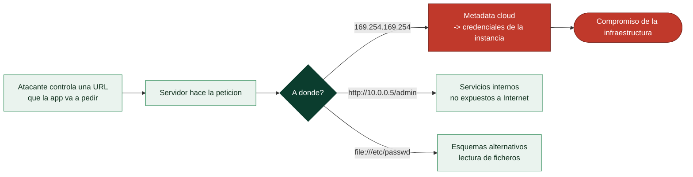

# Clase 099 — Server-Side Request Forgery (SSRF)

> Parte: **4 — Seguridad de aplicaciones web** · Fuente: *Real-World Bug Hunting (Yaworski)* / *OWASP Top 10 A10*
> ⏱️ Duración estimada: **120 min** · Nivel: **Avanzado**

---

## 🎯 Objetivo

Explotar el **SSRF (falsificación de petición del lado servidor)**: hacer que el servidor realice peticiones a destinos que el atacante controla, incluyendo servicios internos y endpoints de metadata cloud. Es una de las vulnerabilidades de mayor impacto en entornos modernos y una categoría propia del OWASP Top 10.

> ⚠️ **Ética**: solo en labs propios/autorizados (PortSwigger, Juice Shop). Alcanzar redes internas ajenas es un delito.

## 📚 Resultados de aprendizaje

Al finalizar, el alumno podrá:

1. **Identificar** funciones que hacen que el servidor pida URLs (webhooks, importadores, previews).
2. **Explotar** SSRF para alcanzar `localhost` y la red interna.
3. **Extraer** credenciales del endpoint de metadata cloud.
4. **Aplicar** SSRF ciega con detección out-of-band.
5. **Evadir** filtros de URL débiles y recomendar defensas robustas.

## 🗺️ Temas

| # | Tema | Por qué importa |
|---|------|-----------------|
| 1 | Qué es SSRF y su superficie | Base del ataque |
| 2 | SSRF a servicios internos | Pivote hacia la red interna |
| 3 | Metadata cloud (169.254.169.254) | Robo de credenciales |
| 4 | SSRF ciega y OOB | Detección sin respuesta directa |
| 5 | Bypass de filtros de URL | Realidad de las defensas |
| 6 | Esquemas alternativos (file://, gopher://) | Amplían el impacto |
| 7 | Defensa: allowlist, sin redirecciones | Cierre del fallo |

## 🧠 Explicación en profundidad

### Convertir el servidor en tu proxy hacia dentro

El **Server-Side Request Forgery** ocurre cuando una aplicación toma una **URL controlada por el
usuario** y **hace una petición a ella desde el servidor**. La aplicación tiene funciones legítimas
que hacen esto —cargar una imagen desde una URL, un webhook, importar datos de un enlace, un
generador de miniaturas—, y el abuso consiste en darle una URL que apunte no a Internet, sino a
sitios que **el atacante no puede alcanzar directamente pero el servidor sí**. El servidor se
convierte, en efecto, en un **proxy hacia la red interna**. Su gravedad hizo que OWASP lo añadiera
como categoría propia (A10) en 2021.

### La joya: el servicio de metadatos cloud

El objetivo de mayor impacto del SSRF, y la razón de su prominencia moderna, es el **servicio de
metadatos** de la clase 086: la dirección `169.254.169.254`, alcanzable solo **desde dentro** de una
instancia cloud, que devuelve su configuración y **sus credenciales**. Si una aplicación en AWS,
GCP o Azure es vulnerable a SSRF, el atacante le pide que consulte esa dirección y obtiene las
**claves de acceso temporales del rol de la instancia** —es decir, las llaves de la infraestructura
cloud del objetivo—. La brecha de Capital One en 2019, con más de cien millones de registros
expuestos, fue exactamente esto: un SSRF que alcanzó el servicio de metadatos de AWS. Es el mejor
argumento de por qué el SSRF no es un fallo menor.



### Más allá de la nube: red interna, esquemas y SSRF ciega

Aunque no haya metadatos, el SSRF abre la **red interna** entera: servicios que confían en el
tráfico interno (bases de datos, paneles de administración, APIs sin autenticar) y que asumen que
"si viene de dentro, es de fiar" —la suposición que el zero trust de la clase 042 desmonta—. Se
puede escanear puertos internos observando los tiempos o los errores de respuesta. Y los **esquemas
de URL alternativos** amplían el arsenal: `file://` para **leer ficheros locales**, `gopher://`
para construir peticiones arbitrarias a otros protocolos (hasta hablar con Redis o SMTP internos),
`dict://` para sondear servicios. Cuando la aplicación **no devuelve** el resultado de la petición,
existe la **SSRF ciega**, que se confirma con el canal **out-of-band** de siempre: hacer que el
servidor resuelva o pida algo a un dominio del atacante demuestra que la petición se realizó.

### Por qué las defensas ingenuas fallan y qué funciona

El SSRF es notoriamente difícil de filtrar bien, y esa dificultad es parte de la lección. Un
**blocklist** de direcciones internas se evade de muchas formas: representaciones alternativas de
la IP (decimal, octal, `0x`), `127.0.0.1` escrito como `127.1` o `[::1]`, dominios que resuelven a
IPs internas (**DNS rebinding**), y **redirecciones** —la URL permitida devuelve un 302 hacia una
interna, y si la aplicación sigue redirecciones, cae—. Por eso la defensa correcta es un
**allowlist** estricto de destinos permitidos (no un blocklist de prohibidos), **no seguir
redirecciones** automáticamente, **validar la IP resuelta** justo antes de conectar (no solo el
nombre), y **segmentar la red** para que el servidor de aplicación no tenga acceso a los servicios
internos ni al metadata que no necesita. En cloud, exigir **IMDSv2** (que requiere un token y
cabeceras que un SSRF simple no puede poner) mitiga específicamente el ataque al metadata. Defensa
en profundidad, porque ninguna capa por sí sola basta.

## 📖 Definiciones y características

- **SSRF**: el servidor hace una petición a una URL controlada por el atacante. Característica: usa la posición de red del servidor.
- **Metadata endpoint**: servicio cloud interno que entrega credenciales temporales (AWS/GCP/Azure). Característica: solo accesible desde la instancia, ideal objetivo de SSRF.
- **SSRF ciega**: no se ve la respuesta; se confirma por interacción OOB. Característica: requiere Collaborator/servidor propio.
- **Bypass de filtro**: técnicas para saltar allow/blocklists (IP decimal, DNS rebinding, redirecciones). Característica: los filtros por string son frágiles.
- **Esquema de URL**: `http`, `file`, `gopher`, `dict`. Característica: esquemas exóticos amplían lo que se puede hacer.
- **DNS rebinding**: cambiar la resolución DNS tras la validación. Característica: evade filtros basados en resolver una vez.

## 📔 Glosario

| Término | Definición concisa |
|---------|--------------------|
| SSRF | La aplicación hace una petición a una URL que controla el atacante |
| Proxy hacia dentro | El servidor alcanza lo que el atacante no puede |
| Servicio de metadatos | `169.254.169.254`; devuelve credenciales de la instancia |
| Capital One | Brecha de 2019 causada por SSRF al metadata de AWS |
| Red interna | Servicios que confían en el tráfico de dentro |
| Escaneo interno | Sondear puertos internos por tiempos o errores |
| Esquema alternativo | `file://`, `gopher://`, `dict://` amplían el ataque |
| SSRF ciega | La app no devuelve el resultado; se confirma por OOB |
| Blocklist | Filtrar IPs internas; evadible de muchas formas |
| DNS rebinding | Un dominio que resuelve a una IP interna |
| Redirección | La URL permitida redirige a una interna |
| Allowlist de destinos | Solo destinos permitidos; la defensa correcta |
| Validar IP resuelta | Comprobar la IP real antes de conectar |
| IMDSv2 | Metadata con token que un SSRF simple no puede alcanzar |

## 🧰 Herramientas y preparación

- **PortSwigger labs** de SSRF y **Juice Shop**.
- **Burp Collaborator** o servidor propio para OOB.
- Conocer los endpoints de metadata de cada nube (documentación oficial).

## 🧪 Laboratorio guiado

> ⚠️ Solo en labs propios/autorizados.

1. Localiza una función que reciba una URL (importar imagen, webhook, comprobar stock).
2. Cambia la URL a `http://localhost/admin` y observa si el servidor la alcanza.
3. Escanea puertos internos cambiando el puerto en la URL y midiendo respuestas/tiempos.
4. En el lab cloud de PortSwigger, apunta al endpoint de metadata:

```text
http://169.254.169.254/latest/meta-data/iam/security-credentials/
```

5. Extrae el rol y luego las **credenciales temporales** de ese rol.
6. Para SSRF ciega, apunta la URL a tu Collaborator y confirma la interacción DNS/HTTP.
7. Evade un filtro que bloquea `localhost` usando `127.1`, `[::1]` o IP en formato decimal.

## ✍️ Ejercicios

1. Enumera 5 features típicas que introducen SSRF.
2. Explica por qué el endpoint de metadata es tan crítico.
3. Evade un blocklist de `127.0.0.1` de tres formas distintas.
4. Usa una redirección abierta para saltar un allowlist de dominios.
5. Diferencia SSRF de CSRF con claridad.
6. Diseña una defensa: allowlist de destinos + bloqueo de IPs privadas + no seguir redirecciones.

## 📝 Reto verificable

Resuelve un lab de SSRF de PortSwigger que exija **acceder al endpoint de metadata** y usa las credenciales obtenidas para completar el objetivo del lab.
**Criterio de aceptación**: el lab queda resuelto, entregas la URL de SSRF, las credenciales/dato extraído y explicas la defensa (allowlist, bloqueo de rangos internos) que lo evitaría.

## ⚠️ Errores comunes

| Síntoma / mensaje | Causa y cómo arreglar |
|-------------------|------------------------|
| El servidor no sigue la URL | La feature valida el destino; busca otra función |
| Bloqueado `localhost` | Usa `127.1`, `[::1]`, decimal o DNS que resuelva a interno |
| Sin respuesta visible | SSRF ciega; confirma con OOB |
| Redirección no ayuda | La app no sigue redirecciones; prueba otro vector |
| Metadata devuelve 401 | IMDSv2 requiere token; ajusta la técnica |

## ❓ Preguntas frecuentes

**❓ ¿Por qué SSRF es tan grave en cloud?**
Porque el endpoint de metadata entrega credenciales de la instancia; con ellas, el atacante puede pivotar a toda la cuenta cloud.

**❓ ¿IMDSv2 resuelve el SSRF?**
Lo mitiga exigiendo un token PUT previo, más difícil de lograr vía SSRF simple, pero no elimina todos los vectores.

**❓ ¿Basta con un blocklist de IPs?**
No. Los blocklists se evaden fácil. Usa allowlists de destinos y bloquea rangos privados a nivel de red.

## 🔗 Referencias

- Yaworski, *Real-World Bug Hunting*, cap. de SSRF.
- OWASP SSRF: <https://owasp.org/www-community/attacks/Server_Side_Request_Forgery>
- OWASP SSRF Prevention Cheat Sheet.
- PortSwigger SSRF: <https://portswigger.net/web-security/ssrf>

## 📥 Material descargable

- 📄 [Guía en PDF](./clase-099-guia.pdf) — versión imprimible de esta clase.
- 🎞️ [Presentación (PPTX)](./clase-099-presentacion.pptx) — deck para proyectar en clase.

## ⬅️ Clase anterior

[Clase 098 — Cross-Site Request Forgery (CSRF)](../098-cross-site-request-forgery-csrf/README.md)

## ➡️ Siguiente clase

[Clase 100 — XML External Entities (XXE)](../100-xml-external-entities-xxe/README.md)
