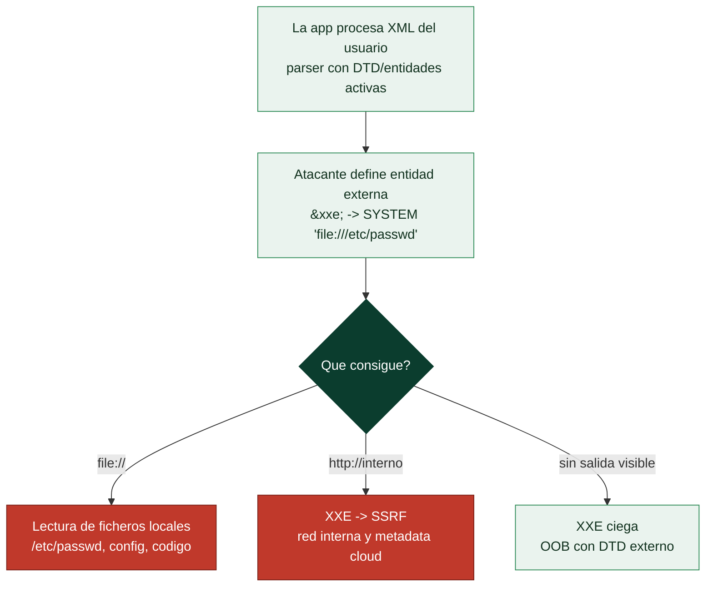

# Clase 100 — XML External Entities (XXE)

> Parte: **4 — Seguridad de aplicaciones web** · Fuente: *The Web Application Hacker's Handbook* / *OWASP*
> ⏱️ Duración estimada: **100 min** · Nivel: **Avanzado**

---

## 🎯 Objetivo

Explotar vulnerabilidades **XXE (XML External Entities)**: abusar de parsers XML mal configurados para leer archivos locales, provocar SSRF y, en casos ciegos, exfiltrar datos out-of-band. Es un fallo clásico que sigue apareciendo en importadores, SOAP, SAML y formatos basados en XML.

> ⚠️ **Ética**: solo en labs propios/autorizados. Leer archivos del servidor ajeno es un delito.

## 📚 Resultados de aprendizaje

Al finalizar, el alumno podrá:

1. **Explicar** qué son las entidades externas y por qué son peligrosas.
2. **Leer** archivos del servidor con XXE in-band.
3. **Provocar** SSRF a través de entidades externas.
4. **Exfiltrar** datos con XXE ciega y DTD externo (OOB).
5. **Configurar** parsers para deshabilitar entidades externas (defensa).

## 🗺️ Temas

| # | Tema | Por qué importa |
|---|------|-----------------|
| 1 | XML, DTD y entidades | Base del ataque |
| 2 | Entidades externas | El vector principal |
| 3 | Lectura de archivos locales | Impacto directo |
| 4 | XXE → SSRF | Encadenar impactos |
| 5 | XXE ciega y OOB con DTD externo | Exfiltración sin salida |
| 6 | XXE en SAML, DOCX, SVG | Superficie oculta |
| 7 | Defensa: deshabilitar DTD/entidades | Cierre del fallo |

## 🧠 Explicación en profundidad

### Una característica de XML pensada para el bien, usada para el mal

El **XML External Entity** abusa de una funcionalidad legítima del formato XML: las **entidades**,
que son como variables que se definen en la cabecera del documento (la **DTD**) y se expanden en el
cuerpo. XML permite además que una entidad apunte a un recurso **externo** —un fichero, una URL—, y
ahí está el problema: si un parser XML procesa entidades externas y el atacante controla el XML de
entrada, puede definir una entidad que lea un fichero del servidor o haga una petición de red. La
causa raíz no es un bug, es una **característica peligrosa activada por defecto** en muchos parsers
antiguos, y por eso la defensa consiste sobre todo en **desactivarla**.



### Leer ficheros y saltar a SSRF

El uso más directo es la **lectura de ficheros locales**: se define una entidad
`<!ENTITY xxe SYSTEM "file:///etc/passwd">` y se coloca `&xxe;` donde su contenido se refleje en la
respuesta, y el parser inserta el contenido del fichero. Así se leen configuraciones, código fuente,
claves y cualquier fichero que el proceso pueda abrir. El segundo uso convierte el XXE en un **SSRF**
(clase 099): si la entidad apunta a una URL (`http://169.254.169.254/...` o un servicio interno), el
parser hace la petición desde el servidor, con todo lo que eso implica —incluido el ataque al
metadata cloud—. XXE y SSRF son primos: el XXE es a menudo una **vía de entrada al SSRF** en
aplicaciones que procesan XML.

### XXE ciega y los formatos que llevan XML por debajo

Cuando la respuesta **no refleja** la entidad, existe la **XXE ciega**, que se explota con un canal
**out-of-band** y un truco: una entidad que carga una **DTD externa** desde el servidor del atacante,
la cual a su vez define entidades que exfiltran el contenido de un fichero por una petición HTTP o
DNS. Es más elaborado pero igual de efectivo. Y una advertencia que amplía enormemente la superficie:
**muchos formatos que no parecen XML lo son por dentro**. Los documentos ofimáticos **DOCX**, **XLSX**
y **PPTX** son archivos ZIP con XML dentro; los **SVG** son XML; los mensajes **SAML** de
autenticación (clase 104) son XML firmado; los feeds **RSS** son XML. Si una aplicación procesa
cualquiera de estos —al subir un documento, al mostrar un SVG, al autenticar por SAML— y su parser
tiene las entidades activas, es candidata a XXE, aunque el desarrollador nunca "eligiera" usar XML.

### La defensa es apagar la característica

A diferencia de la inyección SQL, la remediación del XXE no requiere reescribir cómo se construyen
las consultas: consiste en **configurar el parser para que no procese entidades externas ni DTDs**.
Cada lenguaje tiene su forma —en Java, `setFeature` desactivando `external-general-entities` y
DOCTYPE; en Python, usar `defusedxml` en lugar del parser estándar; en .NET, `XmlResolver = null`—,
pero la idea es universal: **deshabilitar DTDs y entidades externas** por completo, ya que la
inmensa mayoría de las aplicaciones no las necesitan. Como medida adicional, preferir formatos más
simples y menos peligrosos (JSON en lugar de XML) donde sea posible reduce la superficie de raíz. El
mensaje de la clase es claro: el XXE es un fallo de **configuración por defecto**, y la corrección es
una línea de configuración, no una reescritura —lo que lo hace, cuando se conoce, uno de los fallos
más fáciles de cerrar del Top 10—.

## 📖 Definiciones y características

- **XXE**: abuso de entidades externas en un parser XML. Característica: permite leer archivos y hacer SSRF.
- **DTD (Document Type Definition)**: define estructura y entidades del XML. Característica: donde se declaran las entidades externas.
- **Entidad externa**: referencia a un recurso externo (`SYSTEM "file:///etc/passwd"`). Característica: el parser la resuelve si no está deshabilitada.
- **XXE ciega**: no hay salida directa; se usa DTD externo para exfiltrar. Característica: requiere servidor del atacante.
- **Parameter entity** (`%`): entidad usada dentro del DTD. Característica: clave para exfiltración OOB.
- **Deshabilitar DTD**: configurar el parser para no procesar entidades. Característica: defensa definitiva.

## 📔 Glosario

| Término | Definición concisa |
|---------|--------------------|
| XXE | Abuso de las entidades externas de XML |
| Entidad XML | Variable definida en la DTD que se expande en el cuerpo |
| DTD | Definición de tipo de documento; donde se declaran entidades |
| Entidad externa | Entidad que apunta a un fichero o URL |
| `SYSTEM` | Palabra clave que declara un recurso externo |
| Lectura de ficheros | `file:///etc/passwd` insertado en la respuesta |
| XXE → SSRF | La entidad apunta a una URL interna o al metadata |
| XXE ciega | Sin reflejo; se exfiltra por OOB con DTD externa |
| DTD externa maliciosa | Cargada del servidor del atacante para exfiltrar |
| Formatos con XML | DOCX, XLSX, SVG, SAML, RSS lo llevan por dentro |
| SAML | Autenticación basada en XML firmado; candidata a XXE |
| Parser XML | Componente que procesa el XML; suele traer entidades activas |
| defusedxml | Librería Python segura frente a XXE |
| Deshabilitar DTD | La defensa: apagar entidades externas y DOCTYPE |

## 🧰 Herramientas y preparación

- **PortSwigger labs** de XXE y **Juice Shop** (reto de XXE).
- **Burp** para editar cuerpos XML.
- Servidor propio para alojar el DTD externo en XXE ciega.

## 🧪 Laboratorio guiado

> ⚠️ Solo en labs propios.

1. Encuentra un endpoint que acepte XML (importar datos, SOAP, comprobar stock).
2. Inyecta una entidad externa para leer un archivo:

```xml
<?xml version="1.0"?>
<!DOCTYPE foo [ <!ENTITY xxe SYSTEM "file:///etc/passwd"> ]>
<stockCheck><productId>&xxe;</productId></stockCheck>
```

3. Observa el contenido del archivo reflejado en la respuesta.
4. Convierte el XXE en **SSRF** apuntando la entidad a `http://169.254.169.254/...`.
5. Para XXE **ciega**, aloja un DTD externo en tu servidor y usa parameter entities para exfiltrar por HTTP/OOB.
6. Prueba XXE en un archivo **SVG** o **DOCX** subido (son XML por dentro).
7. Documenta el archivo leído, el vector y el impacto.

## ✍️ Ejercicios

1. Lee `/etc/hostname` y `/etc/passwd` en el lab y explica la diferencia de impacto.
2. Transforma un XXE de lectura en un SSRF a metadata.
3. Construye el DTD externo para una XXE ciega OOB.
4. Investiga cómo un SVG subido puede desencadenar XXE.
5. Escribe la configuración segura de un parser en Java/Python que deshabilite DTD.
6. Explica por qué SAML es históricamente vulnerable a XXE.

## 📝 Reto verificable

Resuelve un lab de **XXE ciega** de PortSwigger exfiltrando el contenido de un archivo del servidor mediante un DTD externo alojado por ti.
**Criterio de aceptación**: el lab queda resuelto, entregas el DTD externo, el payload y el dato exfiltrado, y explicas la configuración de parser que lo evitaría.

## ⚠️ Errores comunes

| Síntoma / mensaje | Causa y cómo arreglar |
|-------------------|------------------------|
| La entidad no se resuelve | Parser con entidades deshabilitadas; busca otro endpoint |
| Error de sintaxis XML | DTD mal formado; valida la estructura |
| Sin salida del archivo | XXE ciega; usa DTD externo OOB |
| DTD externo no se carga | El servidor no permite conexiones salientes |
| Parameter entity ignorada | Restricciones del parser; ajusta la técnica |

## ❓ Preguntas frecuentes

**❓ ¿Por qué sigue existiendo XXE si es antiguo?**
Porque muchos parsers procesan DTD por defecto y XML se esconde en SAML, SVG, DOCX y APIs SOAP.

**❓ ¿JSON es inmune?**
JSON no tiene entidades externas, así que no sufre XXE. Pero otras inyecciones sí aplican.

**❓ ¿Cuál es la defensa definitiva?**
Deshabilitar el procesamiento de DTD y entidades externas en la configuración del parser.

## 🔗 Referencias

- Stuttard & Pinto, *The Web Application Hacker's Handbook*, cap. 9.
- OWASP XXE: <https://owasp.org/www-community/vulnerabilities/XML_External_Entity_(XXE)_Processing>
- OWASP XXE Prevention Cheat Sheet.
- PortSwigger XXE: <https://portswigger.net/web-security/xxe>

## 📥 Material descargable

- 📄 [Guía en PDF](./clase-100-guia.pdf) — versión imprimible de esta clase.
- 🎞️ [Presentación (PPTX)](./clase-100-presentacion.pptx) — deck para proyectar en clase.

## ⬅️ Clase anterior

[Clase 099 — Server-Side Request Forgery (SSRF)](../099-server-side-request-forgery-ssrf/README.md)

## ➡️ Siguiente clase

[Clase 101 — Fallos de autenticación y bypass](../101-fallos-de-autenticacion-y-bypass/README.md)
