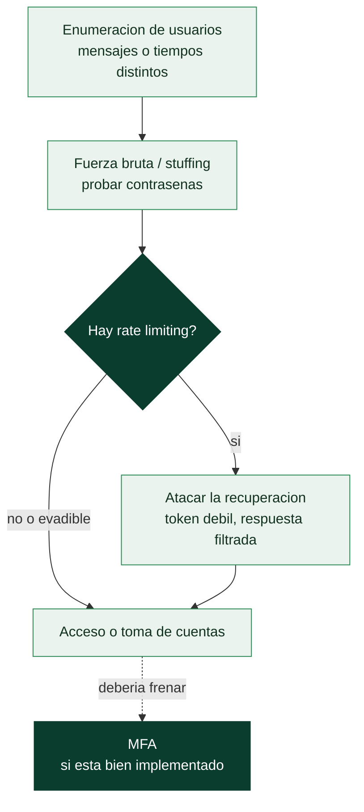

# Clase 101 — Fallos de autenticación y bypass

> Parte: **4 — Seguridad de aplicaciones web** · Fuente: *The Web Application Hacker's Handbook (Stuttard & Pinto)*
> ⏱️ Duración estimada: **120 min** · Nivel: **Avanzado**

---

## 🎯 Objetivo

Auditar los mecanismos de **autenticación** y descubrir formas de saltárselos: enumeración de usuarios, fuerza bruta, fallos en recuperación de contraseña, MFA débil y lógica de login rota. La autenticación es la puerta de la aplicación; romperla suele ser el hallazgo de mayor impacto.

> ⚠️ **Ética**: solo en labs propios/autorizados. La fuerza bruta y el bypass sobre cuentas ajenas son delitos.

## 📚 Resultados de aprendizaje

Al finalizar, el alumno podrá:

1. **Detectar** enumeración de usuarios por diferencias en respuestas/tiempos.
2. **Ejecutar** fuerza bruta controlada y credential stuffing en un lab.
3. **Explotar** fallos en flujos de recuperación de contraseña.
4. **Evaluar** la robustez de la MFA y sus bypass comunes.
5. **Recomendar** controles: rate limiting, MFA correcta, mensajes genéricos.

## 🗺️ Temas

| # | Tema | Por qué importa |
|---|------|-----------------|
| 1 | Enumeración de usuarios | Primer paso del ataque |
| 2 | Fuerza bruta y stuffing | Ataque directo a credenciales |
| 3 | Rate limiting y su evasión | Defensa clave y sus grietas |
| 4 | Recuperación de contraseña | Flujo frecuentemente roto |
| 5 | MFA: tipos y bypass | Segunda barrera, no infalible |
| 6 | Lógica de login rota | Bypass sin adivinar credenciales |
| 7 | Defensa en profundidad | Cierre del fallo |

## 🧠 Explicación en profundidad

### La puerta de entrada, y todas las formas de forzarla

La autenticación es el control que responde "¿quién eres?", y sus fallos (A07 en OWASP) son
especialmente graves porque **saltarse el login abre todo lo que hay detrás**. Esta clase recorre
la cadena completa de ataques a la autenticación web, y su hilo conductor es que la robustez de una
puerta se mide por su eslabón más débil: de nada sirve una contraseña fuerte si el sistema **revela
qué usuarios existen**, no **limita los intentos**, o tiene una **recuperación de contraseña** rota.

### Enumeración de usuarios: el fallo que habilita todo lo demás

Antes de atacar una contraseña, el atacante quiere saber **qué cuentas existen**, y muchas
aplicaciones se lo dicen sin querer. Si el login responde "usuario no encontrado" frente a
"contraseña incorrecta", **distingue** las cuentas válidas de las inexistentes. Aunque el mensaje
sea idéntico, un **tiempo de respuesta distinto** (porque solo se calcula el hash de la contraseña
cuando el usuario existe) filtra la misma información —un canal lateral temporal, como en la clase
060—. El registro y la recuperación de contraseña también enumeran ("ese correo ya está
registrado"). La enumeración convierte el ataque a credenciales de la clase 081 de disparar a
ciegas a disparar sobre blancos confirmados, y por eso la defensa es dar **respuestas y tiempos
idénticos** existan o no las cuentas.

### Fuerza bruta, rate limiting y su evasión

Con la lista de usuarios, entran la **fuerza bruta**, el **password spraying** y el **credential
stuffing** de la clase 081. La defensa es el **rate limiting** —limitar los intentos—, pero su
implementación falla de formas conocidas que hay que probar: límites **por IP** se evaden rotando
direcciones (proxies, botnets); límites **por cuenta** se evaden con spraying (una contraseña contra
muchas cuentas); y a veces el límite se aplica en la interfaz web pero **no en la API** que hay
detrás, o hay endpoints alternativos (una app móvil, un login legacy) sin protección. Probar si el
rate limiting es real, consistente y aplicado en todas las vías es parte del trabajo.

### Recuperación de contraseña y MFA: dónde se rompen

La **recuperación de contraseña** es a menudo el eslabón más débil porque es un **camino
alternativo** al login que recibe menos atención. Los fallos típicos: tokens de reseteo
**predecibles** o de vida demasiado larga, tokens que **no se invalidan** tras usarse, preguntas de
seguridad con respuestas averiguables por OSINT, o el envío del enlace a un correo que el atacante
controla por otro fallo. Un reseteo roto entrega la cuenta sin tocar la contraseña original.

La **MFA** (segundo factor) es la defensa decisiva contra el robo de credenciales, pero **no es
infalible** y hay que saber cómo se ataca: códigos OTP sin límite de intentos (fuerza bruta del
código de 6 dígitos), la **fatiga de MFA** (bombardear al usuario con notificaciones push hasta que
acepte una por cansancio), el robo del token de sesión **después** del MFA (que lo hace irrelevante),
y factores débiles como el **SMS**, interceptable por SIM swapping. Los factores **resistentes a
phishing** (FIDO2/passkeys) cierran la mayoría de estos huecos. El mensaje de la clase es la
**defensa en profundidad**: ningún control aislado protege la autenticación —hacen falta a la vez
respuestas neutras, rate limiting real, recuperación robusta, MFA bien implementado y gestión de
sesión sólida (clase 102)—.

## 📖 Definiciones y características

- **Enumeración de usuarios**: determinar qué cuentas existen por diferencias en las respuestas. Característica: habilita ataques dirigidos.
- **Credential stuffing**: probar credenciales filtradas de otras brechas. Característica: explota la reutilización de contraseñas.
- **Rate limiting**: límite de intentos por tiempo/IP. Característica: defensa esencial contra fuerza bruta.
- **MFA (autenticación multifactor)**: segundo factor además de la contraseña. Característica: reduce el riesgo pero tiene bypass conocidos.
- **Token de reset**: valor temporal para recuperar contraseña. Característica: si es predecible o no expira, es explotable.
- **Response timing**: diferencias de tiempo que filtran información. Característica: canal lateral de enumeración.

## 📔 Glosario

| Término | Definición concisa |
|---------|--------------------|
| Autenticación | Control que verifica la identidad del usuario |
| Enumeración de usuarios | Descubrir qué cuentas existen por respuestas o tiempos |
| Canal lateral temporal | Tiempo de respuesta distinto que filtra si la cuenta existe |
| Respuestas neutras | Mensaje y tiempo idénticos existan o no las cuentas |
| Fuerza bruta | Probar muchas contraseñas contra una cuenta |
| Password spraying | Una contraseña común contra muchas cuentas |
| Credential stuffing | Reutilizar credenciales filtradas de otras brechas |
| Rate limiting | Limitar el número de intentos |
| Evasión de rate limiting | Rotar IPs, spraying, o atacar la API sin límite |
| Recuperación de contraseña | Camino alternativo al login, a menudo el más débil |
| Token de reseteo | Debe ser impredecible, corto y de un solo uso |
| MFA | Segundo factor; la defensa decisiva pero no infalible |
| Fatiga de MFA | Bombardear con push hasta que la víctima acepte |
| FIDO2 / passkeys | Factores resistentes a phishing |

## 🧰 Herramientas y preparación

- **PortSwigger labs** de autenticación y **DVWA**.
- **Burp Intruder** para fuerza bruta y enumeración.
- Listas de usuarios/contraseñas de SecLists.

## 🧪 Laboratorio guiado

> ⚠️ Solo en labs propios.

1. Prueba el login con un usuario inexistente y otro existente; compara mensajes y tiempos (enumeración).
2. Con Intruder, enumera usuarios válidos por diferencia de respuesta.
3. Ejecuta fuerza bruta de contraseña sobre un usuario válido en un lab sin rate limiting.
4. Analiza el flujo de **recuperación de contraseña**: ¿el token es predecible?, ¿expira?, ¿se puede reusar?
5. Prueba un **bypass de MFA**: reenviar la petición sin el paso 2, reutilizar código, o forzar el código (si no hay límite).
6. Busca lógica rota: acceder a `/account` con un estado de sesión parcial.
7. Documenta cada debilidad con evidencia y su corrección.

## ✍️ Ejercicios

1. Detecta enumeración de usuarios por mensaje y por tiempo, por separado.
2. Diseña un ataque de credential stuffing y explica su defensa (MFA, detección de reuso).
3. Analiza un token de reset y evalúa su entropía y expiración.
4. Enumera 4 bypass de MFA reales y cómo prevenirlos.
5. Explica por qué los mensajes de error deben ser genéricos.
6. Diseña una política de rate limiting sensata (por cuenta y por IP).

## 📝 Reto verificable

Resuelve un lab de PortSwigger que combine **enumeración de usuarios + fuerza bruta** y accede a la cuenta objetivo, o un lab de **bypass de MFA**.
**Criterio de aceptación**: el lab queda resuelto, documentas la señal que reveló el usuario válido (o el fallo de MFA), la credencial/técnica y los controles que lo habrían evitado.

## ⚠️ Errores comunes

| Síntoma / mensaje | Causa y cómo arreglar |
|-------------------|------------------------|
| Bloqueo tras pocos intentos | Rate limiting; rota IPs (en lab) o busca otro vector |
| Mensajes idénticos siempre | Sin enumeración por mensaje; prueba por tiempo |
| Token de reset aleatorio | Bien diseñado; busca reuso o falta de expiración |
| MFA no bypasseable | Implementación correcta; documenta como fortaleza |
| Fuerza bruta sin éxito | Contraseña fuerte; prueba stuffing con listas reales |

## ❓ Preguntas frecuentes

**❓ ¿La MFA elimina la fuerza bruta?**
Reduce mucho el riesgo, pero un segundo factor mal implementado (sin límite, reusable) puede saltarse.

**❓ ¿Por qué importan los tiempos de respuesta?**
Porque una diferencia consistente entre usuario válido e inválido filtra información aunque los mensajes sean iguales.

**❓ ¿Bloquear la cuenta es buena defensa?**
Puede provocar denegación de servicio. Mejor combinar rate limiting, MFA y detección de anomalías.

## 🔗 Referencias

- Stuttard & Pinto, *The Web Application Hacker's Handbook*, cap. 6.
- OWASP Authentication Cheat Sheet.
- OWASP WSTG — Authentication Testing.
- PortSwigger Authentication: <https://portswigger.net/web-security/authentication>

## 📥 Material descargable

- 📄 [Guía en PDF](./clase-101-guia.pdf) — versión imprimible de esta clase.
- 🎞️ [Presentación (PPTX)](./clase-101-presentacion.pptx) — deck para proyectar en clase.

## ⬅️ Clase anterior

[Clase 100 — XML External Entities (XXE)](../100-xml-external-entities-xxe/README.md)

## ➡️ Siguiente clase

[Clase 102 — Gestión de sesiones y ataques asociados](../102-gestion-de-sesiones-y-ataques-asociados/README.md)
