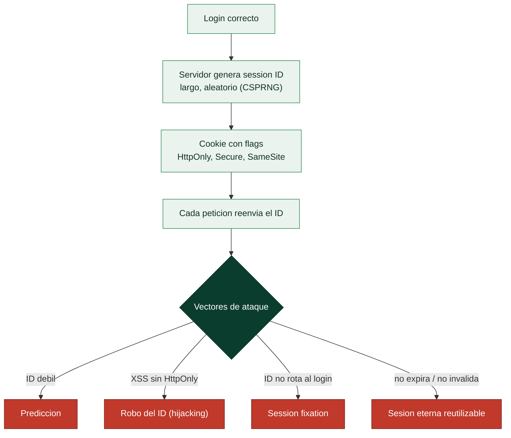

# Clase 102 — Gestión de sesiones y ataques asociados

> Parte: **4 — Seguridad de aplicaciones web** · Fuente: *The Web Application Hacker's Handbook (Stuttard & Pinto)*
> ⏱️ Duración estimada: **100 min** · Nivel: **Avanzado**

---

## 🎯 Objetivo

Analizar cómo las aplicaciones mantienen el **estado de sesión** tras el login y los ataques que lo comprometen: predicción y fijación de sesión, gestión insegura de cookies y fallos de logout. Una sesión mal gestionada anula toda la seguridad de una autenticación fuerte.

> ⚠️ **Ética**: solo en labs propios/autorizados. Secuestrar sesiones ajenas es un delito.

## 📚 Resultados de aprendizaje

Al finalizar, el alumno podrá:

1. **Analizar** la entropía y predictibilidad de los identificadores de sesión.
2. **Explotar** fijación de sesión (session fixation).
3. **Evaluar** los atributos de cookie (HttpOnly, Secure, SameSite).
4. **Detectar** fallos de expiración y logout incompleto.
5. **Recomendar** una gestión de sesión robusta.

## 🗺️ Temas

| # | Tema | Por qué importa |
|---|------|-----------------|
| 1 | Modelo de sesión y cookies | Base del estado autenticado |
| 2 | Entropía del session ID | Predecir = suplantar |
| 3 | Session fixation | Forzar un ID conocido |
| 4 | Atributos de cookie | Protegen el token |
| 5 | Expiración e invalidación | Ventana de exposición |
| 6 | Session hijacking vía XSS | Encadenar vulnerabilidades |
| 7 | Defensa: rotación y flags | Cierre del fallo |

## 🧠 Explicación en profundidad

### HTTP no recuerda; la sesión es el parche

HTTP es **sin estado**: cada petición es independiente y el servidor no recuerda que te
autenticaste hace un momento. La **sesión** es el mecanismo que resuelve eso: tras el login, el
servidor genera un **identificador de sesión** (session ID) y se lo da al navegador —normalmente en
una **cookie**—, y el navegador lo reenvía en cada petición, de modo que el servidor sabe quién eres
sin pedirte la contraseña otra vez. La consecuencia de seguridad es enorme y hay que interiorizarla:
**ese identificador es, funcionalmente, tu contraseña durante toda la sesión**. Quien lo obtenga es
tú, sin saber tu clave. Por eso todo el tema gira en torno a proteger ese valor.

### La entropía: un ID adivinable es una cuenta regalada

Si el session ID se puede **predecir o adivinar**, el atacante genera identificadores válidos de
otros usuarios sin robar nada. De ahí que la propiedad número uno de un buen ID sea la **entropía**:
debe ser **largo y aleatorio**, generado por un CSPRNG (clase 058), no un contador secuencial ni un
valor derivado del nombre de usuario o la hora. Un ID de 128 bits de un generador seguro es
inadivinable; un `session=1002` incremental es una invitación a probar `1001` y `1003`. Este es el
primer punto que se audita: capturar varios IDs y comprobar que no siguen ningún patrón.

### Los flags de cookie y el robo de sesión

La cookie que transporta el ID debe llevar tres **flags** que la protegen, y su ausencia es un
hallazgo directo. **`HttpOnly`** impide que el JavaScript lea la cookie (`document.cookie`), lo que
**mitiga el robo por XSS** (clase 096) —sin él, cualquier XSS roba la sesión al instante—. **`Secure`**
hace que la cookie solo viaje por HTTPS, evitando que se capture en texto claro en una red. Y
**`SameSite`** limita su envío cross-site, la defensa anti-CSRF de la clase 098. El **session
hijacking** —robar el ID— se hace sobre todo vía XSS, pero también capturando tráfico sin cifrar o
leyendo logs que registran URLs con el ID dentro (razón para nunca poner el ID en la URL).

### Fixation, expiración y las dos reglas de oro

La **session fixation** es un ataque más sutil: en lugar de robar el ID de la víctima, el atacante le
**impone uno que él ya conoce** (por ejemplo, poniéndolo en un enlace) antes de que se autentique;
si la aplicación **reutiliza ese mismo ID** después del login, el atacante queda con un ID
autenticado válido. La defensa es la primera regla de oro: **regenerar el ID de sesión en el momento
del login** (y de cualquier cambio de privilegios), de modo que el valor previo al login quede
inservible. La segunda regla es la **expiración e invalidación** correctas: las sesiones deben
caducar por inactividad y por tiempo absoluto, y el **logout debe invalidar el ID en el servidor**
—no basta con borrar la cookie en el cliente, porque un ID robado seguiría siendo válido si el
servidor lo sigue aceptando—. Un fallo muy común es un logout que solo borra la cookie: la sesión
sigue viva para quien copió el ID. Regenerar al elevar privilegios e invalidar de verdad al cerrar:
esas dos, más los flags y la entropía, son el núcleo de una gestión de sesión segura.

## 📖 Definiciones y características

- **Session ID**: identificador que liga peticiones a una sesión autenticada. Característica: debe ser largo, aleatorio e impredecible.
- **Session fixation**: forzar a la víctima a usar un ID que el atacante conoce. Característica: se evita rotando el ID tras el login.
- **HttpOnly**: impide el acceso a la cookie desde JS. Característica: mitiga el robo vía XSS.
- **Secure**: la cookie solo viaja por HTTPS. Característica: evita interceptación en claro.
- **SameSite**: limita el envío entre sitios. Característica: mitiga CSRF.
- **Invalidez en logout**: el servidor descarta la sesión al cerrar. Característica: si falta, el token sigue válido.

## 📔 Glosario

| Término | Definición concisa |
|---------|--------------------|
| Sesión | Mecanismo que da estado a HTTP tras el login |
| Session ID | Identificador que equivale a la contraseña durante la sesión |
| Cookie | Portador habitual del session ID |
| Entropía del ID | Longitud y aleatoriedad; impide adivinarlo |
| CSPRNG | Generador seguro con el que debe crearse el ID |
| HttpOnly | Flag que oculta la cookie a JavaScript; mitiga el robo por XSS |
| Secure | Flag que restringe la cookie a HTTPS |
| SameSite | Flag que limita el envío cross-site (anti-CSRF) |
| Session hijacking | Robar el ID para suplantar la sesión |
| Session fixation | Imponer a la víctima un ID conocido por el atacante |
| Regeneración de ID | Cambiar el ID al autenticar; anula la fixation |
| Expiración | Caducidad por inactividad y por tiempo absoluto |
| Invalidación en servidor | El logout debe anular el ID, no solo borrar la cookie |
| ID en la URL | Mala práctica; queda en logs e historial |

## 🧰 Herramientas y preparación

- **Burp** (Sequencer para analizar aleatoriedad de tokens).
- **PortSwigger labs** y **DVWA**.
- DevTools para inspeccionar cookies y atributos.

## 🧪 Laboratorio guiado

> ⚠️ Solo en labs propios.

1. Inicia sesión y captura el session ID; inspecciona sus atributos en DevTools.
2. Recolecta muchos tokens y analiza su aleatoriedad con **Burp Sequencer**.
3. Comprueba si el ID **rota tras el login** (defensa contra fixation). Si no, es explotable.
4. Simula **session fixation**: fija un ID antes del login de la víctima y verifica si se mantiene.
5. Revisa flags: ¿HttpOnly?, ¿Secure?, ¿SameSite? Documenta los que falten.
6. Prueba el **logout**: tras cerrar sesión, reutiliza el token antiguo; ¿sigue válido?
7. Encadena con XSS (clase 097): roba la cookie si no es HttpOnly.

## ✍️ Ejercicios

1. Evalúa la entropía de un token con Sequencer y explica el resultado.
2. Reproduce una session fixation en un lab que no rote el ID.
3. Enumera los atributos de cookie y qué protege cada uno.
4. Comprueba si la sesión expira por inactividad y por tiempo absoluto.
5. Explica por qué el logout debe invalidar en servidor, no solo borrar la cookie.
6. Diseña la configuración de cookie ideal para una app bancaria.

## 📝 Reto verificable

Demuestra un fallo de gestión de sesión en un lab: **session fixation** o **token válido tras logout**, y propón la corrección.
**Criterio de aceptación**: reproduces el fallo con evidencia (mismo token antes/después o reuso tras logout) y describes la defensa concreta (rotación en login, invalidación en servidor).

## ⚠️ Errores comunes

| Síntoma / mensaje | Causa y cómo arreglar |
|-------------------|------------------------|
| Token cambia tras login | Rotación correcta; no hay fixation |
| Sequencer dice "buena" entropía | Token robusto; busca otro vector |
| Cookie sin HttpOnly | Riesgo de robo vía XSS; repórtalo |
| Logout no invalida | El token sigue vivo; fallo real |
| SameSite ausente | Riesgo de CSRF; combínalo con la clase 098 |

## ❓ Preguntas frecuentes

**❓ ¿JWT elimina estos problemas?**
No; introduce otros (revocación, expiración) que veremos en la clase 103. Los stateless tienen sus propios retos.

**❓ ¿Basta con HttpOnly para proteger la sesión?**
Ayuda contra el robo vía XSS, pero necesitas Secure, SameSite, rotación y expiración correcta.

**❓ ¿Por qué rotar el ID tras el login?**
Para invalidar cualquier ID que el atacante pudiera haber fijado antes de la autenticación.

## 🔗 Referencias

- Stuttard & Pinto, *The Web Application Hacker's Handbook*, cap. 7.
- OWASP Session Management Cheat Sheet.
- OWASP WSTG — Session Management Testing.
- PortSwigger: <https://portswigger.net/web-security/authentication>

## 📥 Material descargable

- 📄 [Guía en PDF](./clase-102-guia.pdf) — versión imprimible de esta clase.
- 🎞️ [Presentación (PPTX)](./clase-102-presentacion.pptx) — deck para proyectar en clase.

## ⬅️ Clase anterior

[Clase 101 — Fallos de autenticación y bypass](../101-fallos-de-autenticacion-y-bypass/README.md)

## ➡️ Siguiente clase

[Clase 103 — Ataques y seguridad de JWT](../103-ataques-y-seguridad-de-jwt/README.md)
