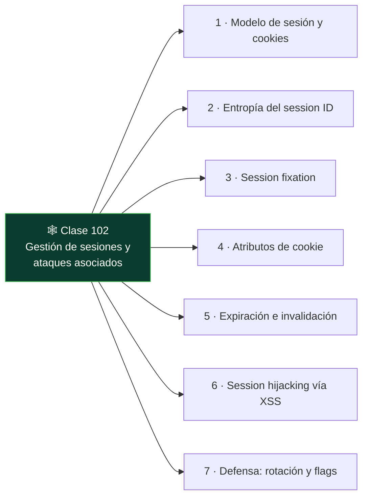

# Clase 102 — Gestión de sesiones y ataques asociados

<!-- cabecera:inicio -->

> 🗂️ Parte: **4 — Seguridad de aplicaciones web** · 📖 Fuente: *The Web Application Hacker's Handbook (Stuttard & Pinto)*
> ⏱️ Duración estimada: **100 min** · 🎚️ Nivel: **Avanzado**

<!-- cabecera:fin -->

---

## 🎯 Objetivo

Analizar cómo las aplicaciones mantienen el **estado de sesión** tras el login y los ataques que lo comprometen: predicción y fijación de sesión, gestión insegura de cookies y fallos de logout. Una sesión mal gestionada anula toda la seguridad de una autenticación fuerte.

> ⚠️ **Ética**: solo en labs propios/autorizados. Secuestrar sesiones ajenas es un delito.

## 📚 Resultados de aprendizaje

Al finalizar, el alumno podrá:

1. **Analizar** la entropía y predictibilidad de los identificadores de sesión.
2. **Explotar** fijación de sesión (session fixation).
3. **Evaluar** los atributos de cookie (HttpOnly, Secure, SameSite).
4. **Detectar** fallos de expiración y logout incompleto.
5. **Recomendar** una gestión de sesión robusta.

## 🗺️ Temas

<!-- mapa:inicio -->

<!-- mapa:fin -->

| # | Tema | Por qué importa |
|---|------|-----------------|
| 1 | Modelo de sesión y cookies | Base del estado autenticado |
| 2 | Entropía del session ID | Predecir = suplantar |
| 3 | Session fixation | Forzar un ID conocido |
| 4 | Atributos de cookie | Protegen el token |
| 5 | Expiración e invalidación | Ventana de exposición |
| 6 | Session hijacking vía XSS | Encadenar vulnerabilidades |
| 7 | Defensa: rotación y flags | Cierre del fallo |

## 📖 Definiciones y características

- **Session ID**: identificador que liga peticiones a una sesión autenticada. Característica: debe ser largo, aleatorio e impredecible.
- **Session fixation**: forzar a la víctima a usar un ID que el atacante conoce. Característica: se evita rotando el ID tras el login.
- **HttpOnly**: impide el acceso a la cookie desde JS. Característica: mitiga el robo vía XSS.
- **Secure**: la cookie solo viaja por HTTPS. Característica: evita interceptación en claro.
- **SameSite**: limita el envío entre sitios. Característica: mitiga CSRF.
- **Invalidez en logout**: el servidor descarta la sesión al cerrar. Característica: si falta, el token sigue válido.

## 🧰 Herramientas y preparación

- **Burp** (Sequencer para analizar aleatoriedad de tokens).
- **PortSwigger labs** y **DVWA**.
- DevTools para inspeccionar cookies y atributos.

## 🧪 Laboratorio guiado

> ⚠️ Solo en labs propios.

1. Inicia sesión y captura el session ID; inspecciona sus atributos en DevTools.
2. Recolecta muchos tokens y analiza su aleatoriedad con **Burp Sequencer**.
3. Comprueba si el ID **rota tras el login** (defensa contra fixation). Si no, es explotable.
4. Simula **session fixation**: fija un ID antes del login de la víctima y verifica si se mantiene.
5. Revisa flags: ¿HttpOnly?, ¿Secure?, ¿SameSite? Documenta los que falten.
6. Prueba el **logout**: tras cerrar sesión, reutiliza el token antiguo; ¿sigue válido?
7. Encadena con XSS (clase 097): roba la cookie si no es HttpOnly.

## ✍️ Ejercicios

1. Evalúa la entropía de un token con Sequencer y explica el resultado.
2. Reproduce una session fixation en un lab que no rote el ID.
3. Enumera los atributos de cookie y qué protege cada uno.
4. Comprueba si la sesión expira por inactividad y por tiempo absoluto.
5. Explica por qué el logout debe invalidar en servidor, no solo borrar la cookie.
6. Diseña la configuración de cookie ideal para una app bancaria.

## 📝 Reto verificable

Demuestra un fallo de gestión de sesión en un lab: **session fixation** o **token válido tras logout**, y propón la corrección.
**Criterio de aceptación**: reproduces el fallo con evidencia (mismo token antes/después o reuso tras logout) y describes la defensa concreta (rotación en login, invalidación en servidor).

## ⚠️ Errores comunes

| Síntoma / mensaje | Causa y cómo arreglar |
|-------------------|------------------------|
| Token cambia tras login | Rotación correcta; no hay fixation |
| Sequencer dice "buena" entropía | Token robusto; busca otro vector |
| Cookie sin HttpOnly | Riesgo de robo vía XSS; repórtalo |
| Logout no invalida | El token sigue vivo; fallo real |
| SameSite ausente | Riesgo de CSRF; combínalo con la clase 098 |

## ❓ Preguntas frecuentes

**❓ ¿JWT elimina estos problemas?**
No; introduce otros (revocación, expiración) que veremos en la clase 103. Los stateless tienen sus propios retos.

**❓ ¿Basta con HttpOnly para proteger la sesión?**
Ayuda contra el robo vía XSS, pero necesitas Secure, SameSite, rotación y expiración correcta.

**❓ ¿Por qué rotar el ID tras el login?**
Para invalidar cualquier ID que el atacante pudiera haber fijado antes de la autenticación.

## 🔗 Referencias

- Stuttard & Pinto, *The Web Application Hacker's Handbook*, cap. 7.
- OWASP Session Management Cheat Sheet.
- OWASP WSTG — Session Management Testing.
- PortSwigger: <https://portswigger.net/web-security/authentication>

## 📥 Material descargable

- 📄 [Guía en PDF](./clase-102-guia.pdf) — versión imprimible de esta clase.
- 🎞️ [Presentación (PPTX)](./clase-102-presentacion.pptx) — deck para proyectar en clase.

## ⬅️ Clase anterior

[Clase 101 — Fallos de autenticación y bypass](../101-fallos-de-autenticacion-y-bypass/README.md)

## ➡️ Siguiente clase

[Clase 103 — Ataques y seguridad de JWT](../103-ataques-y-seguridad-de-jwt/README.md)
