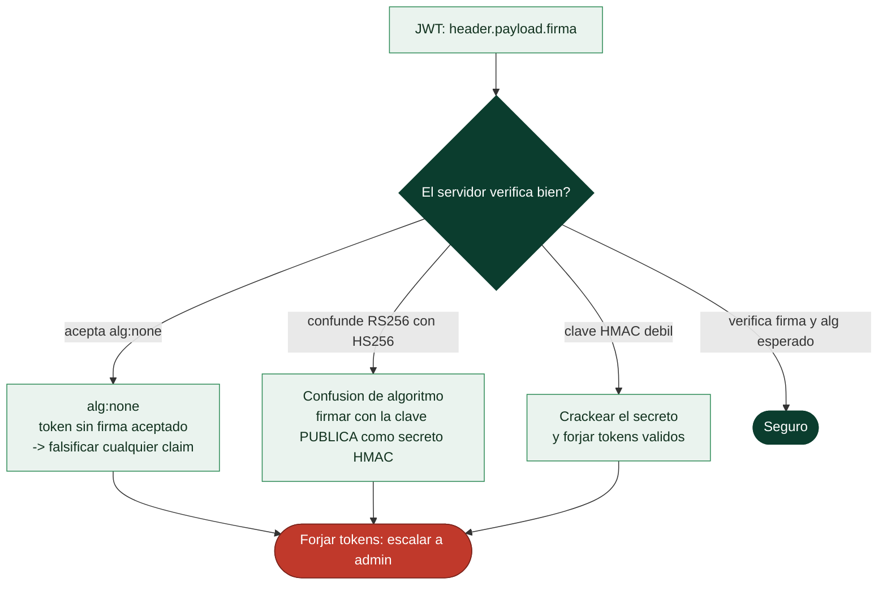

# Clase 103 — Ataques y seguridad de JWT

> Parte: **4 — Seguridad de aplicaciones web** · Fuente: *Bug Bounty Bootcamp (Vickie Li)* / *RFC 7519*
> ⏱️ Duración estimada: **110 min** · Nivel: **Avanzado**

---

## 🎯 Objetivo

Auditar la seguridad de los **JSON Web Tokens (JWT)**, hoy omnipresentes en APIs y SPAs. Aprenderás a decodificarlos, detectar implementaciones inseguras y explotar fallos clásicos: `alg:none`, confusión de algoritmos, claves débiles y falta de verificación de firma.

> ⚠️ **Ética**: solo en labs propios/autorizados. Forjar tokens de sistemas ajenos es un delito.

## 📚 Resultados de aprendizaje

Al finalizar, el alumno podrá:

1. **Decodificar** y comprender la estructura de un JWT (header, payload, signature).
2. **Explotar** el ataque `alg:none` y la aceptación de firma vacía.
3. **Realizar** confusión de algoritmos (RS256 → HS256).
4. **Crackear** claves HMAC débiles por fuerza bruta.
5. **Recomendar** una configuración segura de JWT.

## 🗺️ Temas

| # | Tema | Por qué importa |
|---|------|-----------------|
| 1 | Estructura y claims de JWT | Base para atacar |
| 2 | Algoritmos: HS256 vs. RS256 | El eje de varios ataques |
| 3 | `alg:none` | Bypass de firma |
| 4 | Confusión de algoritmos | Firmar con la clave pública |
| 5 | Claves HMAC débiles | Crackeo offline |
| 6 | Claims: exp, iss, aud, kid | Fallos de validación |
| 7 | Defensa: verificar firma y alg | Cierre del fallo |

## 🧠 Explicación en profundidad

### Un token que lleva su propia información y su propia firma

Un **JWT** (*JSON Web Token*) es una forma de sesión sin estado en el servidor: en lugar de guardar
un session ID que apunta a datos en el servidor (clase 102), el token **contiene** los datos
—quién eres, tus permisos, cuándo expira— y una **firma** que garantiza que no se han manipulado. Se
compone de tres partes separadas por puntos y codificadas en Base64URL: el **header** (qué algoritmo
firma), el **payload** (los *claims*: `sub`, `exp`, `iss`, `aud`, roles) y la **firma**. El punto
crítico que hay que grabar desde el principio: **el payload NO está cifrado**, solo codificado —
cualquiera lo lee decodificando el Base64—; lo único que la firma garantiza es la **integridad**, no
la confidencialidad. Poner un secreto en el payload de un JWT es un error clásico.

### Los dos ataques que definen el tema: alg:none y confusión de algoritmos

La seguridad de un JWT depende **por completo** de que el servidor **verifique la firma
correctamente**, y aquí están los dos fallos históricos que toda esta clase enseña a reconocer.



**`alg:none`.** La especificación de JWT incluyó un algoritmo "ninguno" para tokens sin firmar.
Algunas librerías, mal implementadas, **aceptaban** un token cuyo header decía `alg: none` **sin
verificar nada** —el atacante quita la firma, pone `none`, cambia el payload a `admin` y entra—. Es
el fallo más grave y más simple, y la razón por la que el servidor **nunca** debe permitir que sea
el token quien decida el algoritmo.

**Confusión de algoritmos (RS256 → HS256).** RS256 firma con clave **asimétrica** (privada firma,
**pública** verifica) y HS256 con clave **simétrica** (el mismo secreto firma y verifica). El ataque:
el atacante toma la clave **pública** RS256 (que es pública, la conoce) y firma un token diciendo que
usa **HS256** con esa clave pública como secreto. Si el servidor, al ver `HS256`, verifica usando su
clave RSA pública como secreto HMAC, la firma cuadra, y el atacante ha forjado un token válido con
material que era público. La causa es de nuevo dejar que el token elija el algoritmo.

### Claves débiles, claims y la defensa

El tercer ataque es más directo: si el JWT usa **HS256 con un secreto débil**, se puede **crackear
offline** con hashcat (clase 080) —el token lleva su propia firma, así que es un objetivo de
cracking perfecto— y, una vez conocido el secreto, forjar cualquier token. La defensa es un secreto
largo y aleatorio, como cualquier clave. En cuanto a los **claims**, hay que **validarlos todos**, no
solo la firma: `exp` (que no haya caducado), `iss` (emisor esperado), `aud` (destinado a esta
aplicación); ignorar `exp` deja tokens válidos para siempre. Cuidado especial con `kid` (*key ID*),
que indica qué clave usar: si el servidor lo usa sin validar, puede ser vector de inyección
(SQLi, path traversal) o apuntar a una clave que el atacante controla.

La **defensa** se resume en reglas tajantes: **verificar siempre la firma**, **fijar el algoritmo
esperado en el servidor** (no leerlo del token), **rechazar `alg:none`**, usar secretos fuertes,
**validar todos los claims**, y recordar que un JWT **no se puede revocar** fácilmente antes de su
expiración —lo que obliga a tiempos de vida cortos y a una lista de revocación si se necesita cerrar
sesiones de golpe—. Ese último punto es el compromiso de fondo del JWT frente a la sesión clásica:
gana en escalabilidad sin estado, pierde en control de revocación.

## 📖 Definiciones y características

- **JWT**: token compacto con header, payload y firma en Base64URL. Característica: autocontenido y stateless.
- **`alg:none`**: algoritmo que indica "sin firma". Característica: si el servidor lo acepta, cualquiera forja tokens.
- **Confusión de algoritmos**: hacer que el servidor verifique un RS256 como HS256 usando la clave pública como secreto HMAC. Característica: explota validación laxa del `alg`.
- **`kid` (key id)**: cabecera que indica qué clave usar. Característica: inyectable (path traversal, SQLi) si no se valida.
- **Claim `exp`**: expiración del token. Característica: si no se valida, los tokens no caducan.
- **Secreto HMAC**: clave compartida en HS256. Característica: si es débil, se crackea offline.

## 📔 Glosario

| Término | Definición concisa |
|---------|--------------------|
| JWT | Token que contiene sus datos y una firma; sesión sin estado |
| Header / payload / firma | Las tres partes del JWT, en Base64URL |
| Claim | Dato del payload: `sub`, `exp`, `iss`, `aud`, roles |
| Payload no cifrado | Solo codificado; cualquiera lo lee |
| Integridad, no confidencialidad | La firma protege de manipulación, no de lectura |
| HS256 | Firma simétrica; el mismo secreto firma y verifica |
| RS256 | Firma asimétrica; privada firma, pública verifica |
| alg:none | Algoritmo "ninguno"; aceptarlo permite tokens sin firma |
| Confusión de algoritmos | Firmar HS256 con la clave pública RS256 como secreto |
| Secreto HMAC débil | Crackeable offline; permite forjar tokens |
| exp / iss / aud | Claims que hay que validar además de la firma |
| kid | Key ID del header; vector de inyección si no se valida |
| Fijar el algoritmo | El servidor decide el algoritmo, no el token |
| Revocación de JWT | Difícil antes de expirar; exige TTL cortos o lista negra |

## 🧰 Herramientas y preparación

- **jwt.io** (decodificar/inspeccionar) y **jwt_tool**.
- **Burp** con la extensión **JWT Editor**.
- **hashcat** o **John the Ripper** para crackear secretos.
- **PortSwigger labs** de JWT.

```bash
git clone https://github.com/ticarpi/jwt_tool && cd jwt_tool && pip install -r requirements.txt
```

## 🧪 Laboratorio guiado

> ⚠️ Solo en labs propios.

1. Captura un JWT y decodifícalo con jwt.io o jwt_tool para ver header y claims.
2. Prueba el ataque **alg:none**: cambia `"alg":"none"`, elimina la firma y modifica un claim (p. ej. `role: admin`).
3. Si usa RS256, intenta **confusión de algoritmos**: firma un HS256 usando la clave pública del servidor como secreto.
4. Si es HS256, extrae el token y **crackea el secreto** con hashcat:

```bash
hashcat -m 16500 token.txt wordlist.txt
```

5. Con el secreto, forja un token con privilegios elevados y úsalo.
6. Manipula el `kid` para apuntar a un archivo/valor controlado.
7. Verifica el manejo de `exp`: reusa un token caducado.

## ✍️ Ejercicios

1. Explica cada parte de un JWT y qué contiene el payload.
2. Reproduce el ataque alg:none en un lab de PortSwigger.
3. Realiza confusión RS256→HS256 y explica por qué funciona.
4. Crackea un secreto HMAC débil y forja un token admin.
5. Analiza los claims exp/iss/aud y qué pasa si no se validan.
6. Escribe la validación correcta de JWT en el lenguaje que prefieras.

## 📝 Reto verificable

Resuelve un lab de JWT de PortSwigger (alg:none, clave débil o confusión de algoritmos) y **escala a administrador** forjando un token.
**Criterio de aceptación**: el lab queda resuelto, entregas el token forjado, el ataque usado y la corrección (verificar firma, fijar el algoritmo esperado, secreto fuerte).

## ⚠️ Errores comunes

| Síntoma / mensaje | Causa y cómo arreglar |
|-------------------|------------------------|
| alg:none rechazado | Servidor valida el algoritmo; prueba otro ataque |
| Confusión no funciona | La librería fija el alg; documenta como fortaleza |
| hashcat no crackea | Secreto fuerte; solo funciona con claves débiles |
| Token modificado rechazado | La firma sí se verifica; revisa el vector |
| kid no explotable | Se valida contra allowlist; correcto |

## ❓ Preguntas frecuentes

**❓ ¿JWT es inseguro?**
No por sí mismo. Los fallos vienen de implementaciones que no verifican bien la firma o el algoritmo.

**❓ ¿Puedo revocar un JWT?**
No fácilmente por ser stateless. Se usan expiraciones cortas y listas de revocación o rotación de claves.

**❓ ¿Guardo el JWT en localStorage o cookie?**
Cookie HttpOnly reduce el robo vía XSS; localStorage es accesible por JS. Cada opción tiene trade-offs de CSRF/XSS.

## 🔗 Referencias

- Li, *Bug Bounty Bootcamp*, sección de JWT.
- RFC 7519 (JWT): <https://datatracker.ietf.org/doc/html/rfc7519>
- OWASP JWT Cheat Sheet.
- PortSwigger JWT: <https://portswigger.net/web-security/jwt>

## 📥 Material descargable

- 📄 [Guía en PDF](./clase-103-guia.pdf) — versión imprimible de esta clase.
- 🎞️ [Presentación (PPTX)](./clase-103-presentacion.pptx) — deck para proyectar en clase.

## ⬅️ Clase anterior

[Clase 102 — Gestión de sesiones y ataques asociados](../102-gestion-de-sesiones-y-ataques-asociados/README.md)

## ➡️ Siguiente clase

[Clase 104 — Seguridad de OAuth 2.0 y OpenID Connect](../104-seguridad-de-oauth-2-0-y-openid-connect/README.md)
