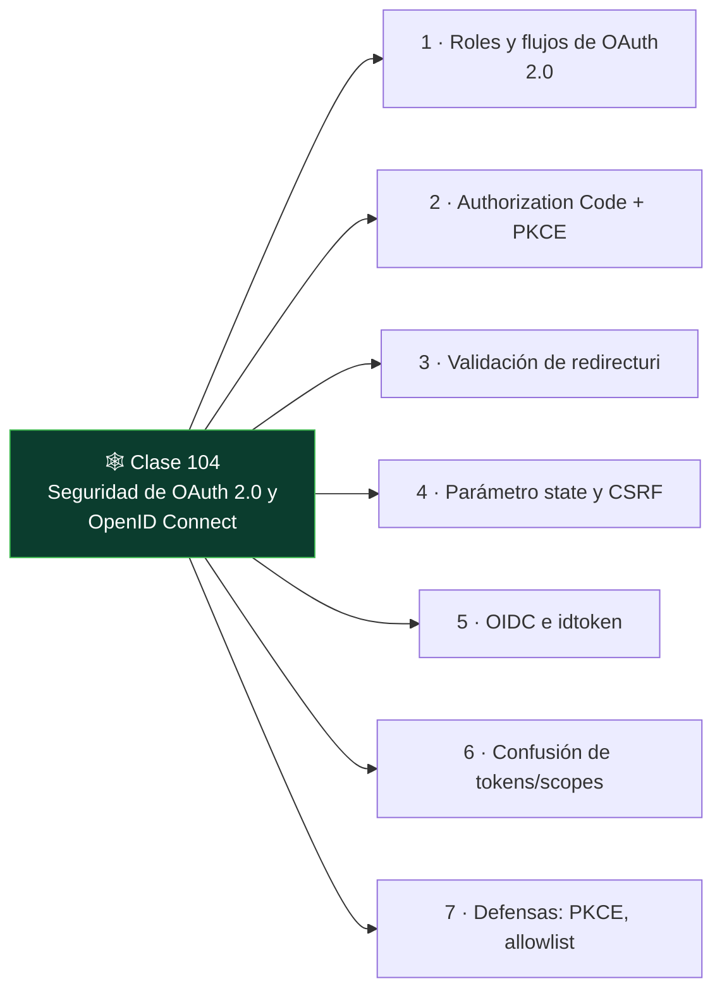

# Clase 104 — Seguridad de OAuth 2.0 y OpenID Connect

<!-- cabecera:inicio -->

> 🗂️ Parte: **4 — Seguridad de aplicaciones web** · 📖 Fuente: *Bug Bounty Bootcamp (Vickie Li)* / *RFC 6749*
> ⏱️ Duración estimada: **120 min** · 🎚️ Nivel: **Experto**

<!-- cabecera:fin -->

---

## 🎯 Objetivo

Comprender y auditar **OAuth 2.0** y **OpenID Connect (OIDC)**, la base del "login con Google/GitHub" y de la delegación de acceso en APIs. Verás los flujos, sus piezas y los ataques clásicos: `redirect_uri` laxo, robo de `code`, CSRF por falta de `state` y confusión de tokens.

> ⚠️ **Ética**: solo en labs propios/autorizados. Robar tokens o cuentas ajenas es un delito.

## 📚 Resultados de aprendizaje

Al finalizar, el alumno podrá:

1. **Describir** el flujo Authorization Code y el rol de cada parámetro.
2. **Explotar** validación débil de `redirect_uri` para robar el `code`/token.
3. **Detectar** ausencia del parámetro `state` (CSRF de OAuth).
4. **Diferenciar** OAuth (autorización) de OIDC (autenticación).
5. **Recomendar** PKCE, `state` y validación estricta de redirect.

## 🗺️ Temas

<!-- mapa:inicio -->

<!-- mapa:fin -->

| # | Tema | Por qué importa |
|---|------|-----------------|
| 1 | Roles y flujos de OAuth 2.0 | Base conceptual |
| 2 | Authorization Code + PKCE | El flujo recomendado hoy |
| 3 | Validación de redirect_uri | Vector de robo de token |
| 4 | Parámetro state y CSRF | Enlace de sesión |
| 5 | OIDC e id_token | Autenticación federada |
| 6 | Confusión de tokens/scopes | Escalada de acceso |
| 7 | Defensas: PKCE, allowlist | Cierre del fallo |

## 📖 Definiciones y características

- **OAuth 2.0**: marco de delegación de acceso a recursos sin compartir credenciales. Característica: autorización, no autenticación.
- **OIDC**: capa de identidad sobre OAuth que añade el `id_token`. Característica: sí autentica al usuario.
- **Authorization Code**: código temporal que se intercambia por tokens. Característica: no debe filtrarse.
- **redirect_uri**: URL a la que vuelve el flujo. Característica: si se valida laxamente, se roba el code.
- **state**: valor anti-CSRF que liga la petición y la respuesta. Característica: su ausencia habilita account hijacking.
- **PKCE**: extensión que protege el intercambio de code en clientes públicos. Característica: evita el robo de code por apps maliciosas.

## 🧰 Herramientas y preparación

- **PortSwigger labs** de OAuth.
- **Burp** para interceptar el flujo (autorización, callback, intercambio).
- Un proveedor de identidad de laboratorio o el simulado por el lab.

## 🧪 Laboratorio guiado

> ⚠️ Solo en labs propios/autorizados.

1. Intercepta el flujo completo con Burp: `/authorize` → consentimiento → `redirect_uri?code=...` → intercambio de token.
2. Modifica el `redirect_uri` a un dominio controlado y observa si el servidor lo acepta (validación laxa).
3. Si lo acepta, captura el `code` enviado a tu dominio y complétalo por un token.
4. Comprueba la presencia del parámetro **state**; si falta, monta un CSRF que vincule la cuenta del atacante.
5. Analiza los **scopes** solicitados: ¿se puede pedir más de lo autorizado?
6. En OIDC, inspecciona el `id_token` (es un JWT): aplica lo aprendido en la clase 103.
7. Documenta el flujo, el fallo y el impacto (account takeover).

## ✍️ Ejercicios

1. Dibuja el flujo Authorization Code con PKCE, parámetro a parámetro.
2. Explica cómo un `redirect_uri` con validación por prefijo se puede evadir.
3. Describe un ataque de account hijacking por falta de `state`.
4. Diferencia `access_token`, `id_token` y `refresh_token`.
5. Explica qué protege PKCE y en qué clientes es imprescindible.
6. Diseña la validación estricta de `redirect_uri` (allowlist exacta).

## 📝 Reto verificable

Resuelve un lab de OAuth de PortSwigger que explote **redirect_uri débil** o **falta de state** y consigue tomar la cuenta de otro usuario.
**Criterio de aceptación**: el lab queda resuelto, documentas el flujo interceptado, el parámetro abusado y la defensa (allowlist de redirect, state obligatorio, PKCE).

## ⚠️ Errores comunes

| Síntoma / mensaje | Causa y cómo arreglar |
|-------------------|------------------------|
| redirect_uri rechazado | Allowlist exacta; el servidor valida bien |
| No hay code en el callback | Flujo implícito o error de scope; revisa el tipo de flujo |
| state presente y validado | No hay CSRF; documenta como fortaleza |
| Token no reutilizable | Expiración/binding correctos |
| Confundir OAuth con login | OAuth autoriza; para autenticar se usa OIDC |

## ❓ Preguntas frecuentes

**❓ ¿OAuth sirve para login?**
OAuth es autorización. Para login federado correcto se usa OIDC, que añade el `id_token` con la identidad.

**❓ ¿Por qué el flujo implícito está obsoleto?**
Porque expone tokens en la URL. Hoy se recomienda Authorization Code con PKCE.

**❓ ¿Qué es lo más explotado en OAuth?**
La validación laxa de `redirect_uri` y la falta de `state`, que llevan a robo de code y account takeover.

## 🔗 Referencias

- Li, *Bug Bounty Bootcamp*, sección de OAuth.
- RFC 6749 (OAuth 2.0): <https://datatracker.ietf.org/doc/html/rfc6749>
- OAuth 2.0 Security Best Current Practice (RFC 9700).
- PortSwigger OAuth: <https://portswigger.net/web-security/oauth>

## 📥 Material descargable

- 📄 [Guía en PDF](./clase-104-guia.pdf) — versión imprimible de esta clase.
- 🎞️ [Presentación (PPTX)](./clase-104-presentacion.pptx) — deck para proyectar en clase.

## ⬅️ Clase anterior

[Clase 103 — Ataques y seguridad de JWT](../103-ataques-y-seguridad-de-jwt/README.md)

## ➡️ Siguiente clase

[Clase 105 — Control de acceso roto: IDOR y path traversal](../105-control-de-acceso-roto-idor-y-path-traversal/README.md)
