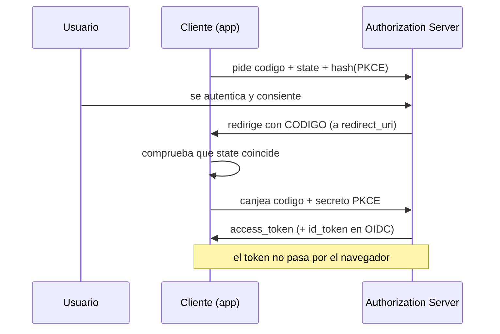

# Clase 104 — Seguridad de OAuth 2.0 y OpenID Connect

> Parte: **4 — Seguridad de aplicaciones web** · Fuente: *Bug Bounty Bootcamp (Vickie Li)* / *RFC 6749*
> ⏱️ Duración estimada: **120 min** · Nivel: **Experto**

---

## 🎯 Objetivo

Comprender y auditar **OAuth 2.0** y **OpenID Connect (OIDC)**, la base del "login con Google/GitHub" y de la delegación de acceso en APIs. Verás los flujos, sus piezas y los ataques clásicos: `redirect_uri` laxo, robo de `code`, CSRF por falta de `state` y confusión de tokens.

> ⚠️ **Ética**: solo en labs propios/autorizados. Robar tokens o cuentas ajenas es un delito.

## 📚 Resultados de aprendizaje

Al finalizar, el alumno podrá:

1. **Describir** el flujo Authorization Code y el rol de cada parámetro.
2. **Explotar** validación débil de `redirect_uri` para robar el `code`/token.
3. **Detectar** ausencia del parámetro `state` (CSRF de OAuth).
4. **Diferenciar** OAuth (autorización) de OIDC (autenticación).
5. **Recomendar** PKCE, `state` y validación estricta de redirect.

## 🗺️ Temas

| # | Tema | Por qué importa |
|---|------|-----------------|
| 1 | Roles y flujos de OAuth 2.0 | Base conceptual |
| 2 | Authorization Code + PKCE | El flujo recomendado hoy |
| 3 | Validación de redirect_uri | Vector de robo de token |
| 4 | Parámetro state y CSRF | Enlace de sesión |
| 5 | OIDC e id_token | Autenticación federada |
| 6 | Confusión de tokens/scopes | Escalada de acceso |
| 7 | Defensas: PKCE, allowlist | Cierre del fallo |

## 🧠 Explicación en profundidad

### Delegar acceso sin entregar la contraseña

**OAuth 2.0** resuelve un problema concreto: permitir que una aplicación acceda a tus datos en otro
servicio **sin darle tu contraseña**. Cuando "inicias sesión con Google" o autorizas a una app a leer
tu calendario, es OAuth. Sus cuatro roles hay que tenerlos claros porque los ataques se explican en
términos de ellos: el **resource owner** (tú, el usuario), el **client** (la aplicación que quiere
acceso), el **authorization server** (quien autentica y emite tokens, p. ej. Google) y el **resource
server** (donde están los datos). Una distinción esencial que causa la mitad de los fallos: **OAuth
es para autorización** (dar acceso a recursos), no para autenticación (probar quién eres); usarlo
para login sin la capa adecuada es un error de diseño que **OpenID Connect** vino a corregir.

### El flujo correcto: Authorization Code + PKCE

El flujo recomendado hoy es el **Authorization Code**, y su versión con **PKCE** es obligatoria para
apps públicas (móviles, SPAs). La idea: el usuario se autentica en el servidor de autorización, que
devuelve un **código** de un solo uso al cliente, y el cliente **cambia ese código por un token** en
una petición de servidor a servidor. Así el token nunca pasa por el navegador. **PKCE** añade una
protección contra el robo del código: el cliente genera un secreto aleatorio, envía su hash al pedir
el código y el secreto original al canjearlo, de modo que un atacante que intercepte el código no
pueda usarlo sin el secreto.

### Los tres fallos clásicos: redirect_uri, state y confusión de tokens

Casi todos los ataques a OAuth caen en tres categorías. El primero es la **validación laxa de
`redirect_uri`**: el servidor de autorización devuelve el código a la URL que indica el cliente, y si
**no valida estrictamente** esa URL contra una allowlist, el atacante pone una URL que él controla y
**el código (o el token) se le entrega a él**. Es el fallo más crítico, y la defensa es un allowlist
exacto de redirect_uris registrados —nada de coincidencias parciales o comodines—. El segundo es la
**ausencia del parámetro `state`**: `state` es un valor impredecible que ata la petición inicial con
la respuesta, y sin él el flujo OAuth es vulnerable a **CSRF** (clase 098) —un atacante puede
"inyectar" su propia autorización en la sesión de la víctima—. El tercero es la **confusión de tokens
y scopes**: usar un `access_token` (que dice qué puede hacer el cliente) como si fuera prueba de
identidad, o no verificar que un token fue emitido **para esta aplicación** (la audiencia), permite
reutilizar en un servicio un token emitido para otro.

### OIDC: la capa de identidad que faltaba

**OpenID Connect** se construye sobre OAuth 2.0 para hacer bien lo que OAuth no hacía: **autenticar**.
Añade el **`id_token`** —un JWT (clase 103) que prueba la identidad del usuario con claims estándar
(`sub`, `iss`, `aud`, `nonce`)—. La clave es que el `id_token` **se valida como cualquier JWT**:
firma, emisor esperado, audiencia que sea tu aplicación, y `nonce` para evitar repetición. El error
de fondo que OIDC corrige es el "login con OAuth" mal hecho, donde una aplicación tomaba un
`access_token` como prueba de que el usuario era quien decía —cuando ese token solo dice que **alguien**
autorizó acceso, no **quién**—. Las defensas de todo el tema se resumen en: **PKCE** siempre, allowlist
**estricto** de redirect_uris, `state` para CSRF, `nonce` en OIDC, y **validar audiencia y emisor** de
cada token. OAuth y OIDC son potentes pero llenos de matices, y la mayoría de las brechas vienen de
saltarse uno de estos controles, no de romper la criptografía.

## 📖 Definiciones y características

- **OAuth 2.0**: marco de delegación de acceso a recursos sin compartir credenciales. Característica: autorización, no autenticación.
- **OIDC**: capa de identidad sobre OAuth que añade el `id_token`. Característica: sí autentica al usuario.
- **Authorization Code**: código temporal que se intercambia por tokens. Característica: no debe filtrarse.
- **redirect_uri**: URL a la que vuelve el flujo. Característica: si se valida laxamente, se roba el code.
- **state**: valor anti-CSRF que liga la petición y la respuesta. Característica: su ausencia habilita account hijacking.
- **PKCE**: extensión que protege el intercambio de code en clientes públicos. Característica: evita el robo de code por apps maliciosas.

## 📔 Glosario

| Término | Definición concisa |
|---------|--------------------|
| OAuth 2.0 | Delegar acceso a recursos sin entregar la contraseña |
| Resource owner | El usuario dueño de los datos |
| Client | La aplicación que solicita acceso |
| Authorization server | Autentica y emite tokens |
| Resource server | Donde están los datos protegidos |
| Autorización ≠ autenticación | OAuth da acceso; no prueba identidad por sí solo |
| Authorization Code | Flujo recomendado: código canjeado por token |
| PKCE | Protección del código para apps públicas |
| redirect_uri | URL de retorno; debe validarse con allowlist estricto |
| state | Valor que ata petición y respuesta; anti-CSRF |
| access_token | Token que dice qué puede hacer el cliente |
| Confusión de tokens/scopes | Usar un token fuera de su propósito o audiencia |
| OpenID Connect (OIDC) | Capa de autenticación sobre OAuth |
| id_token | JWT que prueba la identidad; se valida como tal |

## 🧰 Herramientas y preparación

- **PortSwigger labs** de OAuth.
- **Burp** para interceptar el flujo (autorización, callback, intercambio).
- Un proveedor de identidad de laboratorio o el simulado por el lab.

## 🧪 Laboratorio guiado

> ⚠️ Solo en labs propios/autorizados.

1. Intercepta el flujo completo con Burp: `/authorize` → consentimiento → `redirect_uri?code=...` → intercambio de token.
2. Modifica el `redirect_uri` a un dominio controlado y observa si el servidor lo acepta (validación laxa).
3. Si lo acepta, captura el `code` enviado a tu dominio y complétalo por un token.
4. Comprueba la presencia del parámetro **state**; si falta, monta un CSRF que vincule la cuenta del atacante.
5. Analiza los **scopes** solicitados: ¿se puede pedir más de lo autorizado?
6. En OIDC, inspecciona el `id_token` (es un JWT): aplica lo aprendido en la clase 103.
7. Documenta el flujo, el fallo y el impacto (account takeover).

## ✍️ Ejercicios

1. Dibuja el flujo Authorization Code con PKCE, parámetro a parámetro.
2. Explica cómo un `redirect_uri` con validación por prefijo se puede evadir.
3. Describe un ataque de account hijacking por falta de `state`.
4. Diferencia `access_token`, `id_token` y `refresh_token`.
5. Explica qué protege PKCE y en qué clientes es imprescindible.
6. Diseña la validación estricta de `redirect_uri` (allowlist exacta).

## 📝 Reto verificable

Resuelve un lab de OAuth de PortSwigger que explote **redirect_uri débil** o **falta de state** y consigue tomar la cuenta de otro usuario.
**Criterio de aceptación**: el lab queda resuelto, documentas el flujo interceptado, el parámetro abusado y la defensa (allowlist de redirect, state obligatorio, PKCE).

## ⚠️ Errores comunes

| Síntoma / mensaje | Causa y cómo arreglar |
|-------------------|------------------------|
| redirect_uri rechazado | Allowlist exacta; el servidor valida bien |
| No hay code en el callback | Flujo implícito o error de scope; revisa el tipo de flujo |
| state presente y validado | No hay CSRF; documenta como fortaleza |
| Token no reutilizable | Expiración/binding correctos |
| Confundir OAuth con login | OAuth autoriza; para autenticar se usa OIDC |

## ❓ Preguntas frecuentes

**❓ ¿OAuth sirve para login?**
OAuth es autorización. Para login federado correcto se usa OIDC, que añade el `id_token` con la identidad.

**❓ ¿Por qué el flujo implícito está obsoleto?**
Porque expone tokens en la URL. Hoy se recomienda Authorization Code con PKCE.

**❓ ¿Qué es lo más explotado en OAuth?**
La validación laxa de `redirect_uri` y la falta de `state`, que llevan a robo de code y account takeover.

## 🔗 Referencias

- Li, *Bug Bounty Bootcamp*, sección de OAuth.
- RFC 6749 (OAuth 2.0): <https://datatracker.ietf.org/doc/html/rfc6749>
- OAuth 2.0 Security Best Current Practice (RFC 9700).
- PortSwigger OAuth: <https://portswigger.net/web-security/oauth>

## 📥 Material descargable

- 📄 [Guía en PDF](./clase-104-guia.pdf) — versión imprimible de esta clase.
- 🎞️ [Presentación (PPTX)](./clase-104-presentacion.pptx) — deck para proyectar en clase.

## ⬅️ Clase anterior

[Clase 103 — Ataques y seguridad de JWT](../103-ataques-y-seguridad-de-jwt/README.md)

## ➡️ Siguiente clase

[Clase 105 — Control de acceso roto: IDOR y path traversal](../105-control-de-acceso-roto-idor-y-path-traversal/README.md)
