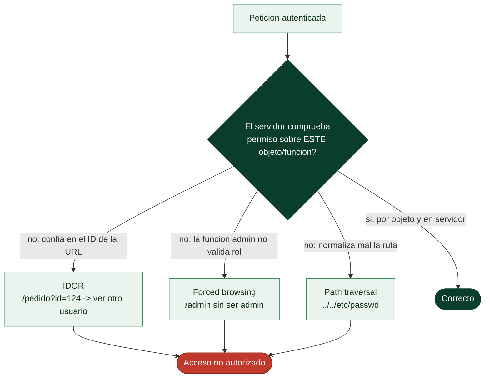

# Clase 105 — Control de acceso roto: IDOR y path traversal

> Parte: **4 — Seguridad de aplicaciones web** · Fuente: *Real-World Bug Hunting (Yaworski)* / *OWASP Top 10 A01*
> ⏱️ Duración estimada: **110 min** · Nivel: **Avanzado**

---

## 🎯 Objetivo

Explotar el **control de acceso roto (Broken Access Control)**, la categoría número 1 del OWASP Top 10. Nos centramos en **IDOR** (referencias directas inseguras a objetos) y **path traversal** (acceso a archivos fuera del directorio permitido), dos de los hallazgos más frecuentes y rentables en bug bounty.

> ⚠️ **Ética**: solo en labs propios/autorizados. Acceder a datos de otros usuarios reales es un delito.

## 📚 Resultados de aprendizaje

Al finalizar, el alumno podrá:

1. **Detectar** IDOR manipulando identificadores en peticiones.
2. **Diferenciar** control de acceso horizontal y vertical.
3. **Explotar** path traversal para leer archivos del servidor.
4. **Descubrir** funciones administrativas por acceso directo a URLs.
5. **Recomendar** autorización a nivel de objeto y validación de rutas.

## 🗺️ Temas

| # | Tema | Por qué importa |
|---|------|-----------------|
| 1 | Autorización vertical vs. horizontal | Dos ejes del control roto |
| 2 | IDOR clásico | El bug más frecuente |
| 3 | IDOR con identificadores no obvios | UUID, hashes, encoding |
| 4 | Forced browsing a funciones admin | Acceso directo por URL |
| 5 | Path/directory traversal | Lectura de archivos |
| 6 | Métodos y verbos HTTP | Bypass por verbo |
| 7 | Defensa: authz por objeto | Cierre del fallo |

## 🧠 Explicación en profundidad

### El nº1 del OWASP Top 10, y el más fácil de explotar

El **control de acceso roto** es la categoría A01 de OWASP —la más extendida— porque combina
altísimo impacto con explotación trivial. Autenticarse responde "¿quién eres?"; **autorizar**
responde "¿puedes hacer *esto*?", y el fallo es no comprobar bien esa segunda pregunta en cada
acción. La causa profunda es casi siempre la misma: **confiar en que el cliente no pedirá lo que no
debe**, ocultando funciones o identificadores en la interfaz en lugar de verificar los permisos en el
servidor. Como el atacante controla el cliente (clase 086), cualquier control que viva solo ahí es
decorativo.

Hay dos ejes de escalada que conviene nombrar: **horizontal** (acceder a datos de **otro usuario del
mismo nivel** —ver el pedido de otro cliente—) y **vertical** (acceder a funciones de un **nivel
superior** —un usuario normal llamando a una función de administración—).



### IDOR: cambiar un número y ver lo que no es tuyo

El **IDOR** (*Insecure Direct Object Reference*) es el fallo de autorización horizontal por
excelencia y uno de los más comunes en bug bounty. Ocurre cuando la aplicación usa un identificador
del usuario para acceder a un objeto **sin comprobar que ese objeto le pertenece**: si `/factura?id=123`
muestra tu factura, probar `id=124` muestra la de otro —porque el servidor obedece el ID sin
verificar la propiedad—. Usar identificadores **no obvios** (UUIDs en lugar de números secuenciales)
**dificulta adivinarlos pero NO es una defensa**: si el ID se filtra por otro sitio (una respuesta de
API, un log) el IDOR sigue ahí. La única defensa real es **comprobar en el servidor, para cada
petición, que el usuario tiene permiso sobre ese objeto concreto**.

### Forced browsing y path traversal

El **forced browsing** es el equivalente vertical: acceder directamente a URLs o funciones de
privilegio superior que la interfaz no muestra al usuario normal —`/admin`, `/api/users/delete`—
apostando a que el único control era **no enseñar el enlace**. Si esas rutas no verifican el rol en el
servidor, se accede sin más. Relacionado está probar **métodos HTTP** distintos: un endpoint puede
proteger el `GET` pero no el `DELETE` o el `PUT`, o aceptar un `X-HTTP-Method-Override`. El **path
traversal** (o directory traversal) es control de acceso roto sobre el **sistema de ficheros**: si la
aplicación construye una ruta con entrada del usuario (`/descargar?fichero=informe.pdf`) sin
normalizarla, inyectar `../../../../etc/passwd` **sube** por el árbol de directorios y lee ficheros
fuera de lo previsto —código, configuración, claves—. Los payloads se codifican (`%2e%2e%2f`, doble
codificación) para saltar filtros ingenuos.

### La regla que lo cierra todo: denegar por defecto y verificar en el servidor

Toda esta categoría se remedia con dos principios. **Denegar por defecto**: el acceso se concede
explícitamente, nunca se asume; un endpoint nuevo sin comprobación de permisos debe ser inaccesible,
no accesible. Y **verificar la autorización en el servidor, por objeto y en cada petición**: no basta
con comprobar el rol al entrar; hay que comprobar, cada vez, que **este** usuario puede hacer **esta**
acción sobre **este** recurso. Para el path traversal, además, se canonicaliza la ruta y se confina el
acceso a un directorio base. La lección de fondo es que el control de acceso **no se puede delegar al
cliente** —ni ocultando enlaces, ni usando IDs difíciles, ni confiando en que nadie cambie la URL—:
es una decisión que el servidor toma en cada operación, o no existe.

## 📖 Definiciones y características

- **Broken Access Control**: la app no verifica que el usuario pueda hacer/ver lo solicitado. Característica: categoría A01, la más frecuente.
- **IDOR**: acceder a un objeto cambiando su identificador sin comprobación de permisos. Característica: fácil de detectar cambiando IDs.
- **Autorización horizontal**: acceder a datos de otro usuario del mismo nivel. Característica: IDOR típico.
- **Autorización vertical**: acceder a funciones de mayor privilegio. Característica: escalada a admin.
- **Path traversal**: usar `../` para salir del directorio permitido. Característica: lee archivos arbitrarios del servidor.
- **Forced browsing**: navegar directamente a URLs no enlazadas. Característica: revela funciones sin control de acceso.

## 📔 Glosario

| Término | Definición concisa |
|---------|--------------------|
| Control de acceso roto | No verificar bien los permisos; A01 de OWASP |
| Autorización | Comprobar si una identidad puede hacer una acción |
| Escalada horizontal | Acceder a datos de otro usuario del mismo nivel |
| Escalada vertical | Acceder a funciones de un nivel superior |
| IDOR | Referenciar un objeto sin comprobar la propiedad |
| Identificador no obvio | UUID que dificulta adivinar, pero no es una defensa |
| Forced browsing | Acceder a funciones ocultas que no validan el rol |
| Métodos HTTP | Un endpoint puede proteger GET pero no DELETE/PUT |
| Path traversal | `../` para leer ficheros fuera del directorio previsto |
| Canonicalización de ruta | Normalizar la ruta antes de usarla |
| Codificación de payload | `%2e%2e%2f` para saltar filtros de traversal |
| Denegar por defecto | El acceso se concede explícitamente, nunca se asume |
| Verificación por objeto | Comprobar el permiso sobre el recurso concreto |
| Control en el servidor | La autorización no se delega al cliente |

## 🧰 Herramientas y preparación

- **Burp** (Intruder para iterar IDs; extensión **Autorize** para probar authz).
- **PortSwigger labs** de access control y **Juice Shop**.
- Dos cuentas de prueba (usuario A y usuario B) para comparar accesos.

## 🧪 Laboratorio guiado

> ⚠️ Solo en labs propios.

1. Autentícate como usuario A y localiza una petición con un ID (`/api/orders/1001`).
2. Cambia el ID a `1002` y observa si accedes a datos de otro usuario (IDOR horizontal).
3. Automatiza con Intruder para enumerar objetos accesibles.
4. Prueba **escalada vertical**: accede a `/admin` o a endpoints de administración con tu sesión normal.
5. Explota **path traversal** en un parámetro de archivo:

```text
GET /download?file=../../../../etc/passwd
```

6. Prueba variantes de evasión: encoding (`%2e%2e%2f`), doble encoding, prefijos absolutos.
7. Usa la extensión **Autorize** para detectar automáticamente endpoints sin control de acceso.

## ✍️ Ejercicios

1. Diferencia con ejemplos IDOR horizontal y escalada vertical.
2. Explota un IDOR donde el identificador es un UUID (busca la fuente del UUID).
3. Lee `/etc/passwd` vía path traversal evadiendo un filtro de `../`.
4. Descubre una función admin por forced browsing.
5. Prueba cambiar el verbo HTTP (GET→POST/PUT) para saltar un control.
6. Escribe el control de acceso correcto a nivel de objeto (comprobar propietario).

## 📝 Reto verificable

Resuelve dos labs de PortSwigger: un **IDOR** que exponga datos de otro usuario y un **path traversal** que lea un archivo del sistema.
**Criterio de aceptación**: ambos labs quedan resueltos, documentas el identificador/ruta manipulados, la evidencia del acceso no autorizado y la defensa (authz por objeto, canonicalización de rutas).

## ⚠️ Errores comunes

| Síntoma / mensaje | Causa y cómo arreglar |
|-------------------|------------------------|
| Cambiar el ID da 403 | Hay control de acceso; busca otro objeto/verbo |
| UUID "imposible de adivinar" | Suele filtrarse en otra respuesta; búscalo |
| `../` filtrado | Prueba encoding, doble encoding o rutas absolutas |
| Admin accesible pero vacío | Falta el rol; prueba acciones concretas |
| Falso IDOR | Confirma con dos cuentas distintas |

## ❓ Preguntas frecuentes

**❓ ¿Por qué IDOR es tan común?**
Porque los desarrolladores confían en que el ID no es adivinable, en vez de verificar la propiedad del objeto en cada petición.

**❓ ¿Los UUID previenen IDOR?**
Dificultan la adivinación, pero no son control de acceso. Si el UUID se filtra, el IDOR persiste.

**❓ ¿Path traversal solo lee archivos?**
Leer es lo básico; combinado con upload o LFI puede escalar a ejecución de código en algunos contextos.

## 🔗 Referencias

- Yaworski, *Real-World Bug Hunting*, cap. de IDOR.
- OWASP Broken Access Control (A01): <https://owasp.org/Top10/A01_2021-Broken_Access_Control/>
- OWASP Path Traversal.
- PortSwigger Access control: <https://portswigger.net/web-security/access-control>

## 📥 Material descargable

- 📄 [Guía en PDF](./clase-105-guia.pdf) — versión imprimible de esta clase.
- 🎞️ [Presentación (PPTX)](./clase-105-presentacion.pptx) — deck para proyectar en clase.

## ⬅️ Clase anterior

[Clase 104 — Seguridad de OAuth 2.0 y OpenID Connect](../104-seguridad-de-oauth-2-0-y-openid-connect/README.md)

## ➡️ Siguiente clase

[Clase 106 — Deserialización insegura](../106-deserializacion-insegura/README.md)
