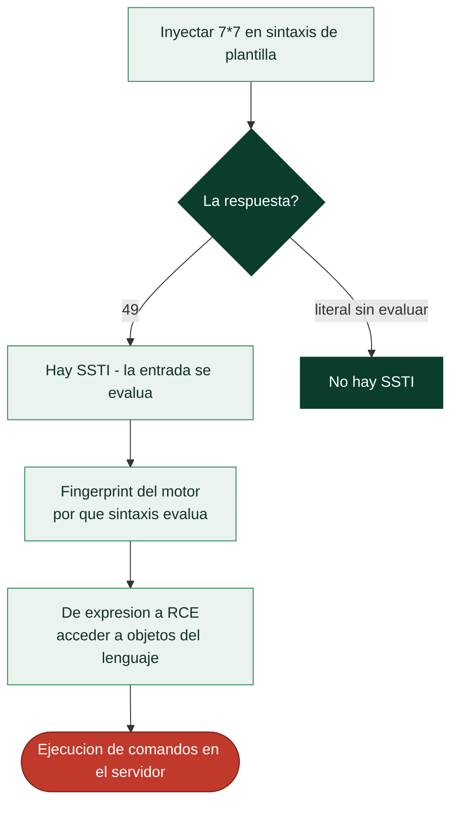

# Clase 107 — Server-Side Template Injection (SSTI)

> Parte: **4 — Seguridad de aplicaciones web** · Fuente: *Real-World Bug Hunting (Yaworski)* / *PortSwigger Research*
> ⏱️ Duración estimada: **110 min** · Nivel: **Experto**

---

## 🎯 Objetivo

Explotar la **inyección de plantillas del lado servidor (SSTI)**: cuando el input del usuario se evalúa como parte de una plantilla (Jinja2, Twig, Freemarker, etc.), permitiendo desde filtración de datos hasta RCE. Es un fallo potente que aparece en emails personalizados, generación de documentos y paneles configurables.

> ⚠️ **Ética**: puede derivar en RCE. Solo en labs propios/autorizados (PortSwigger). Nunca en sistemas ajenos.

## 📚 Resultados de aprendizaje

Al finalizar, el alumno podrá:

1. **Detectar** SSTI con payloads de prueba matemáticos.
2. **Identificar** el motor de plantillas por su comportamiento.
3. **Escalar** de evaluación de expresiones a lectura de archivos y RCE.
4. **Construir** payloads específicos por motor (Jinja2, Twig, Freemarker).
5. **Recomendar** sandboxing y separación de datos y plantilla.

## 🗺️ Temas

| # | Tema | Por qué importa |
|---|------|-----------------|
| 1 | Motores de plantillas | Contexto del fallo |
| 2 | Detección (`{{7*7}}`) | Confirmar la inyección |
| 3 | Fingerprinting del motor | El exploit depende del motor |
| 4 | De expresión a RCE | Escalada de impacto |
| 5 | Jinja2 / Twig / Freemarker | Payloads concretos |
| 6 | SSTI vs. XSS | No confundir el sink |
| 7 | Defensa: sandbox, logic-less | Cierre del fallo |

## 🧠 Explicación en profundidad

### Cuando la plantilla trata tu entrada como codigo de plantilla

Los **motores de plantillas** (Jinja2, Twig, Freemarker, Handlebars) generan HTML combinando una
plantilla fija con datos: `Hola {{ nombre }}` produce "Hola Ana". El **Server-Side Template
Injection** ocurre cuando la aplicacion construye la **plantilla misma** con entrada del usuario, en
lugar de pasar esa entrada como un **dato** a una plantilla fija. La diferencia es sutil pero
decisiva: si el usuario controla el texto de la plantilla, controla un lenguaje de expresiones que se
**evalua en el servidor**, y eso escala con frecuencia a **ejecucion remota de codigo**. La causa raiz
es un patron concreto y evitable: concatenar entrada dentro de la cadena de la plantilla
(`render("Hola " + nombre)`) en vez de `render("Hola {{ nombre }}", nombre=nombre)`.

### Deteccion: la matematica que delata

La sonda universal de SSTI es intentar que el servidor **evalue una expresion matematica**: se inyecta
`{{7*7}}` (u otras sintaxis segun el motor) y se observa la respuesta. Si vuelve `49`, la entrada se
esta evaluando como codigo de plantilla -hay SSTI-; si vuelve `{{7*7}}` literal, no. Esta prueba es
tambien el primer paso del **fingerprinting** del motor, porque cada uno usa una sintaxis distinta:
`{{7*7}}` funciona en Jinja2 y Twig, `${7*7}` en Freemarker y algunos otros, `#{7*7}` en mas.



### De expresion a RCE: escapar del sandbox de la plantilla

Que `{{7*7}}` de 49 solo demuestra evaluacion; el impacto viene de que estos motores exponen, a traves
del objeto que se esta renderizando, acceso a **las clases y objetos del lenguaje anfitrion**. En
Jinja2 (Python), por ejemplo, desde un objeto cualquiera se navega por atributos internos
(`__class__`, `__mro__`, `__subclasses__`) hasta alcanzar una clase que permita leer ficheros o
ejecutar comandos -el clasico ascenso hasta `os.system` o `subprocess`-. En Freemarker (Java) y otros
existen caminos analogos. Los motores ofrecen modos **sandbox** que restringen a que se puede acceder,
pero historicamente muchos sandboxes se han **escapado**, asi que no son una garantia. Lo esencial para
el pentester es entender que un SSTI rara vez se queda en "evaluo expresiones": casi siempre hay una
cadena conocida hacia RCE para el motor identificado.

### SSTI frente a XSS, y la defensa

Conviene no confundir SSTI con **XSS**, porque se parecen en la superficie y difieren en el fondo. El
XSS (clase 096) ejecuta JavaScript en el **navegador de la victima**; el SSTI ejecuta codigo en el
**servidor**, y por eso es mucho mas grave -compromete la maquina, no la sesion de un usuario-. Una
inyeccion que devuelve `49` es SSTI; una que abre un `alert` en el navegador es XSS; distinguirlas
determina el impacto que se reporta. La **defensa** es de diseno: **no construir plantillas con entrada
del usuario**, nunca. La entrada va siempre como **dato** que se pasa a una plantilla estatica, no como
parte del texto de la plantilla. Si por algun requisito el usuario debe aportar plantillas (un sistema
de correos personalizables, por ejemplo), se usa un motor **logic-less** como Mustache -que no evalua
expresiones arbitrarias, solo sustituye variables- y se ejecuta con sandbox y minimo privilegio como
capas adicionales. La regla, una vez mas, es la de toda la parte: separar codigo de datos.

## 📖 Definiciones y características

- **SSTI**: el input se interpreta dentro de una plantilla del servidor. Característica: puede ejecutar código del lado servidor.
- **Motor de plantillas**: sistema que renderiza plantillas con datos (Jinja2, Twig...). Característica: cada uno tiene su sintaxis y capacidades.
- **Payload de detección**: expresión simple (`{{7*7}}`) que revela evaluación. Característica: si devuelve `49`, hay SSTI.
- **Fingerprinting**: identificar el motor por respuestas a payloads. Característica: guía el exploit específico.
- **Sandbox**: entorno restringido de ejecución de plantillas. Característica: mitiga (aunque a veces se evade) la RCE.
- **Logic-less templates**: motores sin ejecución de código (Mustache). Característica: reducen el riesgo por diseño.

## 📔 Glosario

| Termino | Definicion concisa |
|---------|--------------------|
| Motor de plantillas | Genera HTML combinando plantilla y datos |
| SSTI | Inyeccion en la plantilla, evaluada en el servidor |
| Plantilla como dato vs. como codigo | El fallo es construir la plantilla con entrada |
| Sonda 7*7 | Deteccion; si la expresion se evalua, hay SSTI |
| Fingerprinting del motor | Identificar el motor por que sintaxis evalua |
| Jinja2 / Twig | Motores con sintaxis de dobles llaves |
| Freemarker | Motor Java con sintaxis de dolar y llaves |
| Escalada a RCE | Navegar a objetos del lenguaje hasta ejecutar comandos |
| `__subclasses__` | Via tipica de escalada en Jinja2/Python |
| Sandbox | Modo restringido del motor; historicamente escapable |
| SSTI vs XSS | SSTI ejecuta en el servidor; XSS en el navegador |
| Motor logic-less | Mustache y similares; solo sustituyen, no evaluan |
| Entrada como dato | La defensa: pasar la entrada a una plantilla fija |
| Impacto | RCE en el servidor; mas grave que XSS |

## 🧰 Herramientas y preparación

- **PortSwigger labs** de SSTI.
- **tplmap** (automatización, con criterio).
- **Burp** para probar payloads.

```bash
git clone https://github.com/epinna/tplmap && cd tplmap && pip install -r requirements.txt
```

## 🧪 Laboratorio guiado

> ⚠️ Solo en labs propios.

1. Introduce `{{7*7}}` y `${7*7}` en campos que se reflejan (nombre, plantilla de email).
2. Si obtienes `49`, confirma SSTI e identifica el motor con payloads diferenciadores.
3. En Jinja2 (Python), escala a lectura de configuración y luego a ejecución:

```text
{{ config.items() }}
{{ ''.__class__.__mro__[1].__subclasses__() }}
```

4. Encuentra un subclass que permita ejecutar comandos y ejecútalo en el lab.
5. En Twig/Freemarker, usa los payloads específicos del motor para leer archivos o ejecutar.
6. Confirma la RCE con una interacción OOB.
7. Documenta el motor, la cadena de escalada y el impacto.

## ✍️ Ejercicios

1. Diferencia la respuesta de `{{7*7}}` en SSTI de un simple reflejo de texto.
2. Haz fingerprinting distinguiendo Jinja2 de Twig con payloads.
3. Explica la cadena `__class__` → `__mro__` → `__subclasses__` en Python.
4. Diferencia SSTI de XSS: mismo `{{7*7}}`, distinto sink.
5. Usa tplmap y luego reproduce manualmente su payload.
6. Propón una arquitectura con plantillas logic-less para el caso de uso.

## 📝 Reto verificable

Resuelve un lab de SSTI de PortSwigger que exija **fingerprint + RCE** y ejecuta un comando (p. ej. leer un archivo del sistema).
**Criterio de aceptación**: el lab queda resuelto, documentas el motor identificado, la cadena de payloads y la defensa (sandbox, separar datos de plantilla, motor logic-less).

## ⚠️ Errores comunes

| Síntoma / mensaje | Causa y cómo arreglar |
|-------------------|------------------------|
| `{{7*7}}` sale literal | No hay SSTI ahí; puede ser XSS o texto plano |
| `49` pero sin RCE | Motor con sandbox; busca bypass conocido |
| Payload de otro motor falla | Fingerprint incorrecto; ajusta el motor |
| tplmap no detecta | Contexto peculiar; prueba manual |
| RCE ciega | Usa OOB para confirmar |

## ❓ Preguntas frecuentes

**❓ ¿SSTI siempre es RCE?**
No siempre; depende del motor y su sandbox. A veces solo permite leer datos, pero muchos motores llegan a RCE.

**❓ ¿Cómo distingo SSTI de XSS?**
`{{7*7}}` que devuelve `49` indica evaluación en servidor (SSTI); si aparece literal y ejecuta JS, es XSS en cliente.

**❓ ¿El sandbox me protege?**
Ayuda, pero muchos sandboxes de plantillas han sido evadidos. La defensa robusta es no meter input del usuario en la plantilla.

## 🔗 Referencias

- Yaworski, *Real-World Bug Hunting*, cap. de template injection.
- PortSwigger SSTI research y labs: <https://portswigger.net/web-security/server-side-template-injection>
- OWASP Testing for SSTI (WSTG).

## 📥 Material descargable

- 📄 [Guía en PDF](./clase-107-guia.pdf) — versión imprimible de esta clase.
- 🎞️ [Presentación (PPTX)](./clase-107-presentacion.pptx) — deck para proyectar en clase.

## ⬅️ Clase anterior

[Clase 106 — Deserialización insegura](../106-deserializacion-insegura/README.md)

## ➡️ Siguiente clase

[Clase 108 — Vulnerabilidades en carga de archivos](../108-vulnerabilidades-en-carga-de-archivos/README.md)
