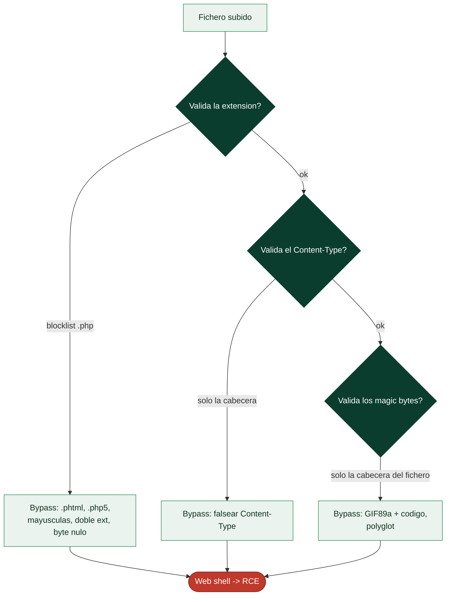

# Clase 108 — Vulnerabilidades en carga de archivos

> Parte: **4 — Seguridad de aplicaciones web** · Fuente: *The Web Application Hacker's Handbook* / *Bug Bounty Bootcamp (Vickie Li)*
> ⏱️ Duración estimada: **100 min** · Nivel: **Avanzado**

---

## 🎯 Objetivo

Explotar fallos en la **carga de archivos (file upload)**: subir contenido malicioso que la aplicación acepta y ejecuta o sirve de forma peligrosa. Un upload mal validado puede convertirse en web shell (RCE), XSS almacenado, path traversal o SSRF.

> ⚠️ **Ética**: subir una web shell equivale a RCE. Solo en labs propios/autorizados (DVWA, PortSwigger). Nunca en sistemas ajenos.

## 📚 Resultados de aprendizaje

Al finalizar, el alumno podrá:

1. **Identificar** qué validaciones aplica un formulario de subida.
2. **Evadir** filtros por extensión, Content-Type y magic bytes.
3. **Conseguir** ejecución subiendo una web shell en un lab.
4. **Explotar** upload para XSS almacenado, path traversal y SSRF.
5. **Recomendar** validación robusta y almacenamiento seguro.

## 🗺️ Temas

| # | Tema | Por qué importa |
|---|------|-----------------|
| 1 | Validaciones de upload | Qué hay que evadir |
| 2 | Bypass por extensión | Filtros de blocklist |
| 3 | Bypass por Content-Type y magic bytes | Validación superficial |
| 4 | Web shell y RCE | Impacto máximo |
| 5 | Upload → XSS/SVG | Vectores alternativos |
| 6 | Path traversal en el nombre | Sobrescritura de archivos |
| 7 | Defensa: allowlist, renombrar, aislar | Cierre del fallo |

## 🧠 Explicación en profundidad

### Subir un fichero puede ser subir un programa

La carga de archivos es una funcionalidad omnipresente —foto de perfil, adjuntos, documentos— y una
fuente frecuente de compromisos graves, porque un fichero subido no es solo datos: según **dónde se
guarde y cómo se sirva**, puede convertirse en **código que el servidor ejecuta**. El escenario más
crítico es el **web shell**: si el atacante consigue subir un fichero con extensión ejecutable (`.php`,
`.jsp`, `.aspx`) a una carpeta desde la que el servidor **ejecuta** scripts, y luego lo visita, el
servidor ejecuta ese código y el atacante obtiene RCE. Por eso la carga de archivos es un punto que se
audita siempre y con cuidado.

### Las tres validaciones y cómo se saltan

Las defensas típicas se apilan en tres capas, y el pentest consiste en probar cómo se evade cada una:

La **validación por extensión** con blocklist (prohibir `.php`) se evade con extensiones alternativas
que el servidor también ejecuta (`.phtml`, `.php5`, `.phar`), mayúsculas (`.PHP`), doble extensión
(`archivo.php.jpg` en servidores mal configurados), o trucos históricos como el **byte nulo**
(`shell.php%00.jpg`). La validación por **Content-Type** es aún más débil, porque esa cabecera la
**pone el cliente** y se falsea sin esfuerzo en Burp. La validación por **magic bytes** (los primeros
bytes que identifican el tipo real, como `GIF89a` para un GIF) es más robusta, pero se evade con un
**polyglot**: un fichero que empieza con los magic bytes de una imagen válida y **contiene código
después** —pasa la comprobación de tipo y sigue siendo ejecutable—. La lección: cada validación por
separado es evadible, y por eso la defensa correcta las combina y añade la pieza que de verdad importa.

### Más allá del web shell: XSS, SVG y traversal en el nombre

No todo ataque de upload busca RCE. Un **SVG** subido y servido como imagen es XML con JavaScript
dentro (clase 100), así que puede provocar **XSS almacenado** cuando otro usuario lo visualiza. Un
HTML subido y servido en el mismo origen también. El **nombre del fichero** es otra entrada peligrosa:
si se usa sin sanear para construir la ruta de guardado, un nombre como `../../../var/www/shell.php`
provoca **path traversal** (clase 105) y coloca el fichero donde el atacante quiera —incluida una
carpeta ejecutable—. Y el contenido puede esconder otros ataques: XXE en un DOCX, un ZIP bomb, malware
que se distribuirá a otros usuarios. La superficie de la carga de archivos va mucho más allá del web
shell.

### La defensa en profundidad que cierra el tema

Ninguna comprobación aislada basta; la carga segura combina varias medidas. **Allowlist de extensiones
y tipos** (permitir solo lo esperado, nunca prohibir lo peligroso). **Renombrar el fichero** con un
valor generado por el servidor, descartando el nombre original —lo que elimina de un golpe el path
traversal y las dobles extensiones—. **Guardar fuera de la raíz web** o en un **almacenamiento
separado** (un bucket de objetos, otro dominio sin ejecución), de modo que aunque se suba un `.php`
**no haya forma de ejecutarlo**. **Servir los ficheros con `Content-Disposition: attachment`** y un
Content-Type seguro para que el navegador los descargue en lugar de interpretarlos. Y **limitar tamaño
y escanear** el contenido. La combinación —renombrar, aislar del entorno de ejecución y validar por
allowlist— convierte un vector crítico en un riesgo manejable, y es el patrón que se lleva al informe.

## 📖 Definiciones y características

- **File upload inseguro**: aceptar archivos sin validar tipo, contenido o ubicación. Característica: puede llevar a RCE.
- **Web shell**: archivo (p. ej. `.php`) que ejecuta comandos al accederse. Característica: da control del servidor.
- **Magic bytes**: firma binaria inicial que identifica el tipo real. Característica: se puede falsificar para engañar validaciones.
- **Blocklist de extensiones**: prohibir ciertas extensiones. Característica: frágil; se evade con variantes (`.phtml`, `.php5`).
- **Allowlist**: permitir solo extensiones/tipos seguros. Característica: defensa robusta.
- **Almacenamiento fuera de webroot**: guardar uploads donde no se ejecuten. Característica: evita ejecución del contenido subido.

## 📔 Glosario

| Término | Definición concisa |
|---------|--------------------|
| Carga de archivos | Funcionalidad de subir ficheros; superficie de ataque frecuente |
| Web shell | Fichero ejecutable subido que da RCE al visitarlo |
| Validación por extensión | Comprobar el sufijo; evadible con blocklist |
| Doble extensión | `archivo.php.jpg` en servidores mal configurados |
| Byte nulo | `shell.php%00.jpg`; truco histórico de bypass |
| Content-Type | Cabecera puesta por el cliente; se falsea |
| Magic bytes | Primeros bytes que identifican el tipo real |
| Polyglot | Fichero válido como imagen que además contiene código |
| SVG malicioso | XML con JavaScript; provoca XSS al visualizarse |
| Path traversal en el nombre | `../` en el nombre para colocar el fichero donde sea |
| Allowlist | Permitir solo tipos esperados; la defensa base |
| Renombrar | Descartar el nombre original; anula traversal y doble ext. |
| Almacenamiento sin ejecución | Guardar donde el fichero no se pueda ejecutar |
| Content-Disposition | Forzar descarga en lugar de interpretación |

## 🧰 Herramientas y preparación

- **DVWA** (*File Upload*) y **PortSwigger labs** de file upload.
- **Burp** para modificar el nombre, extensión y Content-Type en la petición.
- Una web shell mínima de laboratorio (p. ej. PHP que ejecute `$_GET['cmd']`).

## 🧪 Laboratorio guiado

> ⚠️ Solo en labs propios y aislados.

1. En DVWA → *File Upload*, sube una imagen normal y observa dónde se guarda y cómo se sirve.
2. Sube una web shell PHP simple; si se bloquea por extensión, prueba variantes: `.phtml`, `.php5`, `.pHp`.
3. Evade validación por **Content-Type**: cambia el header a `image/png` en Burp manteniendo el contenido PHP.
4. Evade validación por **magic bytes**: antepone `GIF89a;` al código PHP.
5. Accede a la URL del archivo subido y ejecuta un comando (`?cmd=id`) en el lab.
6. Prueba vectores alternativos: sube un **SVG** con XSS, o un nombre con `../` para path traversal.
7. Documenta la validación evadida, el payload y el impacto.

## ✍️ Ejercicios

1. Enumera 5 extensiones alternativas que pueden ejecutar código PHP.
2. Evade una validación por Content-Type y otra por magic bytes.
3. Sube un SVG que ejecute JavaScript (XSS almacenado).
4. Usa `../` en el nombre para intentar sobrescribir un archivo.
5. Explica por qué guardar fuera del webroot mitiga el RCE.
6. Diseña una validación de upload robusta (allowlist + renombrado + escaneo).

## 📝 Reto verificable

Consigue **RCE** subiendo una web shell en un lab (DVWA Medium o PortSwigger) evadiendo al menos una validación, y ejecuta un comando.
**Criterio de aceptación**: entregas el archivo subido, la validación evadida, la evidencia de ejecución de comando y la corrección (allowlist, renombrado, almacenamiento fuera del webroot).

## ⚠️ Errores comunes

| Síntoma / mensaje | Causa y cómo arreglar |
|-------------------|------------------------|
| Extensión rechazada | Blocklist; prueba variantes o doble extensión |
| Se sube pero no ejecuta | Fuera del webroot o sin handler PHP; busca ubicación ejecutable |
| Content-Type validado | Falsifícalo en Burp manteniendo el contenido |
| Magic bytes comprobados | Antepón la firma del tipo permitido |
| Nombre saneado | Path traversal bloqueado; prueba encoding |

## ❓ Preguntas frecuentes

**❓ ¿Basta validar la extensión?**
No. Hay que validar tipo real, renombrar, y sobre todo almacenar donde no se ejecute el contenido.

**❓ ¿Por qué un SVG es peligroso?**
Porque es XML y puede contener JavaScript; servido inline, ejecuta XSS en el contexto de la app.

**❓ ¿Dónde guardo los uploads?**
Fuera del directorio web servible, con nombres generados, y sírvelos con Content-Type y `Content-Disposition` seguros.

## 🔗 Referencias

- Stuttard & Pinto, *The Web Application Hacker's Handbook*.
- OWASP File Upload Cheat Sheet.
- PortSwigger File upload vulnerabilities: <https://portswigger.net/web-security/file-upload>
- Li, *Bug Bounty Bootcamp*.

## 📥 Material descargable

- 📄 [Guía en PDF](./clase-108-guia.pdf) — versión imprimible de esta clase.
- 🎞️ [Presentación (PPTX)](./clase-108-presentacion.pptx) — deck para proyectar en clase.

## ⬅️ Clase anterior

[Clase 107 — Server-Side Template Injection (SSTI)](../107-server-side-template-injection-ssti/README.md)

## ➡️ Siguiente clase

[Clase 109 — Vulnerabilidades de lógica de negocio](../109-vulnerabilidades-de-logica-de-negocio/README.md)
