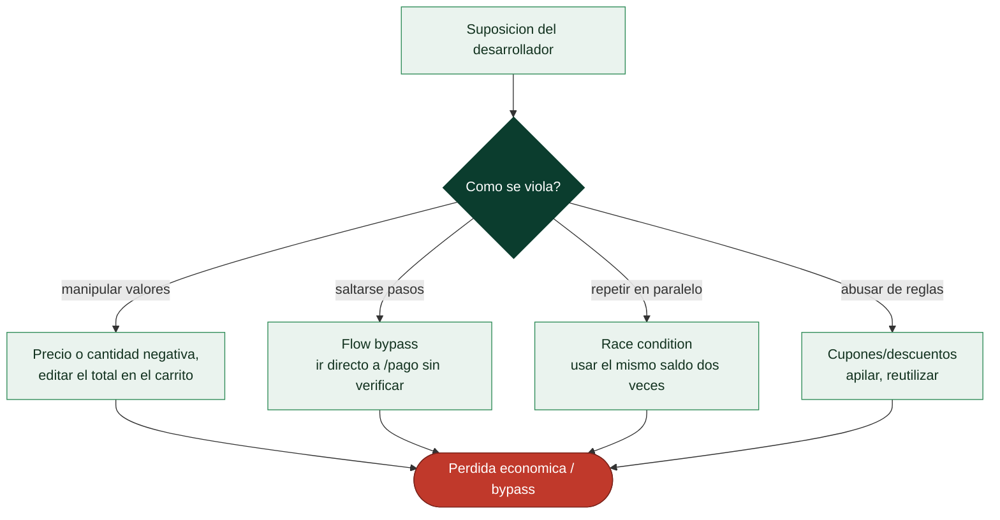

# Clase 109 — Vulnerabilidades de lógica de negocio

> Parte: **4 — Seguridad de aplicaciones web** · Fuente: *Real-World Bug Hunting (Yaworski)* / *PortSwigger*
> ⏱️ Duración estimada: **100 min** · Nivel: **Avanzado**

---

## 🎯 Objetivo

Descubrir **fallos de lógica de negocio**: vulnerabilidades que no rompen la tecnología sino las reglas de la aplicación (precios negativos, saltarse pasos, abusar de descuentos, condiciones de carrera). No las detectan los escáneres automáticos; requieren entender el flujo y pensar como un adversario creativo.

> ⚠️ **Ética**: solo en labs propios/autorizados. Manipular transacciones reales es fraude.

## 📚 Resultados de aprendizaje

Al finalizar, el alumno podrá:

1. **Modelar** el flujo de negocio para encontrar suposiciones frágiles.
2. **Explotar** fallos de validación de precios, cantidades y estados.
3. **Saltar** pasos de un flujo multi-etapa (flow bypass).
4. **Detectar** y explotar condiciones de carrera (race conditions).
5. **Recomendar** validaciones de negocio del lado servidor.

## 🗺️ Temas

| # | Tema | Por qué importa |
|---|------|-----------------|
| 1 | Qué es una falla de lógica | Categoría distinta de las técnicas |
| 2 | Suposiciones del desarrollador | Donde vive el bug |
| 3 | Manipulación de precios/cantidades | Impacto económico directo |
| 4 | Flow bypass | Saltar validaciones |
| 5 | Race conditions | Estado inconsistente |
| 6 | Abuso de descuentos/cupones | Casos reales frecuentes |
| 7 | Defensa: validar reglas en servidor | Cierre del fallo |

## 🧠 Explicación en profundidad

### El fallo que ningún escáner encuentra

Las vulnerabilidades de **lógica de negocio** son distintas de todas las anteriores: no hay una
inyección, ni un carácter mágico, ni un patrón que un escáner reconozca. El código funciona
**exactamente como se programó**; el problema es que **la lógica programada permite un abuso que el
desarrollador no anticipó**. Por eso son invisibles para las herramientas automáticas (Burp, ZAP, un
escáner de vulnerabilidades no las ve) y solo se encuentran **entendiendo qué hace la aplicación y
razonando cómo romper sus reglas**. Son, en muchos programas de bug bounty, los hallazgos mejor pagados,
precisamente porque exigen inteligencia humana y no se automatizan.

La causa raíz es siempre una **suposición implícita del desarrollador** que el atacante viola: "el
usuario seguirá los pasos en orden", "el precio que llega es el que enviamos", "nadie pedirá una
cantidad negativa", "cada cupón se usa una vez". Cada una de esas suposiciones no verificadas en el
servidor es una vulnerabilidad de lógica.

### Manipular valores y saltarse pasos

Los casos más comunes son concretos y elocuentes. La **manipulación de precios o cantidades**: si el
precio o el total viaja en la petición (un campo oculto, el carrito en el cliente) y el servidor lo
**acepta sin recalcularlo**, el atacante lo cambia —comprar por 0,01 €, o pedir una **cantidad
negativa** que en un cálculo mal hecho **abona** dinero en lugar de cobrarlo—. El **flow bypass**:
saltarse pasos obligatorios de un proceso —ir directo a la URL de "pedido confirmado" sin pasar por el
pago, completar un registro sin verificar el correo, acceder al paso 3 sin haber pasado el control del
paso 2— cuando el servidor asume que se llegó por el camino previsto. El **abuso de descuentos y
cupones**: apilar cupones que deberían ser excluyentes, reutilizar un código de un solo uso, aplicar un
reembolso varias veces.

### Race conditions: la ventana entre comprobar y actuar

Las **condiciones de carrera** (*race conditions*) son una clase especialmente potente de fallo lógico.
Ocurren cuando la aplicación **comprueba** una condición y **actúa** en dos pasos separados, y el
atacante envía **muchas peticiones simultáneas** para colarse en la ventana entre ambos. El ejemplo
canónico: una tarjeta regalo con 50 € de saldo; si se envían diez peticiones de "gastar 50 €"
exactamente a la vez, y cada una comprueba el saldo *antes* de que las otras lo hayan descontado, todas
ven 50 € disponibles y **todas se aprueban** —se gastan 500 € de un saldo de 50—. Lo mismo aplica a
canjear un cupón varias veces, retirar dinero de una cuenta, o superar un límite de "uno por usuario".
La herramienta para provocarlas es enviar peticiones en paralelo con precisión (Turbo Intruder en Burp,
por ejemplo), y su existencia es una razón de peso para las transacciones atómicas y los bloqueos en el
servidor.

### La defensa: no confiar en nada del cliente y validar reglas en el servidor

La remediación de la lógica de negocio no es una librería ni una configuración: es **diseño**. Cada
regla de negocio debe **validarse en el servidor**, y cada valor sensible (precios, saldos, permisos,
estado del flujo) debe ser **autoritativo en el servidor**, nunca tomado del cliente. Los precios se
recalculan del catálogo, no se aceptan de la petición; las cantidades se validan (positivas, dentro de
límites); el estado del flujo se comprueba en cada paso; las operaciones sobre saldos se hacen de forma
**atómica** con bloqueos para cerrar la ventana de las race conditions; y los límites de uso se aplican
transaccionalmente. El **modelado de amenazas** —pensar antes de programar "¿cómo abusaría alguien de
esto?"— es la única defensa preventiva real, y por eso OWASP creó la categoría A04 *Insecure Design*
(clase 087): estos fallos no se parchean, se diseñan para que no existan.

## 📖 Definiciones y características

- **Falla de lógica**: violación de una regla de negocio, no de una tecnología. Característica: invisible para los escáneres.
- **Flow bypass**: completar una operación saltándose pasos o validaciones intermedias. Característica: explota confianza en el orden del flujo.
- **Race condition (TOCTOU)**: dos operaciones concurrentes producen un estado inconsistente. Característica: ventana entre comprobación y uso.
- **Manipulación de parámetros de negocio**: alterar precio, cantidad o estado en la petición. Característica: el servidor debe recalcular, no confiar.
- **Idempotencia**: una operación repetida no cambia el resultado. Característica: su ausencia habilita abusos (doble canje).
- **Límite lógico**: restricción de negocio (máximos, mínimos). Característica: si no se valida en servidor, se evade.

## 📔 Glosario

| Término | Definición concisa |
|---------|--------------------|
| Lógica de negocio | Reglas específicas de la aplicación |
| Fallo de lógica | Abuso permitido por la lógica; el código funciona "bien" |
| Invisible a escáneres | No hay patrón que detectar automáticamente |
| Suposición del desarrollador | Premisa no verificada que el atacante viola |
| Manipulación de precio | Aceptar el precio o total que envía el cliente |
| Cantidad negativa | Valor que un cálculo mal hecho convierte en abono |
| Flow bypass | Saltarse pasos obligatorios de un proceso |
| Abuso de cupones | Apilar o reutilizar descuentos excluyentes |
| Race condition | Explotar la ventana entre comprobar y actuar |
| Peticiones en paralelo | Enviar muchas a la vez para colarse en la ventana |
| Turbo Intruder | Herramienta para lanzar peticiones simultáneas |
| Operación atómica | Comprobar y actuar sin ventana intermedia |
| Valor autoritativo en servidor | Precios y saldos calculados en el servidor |
| Modelado de amenazas | Anticipar el abuso antes de programar; A04 |

## 🧰 Herramientas y preparación

- **PortSwigger labs** de business logic y race conditions.
- **Juice Shop** (varios retos de lógica).
- **Burp** (Repeater, Intruder y el modo de peticiones paralelas para race conditions).

## 🧪 Laboratorio guiado

> ⚠️ Solo en labs propios.

1. Mapea un flujo de compra completo: carrito → checkout → pago → confirmación.
2. Intercepta el checkout y **manipula el precio** o la cantidad (valores negativos, decimales, cero).
3. Prueba un **flow bypass**: envía la petición de confirmación sin completar el pago.
4. Abusa de un cupón: aplícalo varias veces o combínalo indebidamente.
5. Explota una **race condition**: envía peticiones paralelas de canje/retiro con Burp (single-packet attack) para superar un límite.
6. Comprueba límites lógicos: compra más unidades de las permitidas alterando el parámetro.
7. Documenta la regla violada, la petición manipulada y el impacto económico.

## ✍️ Ejercicios

1. Encuentra 3 suposiciones del desarrollador que se puedan romper en Juice Shop.
2. Manipula un precio a un valor negativo y explica el impacto.
3. Diseña un flow bypass saltando un paso de validación.
4. Reproduce una race condition de canje múltiple con peticiones paralelas.
5. Explica por qué recalcular en servidor evita la manipulación de precios.
6. Propón validaciones de negocio para un carrito de compra.

## 📝 Reto verificable

Resuelve un lab de lógica de negocio de PortSwigger (manipulación de precio, flow bypass o race condition) y demuestra el beneficio indebido.
**Criterio de aceptación**: el lab queda resuelto, documentas la regla de negocio vulnerada, la petición manipulada/paralela y la defensa (validación y recálculo en servidor, idempotencia, bloqueos).

## ⚠️ Errores comunes

| Síntoma / mensaje | Causa y cómo arreglar |
|-------------------|------------------------|
| El precio se recalcula | Servidor valida; busca otro parámetro de negocio |
| Flow no se puede saltar | Estados bien controlados; documenta la fortaleza |
| Race condition no reproduce | Envía peticiones más simultáneas (single-packet) |
| Cupón no reutilizable | Idempotencia correcta; prueba combinaciones |
| Escáner no encontró nada | Normal: la lógica requiere análisis manual |

## ❓ Preguntas frecuentes

**❓ ¿Por qué los escáneres no las detectan?**
Porque dependen del significado de negocio, que la herramienta no entiende. Requieren razonamiento humano.

**❓ ¿Qué es una race condition en la práctica?**
Aprovechar la ventana entre "comprobar" y "usar" enviando peticiones simultáneas para, por ejemplo, canjear dos veces un mismo saldo.

**❓ ¿Cómo se defienden?**
Validando y recalculando toda regla en el servidor, usando bloqueos/transacciones e idempotencia en operaciones sensibles.

## 🔗 Referencias

- Yaworski, *Real-World Bug Hunting*.
- PortSwigger Business logic vulnerabilities: <https://portswigger.net/web-security/logic-flaws>
- PortSwigger Race conditions: <https://portswigger.net/web-security/race-conditions>
- OWASP WSTG — Business Logic Testing.

## 📥 Material descargable

- 📄 [Guía en PDF](./clase-109-guia.pdf) — versión imprimible de esta clase.
- 🎞️ [Presentación (PPTX)](./clase-109-presentacion.pptx) — deck para proyectar en clase.

## ⬅️ Clase anterior

[Clase 108 — Vulnerabilidades en carga de archivos](../108-vulnerabilidades-en-carga-de-archivos/README.md)

## ➡️ Siguiente clase

[Clase 110 — Seguridad de APIs REST](../110-seguridad-de-apis-rest/README.md)
