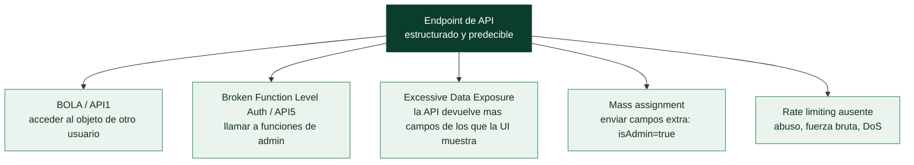

# Clase 110 — Seguridad de APIs REST

> Parte: **4 — Seguridad de aplicaciones web** · Fuente: *OWASP API Security Top 10* / *Bug Bounty Bootcamp (Vickie Li)*
> ⏱️ Duración estimada: **110 min** · Nivel: **Avanzado**

---

## 🎯 Objetivo

Auditar la seguridad de **APIs REST**, hoy el backend de casi toda aplicación moderna. Usaremos el **OWASP API Security Top 10** como marco, con foco en BOLA/IDOR a nivel de API, autorización rota a nivel de función y exposición excesiva de datos.

> ⚠️ **Ética**: solo en APIs propias/autorizadas. Acceder a datos de otros usuarios reales es un delito.

## 📚 Resultados de aprendizaje

Al finalizar, el alumno podrá:

1. **Enumerar** endpoints y métodos de una API REST.
2. **Explotar** BOLA (Broken Object Level Authorization), el IDOR de las APIs.
3. **Detectar** Broken Function Level Authorization (acceso a acciones privilegiadas).
4. **Identificar** exposición excesiva de datos y mass assignment.
5. **Recomendar** autorización por objeto y por función, y filtrado de salida.

## 🗺️ Temas

| # | Tema | Por qué importa |
|---|------|-----------------|
| 1 | OWASP API Security Top 10 | Marco específico de APIs |
| 2 | Enumeración de endpoints | Superficie de la API |
| 3 | BOLA (API1) | La vulnerabilidad de API más común |
| 4 | Broken Function Level Auth (API5) | Escalada vertical |
| 5 | Excessive Data Exposure y mass assignment | Fugas y sobre-escritura |
| 6 | Rate limiting y abuso | Disponibilidad y coste |
| 7 | Defensa: authz granular | Cierre del fallo |

## 🧠 Explicación en profundidad

### Las APIs tienen su propio Top 10, y por buenas razones

Las aplicaciones modernas son en su mayoría un frontend que consume **APIs** (clase 086), y las APIs
tienen un perfil de riesgo tan distinto que OWASP publica un **API Security Top 10** propio. La razón
es estructural: una API expone **directamente la lógica y los datos** en endpoints estructurados y
predecibles, a menudo sin la capa de interfaz que en una web clásica ocultaba parte de la superficie.
Muchos fallos que en una web se mitigaban por accidente (porque el enlace no estaba, porque la página
no lo mostraba) en una API quedan a plena vista para quien sepa hacer la petición. Las dos categorías
que dominan las brechas de API son de **autorización**, y merecen entenderse bien.



### BOLA y BFLA: el IDOR y el forced browsing de las APIs

La categoría **API1: BOLA** (*Broken Object Level Authorization*) es el **IDOR de la clase 105**
elevado a la vulnerabilidad de API más común y más dañina. Una API expone objetos por identificador
—`GET /api/orders/1234`— y si no verifica que el objeto pertenece al usuario que pregunta, cambiar el
número devuelve los datos de otro. En una API es especialmente prevalente porque los identificadores
son parte natural de la ruta y se enumeran con facilidad. La categoría **API5: BFLA** (*Broken Function
Level Authorization*) es el **forced browsing**: llamar a funciones de nivel superior —`DELETE
/api/users/1234`, `POST /api/admin/...`— que la aplicación no debería permitir a un usuario normal, a
menudo simplemente cambiando el **método HTTP** o adivinando el endpoint de administración. Ambas se
deben a lo mismo: la autorización no se comprueba **por objeto y por función en el servidor** en cada
llamada.

### Exposición de datos y mass assignment: los dos lados del mapeo automático

Dos fallos nacen de que las APIs suelen **serializar objetos completos** de forma automática. La
**exposición excesiva de datos** (*excessive data exposure*) ocurre cuando la API devuelve el objeto
entero —con campos que el frontend no muestra pero que van en el JSON: el hash de contraseña, el correo
de otros, flags internos— confiando en que el cliente "solo enseñará lo que debe". Como el atacante ve
la respuesta cruda, obtiene todo. El **mass assignment** (o *auto-binding*) es el reverso: la API
**acepta** un objeto completo y mapea automáticamente sus campos al modelo de datos, de modo que enviar
un campo extra que no estaba en el formulario —`{"nombre": "Ana", "isAdmin": true}` o `"balance":
99999`— puede **modificar propiedades que el usuario no debería controlar**. La defensa es explícita en
ambos casos: definir con precisión qué campos **entran** (allowlist de campos aceptados) y qué campos
**salen** (serializar solo lo necesario), nunca confiar en el mapeo automático.

### Enumeración, rate limiting y la defensa transversal

Las APIs se **enumeran** con ventaja: la documentación (Swagger/OpenAPI), las convenciones de nombres
(`/api/v1/...`, `/api/v2/...` que puede tener endpoints antiguos sin proteger) y el análisis del
JavaScript del cliente (clase 090) revelan endpoints ocultos. La ausencia de **rate limiting** en las
APIs habilita fuerza bruta, scraping masivo de datos y DoS, y es más grave que en la web porque las
APIs están pensadas para consumo programático a alta velocidad. La defensa transversal de toda la clase
es la **autorización granular en el servidor** —comprobar en cada endpoint, para cada objeto y cada
función, que el usuario tiene permiso— más allowlists de campos de entrada y salida, rate limiting real
y no exponer versiones antiguas. La API GraphQL (clase 111) añade sus propios matices, pero el principio
es el mismo: en una API, la seguridad **es** la autorización, porque no hay interfaz que la disimule.

## 📖 Definiciones y características

- **API REST**: interfaz basada en HTTP y recursos con verbos (GET, POST, PUT, DELETE). Característica: cada endpoint necesita autorización propia.
- **BOLA**: acceder a objetos de otros usuarios manipulando su identificador. Característica: el IDOR de las APIs; la nº1 de OWASP API.
- **Broken Function Level Authorization**: usar funciones para las que no se tiene rol. Característica: escalada vertical vía endpoints admin.
- **Excessive Data Exposure**: la API devuelve más campos de los necesarios y el cliente filtra. Característica: fuga de datos sensibles.
- **Mass assignment**: enviar campos extra que el backend asigna sin filtrar (`isAdmin:true`). Característica: sobre-escritura de propiedades.
- **Documentación (Swagger/OpenAPI)**: especificación de la API. Característica: gran fuente de endpoints al auditar.

## 📔 Glosario

| Término | Definición concisa |
|---------|--------------------|
| API REST | Backend que expone datos y lógica en endpoints estructurados |
| API Security Top 10 | Lista OWASP específica de riesgos de API |
| BOLA (API1) | IDOR de las APIs; acceder al objeto de otro usuario |
| BFLA (API5) | Forced browsing; llamar a funciones de nivel superior |
| Enumeración de endpoints | Descubrir rutas por docs, versiones y JS |
| Swagger / OpenAPI | Documentación que revela los endpoints |
| Exposición excesiva de datos | La API devuelve más campos de los que la UI muestra |
| Mass assignment | La API mapea campos extra al modelo (`isAdmin=true`) |
| Auto-binding | Mapeo automático de la petición al objeto |
| Allowlist de campos | Definir qué campos entran y cuáles salen |
| Método HTTP | Cambiarlo puede saltar controles (GET protegido, DELETE no) |
| Versiones antiguas | `/api/v1` puede seguir vivo sin protección |
| Rate limiting | Limitar llamadas; crítico en consumo programático |
| Autorización granular | Comprobar permiso por objeto y función en el servidor |

## 🧰 Herramientas y preparación

- **Postman** o **Burp** para construir peticiones a la API.
- **crAPI** o **VAmPI** (APIs deliberadamente vulnerables) y **Juice Shop**.
- Especificación **OpenAPI/Swagger** si está disponible.

```bash
# crAPI: API vulnerable de OWASP para practicar
git clone https://github.com/OWASP/crAPI && cd crAPI && docker compose up
```

## 🧪 Laboratorio guiado

> ⚠️ Solo en APIs propias/lab.

1. Descubre endpoints desde el Swagger/OpenAPI o analizando el JS del cliente.
2. Autentícate como usuario A y localiza `GET /api/users/{id}/orders`.
3. Cambia `{id}` al de otro usuario y comprueba **BOLA**.
4. Prueba **Broken Function Level Authorization**: llama a un endpoint admin (`/api/admin/...`) con tu token normal.
5. Inspecciona respuestas por **exposición excesiva**: ¿devuelve hashes, emails, roles no necesarios?
6. Prueba **mass assignment**: añade `"role":"admin"` o `"verified":true` en un PUT de perfil.
7. Evalúa el **rate limiting** enviando muchas peticiones y documenta el abuso posible.

## ✍️ Ejercicios

1. Enumera los endpoints de crAPI y agrúpalos por sensibilidad.
2. Explota un BOLA y documenta el dato de otro usuario obtenido.
3. Encuentra un endpoint sin control de función y escálalo.
4. Detecta exposición excesiva comparando lo mostrado en la UI vs. la respuesta cruda.
5. Realiza un mass assignment que eleve privilegios en el lab.
6. Diseña la autorización correcta por objeto y por función.

## 📝 Reto verificable

En crAPI (o VAmPI), consigue **acceso a datos de otro usuario vía BOLA** y una **escalada por mass assignment**, documentando ambos.
**Criterio de aceptación**: entregas las peticiones, la evidencia de acceso no autorizado y elevación de privilegio, y la defensa (comprobar propiedad del objeto, allowlist de campos, authz por función).

## ⚠️ Errores comunes

| Síntoma / mensaje | Causa y cómo arreglar |
|-------------------|------------------------|
| Cambiar el ID da 403 | Hay authz por objeto; busca otro endpoint |
| Endpoint admin devuelve 401 | Requiere rol; prueba mass assignment para obtenerlo |
| Mass assignment ignorado | El backend filtra campos; documenta la fortaleza |
| No encuentro endpoints | Revisa Swagger y el JS del cliente |
| Rate limit corta las pruebas | Baja el ritmo; documenta el límite |

## ❓ Preguntas frecuentes

**❓ ¿BOLA e IDOR son lo mismo?**
Conceptualmente sí; BOLA es el término de OWASP API para el IDOR a nivel de objeto en APIs.

**❓ ¿Por qué la exposición excesiva es un problema si la UI no lo muestra?**
Porque el dato viaja al cliente y cualquiera puede leer la respuesta cruda; el filtrado en el cliente no protege nada.

**❓ ¿Cómo evito mass assignment?**
Usa allowlists de campos aceptados (DTOs), nunca vincules el body directamente al modelo de datos.

## 🔗 Referencias

- OWASP API Security Top 10: <https://owasp.org/API-Security/>
- Li, *Bug Bounty Bootcamp*, sección de APIs.
- crAPI: <https://github.com/OWASP/crAPI>
- OWASP WSTG — API Testing.

## 📥 Material descargable

- 📄 [Guía en PDF](./clase-110-guia.pdf) — versión imprimible de esta clase.
- 🎞️ [Presentación (PPTX)](./clase-110-presentacion.pptx) — deck para proyectar en clase.

## ⬅️ Clase anterior

[Clase 109 — Vulnerabilidades de lógica de negocio](../109-vulnerabilidades-de-logica-de-negocio/README.md)

## ➡️ Siguiente clase

[Clase 111 — Seguridad de APIs GraphQL](../111-seguridad-de-apis-graphql/README.md)
