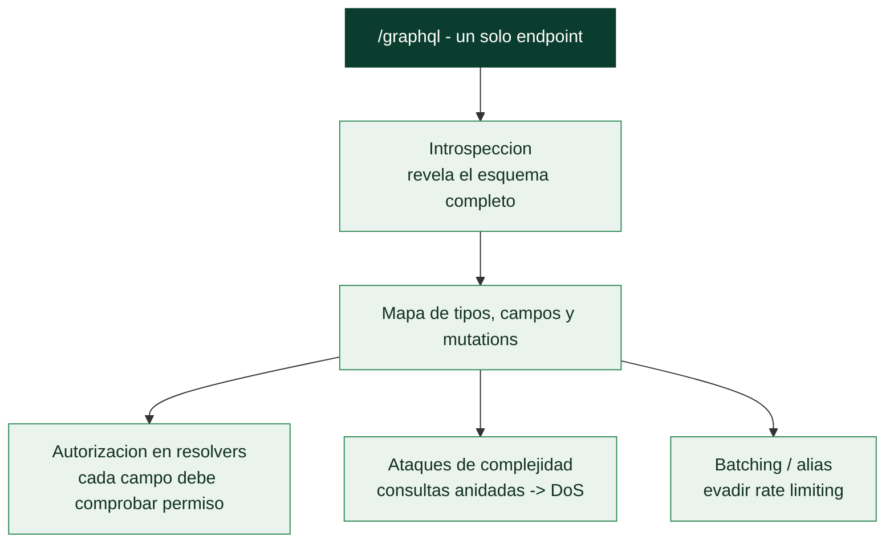

# Clase 111 — Seguridad de APIs GraphQL

> Parte: **4 — Seguridad de aplicaciones web** · Fuente: *PortSwigger Research* / *OWASP*
> ⏱️ Duración estimada: **100 min** · Nivel: **Avanzado**

---

## 🎯 Objetivo

Auditar la seguridad de **APIs GraphQL**, cada vez más comunes. GraphQL cambia el modelo (un único endpoint, consultas flexibles) e introduce riesgos propios: introspección, over-fetching, ataques de complejidad (DoS), y los mismos problemas de autorización que REST, a menudo peor gestionados.

> ⚠️ **Ética**: solo en APIs propias/autorizadas.

## 📚 Resultados de aprendizaje

Al finalizar, el alumno podrá:

1. **Explorar** el esquema con introspección y herramientas de GraphQL.
2. **Detectar** fallos de autorización (IDOR/BOLA) en queries y mutations.
3. **Explotar** over-fetching y batching para eludir límites.
4. **Provocar** DoS por consultas anidadas/complejas.
5. **Recomendar** desactivar introspección en prod y limitar complejidad.

## 🗺️ Temas

| # | Tema | Por qué importa |
|---|------|-----------------|
| 1 | Modelo GraphQL | Cambia la superficie |
| 2 | Introspección del esquema | Mapa completo de la API |
| 3 | Queries vs. mutations | Lectura y escritura |
| 4 | Autorización en resolvers | Donde suele fallar |
| 5 | Batching y alias | Bypass de rate limit |
| 6 | Ataques de complejidad (DoS) | Disponibilidad |
| 7 | Defensa: límites y authz | Cierre del fallo |

## 🧠 Explicación en profundidad

### Un solo endpoint, un lenguaje de consulta y una superficie distinta

**GraphQL** cambia el modelo de las APIs REST: en lugar de muchos endpoints fijos, hay **un solo
endpoint** (`/graphql`) al que el cliente envía **consultas** que especifican exactamente qué datos
quiere, con qué campos y qué relaciones. Esa flexibilidad —pedir en una consulta lo que en REST serían
varias llamadas— es su virtud y también su superficie de ataque particular. Muchas defensas
mentales de REST no aplican: no hay "endpoints ocultos" que enumerar (el esquema los expone todos),
pero aparecen problemas nuevos —la autorización dispersa en cada resolver, los ataques de complejidad,
la introspección que regala el mapa completo—. Distinguir **queries** (leen datos) de **mutations**
(los modifican) es el primer paso: las mutations son las que cambian estado y las que más importa
proteger.

### La introspección: el esquema te entrega el mapa

La característica más relevante para el pentesting es la **introspección**: GraphQL permite consultar
su **propio esquema** —todos los tipos, campos, argumentos y mutations disponibles— con una consulta
especial. Es una funcionalidad de desarrollo pensada para herramientas como GraphiQL, pero si está
habilitada en producción, entrega al atacante el **mapa completo de la API** sin esfuerzo: qué datos
existen, qué operaciones se pueden hacer, qué campos hay incluso en tipos que la interfaz nunca usa.
Herramientas como GraphQL Voyager o InQL reconstruyen el esquema entero a partir de la introspección.
La primera comprobación de un pentest GraphQL es si la introspección está abierta —y la primera
recomendación defensiva, casi siempre, desactivarla en producción—.



### El error de fondo: creer que un endpoint es un punto de control

La trampa conceptual de GraphQL es asumir que, por haber un solo endpoint, basta con proteger ese
endpoint. Falso: la autorización en GraphQL debe vivir en **cada resolver** —la función que resuelve
cada campo—. Una consulta puede navegar relaciones (`usuario { pedidos { direccion } }`), y cada salto
debe comprobar que el usuario tiene permiso sobre **ese** dato. Es el **BOLA de la clase 110** trasladado
a GraphQL, y es más fácil de pasar por alto porque la autorización queda dispersa por decenas de
resolvers en vez de en un puñado de endpoints. Un campo sensible sin comprobación en su resolver es una
fuga, aunque el endpoint esté "autenticado".

### Complejidad, batching y la defensa

Dos ataques nacen de la flexibilidad del lenguaje. Los **ataques de complejidad / profundidad**: como
el cliente compone la consulta, puede pedir estructuras profundamente **anidadas o recursivas**
(`amigos { amigos { amigos { ... } } }`) que obligan al servidor a resolver un número explosivo de
operaciones, provocando un **DoS** con una sola petición. La defensa es limitar la profundidad, la
complejidad y el número de nodos de las consultas, y aplicar timeouts. El **batching y los alias**: una
sola petición GraphQL puede contener **muchas operaciones** usando alias (`a: login(...) b: login(...)
...`), lo que permite **evadir el rate limiting** que cuenta peticiones HTTP —mil intentos de login en
una sola petición— y acelerar fuerza bruta o enumeración. La defensa exige limitar operaciones por
petición y aplicar el rate limiting a nivel de operación, no de petición HTTP.

La defensa transversal de GraphQL se resume así: **desactivar la introspección** (y GraphiQL) en
producción, comprobar **autorización en cada resolver** por objeto y por campo, **limitar complejidad,
profundidad y batching** para frenar el DoS y la evasión de límites, y no exponer más campos de los
necesarios. Como en REST, la seguridad de GraphQL es, en su núcleo, **autorización granular**; solo
que la flexibilidad del lenguaje añade la complejidad y el batching como vectores propios que un
pentester debe probar siempre.

## 📖 Definiciones y características

- **GraphQL**: lenguaje de consulta con un único endpoint donde el cliente define qué datos quiere. Característica: flexibilidad que amplía la superficie.
- **Introspección**: capacidad de consultar el propio esquema. Característica: revela todos los tipos y campos; peligrosa en producción.
- **Resolver**: función que resuelve un campo. Característica: si no valida authz, hay IDOR/BOLA.
- **Batching**: enviar múltiples operaciones en una petición. Característica: puede eludir rate limiting (p. ej. fuerza bruta).
- **Alias**: renombrar campos para repetir una consulta muchas veces. Característica: amplifica ataques en una sola petición.
- **Ataque de complejidad**: consulta profundamente anidada que agota recursos. Característica: DoS sin gran volumen de peticiones.

## 📔 Glosario

| Término | Definición concisa |
|---------|--------------------|
| GraphQL | API de un solo endpoint con lenguaje de consulta |
| Query | Operación que lee datos |
| Mutation | Operación que modifica datos |
| Resolver | Función que resuelve cada campo de una consulta |
| Introspección | Consultar el propio esquema de la API |
| Esquema | Todos los tipos, campos y operaciones disponibles |
| GraphiQL / InQL | Herramientas que reconstruyen el esquema |
| Autorización por resolver | Comprobar el permiso en cada campo, no solo el endpoint |
| BOLA en GraphQL | Acceder a datos de otro navegando relaciones |
| Ataque de complejidad | Consultas anidadas o recursivas que provocan DoS |
| Límite de profundidad | Restringir cuán anidada puede ser una consulta |
| Batching | Muchas operaciones en una sola petición |
| Alias | Repetir operaciones con nombres distintos para evadir límites |
| Rate limiting por operación | Contar operaciones, no peticiones HTTP |

## 🧰 Herramientas y preparación

- **GraphiQL/Altair** o **Burp** con extensiones **InQL**.
- **DVGA (Damn Vulnerable GraphQL Application)** como lab.
- **clairvoyance** para reconstruir esquema si la introspección está deshabilitada.

```bash
git clone https://github.com/dolevf/Damn-Vulnerable-GraphQL-Application
docker run -t -p 5013:5013 dolevf/dvga
```

## 🧪 Laboratorio guiado

> ⚠️ Solo en labs propios.

1. Localiza el endpoint GraphQL (`/graphql`, `/api/graphql`) y prueba la **introspección**:

```graphql
{ __schema { types { name fields { name } } } }
```

2. Con InQL, genera el mapa de queries y mutations disponibles.
3. Prueba **IDOR/BOLA**: consulta un objeto por ID que no es tuyo (`user(id: 2){ email }`).
4. Ejecuta una **mutation** sensible sin el rol adecuado (autorización rota).
5. Usa **alias/batching** para repetir un login muchas veces en una sola petición (fuerza bruta sin rate limit).
6. Lanza una **consulta profundamente anidada** para evaluar el riesgo de DoS por complejidad.
7. Documenta introspección, authz rota y el vector de DoS.

## ✍️ Ejercicios

1. Reconstruye el esquema de DVGA con introspección y con clairvoyance (deshabilitada).
2. Explota un IDOR en una query y otro en una mutation.
3. Usa alias para hacer fuerza bruta en una petición.
4. Diseña una consulta anidada que dispare un ataque de complejidad.
5. Explica por qué desactivar introspección en prod reduce (pero no elimina) el riesgo.
6. Propón límites de profundidad/complejidad y authz por resolver.

## 📝 Reto verificable

En DVGA, obtén el **esquema por introspección**, explota una **autorización rota** (query o mutation) y demuestra un **bypass de rate limit** con batching/alias.
**Criterio de aceptación**: entregas el esquema, la operación no autorizada con su evidencia y el batching que elude el límite, más la defensa (introspección off, authz por resolver, límites de complejidad).

## ⚠️ Errores comunes

| Síntoma / mensaje | Causa y cómo arreglar |
|-------------------|------------------------|
| Introspección deshabilitada | Usa clairvoyance para inferir el esquema |
| Query da error de tipo | Sintaxis GraphQL; ajusta campos/argumentos |
| Mutation rechazada | Requiere rol; busca otra vía o documenta fortaleza |
| Batching ignorado | El servidor no soporta batch; usa alias |
| DoS no reproducible | Hay límite de profundidad; documenta la defensa |

## ❓ Preguntas frecuentes

**❓ ¿GraphQL es más inseguro que REST?**
No inherentemente, pero su flexibilidad y la introspección amplían la superficie y a menudo la autorización está peor implementada.

**❓ ¿Basta con desactivar la introspección?**
Ayuda, pero un atacante puede inferir el esquema (clairvoyance). La defensa real es authz por resolver y límites de complejidad.

**❓ ¿Por qué el batching es peligroso?**
Permite empaquetar muchas operaciones en una petición, eludiendo rate limits diseñados para contar peticiones, no operaciones.

## 🔗 Referencias

- PortSwigger GraphQL API vulnerabilities: <https://portswigger.net/web-security/graphql>
- OWASP GraphQL Cheat Sheet.
- DVGA: <https://github.com/dolevf/Damn-Vulnerable-GraphQL-Application>
- InQL: <https://github.com/doyensec/inql>

## 📥 Material descargable

- 📄 [Guía en PDF](./clase-111-guia.pdf) — versión imprimible de esta clase.
- 🎞️ [Presentación (PPTX)](./clase-111-presentacion.pptx) — deck para proyectar en clase.

## ⬅️ Clase anterior

[Clase 110 — Seguridad de APIs REST](../110-seguridad-de-apis-rest/README.md)

## ➡️ Siguiente clase

[Clase 112 — Web cache poisoning y HTTP request smuggling](../112-web-cache-poisoning-y-http-request-smuggling/README.md)
