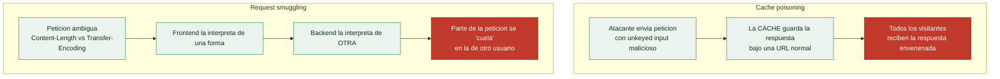

# Clase 112 — Web cache poisoning y HTTP request smuggling

> Parte: **4 — Seguridad de aplicaciones web** · Fuente: *PortSwigger Research (James Kettle)*
> ⏱️ Duración estimada: **130 min** · Nivel: **Experto**

---

## 🎯 Objetivo

Explotar dos ataques avanzados a nivel de protocolo e infraestructura: el **web cache poisoning**, que envenena respuestas cacheadas para afectar a muchos usuarios, y el **HTTP request smuggling**, que abusa de discrepancias entre servidores frontend y backend al interpretar los límites de una petición. Son técnicas de alto nivel, muy premiadas en bug bounty.

> ⚠️ **Ética**: solo en labs propios/autorizados (PortSwigger). Estos ataques afectan a infraestructura compartida; nunca los pruebes en producción ajena.

## 📚 Resultados de aprendizaje

Al finalizar, el alumno podrá:

1. **Explicar** cómo las caches web y las cadenas de proxies procesan peticiones.
2. **Envenenar** una cache mediante cabeceras no incluidas en la clave.
3. **Distinguir** desincronización CL.TE, TE.CL y TE.TE.
4. **Explotar** request smuggling para envenenar respuestas y secuestrar peticiones.
5. **Recomendar** normalización y HTTP/2 end-to-end como defensa.

## 🗺️ Temas

| # | Tema | Por qué importa |
|---|------|-----------------|
| 1 | Caches web y cache keys | Base del poisoning |
| 2 | Unkeyed inputs | Vector del envenenamiento |
| 3 | Cadena frontend/backend | Base del smuggling |
| 4 | CL.TE, TE.CL, TE.TE | Tipos de desincronización |
| 5 | Impacto: hijack y bypass | Traducir a daño real |
| 6 | HTTP/2 downgrade | Superficie moderna |
| 7 | Defensa: normalizar, rechazar ambiguo | Cierre del fallo |

## 🧠 Explicación en profundidad

### Dos ataques que explotan la brecha entre máquinas que interpretan lo mismo distinto

Esta clase reúne dos vulnerabilidades avanzadas que comparten una idea profunda: en una cadena de
servidores (CDN, proxy, balanceador, backend), **distintas máquinas pueden interpretar la misma
petición HTTP de forma diferente**, y esa discrepancia es explotable. Son ataques sofisticados,
popularizados por la investigación de James Kettle (PortSwigger), y entenderlos requiere pensar en la
**cadena** de la clase 086, no en un servidor aislado.

### Web cache poisoning: envenenar lo que otros recibirán

Una **caché** guarda una respuesta y la sirve a muchos usuarios para acelerar. Decide qué respuesta
corresponde a qué petición mediante una **clave de caché**, normalmente la URL y algunas cabeceras. El
**web cache poisoning** explota que la respuesta puede depender de una entrada que **no forma parte de
la clave** —un **unkeyed input**, como cierta cabecera—: si el atacante logra que una respuesta
maliciosa (con un XSS, una redirección) se **almacene** en la caché asociada a una URL normal, esa
respuesta envenenada se sirve **a todos los usuarios** que pidan esa URL después. El impacto de un XSS
reflejado, que normalmente requiere engañar a cada víctima, se **masifica**: la caché lo entrega a
todo el mundo. La clave del ataque es encontrar un input que influya en la respuesta pero no en la
clave de caché, y la defensa es incluir en la clave todo lo que afecte a la respuesta —o no cachear lo
que dependa de cabeceras variables—.

### HTTP request smuggling: colar una petición dentro de otra

El **request smuggling** explota el desacuerdo entre el **servidor frontend** (proxy/CDN) y el
**backend** sobre **dónde termina una petición y empieza la siguiente** cuando reutilizan una misma
conexión TCP. HTTP tiene dos formas de indicar la longitud del cuerpo: la cabecera **`Content-Length`**
(CL, dice cuántos bytes) y **`Transfer-Encoding: chunked`** (TE, marca el fin con un chunk vacío). Si
una petición incluye **ambas** de forma contradictoria, y el frontend hace caso a una mientras el
backend hace caso a la otra, parte de lo que el atacante envió queda "colgando" y el backend lo
**antepone a la siguiente petición** —la de otro usuario—. De ahí las variantes **CL.TE**, **TE.CL** y
**TE.TE**, según qué servidor prioriza qué cabecera. El impacto es grave: **secuestrar la petición de
otro usuario** (robando sus credenciales o su respuesta), **saltarse controles** del frontend (un WAF
que ya validó "la petición") o envenenar la caché. El auge de **HTTP/2** añadió el *downgrade*: la
traducción de HTTP/2 a HTTP/1.1 en el frontend reintroduce ambigüedades que se creían resueltas.

### Por qué son difíciles y cómo se defienden

Estos ataques son avanzados porque dependen de la **combinación concreta** de servidores y de detalles
de su implementación, no de un fallo en el código de la aplicación —una app "perfecta" es vulnerable
si su cadena de proxies lo es—. Encontrarlos requiere probar peticiones ambiguas y medir tiempos y
respuestas anómalas (Burp tiene herramientas específicas). La defensa vive en la **infraestructura**:
para el smuggling, **normalizar las peticiones** en el frontend, **rechazar las ambiguas** (las que
llevan CL y TE a la vez), usar HTTP/2 de extremo a extremo sin downgrade, y asegurar que frontend y
backend interpretan las cabeceras igual. Para el cache poisoning, **incluir en la clave de caché** todo
input que afecte a la respuesta y no cachear contenido dependiente de cabeceras no fiables. El mensaje
de la clase: la seguridad no es solo del código, sino de **cómo encajan las piezas** de la arquitectura,
y las discrepancias entre ellas son una clase entera de vulnerabilidad.

## 📖 Definiciones y características

- **Web cache poisoning**: inyectar contenido en una respuesta cacheada que se sirve a otros usuarios. Característica: amplifica un input a muchas víctimas.
- **Cache key**: conjunto de campos que identifican una respuesta en cache. Característica: los inputs no incluidos (unkeyed) son el vector.
- **HTTP request smuggling**: aprovechar que frontend y backend delimitan las peticiones de forma distinta. Característica: "contrabandea" una petición dentro de otra.
- **CL.TE / TE.CL**: discrepancia entre `Content-Length` y `Transfer-Encoding`. Característica: cada extremo usa una cabecera distinta.
- **TE.TE**: ambos usan `Transfer-Encoding` pero uno se ofusca. Característica: se evade con obfuscación del header.
- **Response queue poisoning**: desalinear respuestas para servir la de otro usuario. Característica: impacto grave del smuggling.

## 📔 Glosario

| Término | Definición concisa |
|---------|--------------------|
| Caché web | Guarda respuestas y las sirve a muchos usuarios |
| Clave de caché | URL y cabeceras que identifican qué respuesta corresponde |
| Unkeyed input | Entrada que afecta a la respuesta pero no a la clave |
| Cache poisoning | Almacenar una respuesta maliciosa que se sirve a todos |
| Request smuggling | Colar parte de una petición en la de otro usuario |
| Content-Length (CL) | Cabecera que indica la longitud del cuerpo en bytes |
| Transfer-Encoding (TE) | Cuerpo por chunks; termina con un chunk vacío |
| CL.TE / TE.CL / TE.TE | Variantes según qué servidor prioriza qué cabecera |
| Frontend vs backend | Proxy/CDN y servidor de aplicación que interpretan distinto |
| Reutilización de conexión | Varias peticiones sobre la misma conexión TCP |
| HTTP/2 downgrade | Traducir HTTP/2 a HTTP/1.1 reintroduce ambigüedades |
| Secuestro de petición | Robar la petición o respuesta de otro usuario |
| Normalizar peticiones | Defensa: rechazar peticiones ambiguas en el frontend |
| Seguridad de la cadena | El riesgo nace de cómo encajan los componentes |

## 🧰 Herramientas y preparación

- **PortSwigger labs** de request smuggling y cache poisoning.
- **Burp** con la extensión **HTTP Request Smuggler** y **Param Miner**.
- Comprensión de HTTP/1.1 y HTTP/2.

## 🧪 Laboratorio guiado

> ⚠️ Solo en labs propios/autorizados.

1. **Cache poisoning**: usa Param Miner para descubrir cabeceras no incluidas en la clave (unkeyed).
2. Inyecta un valor malicioso en esa cabecera y comprueba si se refleja y se **cachea**.
3. Verifica el envenenamiento accediendo a la URL sin la cabecera (recibes el contenido inyectado).
4. **Request smuggling**: con HTTP Request Smuggler, detecta la desincronización (CL.TE/TE.CL).
5. Construye manualmente una petición con `Content-Length` y `Transfer-Encoding` conflictivos para "contrabandear" una segunda petición.
6. Demuestra el impacto: captura la petición de otro usuario o envenena la cola de respuestas en el lab.
7. Documenta el tipo de desincronización, el payload y el impacto.

## ✍️ Ejercicios

1. Explica con un diagrama cómo la cache key deja fuera ciertos inputs.
2. Envenena una cache vía cabecera unkeyed en un lab.
3. Diferencia CL.TE, TE.CL y TE.TE con ejemplos de peticiones.
4. Construye a mano una petición de smuggling CL.TE.
5. Explica cómo HTTP/2 end-to-end mitiga el smuggling clásico.
6. Propón defensas: normalización en el frontend y rechazo de peticiones ambiguas.

## 📝 Reto verificable

Resuelve un lab de **HTTP request smuggling** de PortSwigger (CL.TE o TE.CL) y un lab de **cache poisoning**, demostrando impacto en ambos.
**Criterio de aceptación**: ambos labs quedan resueltos, entregas las peticiones exactas (cabeceras conflictivas / input unkeyed), la evidencia del impacto y la defensa correspondiente.

## ⚠️ Errores comunes

| Síntoma / mensaje | Causa y cómo arreglar |
|-------------------|------------------------|
| El input no se cachea | Está en la clave o hay `Cache-Control: no-store`; busca otro header |
| Smuggling no desincroniza | Ambos usan la misma cabecera; prueba TE.TE con obfuscación |
| El lab usa HTTP/2 | El vector clásico cambia; usa técnicas de downgrade/H2 |
| Respuestas inconsistentes | Timing sensible; repite y ajusta |
| Param Miner sin hallazgos | Amplía el diccionario de cabeceras |

## ❓ Preguntas frecuentes

**❓ ¿Por qué el smuggling es tan potente?**
Porque puede secuestrar peticiones de otros usuarios, saltar controles del frontend y envenenar respuestas a escala.

**❓ ¿HTTP/2 elimina el smuggling?**
El clásico de HTTP/1.1 sí se mitiga con HTTP/2 end-to-end, pero aparecen variantes (H2.CL, downgrade) si hay traducción a HTTP/1.1.

**❓ ¿Qué hace peligroso al cache poisoning?**
Que un solo input malicioso, una vez cacheado, se sirve a todos los usuarios que piden esa URL.

## 🔗 Referencias

- PortSwigger — HTTP request smuggling: <https://portswigger.net/web-security/request-smuggling>
- PortSwigger — Web cache poisoning: <https://portswigger.net/web-security/web-cache-poisoning>
- James Kettle, investigaciones de PortSwigger Research.
- RFC 7230 (HTTP/1.1 message syntax).

## 📥 Material descargable

- 📄 [Guía en PDF](./clase-112-guia.pdf) — versión imprimible de esta clase.
- 🎞️ [Presentación (PPTX)](./clase-112-presentacion.pptx) — deck para proyectar en clase.

## ⬅️ Clase anterior

[Clase 111 — Seguridad de APIs GraphQL](../111-seguridad-de-apis-graphql/README.md)

## ➡️ Siguiente clase

[Clase 113 — Ataques del lado del cliente: CORS, postMessage y prototype pollution](../113-ataques-del-lado-del-cliente-cors-postmessage-y-prototype-pollution/README.md)
