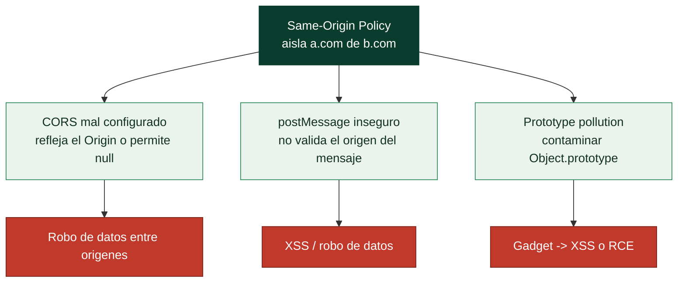

# Clase 113 — Ataques del lado del cliente: CORS, postMessage y prototype pollution

> Parte: **4 — Seguridad de aplicaciones web** · Fuente: *PortSwigger Research* / *Real-World Bug Hunting (Yaworski)*
> ⏱️ Duración estimada: **120 min** · Nivel: **Experto**

---

## 🎯 Objetivo

Explotar tres clases de ataques **del lado del cliente** propias de las aplicaciones JavaScript modernas: configuraciones **CORS** inseguras que exponen datos, uso inseguro de **postMessage** entre ventanas/iframes, y **prototype pollution** en JavaScript que puede escalar a XSS o RCE (en Node). Son vectores de moda en el bug bounty actual.

> ⚠️ **Ética**: solo en labs propios/autorizados.

## 📚 Resultados de aprendizaje

Al finalizar, el alumno podrá:

1. **Auditar** políticas CORS y explotar reflejo del `Origin` con credenciales.
2. **Detectar** manejadores `postMessage` sin validación de origen.
3. **Explotar** prototype pollution en cliente y (conceptualmente) en Node.
4. **Encadenar** prototype pollution hacia un "gadget" que produce XSS.
5. **Recomendar** allowlists de origen, validación de mensajes y `Object.freeze`.

## 🗺️ Temas

| # | Tema | Por qué importa |
|---|------|-----------------|
| 1 | Modelo de origen (SOP) y CORS | Base de la seguridad cliente |
| 2 | Configuraciones CORS inseguras | Fuga de datos con credenciales |
| 3 | postMessage inseguro | Comunicación entre ventanas |
| 4 | Prototype pollution: concepto | Contaminar `Object.prototype` |
| 5 | Gadgets y escalada a XSS/RCE | Impacto real |
| 6 | Herramientas (DOM Invader) | Detección práctica |
| 7 | Defensas por vector | Cierre del fallo |

## 🧠 Explicación en profundidad

### La política del mismo origen, y las tres formas de eludirla

El navegador aísla los sitios entre sí con la **política del mismo origen** (SOP): el JavaScript de
`a.com` no puede leer datos de `b.com`. Es la barrera fundamental de la seguridad web del lado del
cliente, y esta clase reúne tres formas de **relajarla mal** o **rodearla**: CORS mal configurado,
`postMessage` inseguro y prototype pollution. Los tres comparten que el fallo está en el **cliente**
—en cómo el JavaScript de la aplicación maneja la comunicación entre orígenes o su propio estado— y que
su impacto va del robo de datos al XSS o incluso al RCE.

### CORS mal configurado: relajar la SOP demasiado

**CORS** (*Cross-Origin Resource Sharing*) es el mecanismo que permite, de forma controlada, que un
origen acceda a recursos de otro —necesario para que una SPA en `app.com` consuma una API en
`api.com`—. El problema aparece cuando se configura de forma **demasiado permisiva**. El fallo clásico:
el servidor **refleja** el valor de la cabecera `Origin` de la petición en la respuesta
`Access-Control-Allow-Origin` **junto con** `Access-Control-Allow-Credentials: true`. Eso significa
"cualquier origen puede leer mi respuesta **con las cookies del usuario**", lo que permite a un sitio
malicioso hacer peticiones autenticadas a la API de la víctima y **leer los datos**. Otro fallo es
confiar en el origen `null` (que ciertos contextos envían) o usar comodines mal. La regla: un
**allowlist estricto** de orígenes permitidos, y nunca reflejar el `Origin` con credenciales activadas.

### postMessage inseguro y prototype pollution

`postMessage` es la API que permite a dos ventanas o iframes de **distinto origen** comunicarse de
forma legítima. Es segura **si se usa bien**, y peligrosa si no: el receptor debe **verificar el
origen** del mensaje (`event.origin`) antes de confiar en él, y no pasar su contenido a un **sink**
peligroso (`innerHTML`, `eval`). Un receptor que acepta mensajes de cualquier origen y los inserta en
la página es un **DOM XSS** (clase 097) a través de `postMessage`. El **prototype pollution** es el más
sutil y propio de JavaScript: como los objetos JS heredan de `Object.prototype`, si el atacante logra
que la aplicación escriba en `__proto__` (por ejemplo, fusionando sin sanear un JSON que contiene
`{"__proto__": {"isAdmin": true}}`), **contamina el prototipo del que heredan todos los objetos**. Por
sí solo puede no hacer nada, pero combinado con un **gadget** —código de la aplicación que lee esa
propiedad contaminada— escala a bypass de autorización, XSS o, en Node.js, incluso RCE. Es análogo a la
gadget chain de la deserialización (clase 106), trasladado al prototipo de JavaScript.

### Herramientas y defensa por vector

Estos ataques del lado del cliente se cazan leyendo el JavaScript y probando la comunicación entre
orígenes; **DOM Invader** (integrado en el navegador de Burp) automatiza el rastreo de sources, sinks y
gadgets de postMessage y prototype pollution. Las defensas son específicas de cada vector y no hay una
sola: para **CORS**, allowlist estricto de orígenes y no reflejar `Origin` con credenciales; para
**postMessage**, validar siempre `event.origin` y no llevar el contenido a sinks peligrosos; para
**prototype pollution**, sanear las claves al fusionar objetos (rechazar `__proto__`, `constructor`,
`prototype`), usar `Object.create(null)` o `Map` para datos sin prototipo, y `Object.freeze` sobre el
prototipo. La lección conjunta es que el navegador es un entorno hostil donde el estado y la
comunicación entre orígenes se manejan con cuidado: la SOP protege mucho, pero cada mecanismo que la
relaja —por necesidad legítima— es una superficie que hay que configurar con precisión.

## 📖 Definiciones y características

- **SOP (Same-Origin Policy)**: política que aísla orígenes distintos. Característica: CORS la relaja de forma controlada.
- **CORS inseguro**: reflejar el `Origin` o permitir `null` con `Access-Control-Allow-Credentials: true`. Característica: permite leer datos autenticados cross-origin.
- **postMessage**: API para comunicar ventanas/iframes. Característica: insegura si no se valida `event.origin` ni los datos.
- **Prototype pollution**: inyectar propiedades en `Object.prototype` vía claves como `__proto__`. Característica: afecta a todos los objetos.
- **Gadget**: código que lee una propiedad contaminable y la usa peligrosamente. Característica: convierte la contaminación en XSS/RCE.
- **Source/sink en cliente**: origen del dato y punto de uso. Característica: base para rastrear estos ataques.

## 📔 Glosario

| Término | Definición concisa |
|---------|--------------------|
| Same-Origin Policy (SOP) | Aísla el JS de un origen de los datos de otro |
| CORS | Mecanismo que relaja la SOP de forma controlada |
| Access-Control-Allow-Origin | Cabecera que dice qué orígenes pueden leer la respuesta |
| Reflejar el Origin | Fallo: devolver el Origin recibido con credenciales |
| Allow-Credentials | Permite enviar cookies en la petición cross-origin |
| Origen null | Valor que ciertos contextos envían; peligroso confiarlo |
| postMessage | API de comunicación entre ventanas de distinto origen |
| event.origin | Origen del mensaje; hay que validarlo siempre |
| Prototype pollution | Contaminar `Object.prototype` desde el que heredan todos |
| `__proto__` | Propiedad cuya escritura provoca la contaminación |
| Gadget | Código que lee la propiedad contaminada y escala el ataque |
| DOM Invader | Herramienta de Burp para sources, sinks y gadgets |
| Object.create(null) | Objeto sin prototipo; mitiga la pollution |
| Defensa por vector | Cada mecanismo se protege de forma específica |

## 🧰 Herramientas y preparación

- **PortSwigger labs** de CORS, DOM-based y prototype pollution.
- **Burp** con **DOM Invader** (detecta postMessage y prototype pollution).
- Un servidor propio para alojar la página de exploit cross-origin.

## 🧪 Laboratorio guiado

> ⚠️ Solo en labs propios.

1. **CORS**: envía una petición con `Origin: https://evil.com` y observa si se refleja en `Access-Control-Allow-Origin` junto a `Allow-Credentials: true`.
2. Aloja un exploit que use `fetch` con `credentials: 'include'` para leer datos sensibles cross-origin.
3. Prueba también el origen `null` (iframe sandbox) si el servidor lo acepta.
4. **postMessage**: con DOM Invader, localiza un handler que use `event.data` sin validar `event.origin`.
5. Envía un mensaje desde tu página para inyectar en un sink (p. ej. `innerHTML`) y lograr XSS.
6. **Prototype pollution**: identifica un source (parámetro JSON/URL) que permita `__proto__[x]=y` y un gadget que lo consuma.
7. Encadena la contaminación hasta ejecutar JavaScript en el lab. Documenta cada vector.

## ✍️ Ejercicios

1. Explota un CORS que refleja el Origin y roba datos autenticados en el lab.
2. Encuentra un postMessage sin validación de origen y explótalo.
3. Contamina `Object.prototype` desde un parámetro y comprueba el efecto global.
4. Localiza un gadget que convierta la contaminación en XSS.
5. Explica el riesgo de prototype pollution en Node (RCE) frente al cliente (XSS).
6. Propón defensas: allowlist de orígenes, validar `event.origin`, `Object.freeze(Object.prototype)`.

## 📝 Reto verificable

Resuelve un lab de **CORS** que permita exfiltrar datos autenticados y un lab de **prototype pollution** que escale a XSS, documentando ambos.
**Criterio de aceptación**: ambos labs quedan resueltos, entregas el exploit CORS (con `credentials`), el source→gadget de la contaminación y las defensas concretas por vector.

## ⚠️ Errores comunes

| Síntoma / mensaje | Causa y cómo arreglar |
|-------------------|------------------------|
| CORS no refleja Origin | Allowlist estricta; no explotable por reflejo |
| `Allow-Credentials` ausente | Sin credenciales no hay fuga de datos privados |
| postMessage valida origen | Handler seguro; documenta la fortaleza |
| `__proto__` filtrado | La app sanea claves; prueba `constructor.prototype` |
| Contaminación sin gadget | No hay sink que la consuma; busca otro |

## ❓ Preguntas frecuentes

**❓ ¿CORS mal configurado es como CSRF?**
No: CSRF ejecuta acciones; el CORS inseguro permite **leer** respuestas cross-origin, filtrando datos.

**❓ ¿Prototype pollution siempre es explotable?**
No por sí sola; necesita un gadget que lea la propiedad contaminada. Sin gadget, es un fallo latente.

**❓ ¿Por qué validar `event.origin` en postMessage?**
Porque sin ello cualquier página puede enviar mensajes maliciosos que tu handler procesa como confiables.

## 🔗 Referencias

- PortSwigger — CORS: <https://portswigger.net/web-security/cors>
- PortSwigger — Prototype pollution: <https://portswigger.net/web-security/prototype-pollution>
- MDN — Window.postMessage: <https://developer.mozilla.org/en-US/docs/Web/API/Window/postMessage>
- Yaworski, *Real-World Bug Hunting*.

## 📥 Material descargable

- 📄 [Guía en PDF](./clase-113-guia.pdf) — versión imprimible de esta clase.
- 🎞️ [Presentación (PPTX)](./clase-113-presentacion.pptx) — deck para proyectar en clase.

## ⬅️ Clase anterior

[Clase 112 — Web cache poisoning y HTTP request smuggling](../112-web-cache-poisoning-y-http-request-smuggling/README.md)

## ➡️ Siguiente clase

[Clase 114 — Bug bounty: metodología y plataformas](../114-bug-bounty-metodologia-y-plataformas/README.md)
