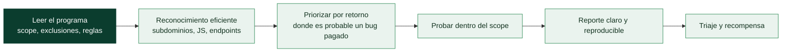

# Clase 114 — Bug bounty: metodología y plataformas

> Parte: **4 — Seguridad de aplicaciones web** · Fuente: *Bug Bounty Bootcamp (Vickie Li)* / *Real-World Bug Hunting (Yaworski)*
> ⏱️ Duración estimada: **110 min** · Nivel: **Intermedio**

---

## 🎯 Objetivo

Integrar todo lo aprendido en una **metodología de bug bounty** profesional: elegir programas, respetar el scope, hacer reconocimiento eficiente, priorizar vectores por retorno, y —lo más importante— **redactar reportes** claros con impacto y remediación que sean aceptados y recompensados.

> ⚠️ **Ética**: el bug bounty es hacking **autorizado** bajo las reglas del programa. Sal del scope o incumple la política y pasas de investigador a atacante ilegal.

## 📚 Resultados de aprendizaje

Al finalizar, el alumno podrá:

1. **Interpretar** el scope y las reglas de un programa antes de probar.
2. **Estructurar** un flujo de reconocimiento y testing eficiente.
3. **Priorizar** vulnerabilidades por probabilidad e impacto (retorno).
4. **Redactar** un reporte reproducible con PoC, impacto y remediación.
5. **Estimar** severidad con CVSS y gestionar la divulgación responsable.

## 🗺️ Temas

| # | Tema | Por qué importa |
|---|------|-----------------|
| 1 | Plataformas (HackerOne, Bugcrowd, Intigriti) | Dónde se hace bug bounty |
| 2 | Scope y reglas del programa | Frontera legal y ética |
| 3 | Reconocimiento eficiente | Encontrar dónde mirar |
| 4 | Priorización por retorno | Optimizar el tiempo |
| 5 | Redacción de reportes | Cobrar depende de esto |
| 6 | CVSS y severidad | Lenguaje común de riesgo |
| 7 | Divulgación responsable | Ética y reputación |

## 🧠 Explicación en profundidad

### Cazar vulnerabilidades por recompensa, dentro de las reglas

El **bug bounty** es un modelo en el que las organizaciones invitan a investigadores externos a
encontrar vulnerabilidades a cambio de una **recompensa** por cada una válida. Plataformas como
**HackerOne**, **Bugcrowd** e **Intigriti** intermedian: alojan los **programas** (el conjunto de
reglas de cada organización), gestionan los reportes y los pagos. Es una vía real de aprendizaje y de
ingresos, pero su premisa fundamental es la misma que la del pentest (clase 067): **solo estás
autorizado a probar lo que el programa incluye en su alcance, con las técnicas que permite**. Salirse
del scope en bug bounty no es una infracción menor: es acceso no autorizado, con las mismas
consecuencias legales de siempre.

### Lo primero, siempre: leer el scope

Antes de tocar nada se lee el programa a fondo, y esto no es un trámite: es lo que separa un
investigador profesional de uno que se mete en problemas. El programa define qué **dominios y activos**
están **dentro** del alcance y cuáles **explícitamente fuera**, qué **técnicas están prohibidas**
(casi siempre la denegación de servicio, la ingeniería social a empleados, los ataques automáticos
agresivos), y qué **tipos de hallazgo** paga y cuáles considera fuera de interés. Probar un subdominio
excluido, lanzar un DoS "para ver", o hacer phishing a un empleado son formas rápidas de quedar
baneado de la plataforma —o de acabar en un problema legal—. El scope es la ley del engagement.

### Reconocimiento y priorización: el retorno del tiempo

En un programa amplio, el **reconocimiento eficiente** marca la diferencia, y aplica todo lo de la
clase 090: enumerar subdominios (crt.sh), analizar el JavaScript en busca de endpoints, descubrir APIs
y versiones antiguas. La clave es la **priorización por retorno**: el tiempo es limitado, así que se
va donde es más probable encontrar un bug que **pague** —funcionalidad nueva o compleja, adquisiciones
recientes con seguridad desigual, endpoints de API poco pulidos, zonas que otros cazadores habrán
mirado menos—. Cazar el mismo XSS reflejado que ya reportaron cien personas rara vez es rentable;
encontrar un IDOR o una falla de lógica en una función nueva sí. Entender **qué se valora** (impacto,
originalidad) orienta el esfuerzo.

### El reporte es lo que se paga, y la divulgación responsable

Como en el pentest (clase 085), **el hallazgo no vale por sí mismo: vale el reporte**. Un buen reporte
de bug bounty tiene título claro, pasos de reproducción exactos, evidencia (capturas, peticiones), una
explicación del **impacto real** (no "encontré un XSS" sino "un atacante puede robar la sesión de
cualquier usuario que abra este enlace") y una remediación sugerida. El **triaje** —el equipo que
valida el reporte— decide si es válido, único y con qué severidad, y el **CVSS** (clase 071) ayuda a
justificar la recompensa. Un reporte confuso o exagerado se rechaza aunque el bug sea real. Y todo se
enmarca en la **divulgación responsable**: se reporta **en privado** a la organización a través de la
plataforma, se le da **tiempo para corregir**, y no se hace público el fallo hasta que esté resuelto y
el programa lo autorice. Publicar un bug sin resolver, extorsionar con él, o usarlo para acceder a más
datos de los necesarios para demostrarlo, cruza la línea de la investigación a la actividad
delictiva. El bug bounty es hacking **ético y legal** precisamente porque respeta esas reglas.

## 📖 Definiciones y características

- **Bug bounty**: programa que recompensa el reporte de vulnerabilidades bajo reglas definidas. Característica: hacking autorizado y con límites.
- **Scope**: activos y pruebas permitidas. Característica: salir de él anula la autorización.
- **PoC (Proof of Concept)**: pasos/artefacto que reproducen el bug. Característica: sin reproducibilidad no hay pago.
- **CVSS**: sistema estándar para puntuar severidad. Característica: da un lenguaje común, pero no sustituye el impacto de negocio.
- **Duplicado**: bug ya reportado por otro. Característica: no se recompensa; premia la velocidad y la originalidad.
- **Divulgación responsable**: reportar en privado y esperar la corrección. Característica: protege a usuarios y a tu reputación.

## 📔 Glosario

| Término | Definición concisa |
|---------|--------------------|
| Bug bounty | Recompensa por vulnerabilidades reportadas |
| HackerOne / Bugcrowd / Intigriti | Plataformas que alojan programas |
| Programa | Reglas y alcance de una organización |
| Scope | Activos autorizados; fuera de él es acceso no autorizado |
| Exclusiones | Dominios o técnicas explícitamente prohibidos |
| Técnica prohibida | DoS, ingeniería social, escaneo agresivo (habitual) |
| Reconocimiento eficiente | Subdominios, JS y endpoints con buen retorno |
| Priorización por retorno | Ir donde es probable un bug pagado |
| Duplicado | Bug ya reportado; no se recompensa |
| Reporte | Producto que se paga; claro y reproducible |
| Impacto | Lo que el bug permite; justifica la severidad |
| Triaje | Validación del reporte por la plataforma |
| CVSS | Puntuación que ayuda a fijar la recompensa |
| Divulgación responsable | Reportar en privado y dar tiempo a corregir |

## 🧰 Herramientas y preparación

- Cuentas en **HackerOne**, **Bugcrowd** o **Intigriti** (lee sus políticas).
- Stack de reconocimiento: **subfinder/amass**, **httpx**, **nuclei**, **ffuf**, **Burp**.
- Plantilla de reporte propia (título, resumen, pasos, impacto, remediación, referencias).

## 🧪 Laboratorio guiado

> ⚠️ Practica el reconocimiento y el reporte en tus propios labs o en programas con scope explícito. No pruebes activos fuera de scope.

1. Elige un programa y **lee su política**: scope, exclusiones, pruebas prohibidas, safe harbor.
2. Monta un flujo de reconocimiento (solo sobre activos en scope): subdominios → hosts vivos → tecnologías → endpoints.
3. Prioriza por retorno: funciones de negocio críticas, autenticación, APIs, uploads.
4. Encuentra un hallazgo en tu **laboratorio** (Juice Shop) y trátalo como si fuera real.
5. Redacta un **reporte completo**: título claro, resumen, pasos numerados reproducibles, PoC, impacto y remediación.
6. Calcula el **CVSS** del hallazgo con la calculadora oficial y justifica el vector.
7. Revisa el reporte con ojo crítico: ¿podría reproducirlo alguien sin contexto?

## ✍️ Ejercicios

1. Resume el scope y las reglas de un programa real en 5 puntos.
2. Diseña tu pipeline de reconocimiento con comandos concretos.
3. Prioriza 5 vectores de una app hipotética por probabilidad × impacto.
4. Redacta un reporte de un XSS almacenado de Juice Shop con todos los apartados.
5. Calcula el CVSS de ese XSS y explica cada métrica.
6. Explica qué es el safe harbor y por qué importa legalmente.

## 📝 Reto verificable

Escribe un **reporte de bug bounty completo y reproducible** de una vulnerabilidad hallada en tu laboratorio, con CVSS calculado y sección de remediación.
**Criterio de aceptación**: un tercero puede reproducir el bug siguiendo solo tu reporte; incluye título, impacto de negocio, pasos con PoC, CVSS justificado y remediación accionable.

## ⚠️ Errores comunes

| Síntoma / mensaje | Causa y cómo arreglar |
|-------------------|------------------------|
| Reporte rechazado por irreproducible | Faltan pasos/versión/contexto; detalla el PoC |
| "Out of scope" | Probaste un activo no permitido; respeta el scope |
| Marcado como duplicado | Otro llegó antes; prioriza velocidad y originalidad |
| Severidad inflada | Ajusta el impacto real; usa CVSS honesto |
| Baja recompensa | Impacto mal explicado; conecta el bug con daño de negocio |

## ❓ Preguntas frecuentes

**❓ ¿El bug bounty es legal?**
Sí, mientras te ciñas al scope y las reglas del programa (safe harbor). Fuera de ahí, no hay autorización.

**❓ ¿Qué diferencia un buen reporte de uno malo?**
La reproducibilidad y la claridad del impacto. Un triager debe poder replicar el bug y entender su gravedad sin esfuerzo.

**❓ ¿Automatizo todo con nuclei?**
La automatización ayuda en recon y detección superficial, pero los bugs bien pagados suelen requerir análisis manual y creatividad.

## 🔗 Referencias

- Li, *Bug Bounty Bootcamp*, No Starch Press.
- Yaworski, *Real-World Bug Hunting*, No Starch Press.
- HackerOne: <https://www.hackerone.com/> · Bugcrowd: <https://www.bugcrowd.com/>
- FIRST CVSS: <https://www.first.org/cvss/>

## 📥 Material descargable

- 📄 [Guía en PDF](./clase-114-guia.pdf) — versión imprimible de esta clase.
- 🎞️ [Presentación (PPTX)](./clase-114-presentacion.pptx) — deck para proyectar en clase.

## ⬅️ Clase anterior

[Clase 113 — Ataques del lado del cliente: CORS, postMessage y prototype pollution](../113-ataques-del-lado-del-cliente-cors-postmessage-y-prototype-pollution/README.md)

## ➡️ Siguiente clase

[Clase 115 — Secure coding y defensa de aplicaciones web](../115-secure-coding-y-defensa-de-aplicaciones-web/README.md)
