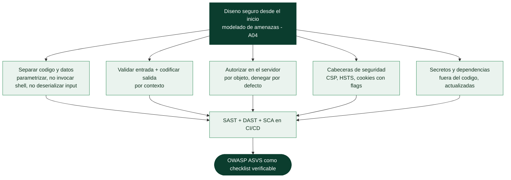

# Clase 115 — Secure coding y defensa de aplicaciones web

> Parte: **4 — Seguridad de aplicaciones web** · Fuente: *OWASP ASVS* / *OWASP Cheat Sheet Series*
> ⏱️ Duración estimada: **120 min** · Nivel: **Avanzado**

---

## 🎯 Objetivo

Cerrar la parte pasando del ataque a la **defensa**: cómo escribir código seguro y arquitecturas resistentes que eliminen de raíz las vulnerabilidades vistas. Aprenderás los principios de secure coding, las defensas concretas por categoría OWASP y cómo integrarlas en el ciclo de desarrollo (DevSecOps).

## 📚 Resultados de aprendizaje

Al finalizar, el alumno podrá:

1. **Aplicar** principios de diseño seguro (defensa en profundidad, mínimo privilegio).
2. **Implementar** las defensas correctas por categoría (inyección, XSS, authz).
3. **Usar** cabeceras de seguridad (CSP, HSTS, cookies seguras) con criterio.
4. **Integrar** SAST/DAST/SCA y OWASP ASVS en el SDLC.
5. **Evaluar** una aplicación contra un checklist de secure coding.

## 🗺️ Temas

| # | Tema | Por qué importa |
|---|------|-----------------|
| 1 | Principios de diseño seguro | Base transversal |
| 2 | Defensas por categoría OWASP | Corregir la causa raíz |
| 3 | Validación y codificación de salida | Contra inyección/XSS |
| 4 | Cabeceras de seguridad | Endurecimiento del cliente |
| 5 | Gestión segura de secretos y dependencias | A02, A06 |
| 6 | SAST/DAST/SCA en CI/CD | Automatizar la seguridad |
| 7 | OWASP ASVS como checklist | Verificación estructurada |

## 🧠 Explicación en profundidad

### La síntesis: construir defendiendo, no parcheando

Las 29 clases anteriores enseñaron a **atacar**; esta las invierte para enseñar a **construir seguro**,
y su tesis es que **la seguridad es más barata y más efectiva diseñada desde el principio que
parcheada al final**. No es una lista de trucos, sino un conjunto de principios que, aplicados,
eliminan **clases enteras** de vulnerabilidad en lugar de instancias sueltas. El hilo que conecta casi
todo lo visto es uno solo: **no confiar en la entrada y no mezclar datos con código**. Quien
interioriza eso ya tiene el 80% del secure coding.



### Las defensas por categoría, ya vistas y ahora ordenadas

Cada categoría de riesgo tiene su defensa raíz, y ordenarlas es el resumen de la parte. Contra la
**inyección** (SQL, comandos, NoSQL): separar código y datos —consultas parametrizadas, APIs que no
invocan la shell, no deserializar entrada—. Contra el **XSS**: **codificación de salida por contexto**
(la defensa primaria) más CSP como red de seguridad. Contra el **control de acceso roto**: autorizar
**en el servidor, por objeto, denegando por defecto**. Contra los **fallos criptográficos** (Parte 2):
AEAD, KDF para contraseñas, TLS bien configurado, no inventar cripto. Contra la **mala configuración**:
endurecer por defecto y no exponer lo innecesario. El patrón se repite: **validar la entrada** (rechazar
lo que no encaja, con allowlists) y **codificar la salida** (según dónde va el dato) son las dos
operaciones que, bien hechas, cierran la mayoría de los fallos de inyección de toda la parte.

### Cabeceras, secretos y dependencias

Tres capas transversales completan la defensa. Las **cabeceras de seguridad** son defensa gratuita que
el navegador aplica: **CSP** (restringe scripts, clase 096), **HSTS** (fuerza HTTPS, clase 040),
`X-Content-Type-Options`, `X-Frame-Options`/frame-ancestors (contra clickjacking), y las **cookies con
flags** `HttpOnly`, `Secure`, `SameSite` (clase 102). La **gestión de secretos**: nunca en el código
(clase 063), sino en un gestor o variables de entorno seguras, con escaneo automático que impida
commitearlos. Y la **gestión de dependencias**: el A06 de OWASP (componentes vulnerables) es de los
fallos más comunes, porque una aplicación hereda las vulnerabilidades de sus librerías —mantenerlas
actualizadas y monitorizar sus CVE (Parte 11) es tan importante como el código propio—.

### Automatizar la seguridad: SAST, DAST, SCA y ASVS

El secure coding no depende de que cada desarrollador recuerde todo: se **automatiza** en el pipeline
(la Parte 11 lo desarrolla). **SAST** (*static application security testing*) analiza el **código
fuente** buscando patrones peligrosos. **DAST** analiza la **aplicación en ejecución** enviándole
ataques (ZAP en modo baseline, clase 089). **SCA** (*software composition analysis*) revisa las
**dependencias** contra bases de vulnerabilidades. Integrados en CI/CD, atrapan fallos antes de
producción. Y como marco de referencia verificable, **OWASP ASVS** (*Application Security Verification
Standard*) es la **checklist** exhaustiva —mucho más detallada que el Top 10 (clase 087)— con
requisitos concretos por nivel de criticidad, que sirve tanto para construir como para auditar. El
cierre de la parte es una idea de madurez: el objetivo no es cazar bugs uno a uno para siempre, sino
**diseñar y automatizar** de modo que las clases enteras de vulnerabilidad no lleguen a existir. Atacar
enseña dónde están los fallos; construir seguro es lo que hace que no vuelvan.

## 📖 Definiciones y características

- **Secure coding**: prácticas de programación que previenen vulnerabilidades. Característica: es más barato prevenir que parchear.
- **Defensa en profundidad**: múltiples capas de control. Característica: si una falla, otra contiene el daño.
- **Mínimo privilegio**: cada componente solo con los permisos necesarios. Característica: limita el impacto de un compromiso.
- **CSP (Content Security Policy)**: cabecera que restringe recursos ejecutables. Característica: mitiga XSS aunque exista el bug.
- **ASVS**: estándar de verificación de OWASP con requisitos por nivel. Característica: convierte "ser seguro" en una checklist auditable.
- **SAST/DAST/SCA**: análisis estático, dinámico y de composición. Característica: automatizan la detección en el pipeline.

## 📔 Glosario

| Término | Definición concisa |
|---------|--------------------|
| Secure coding | Construir software seguro por diseño, no por parche |
| Diseño seguro | Modelar amenazas antes de programar (A04) |
| Separar código y datos | Parametrizar, no invocar shell, no deserializar input |
| Validación de entrada | Rechazar lo que no encaja, con allowlists |
| Codificación de salida | Codificar el dato según su contexto; defensa primaria del XSS |
| Autorización en servidor | Por objeto y denegando por defecto |
| CSP / HSTS | Cabeceras que restringen scripts y fuerzan HTTPS |
| X-Frame-Options | Cabecera contra clickjacking |
| Flags de cookie | HttpOnly, Secure, SameSite |
| Gestión de secretos | Fuera del código, con escaneo automático |
| Componentes vulnerables | A06; heredar CVE de las dependencias |
| SAST | Análisis estático del código fuente |
| DAST | Análisis dinámico de la aplicación en ejecución |
| SCA | Análisis de las dependencias contra CVE |
| OWASP ASVS | Estándar de verificación; checklist detallada |

## 🧰 Herramientas y preparación

- **OWASP ASVS** y **OWASP Cheat Sheet Series**.
- **Semgrep** (SAST), **OWASP ZAP** (DAST), **Dependabot/Trivy/OWASP Dependency-Check** (SCA).
- **securityheaders.com** y **CSP Evaluator** para revisar cabeceras.

```bash
# SAST rápido con Semgrep
pipx install semgrep
semgrep --config=auto ./tu-proyecto
```

## 🧪 Laboratorio guiado

> Ejercicio aplicado de defensa (revisión y corrección de código).

1. Toma un endpoint vulnerable a SQLi de clases previas y **reescríbelo** con consultas parametrizadas.
2. Corrige un XSS aplicando **codificación de salida por contexto** y añade una CSP restrictiva.
3. Endurece las cookies: `HttpOnly`, `Secure`, `SameSite`, y verifica con DevTools.
4. Añade cabeceras de seguridad (HSTS, `X-Content-Type-Options`, CSP) y valida en securityheaders.com.
5. Ejecuta **Semgrep** sobre un proyecto y corrige un hallazgo real.
6. Integra un **DAST baseline (ZAP)** y un **SCA** en un pipeline de ejemplo.
7. Audita la app contra un subconjunto de **OWASP ASVS** nivel 1 y documenta gaps.

## ✍️ Ejercicios

1. Reescribe de forma segura una query vulnerable en dos lenguajes.
2. Diseña una CSP para una SPA que solo cargue scripts propios.
3. Configura las cookies de sesión ideales y justifícalo.
4. Corrige un IDOR añadiendo autorización a nivel de objeto.
5. Añade validación de entrada con allowlist en un endpoint.
6. Mapea 10 controles de secure coding a las categorías del OWASP Top 10.

## 📝 Reto verificable

Toma una aplicación vulnerable (Juice Shop/DVWA o un proyecto propio) y **corrige al menos 3 vulnerabilidades** de categorías distintas, verificando que el ataque original ya no funciona.
**Criterio de aceptación**: entregas el diff/código corregido de 3 fallos (p. ej. SQLi, XSS, IDOR), demuestras que el exploit previo falla tras el cambio, y mapeas cada corrección a su categoría OWASP y requisito ASVS.

## ⚠️ Errores comunes

| Síntoma / mensaje | Causa y cómo arreglar |
|-------------------|------------------------|
| Escapar en vez de parametrizar | Frágil; usa prepared statements |
| CSP con `unsafe-inline` | Anula la protección; elimina inline y usa nonces |
| Validación solo en cliente | Inútil como control; valida en servidor |
| Blocklists en vez de allowlists | Se evaden; prefiere allowlists |
| Secretos en el repositorio | Fuga; usa gestores de secretos y rota lo expuesto |

## ❓ Preguntas frecuentes

**❓ ¿Por dónde empiezo a asegurar una app?**
Por las categorías de mayor impacto en tu contexto (a menudo access control e inyección) y por un baseline de cabeceras y gestión de sesión.

**❓ ¿SAST o DAST?**
Ambos: SAST encuentra fallos en el código, DAST en la app corriendo. Complétalos con SCA para dependencias.

**❓ ¿Qué nivel de ASVS busco?**
Nivel 1 como mínimo para cualquier app; niveles 2–3 para aplicaciones sensibles o reguladas.

## 🔗 Referencias

- OWASP ASVS: <https://owasp.org/www-project-application-security-verification-standard/>
- OWASP Cheat Sheet Series: <https://cheatsheetseries.owasp.org/>
- OWASP Proactive Controls: <https://owasp.org/www-project-proactive-controls/>
- OWASP Top 10 2021: <https://owasp.org/Top10/>

## 📥 Material descargable

- 📄 [Guía en PDF](./clase-115-guia.pdf) — versión imprimible de esta clase.
- 🎞️ [Presentación (PPTX)](./clase-115-presentacion.pptx) — deck para proyectar en clase.

## ⬅️ Clase anterior

[Clase 114 — Bug bounty: metodología y plataformas](../114-bug-bounty-metodologia-y-plataformas/README.md)

## ➡️ Siguiente clase

[Clase 116 — Arquitectura x86/x64 y lenguaje ensamblador](../../parte-5-explotacion-de-sistemas-y-binarios/116-arquitectura-x86-x64-y-lenguaje-ensamblador/README.md)
