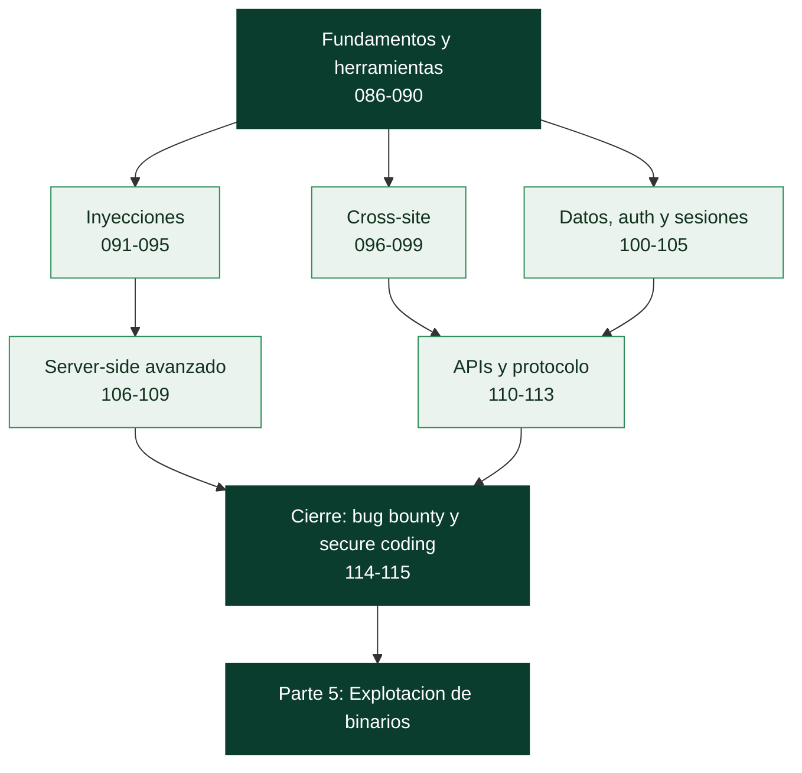

# Parte 4 — Seguridad de aplicaciones web

> [⬅️ Volver al programa](../../README.md) · [📚 Índice completo](../README.md) · [⏭️ Parte siguiente](../parte-5-explotacion-de-sistemas-y-binarios/README.md)

**30 clases** · rango 086–115 · OWASP Top 10, Burp Suite, inyecciones, XSS, SSRF, APIs y bug bounty

**Fuentes de referencia de esta parte:**

- Dafydd Stuttard y Marcus Pinto — *The Web Application Hacker's Handbook* (2ª ed., Wiley)
- Peter Yaworski — *Real-World Bug Hunting* (No Starch Press)
- Vickie Li — *Bug Bounty Bootcamp* (No Starch Press)
- OWASP — *Top 10 (2021)*, *Web Security Testing Guide (WSTG)* y *Application Security Verification Standard (ASVS)*
- PortSwigger — *Web Security Academy* (material de laboratorio y taxonomía de ataques)

---

## 🎯 ¿De qué trata esta parte?

La web es la superficie de ataque más expuesta de casi cualquier organización: un navegador, una URL y un endpoint HTTP bastan para alcanzar datos, lógica de negocio e infraestructura interna. Esta parte enseña a **encontrar, explotar y corregir** las vulnerabilidades que dominan el panorama real de las aplicaciones web modernas, desde el clásico SQL injection hasta ataques de protocolo como el HTTP request smuggling.

Trabajaremos con el **OWASP Top 10** como mapa mental, el **Web Security Testing Guide** como metodología y **Burp Suite** como herramienta central de proxy e interceptación. Cada clase combina teoría (cómo y por qué falla el código) con laboratorio práctico sobre entornos deliberadamente vulnerables y autorizados: **DVWA**, **OWASP Juice Shop** y los **PortSwigger Web Security Academy labs**.

Sirve a pentesters web, cazadores de bugs (bug bounty), desarrolladores que quieren escribir código seguro y equipos de AppSec/DevSecOps. Al final no solo sabrás romper aplicaciones: sabrás explicar el impacto, priorizar el riesgo y proponer la corrección correcta.

## 🧩 Problemas que resuelve

- Identificar la **superficie de ataque** real de una aplicación web moderna (SPA, API, microservicios).
- Detectar y explotar las **10 categorías de OWASP** con evidencia reproducible.
- Usar **Burp Suite y ZAP** con fluidez para interceptar, modificar y automatizar peticiones.
- Encadenar vulnerabilidades (p. ej. SSRF → metadata cloud → RCE) para demostrar impacto real.
- Auditar **APIs REST y GraphQL**, JWT, OAuth y mecanismos de autenticación/sesión.
- Distinguir un hallazgo trivial de uno crítico y **redactar reportes** aceptables en programas de bug bounty.
- Cerrar el círculo: proponer **secure coding** y defensas efectivas, no solo señalar el fallo.

## 🎓 Resultados de aprendizaje

Al terminar la parte, el alumno podrá:

- Mapear una aplicación y priorizar su superficie de ataque siguiendo la WSTG.
- Explotar inyecciones (SQL, NoSQL, comandos, plantillas) y automatizarlas con sqlmap.
- Detectar y explotar XSS reflejado, almacenado y basado en DOM, y evaluar su impacto.
- Analizar y atacar SSRF, XXE, CSRF, deserialización insegura y carga de archivos.
- Auditar tokens JWT, flujos OAuth 2.0/OIDC y controles de acceso (IDOR, path traversal).
- Evaluar la seguridad de APIs REST/GraphQL y ataques de protocolo (request smuggling, cache poisoning).
- Ejecutar una metodología de bug bounty y redactar reportes con impacto y remediación.
- Recomendar controles de secure coding alineados con OWASP ASVS.

## 🧱 Prerrequisitos

Esta parte se apoya en las anteriores; conviene traer fresco lo siguiente:

| Necesitas tener claro… | Dónde se cubre |
|---|---|
| HTTP, cookies, sesiones y qué añade HTTPS | [Clase 013](../parte-0-fundamentos-y-prerrequisitos/013-http-https-y-la-arquitectura-de-la-web-moderna/README.md) |
| Codificación: URL, Base64, hex (hashing ≠ cifrado) | [Clase 020](../parte-0-fundamentos-y-prerrequisitos/020-sistemas-de-numeracion-y-encoding-binario-hex-base64-y-url/README.md) |
| Man-in-the-middle y por qué se instala una CA de proxy | [Clase 040](../parte-1-redes-y-seguridad-de-redes/040-man-in-the-middle-tecnicas-y-defensa/README.md) |
| Contraseñas, JWT/HMAC, TLS (para auth y tokens) | [Clases 052](../parte-2-criptografia-aplicada/052-hmac-y-autenticacion-de-mensajes/README.md), [056–057](../parte-2-criptografia-aplicada/056-tls-ssl-en-profundidad/README.md) |
| Metodología de pentest, recon y reporte | [Parte 3](../parte-3-hacking-etico-y-pentesting-metodologia/README.md) · [Clase 085](../parte-3-hacking-etico-y-pentesting-metodologia/085-reporte-profesional-de-pentest/README.md) |
| Ética, alcance y autorización | [Clase 025](../parte-0-fundamentos-y-prerrequisitos/025-etica-legalidad-alcance-y-divulgacion-responsable/README.md) |

En cuanto a nociones de HTML, JavaScript y SQL básicos: no hace falta ser desarrollador experto, pero **saber leer código ayuda mucho**, sobre todo en las clases de XSS (DOM), SSTI y deserialización.

## 🧭 Cómo recorrer esta parte

**Es la parte más larga del programa (30 clases), y el orden está pensado para ir de lo general a lo específico.** Primero el mapa y las herramientas (086–090), luego cada familia de vulnerabilidad, y al final la profesión (bug bounty, secure coding). Puedes tratar cada bloque de vulnerabilidades como una unidad relativamente independiente —quien solo necesite inyecciones puede ir a 091–095—, pero las clases 086 (superficie de ataque), 087 (OWASP Top 10) y 088 (Burp) son la base transversal que todas las demás dan por sabida.

**El ritmo.** La parte suma unas **54 horas** de trabajo guiado, la más extensa del programa, sin contar el tiempo de laboratorio (que aquí es mucho: cada vulnerabilidad se practica en DVWA, Juice Shop o los labs de PortSwigger). A dos horas al día son unas **seis semanas**.

**El método, clase a clase.**

1. Lee **🎯 Objetivo** y **📚 Resultados de aprendizaje**.
2. Lee **🧠 Explicación en profundidad** antes de tocar Burp. Casi todas las clases comparten una misma causa raíz —**no confiar en la entrada, no mezclar datos con código**—; entender el mecanismo hace que los payloads dejen de ser recetas.
3. Prepara el laboratorio de **🧰 Herramientas y preparación** (un entorno vulnerable autorizado, nunca un sitio ajeno).
4. Haz el **🧪 Laboratorio guiado**: explota la vulnerabilidad y, cuando aplique, aplica la defensa y comprueba que la cierra.
5. Resuelve **✍️ Ejercicios** y el **📝 Reto verificable**.
6. Repasa el **📔 Glosario**. La densidad de siglas es alta (SSRF, XXE, IDOR, BOLA, SSTI, CORS): si no sabrías explicar una, vuelve a su sección.

> ⚠️ **Uso ético y legal.** Todas estas técnicas se practican **solo** en entornos deliberadamente vulnerables (DVWA, Juice Shop, los labs de PortSwigger) o dentro del alcance de un pentest o un programa de bug bounty autorizado. Atacar una aplicación web ajena sin permiso es delito, aunque "solo pruebes una comilla". La clase 114 detalla las reglas del bug bounty y la clase [025](../parte-0-fundamentos-y-prerrequisitos/025-etica-legalidad-alcance-y-divulgacion-responsable/README.md) el marco legal.

## 🧱 Anatomía de una clase

Las 30 clases siguen el **estándar pedagógico profundo** del programa:

| Sección | Qué contiene | Para qué la usas |
|---|---|---|
| 🎯 Objetivo | Qué sabrás hacer al terminar y por qué importa | Decidir si necesitas la clase |
| 📚 Resultados de aprendizaje | Lista verificable de capacidades concretas | Autoevaluarte al final |
| 🗺️ Temas | Cada tema con el porqué de su inclusión | Ubicarte antes de leer |
| 🧠 Explicación en profundidad | El mecanismo del ataque, su causa raíz y su defensa, con diagramas | Entender, no memorizar payloads |
| 📖 Definiciones y características | Cada término desarrollado con su relevancia | Consulta puntual |
| 📔 Glosario | Términos y siglas de la clase, en tabla | Repaso rápido |
| 🧰 Herramientas y preparación | Qué instalar y qué laboratorio montar | Antes del laboratorio |
| 🧪 Laboratorio guiado | Explotación paso a paso en entorno vulnerable | Donde de verdad se aprende |
| ✍️ Ejercicios · 📝 Reto verificable | Práctica propia y un entregable con criterio | Consolidar y demostrar |
| ⚠️ Errores comunes · ❓ Preguntas frecuentes | Tropiezos reales y dudas auténticas | Cuando algo no funciona |
| 🔗 Referencias | WAHH, PortSwigger, OWASP | Profundizar |

El CI del repositorio verifica que ninguna clase de esta parte pierda las secciones **🧠 Explicación en profundidad** ni **📔 Glosario**.

## 🗺️ Estructura temática

| Bloque | Clases | Contenido | Tiempo |
|--------|--------|-----------|--------|
| Fundamentos y herramientas | 086–090 | Superficie de ataque, OWASP Top 10, Burp, ZAP, mapeo | ≈ 7 h 55 |
| Inyecciones | 091–095 | SQLi, blind SQLi, sqlmap, NoSQL, command injection | ≈ 9 h |
| Cross-site y falsificación | 096–099 | XSS reflejado, XSS stored/DOM, CSRF, SSRF | ≈ 7 h 20 |
| Datos, auth y sesiones | 100–105 | XXE, auth bypass, sesiones, JWT, OAuth, IDOR/traversal | ≈ 11 h |
| Server-side avanzado | 106–109 | Deserialización, SSTI, upload, lógica de negocio | ≈ 7 h 10 |
| APIs y protocolo | 110–113 | REST, GraphQL, request smuggling/cache, client-side | ≈ 7 h 40 |
| Cierre profesional | 114–115 | Bug bounty y secure coding | ≈ 3 h 50 |

## 📖 Guía capítulo a capítulo

### 🧰 Bloque 1 · Fundamentos y herramientas — clases 086 a 090

- **[086 · Arquitectura web moderna y superficie de ataque](086-arquitectura-web-moderna-y-superficie-de-ataque/README.md)** · 90 min — Cada componente (navegador, CDN, WAF, API, backend) procesa la entrada distinto y por eso es un punto de ataque distinto. El desplazamiento al cliente, la regla "nunca confíes en el cliente" y la joya del metadata cloud.
- **[087 · OWASP Top 10: panorama general](087-owasp-top-10-panorama-general/README.md)** · 75 min — El mapa consensuado del riesgo web. Las tres primeras categorías (control de acceso, cripto, inyección) y por qué el Top 10 es el índice mental de todo pentest web.
- **[088 · Burp Suite: configuración y flujo de trabajo](088-burp-suite-configuracion-y-flujo-de-trabajo/README.md)** · 120 min — El proxy que se pone en medio de tu navegador y hace moldeable todo lo que envía. La CA para HTTPS, Repeater e Intruder, y por qué Burp amplifica el criterio pero no lo sustituye.
- **[089 · OWASP ZAP](089-owasp-zap/README.md)** · 90 min — La alternativa abierta. Spider tradicional frente a AJAX spider, la distinción pasivo/activo que evita incidentes, y el Automation Framework para CI/CD.
- **[090 · Mapeo, spidering y descubrimiento de contenido](090-mapeo-spidering-y-descubrimiento-de-contenido/README.md)** · 100 min — No puedes probar lo que no encontraste. Dirbusting con SecLists, el JavaScript como mapa que el sitio te entrega, y los ficheros que hablan de más (robots.txt, `.git`).

### 💉 Bloque 2 · Inyecciones — clases 091 a 095

- **[091 · Inyección SQL: fundamentos](091-inyeccion-sql-fundamentos/README.md)** · 120 min — La causa raíz de toda inyección: mezclar código y datos. Detección, UNION, bypass de login, y la remediación real (consultas parametrizadas, no filtrar comillas).
- **[092 · Inyección SQL avanzada y ciega](092-inyeccion-sql-avanzada-y-ciega-blind/README.md)** · 130 min — Cuando no ves los resultados: preguntas de sí/no. Booleana, temporal, out-of-band y la traicionera de segundo orden.
- **[093 · SQLMap](093-sqlmap/README.md)** · 100 min — Automatizar toda la clase anterior con criterio. `-r` con Burp, `--level`/`--risk` (cobertura vs. daño), volcado mínimo y el peligro de `--os-shell`.
- **[094 · Inyección NoSQL](094-inyeccion-nosql/README.md)** · 90 min — El mismo fallo con operadores en vez de comillas. El `$ne` que rompe el login, la vía query string que sorprende, y la validación de tipos como defensa.
- **[095 · Inyección de comandos del SO](095-inyeccion-de-comandos-del-sistema-operativo/README.md)** · 100 min — Del navegador a una shell del sistema. Metacaracteres, inyección ciega por tiempo y OOB, y la defensa: no invocar la shell (`shell=False`), no filtrar.

### 🕸️ Bloque 3 · Cross-site y falsificación — clases 096 a 099

- **[096 · XSS reflejado](096-cross-site-scripting-xss-reflejado/README.md)** · 110 min — La inyección en el navegador de otra víctima. El contexto de inyección lo decide todo, el impacto (robo de sesión), y la defensa (output encoding + CSP).
- **[097 · XSS almacenado y basado en DOM](097-xss-almacenado-y-basado-en-dom/README.md)** · 120 min — El payload que espera a las víctimas y el que vive solo en el cliente. Sources y sinks, los frameworks que ayudan pero no son magia, DOMPurify y Trusted Types.
- **[098 · CSRF](098-cross-site-request-forgery-csrf/README.md)** · 90 min — El navegador manda tus cookies aunque la petición no la hagas tú. Las tres condiciones, los tokens anti-CSRF y `SameSite`, y por qué sigue vivo.
- **[099 · SSRF](099-server-side-request-forgery-ssrf/README.md)** · 120 min — Convertir el servidor en tu proxy hacia dentro. La joya del metadata cloud (Capital One), la red interna, los esquemas alternativos, y por qué el blocklist falla.

### 🔐 Bloque 4 · Datos, autenticación y sesiones — clases 100 a 105

- **[100 · XXE](100-xml-external-entities-xxe/README.md)** · 100 min — Una característica de XML usada para el mal. Lectura de ficheros, salto a SSRF, los formatos que llevan XML por dentro (DOCX, SVG, SAML), y la defensa de una línea.
- **[101 · Fallos de autenticación y bypass](101-fallos-de-autenticacion-y-bypass/README.md)** · 120 min — La puerta de entrada y todas las formas de forzarla. Enumeración de usuarios, rate limiting y su evasión, recuperación de contraseña rota, y el ataque a la MFA.
- **[102 · Gestión de sesiones](102-gestion-de-sesiones-y-ataques-asociados/README.md)** · 100 min — El session ID es tu contraseña durante la sesión. Entropía, flags de cookie, session fixation, y las dos reglas de oro (regenerar al login, invalidar de verdad).
- **[103 · Ataques y seguridad de JWT](103-ataques-y-seguridad-de-jwt/README.md)** · 110 min — Un token con sus datos y su firma. `alg:none`, confusión de algoritmos, secretos débiles crackeables, y por qué el servidor fija el algoritmo, no el token.
- **[104 · OAuth 2.0 y OpenID Connect](104-seguridad-de-oauth-2-0-y-openid-connect/README.md)** · 120 min — Delegar acceso sin dar la contraseña. Authorization Code + PKCE, los tres fallos clásicos (redirect_uri, state, confusión de tokens), y qué añade OIDC.
- **[105 · Control de acceso roto: IDOR y path traversal](105-control-de-acceso-roto-idor-y-path-traversal/README.md)** · 110 min — El nº1 de OWASP y el más fácil de explotar. IDOR, forced browsing, path traversal, y la regla que lo cierra: denegar por defecto y autorizar por objeto en el servidor.

### ⚙️ Bloque 5 · Server-side avanzado — clases 106 a 109

- **[106 · Deserialización insegura](106-deserializacion-insegura/README.md)** · 120 min — Convertir bytes en objetos ejecuta código. Gadget chains (no hace falta traer código, ya está), pickle/ysoserial, y la regla: no deserializar entrada no confiable.
- **[107 · SSTI](107-server-side-template-injection-ssti/README.md)** · 110 min — Cuando la plantilla trata tu entrada como código de plantilla. La sonda `{{7*7}}`, el fingerprint del motor, la escalada a RCE, y SSTI vs XSS.
- **[108 · Carga de archivos](108-vulnerabilidades-en-carga-de-archivos/README.md)** · 100 min — Subir un fichero puede ser subir un programa. Las tres validaciones y cómo se saltan, el web shell, y la defensa (renombrar, aislar del entorno de ejecución).
- **[109 · Lógica de negocio](109-vulnerabilidades-de-logica-de-negocio/README.md)** · 100 min — El fallo que ningún escáner encuentra. Manipular precios, saltarse pasos, race conditions, y la defensa: validar reglas y valores en el servidor.

### 🔌 Bloque 6 · APIs y protocolo — clases 110 a 113

- **[110 · Seguridad de APIs REST](110-seguridad-de-apis-rest/README.md)** · 110 min — Las APIs tienen su propio Top 10. BOLA (el IDOR de las APIs) y BFLA, exposición de datos y mass assignment, y la autorización granular como defensa.
- **[111 · Seguridad de APIs GraphQL](111-seguridad-de-apis-graphql/README.md)** · 100 min — Un endpoint, un lenguaje de consulta. La introspección que regala el mapa, la autorización en cada resolver, y los ataques de complejidad y batching.
- **[112 · Web cache poisoning y HTTP request smuggling](112-web-cache-poisoning-y-http-request-smuggling/README.md)** · 130 min — Dos máquinas que interpretan lo mismo distinto. Envenenar la caché para todos, colar una petición dentro de otra (CL.TE/TE.CL), y la defensa en la infraestructura.
- **[113 · Ataques del lado del cliente](113-ataques-del-lado-del-cliente-cors-postmessage-y-prototype-pollution/README.md)** · 120 min — Relajar mal la política del mismo origen. CORS que refleja el Origin, postMessage sin validar, y prototype pollution (el gadget chain de JavaScript).

### 🎓 Bloque 7 · Cierre profesional — clases 114 a 115

- **[114 · Bug bounty: metodología y plataformas](114-bug-bounty-metodologia-y-plataformas/README.md)** · 110 min — Cazar por recompensa dentro de las reglas. Leer el scope siempre primero, reconocimiento y priorización por retorno, el reporte que se paga, y la divulgación responsable.
- **[115 · Secure coding y defensa de aplicaciones web](115-secure-coding-y-defensa-de-aplicaciones-web/README.md)** · 120 min — La síntesis: construir defendiendo, no parcheando. Las defensas por categoría, las cabeceras de seguridad, y SAST/DAST/SCA + OWASP ASVS para automatizar la seguridad.

## 🧰 Qué tendrás al terminar

- Un **flujo de trabajo con Burp/ZAP** fluido: interceptar, modificar, repetir y automatizar.
- La capacidad de **mapear** una aplicación y recorrer el **OWASP Top 10** categoría por categoría.
- Explotación práctica de **inyecciones** (SQL, NoSQL, comandos, plantillas), **XSS**, **SSRF**, **XXE**, **CSRF**, **deserialización** y **carga de archivos** en laboratorio.
- Auditoría de **JWT, OAuth/OIDC, sesiones y control de acceso**, y de **APIs REST y GraphQL**.
- Un **cadena de impacto** demostrada (p. ej. SSRF → metadata → credenciales cloud) del tipo que convence a la dirección.
- Un **reporte** de calidad de bug bounty y el criterio de **secure coding** para recomendar la defensa correcta.

## 🚦 ¿Puedo saltarme clases?

Los bloques de vulnerabilidades son bastante independientes, pero 086–088 son transversales. Sáltate una clase solo si respondes de memoria a su pregunta de control:

| Si dominas… | Pregunta de control | Si titubeas |
|---|---|---|
| Herramientas (088) | ¿Por qué hay que instalar la CA de Burp para interceptar HTTPS? | Haz 088 |
| Inyección (091) | ¿Por qué parametrizar elimina la SQLi y filtrar comillas no? | Haz 091 |
| XSS (096) | ¿Qué es el "contexto de inyección" y por qué lo decide todo? | Haz 096 |
| SSRF (099) | ¿Por qué `169.254.169.254` es la joya del SSRF? | Haz 099 |
| Control de acceso (105) | ¿Por qué usar UUIDs no arregla un IDOR? | Haz 105 |
| APIs (110) | ¿Qué es BOLA y por qué domina las brechas de API? | Haz 110 |

## 🔗 Referencias de la parte

- Stuttard & Pinto, *The Web Application Hacker's Handbook*, 2ª ed., Wiley.
- Yaworski, *Real-World Bug Hunting*, No Starch Press.
- Li, *Bug Bounty Bootcamp*, No Starch Press.
- OWASP Top 10 — <https://owasp.org/Top10/>
- OWASP Web Security Testing Guide — <https://owasp.org/www-project-web-security-testing-guide/>
- OWASP ASVS — <https://owasp.org/www-project-application-security-verification-standard/>
- PortSwigger Web Security Academy — <https://portswigger.net/web-security>

## ▶️ Empezar

[Clase 086 — Arquitectura web moderna y superficie de ataque](086-arquitectura-web-moderna-y-superficie-de-ataque/README.md)
