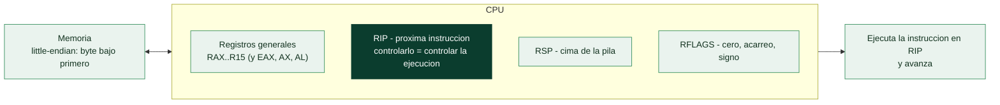

# Clase 116 — Arquitectura x86/x64 y lenguaje ensamblador

> Parte: **5 — Explotación de sistemas y binarios** · Fuente: *Erickson, Hacking: The Art of Exploitation, 2e* · *Intel SDM*
> ⏱️ Duración estimada: **120 min** · Nivel: **Fundamentos**

---

## 🎯 Objetivo

Entender cómo la CPU x86/x64 ejecuta instrucciones y traducir mentalmente entre C y ensamblador.
Al final sabrás qué son los registros de propósito general, cómo se representan las instrucciones
en memoria, la diferencia entre las sintaxis Intel y AT&T, y podrás leer el desensamblado de una
función sencilla identificando el prólogo, el cuerpo y el epílogo. Es la base sin la cual el resto
de la parte (overflows, ROP, reversing) no se sostiene.

## 📚 Resultados de aprendizaje

Al finalizar, el alumno podrá:

1. **Enumerar** los registros de propósito general de x86 (32 bits) y x64 (64 bits) y su propósito.
2. **Distinguir** las sintaxis Intel y AT&T y convertir instrucciones simples entre ambas.
3. **Compilar** un programa en C a ensamblador y **relacionar** cada línea con su origen.
4. **Desensamblar** un binario con `objdump` y localizar el prólogo y epílogo de una función.
5. **Explicar** el ciclo fetch-decode-execute y el papel de `RIP`/`EIP` y `RFLAGS`.

## 🗺️ Temas

| # | Tema | Por qué importa |
| --- | --- | --- |
| 1 | Modos de operación (real, protegido, largo) | Define el tamaño de registro y direccionamiento |
| 2 | Registros GPR: RAX…R15, EAX…EDI | Son el "espacio de trabajo" de todo exploit |
| 3 | RIP/EIP y RFLAGS | Controlar RIP = controlar la ejecución |
| 4 | Endianness (little-endian) | Cómo se colocan los bytes de una dirección en memoria |
| 5 | Sintaxis Intel vs AT&T | Cambia el orden operando y los prefijos |
| 6 | Instrucciones básicas: mov, add, lea, cmp, jmp, call | Vocabulario mínimo para leer código |
| 7 | Prólogo/epílogo de función | Punto donde se guarda y restaura el marco |
| 8 | Del C al ASM (gcc -S) | Puente entre lo que escribes y lo que corre |

## 🧠 Explicación en profundidad

### Para explotar un binario hay que pensar como la CPU

La explotación de binarios opera un nivel por debajo del código fuente: manipula
directamente los **registros**, la **memoria** y el **flujo de ejecución** de la máquina. Por eso
esta parte empieza donde terminó la [Clase 024](../../parte-0-fundamentos-y-prerrequisitos/024-arquitectura-de-computadores-cpu-registros-y-memoria/README.md) —CPU, registros y pila— y lo
profundiza hasta el punto en que se puede **leer ensamblador con fluidez**. No se trata de
convertirse en programador de ASM, sino de entender qué hace cada instrucción, porque un exploit
consiste, en el fondo, en **conseguir que la CPU ejecute instrucciones que el programador no
puso ahí**.

Un procesador x86-64 tiene tres **modos de operación** que son herencia histórica: *real* (16
bits, el de los años ochenta), *protegido* (32 bits, con memoria virtual y protección) y *largo*
(64 bits, el actual). Casi todo el trabajo moderno ocurre en modo largo, pero conocer que existen
explica muchas rarezas de compatibilidad.

### Los registros: el escritorio de trabajo de la CPU

Los **registros de propósito general** (GPR) son las pocas celdas de memoria ultrarrápida donde la
CPU hace su trabajo. En x64 hay dieciséis de 64 bits: `RAX`, `RBX`, `RCX`, `RDX`, `RSI`, `RDI`,
`RBP`, `RSP` y `R8`–`R15`. Cada uno es accesible también en tamaños menores: `RAX` (64), `EAX`
(32), `AX` (16), `AL` (8), lo que aparece constantemente al leer ASM. Dos registros son
**especiales para la explotación** y conviene fijarlos ya: **`RSP`** apunta a la cima de la pila y
**`RIP`** (el *instruction pointer*) contiene la dirección de la **próxima instrucción a
ejecutar**. Controlar `RIP` **es** controlar la ejecución, y por eso el objetivo de la mayoría de
los exploits de esta parte se resume en una frase: **sobrescribir el valor que acabará en RIP**.
El registro `RFLAGS` guarda los indicadores (cero, acarreo, signo) que gobiernan los saltos
condicionales.



### Endianness y sintaxis: dos motivos de confusión constante

Dos detalles técnicos causan la mitad de los errores del principiante. El primero es la
**endianness**: x86 es **little-endian**, es decir, almacena el byte **menos significativo
primero**. La dirección `0x00401234` se guarda en memoria como los bytes `34 12 40 00`. Esto
importa muchísimo al construir exploits, porque al escribir una dirección en la pila hay que
ponerla en ese orden invertido —de ahí que `pwntools` tenga `p64()`, que empaqueta un número en
sus 8 bytes little-endian—. El segundo es que hay **dos sintaxis de ensamblador**: **Intel**
(`mov rax, 5`, destino primero, la que usan Windows, IDA, Ghidra) y **AT&T** (`mov $5, %rax`,
origen primero, con `%` y `$`, la de gas y el GDB por defecto). Son el mismo código escrito de
dos formas; saber traducir entre ambas evita confusiones al saltar de herramienta a herramienta.

### Las instrucciones que hay que reconocer de un vistazo

No hace falta memorizar el set completo, pero sí reconocer un puñado. **`mov`** copia datos;
**`lea`** (*load effective address*) calcula una dirección sin acceder a memoria —útil para
aritmética de punteros—; **`add`/`sub`** operan; **`cmp`** compara (restando sin guardar) y ajusta
los flags; **`jmp`** salta incondicionalmente y **`je`/`jne`/`jg`...** condicionalmente según los
flags. Y las tres que gobiernan las funciones, centrales en toda la parte: **`call`** apila la
dirección de retorno y salta a la función; **`ret`** desapila esa dirección a `RIP` y vuelve; y el
par **`push`/`pop`** que mueve datos a y desde la pila. El hábito más formativo para leer ASM es
compilar C con **`gcc -S`** y comparar el código fuente con el ensamblador generado: ver cómo un
`if`, un bucle o una llamada a función se traducen a instrucciones es lo que convierte el
ensamblador de un jeroglífico en un idioma legible, y ese es el prerrequisito de todo lo que
sigue.

## 📖 Definiciones y características

- **Registro de propósito general (GPR):** almacenamiento rapidísimo dentro de la CPU. En x64 hay
  16 de 64 bits (`RAX`–`R15`); sus mitades de 32 bits son `EAX`, etc. *Característica clave:* operar
  sobre `EAX` pone a cero los 32 bits altos de `RAX`.
- **RIP / EIP (instruction pointer):** apunta a la siguiente instrucción a ejecutar. *Clave:* no se
  escribe directamente con `mov`; se altera con `call`, `ret`, `jmp` — de ahí su valor para el atacante.
- **RFLAGS:** registro de banderas (ZF, SF, CF, OF…) que refleja el resultado de operaciones y guía
  los saltos condicionales. *Clave:* `cmp` no guarda resultado, solo actualiza banderas.
- **Little-endian:** el byte menos significativo se almacena primero. *Clave:* la dirección
  `0x08049000` se escribe en memoria como `00 90 04 08`.
- **Opcode / operandos:** cada instrucción es uno o más bytes de código de operación seguidos de sus
  operandos. *Clave:* las instrucciones x86 tienen longitud variable (1 a 15 bytes).
- **Sintaxis AT&T vs Intel:** AT&T usa `mov $0x1, %eax` (origen→destino, prefijos `%`/`$`); Intel usa
  `mov eax, 1` (destino←origen). *Clave:* GDB por defecto usa AT&T; se puede cambiar a Intel.

## 📔 Glosario

| Término | Definición concisa |
|---------|--------------------|
| Registro (GPR) | Celda de memoria ultrarrápida de la CPU (RAX…R15) |
| RAX / EAX / AX / AL | El mismo registro en 64, 32, 16 y 8 bits |
| RIP | Puntero de instrucción; controlarlo controla la ejecución |
| RSP | Puntero a la cima de la pila |
| RFLAGS | Indicadores (cero, acarreo, signo) que rigen los saltos |
| Modo real / protegido / largo | 16, 32 y 64 bits; modo largo es el actual |
| Endianness | Orden de los bytes; x86 es little-endian |
| Little-endian | El byte menos significativo se almacena primero |
| p64 / p32 | Empaquetan un número en bytes little-endian (pwntools) |
| Sintaxis Intel | `mov rax, 5`; destino primero |
| Sintaxis AT&T | `mov $5, %rax`; origen primero, con `%` y `$` |
| mov / lea | Copiar datos / calcular una dirección sin leer memoria |
| cmp / jmp | Comparar ajustando flags / saltar |
| call / ret | Llamar (apila retorno) / volver (desapila a RIP) |
| gcc -S | Genera el ensamblador de un fuente C, para aprender a leerlo |

## 🧰 Herramientas y preparación

Trabaja en una **VM Linux aislada** (por ejemplo Ubuntu/Kali x86-64) que usarás durante toda la parte.

```bash
sudo apt update
sudo apt install -y build-essential gdb gcc-multilib nasm binutils
# Verifica versiones
gcc --version && objdump --version && nasm --version
```

Para ver desensamblado con sintaxis Intel de forma cómoda añade a `~/.gdbinit`: `set disassembly-flavor intel`.

## 🧪 Laboratorio guiado

> Entorno propio: todo se compila y ejecuta en tu VM.

1. Crea `suma.c`:

   ```c
   int suma(int a, int b) { return a + b; }
   int main(void) { return suma(3, 4); }
   ```

2. Genera ensamblador legible con sintaxis Intel:

   ```bash
   gcc -O0 -S -masm=intel suma.c -o suma.s
   cat suma.s
   ```

   Localiza `push rbp` / `mov rbp, rsp` (prólogo) y `pop rbp` / `ret` (epílogo).

3. Compila y desensambla el binario:

   ```bash
   gcc -O0 suma.c -o suma
   objdump -d -M intel suma | sed -n '/<suma>:/,/ret/p'
   ```

4. Observa cómo se pasan los argumentos: en x64 el primero va en `EDI` y el segundo en `ESI`
   (System V ABI). Anota qué instrucción hace la suma (`add`).

5. Escribe tu primer ASM puro con NASM (`hola.asm`) que solo termine con exit(42):

   ```asm
   section .text
   global _start
   _start:
       mov rax, 60      ; syscall exit
       mov rdi, 42      ; código de salida
       syscall
   ```

   ```bash
   nasm -f elf64 hola.asm -o hola.o && ld hola.o -o hola
   ./hola; echo $?      # imprime 42
   ```

6. Compara la salida de `objdump -d hola` con lo que escribiste para confirmar la traducción a opcodes.

## ✍️ Ejercicios

1. Convierte a sintaxis AT&T: `mov eax, 5`, `add rbx, rax`, `lea rax, [rbp-0x4]`.
2. Escribe en little-endian los bytes de la dirección `0x00401136`.
3. Modifica `hola.asm` para que devuelva la suma de dos inmediatos usando `add`.
4. Compila `suma.c` con `-O2` y explica por qué el desensamblado es más corto.
5. Identifica en un `objdump` cualquiera tres instrucciones de salto y di qué bandera consultan.
6. Escribe una función C con un `if` y localiza el `cmp` + `jne` correspondiente en el ASM.

## 📝 Reto verificable

Escribe en NASM un programa que calcule `(7 * 6) - 5` usando solo registros e instrucciones
aritméticas y devuelva el resultado como código de salida.

**Criterio de aceptación:** `./programa; echo $?` imprime **37**, y `objdump -d` muestra al menos
una instrucción `imul`/`mul` y una `sub`.

## ⚠️ Errores comunes

| Síntoma / mensaje | Causa y cómo arreglar |
| --- | --- |
| `objdump` muestra AT&T y no lo entiendes | Añade `-M intel`, o `set disassembly-flavor intel` en GDB |
| `ld: cannot find entry symbol _start` | Falta `global _start`; NASM no exporta el símbolo por defecto |
| Segfault al salir del NASM | Usaste `ret` sin stack válido; termina con la syscall `exit` |
| Registros de 32 bits "no cambian" los altos | Escribir `EAX` sí pone a cero el alto de `RAX`; revisa qué mitad usas |
| El ASM de `-O2` no coincide con tu C | El optimizador reordena/elimina; compila con `-O0` para aprender |

## ❓ Preguntas frecuentes

**❓ ¿Necesito aprender x86 de 32 bits si todo es de 64?** Sí: muchos retos de CTF y binarios legacy
son de 32 bits, y las convenciones (paso de argumentos por stack) son distintas y didácticas.

**❓ ¿Intel o AT&T?** Aprende a leer ambas. Intel suele ser más clara para principiantes; AT&T es el
default de muchas herramientas GNU.

**❓ ¿Tengo que memorizar todas las instrucciones?** No. Domina un núcleo de ~20 instrucciones y
consulta el *Intel SDM* para el resto.

## 🔗 Referencias

- Erickson, J. *Hacking: The Art of Exploitation, 2e*, cap. 0x2. No Starch Press.
- Intel® 64 and IA-32 Architectures Software Developer's Manual — <https://www.intel.com/sdm>
- (X86 assembly) OSDev Wiki — <https://wiki.osdev.org/X86-64>
- Compiler Explorer (godbolt) para ver C↔ASM — <https://godbolt.org/>

## 📥 Material descargable

- 📄 [Guía en PDF](./clase-116-guia.pdf) — versión imprimible de esta clase.
- 🎞️ [Presentación (PPTX)](./clase-116-presentacion.pptx) — deck para proyectar en clase.

## ⬅️ Clase anterior

[Clase 115 — Secure coding y defensa de aplicaciones web](../../parte-4-seguridad-de-aplicaciones-web/115-secure-coding-y-defensa-de-aplicaciones-web/README.md)

## ➡️ Siguiente clase

[Clase 117 — El stack, los registros y las convenciones de llamada](../117-el-stack-los-registros-y-las-convenciones-de-llamada/README.md)
