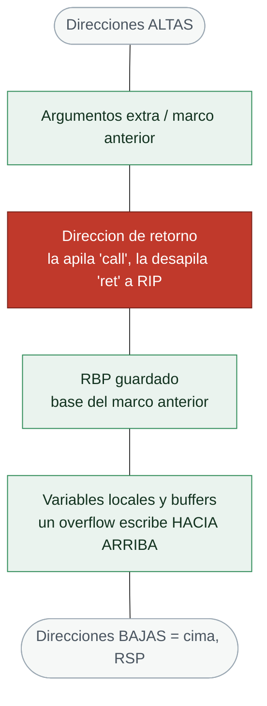

# Clase 117 — El stack, los registros y las convenciones de llamada

> Parte: **5 — Explotación de sistemas y binarios** · Fuente: *System V AMD64 ABI* · *Erickson, Hacking 2e*
> ⏱️ Duración estimada: **120 min** · Nivel: **Fundamentos**

---

## 🎯 Objetivo

Comprender a fondo cómo funciona el **stack** de un proceso: cómo crece, qué guarda un *stack frame*,
cómo `call`/`ret` usan la dirección de retorno y cómo las **convenciones de llamada** (System V en
Linux, Microsoft x64 en Windows) dictan dónde van los argumentos. Este conocimiento es el que
convierte un "buffer overflow" abstracto en una técnica concreta de control de flujo.

## 📚 Resultados de aprendizaje

Al finalizar, el alumno podrá:

1. **Describir** la estructura de un stack frame: dirección de retorno, `RBP` guardado, variables locales.
2. **Explicar** cómo `call` empuja la dirección de retorno y `ret` la consume.
3. **Aplicar** la convención System V AMD64: orden de argumentos en `RDI, RSI, RDX, RCX, R8, R9`.
4. **Contrastar** el paso de argumentos por stack (cdecl x86) frente a registros (x64).
5. **Localizar** en GDB la dirección de retorno de una función en el stack.

## 🗺️ Temas

| # | Tema | Por qué importa |
| --- | --- | --- |
| 1 | El stack crece hacia abajo | Direcciones menores según se apilan datos |
| 2 | RSP y RBP | Tope del stack y base del frame actual |
| 3 | push / pop | Mecánica de apilar y desapilar |
| 4 | call / ret y la dirección de retorno | El objetivo número uno del atacante |
| 5 | Stack frame y prólogo/epílogo | Dónde viven locales y saved RBP |
| 6 | System V AMD64 (Linux) | Argumentos en registros; retorno en RAX |
| 7 | cdecl / stdcall (x86) | Argumentos por stack; quién limpia |
| 8 | Red zone y alineación a 16 bytes | Reglas que rompen exploits si se ignoran |

## 🧠 Explicación en profundidad

### La pila: la estructura donde ocurre casi toda la explotación

La **pila** (*stack*) es la región de memoria donde una función guarda sus variables locales, sus
argumentos y —lo decisivo— la **dirección de retorno**. Es una estructura **LIFO** (último en
entrar, primero en salir) con dos peculiaridades que hay que tener grabadas. Primera: **crece
hacia direcciones más bajas**, es decir, apilar (`push`) *resta* de `RSP` y desapilar (`pop`) le
*suma*. Segunda: **`RSP` apunta siempre a la cima** (el último dato apilado), mientras que **`RBP`**
(*base pointer*) marca la base del marco de la función actual, dando un punto de referencia fijo
para localizar variables y argumentos. Toda la explotación de stack de esta parte consiste en
escribir en esta estructura más allá de lo previsto para alcanzar la dirección de retorno.



### call, ret y el prólogo: cómo nace y muere un marco de pila

El ciclo de vida de una llamada a función es el corazón del tema. Cuando se ejecuta **`call
funcion`**, la CPU hace dos cosas: **apila la dirección de retorno** (la instrucción siguiente al
`call`) y salta al inicio de la función. La función empieza con un **prólogo** típico —`push rbp;
mov rbp, rsp; sub rsp, N`— que guarda el marco anterior, establece el nuevo y reserva `N` bytes
para las locales. Al terminar, un **epílogo** —`leave; ret`— restaura el marco anterior y `ret`
**desapila la dirección de retorno a `RIP`**, devolviendo el control. Aquí está toda la
vulnerabilidad, y conviene enunciarla con precisión: la dirección de retorno vive en la pila,
**junto a** los buffers locales; si una escritura descontrolada sobre un buffer se pasa de tamaño,
avanza sobre el `RBP` guardado y sobre la dirección de retorno, y cuando la función ejecute `ret`,
la CPU saltará a donde el atacante haya escrito.

### Las convenciones de llamada: dónde están los argumentos

Para explotar hace falta saber **dónde** pasa un programa los argumentos a una función, y eso lo
fija la **convención de llamada**, que difiere entre arquitecturas. En **Linux x64** rige **System
V AMD64**: los seis primeros argumentos enteros van en registros, en este orden que hay que
memorizar —**`RDI`, `RSI`, `RDX`, `RCX`, `R8`, `R9`**— y el resto en la pila; el valor de retorno
vuelve en `RAX`. Este detalle es la base de ROP y ret2libc: para llamar a `system("/bin/sh")` en
x64 hay que colocar el puntero a `"/bin/sh"` en `RDI`, de ahí que se busque el gadget `pop rdi;
ret`. En **x86 de 32 bits** las convenciones (`cdecl`, `stdcall`) pasan los argumentos **por la
pila**, lo que cambia por completo cómo se construye el payload —una de las razones por las que los
exploits de 32 y 64 bits se ven tan distintos—.

### Los detalles que rompen exploits: red zone y alineación

Dos sutilezas de la ABI de System V causan fallos desconcertantes si se ignoran. La **red zone**
son 128 bytes por debajo de `RSP` que una función hoja puede usar sin ajustar el puntero de pila;
rara vez estorba, pero conviene saber que existe. Mucho más importante es la **alineación a 16
bytes**: la ABI exige que `RSP` esté alineado a 16 bytes en el momento de un `call`, y ciertas
instrucciones de libc (las SSE como `movaps`, muy comunes en `system` y `printf`) **fallan con un
SIGSEGV si la pila no está alineada**. Este es el origen del error más frustrante del principiante
en ret2libc: el exploit "es correcto" pero el programa crashea dentro de libc, y la causa es un
desalineamiento de 8 bytes que se arregla añadiendo un gadget `ret` extra como relleno. Entender la
pila, `call`/`ret`, la convención System V y la alineación es el conjunto mínimo para que todo lo
demás de la parte tenga sentido.

## 📖 Definiciones y características

- **Stack:** región de memoria LIFO por hilo que crece hacia direcciones **menores**. *Clave:* `push`
  resta a `RSP`, `pop` suma.
- **RSP (stack pointer):** apunta al tope del stack. *Clave:* toda instrucción `push`/`call` lo modifica.
- **RBP (base pointer):** ancla el frame actual; las locales se referencian como `[rbp-X]`. *Clave:*
  con `-fomit-frame-pointer` puede no usarse.
- **Dirección de retorno:** dirección que `call` guarda en el stack para que `ret` sepa a dónde volver.
  *Clave:* sobrescribirla es la esencia del stack overflow.
- **Convención System V AMD64:** primeros 6 enteros en `RDI, RSI, RDX, RCX, R8, R9`; el resto por stack;
  retorno en `RAX`. *Clave:* estándar en Linux/macOS.
- **Red zone:** 128 bytes bajo `RSP` que una función hoja puede usar sin ajustar `RSP`. *Clave:* propia
  de System V; no existe en Windows x64.

## 📔 Glosario

| Término | Definición concisa |
|---------|--------------------|
| Pila (stack) | Región LIFO con locales, argumentos y dirección de retorno |
| Crece hacia abajo | Apilar resta de RSP; desapilar le suma |
| RSP / RBP | Cima de la pila / base del marco actual |
| push / pop | Apilar y desapilar datos |
| Stack frame | Marco de pila de una función |
| Prólogo / epílogo | `push rbp; mov rbp,rsp` / `leave; ret` |
| Dirección de retorno | Valor que `ret` carga en RIP; objetivo del overflow |
| Convención de llamada | Regla de dónde van argumentos y retorno |
| System V AMD64 | ABI de Linux x64 |
| RDI, RSI, RDX, RCX, R8, R9 | Los seis primeros argumentos en x64, en ese orden |
| RAX | Registro del valor de retorno |
| cdecl / stdcall | Convenciones de x86; pasan argumentos por la pila |
| Red zone | 128 bytes bajo RSP usables por funciones hoja |
| Alineación a 16 bytes | RSP alineado en el `call`; su ausencia crashea libc |
| movaps | Instrucción SSE que falla si la pila no está alineada |

## 🧰 Herramientas y preparación

```bash
sudo apt install -y gdb gcc
# pwndbg mejora enormemente la vista del stack (se instala en la clase 118)
```

Usa la misma VM de la clase 116. Compila siempre con `-O0 -g` mientras aprendes para no perder el frame.

## 🧪 Laboratorio guiado

> Entorno propio.

1. Crea `frame.c`:

   ```c
   #include <stdio.h>
   long triple(long x) { long r = x * 3; return r; }
   int main(void) { printf("%ld\n", triple(5)); return 0; }
   ```

2. Compila con símbolos: `gcc -O0 -g frame.c -o frame`.

3. Depura y coloca un breakpoint dentro de `triple`:

   ```bash
   gdb -q ./frame
   (gdb) break triple
   (gdb) run
   (gdb) info registers rsp rbp rip
   ```

4. Examina la parte alta del frame para ver la dirección de retorno guardada por `call`:

   ```gdb
   (gdb) x/4gx $rbp        # muestra saved RBP y, en rbp+8, la dirección de retorno
   ```

   Confirma que la palabra en `$rbp+8` apunta de vuelta a `main`.

5. Verifica el paso de argumentos: `info registers rdi` justo al entrar en `triple` debe valer `5`.

6. Avanza con `finish` y observa el valor de retorno en `RAX` (debe ser `15`).

7. Repite compilando en 32 bits (`gcc -m32`) y comprueba que ahora el argumento se lee de `[esp+...]`
   en vez de un registro.

## ✍️ Ejercicios

1. Dibuja el stack frame de `triple` indicando offsets de `r`, saved RBP y ret address.
2. Explica con tus palabras qué hacen exactamente `call` y `ret` sobre `RSP` y `RIP`.
3. En x64, ¿en qué registros irían los argumentos de `f(a,b,c,d)`?
4. Compila con `-fomit-frame-pointer` y describe cómo cambia el epílogo.
5. Usa `p $rsp` y `p $rbp` en dos frames anidados y calcula el tamaño de cada frame.
6. Investiga la convención Microsoft x64 y lista sus 4 registros de argumentos.

## 📝 Reto verificable

Con GDB, encuentra e imprime la dirección de retorno de `triple` sin usar `backtrace`, solo con
aritmética sobre `$rbp`.

**Criterio de aceptación:** el valor impreso coincide con la dirección de la instrucción siguiente a
`call triple` en `main` (verificable con `disassemble main`).

## ⚠️ Errores comunes

| Síntoma / mensaje | Causa y cómo arreglar |
| --- | --- |
| No encuentras saved RBP | Compilaste con optimización u `-fomit-frame-pointer`; usa `-O0` |
| La dirección de retorno "no cuadra" | Confundes crecimiento del stack; recuerda que crece hacia abajo |
| Segfault por desalineación en x64 | Falta alineación a 16 bytes en `RSP` antes de `call` |
| Argumentos "vacíos" en registros | En x86 van por stack, no por registros |
| `info registers` no muestra R8-R15 | Estás en un binario de 32 bits |

## ❓ Preguntas frecuentes

**❓ ¿Por qué el stack crece hacia abajo?** Es una convención histórica que permite que stack y heap
crezcan uno hacia el otro maximizando el espacio disponible.

**❓ ¿Qué diferencia hay entre cdecl y stdcall?** Ambas pasan argumentos por stack en x86; en cdecl
limpia el llamador, en stdcall limpia la función llamada.

**❓ ¿La red zone puede romper mis exploits?** Sí: si escribes bajo `RSP` asumiendo que está libre,
puedes corromper datos que la función hoja usa.

## 🔗 Referencias

- System V AMD64 ABI — <https://gitlab.com/x86-psABIs/x86-64-ABI>
- Erickson, J. *Hacking: The Art of Exploitation, 2e*, cap. 0x3. No Starch Press.
- Microsoft x64 calling convention — <https://learn.microsoft.com/cpp/build/x64-calling-convention>
- Eli Bendersky, "Stack frame layout on x86-64" — <https://eli.thegreenplace.net/2011/09/06/stack-frame-layout-on-x86-64>

## 📥 Material descargable

- 📄 [Guía en PDF](./clase-117-guia.pdf) — versión imprimible de esta clase.
- 🎞️ [Presentación (PPTX)](./clase-117-presentacion.pptx) — deck para proyectar en clase.

## ⬅️ Clase anterior

[Clase 116 — Arquitectura x86/x64 y lenguaje ensamblador](../116-arquitectura-x86-x64-y-lenguaje-ensamblador/README.md)

## ➡️ Siguiente clase

[Clase 118 — Debugging con GDB y pwndbg](../118-debugging-con-gdb-y-pwndbg/README.md)
