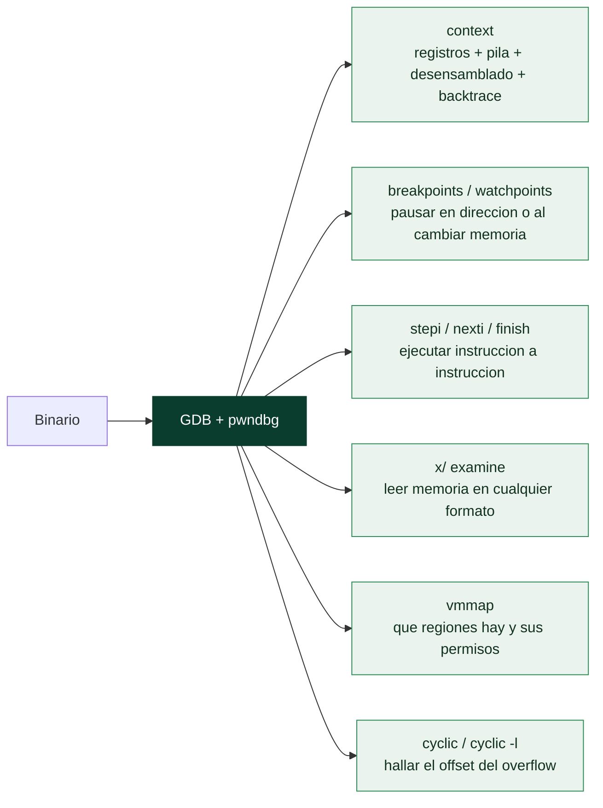

# Clase 118 — Debugging con GDB y pwndbg

> Parte: **5 — Explotación de sistemas y binarios** · Fuente: *Andriesse, Practical Binary Analysis* · docs de pwndbg
> ⏱️ Duración estimada: **110 min** · Nivel: **Fundamentos**

---

## 🎯 Objetivo

Dominar GDB como herramienta de análisis dinámico y potenciarlo con **pwndbg**, el plugin estándar
en el mundo del *pwn*. Aprenderás a poner breakpoints, avanzar instrucción a instrucción, examinar
memoria y registros, e interpretar la vista de contexto (registros, stack, disassembly, backtrace)
que pwndbg pinta en cada parada. Esta es la mesa de trabajo del resto de la parte.

## 📚 Resultados de aprendizaje

Al finalizar, el alumno podrá:

1. **Instalar y verificar** pwndbg sobre GDB.
2. **Controlar** la ejecución con `break`, `run`, `continue`, `stepi`, `nexti`, `finish`.
3. **Inspeccionar** memoria con `x/`, registros con `info registers` y el stack con `stack`.
4. **Usar** los comandos de pwndbg: `context`, `vmmap`, `telescope`, `search`, `cyclic`.
5. **Localizar** un desbordamiento observando cómo se corrompe `RIP` en tiempo de ejecución.

## 🗺️ Temas

| # | Tema | Por qué importa |
| --- | --- | --- |
| 1 | Instalación de pwndbg | Contexto visual imprescindible para pwn |
| 2 | Breakpoints y watchpoints | Detener en el punto exacto de interés |
| 3 | stepi / nexti / finish | Avanzar a nivel de instrucción |
| 4 | x/ (examine) y formatos | Leer memoria en cualquier representación |
| 5 | context de pwndbg | Registros + stack + code de un vistazo |
| 6 | vmmap y telescope | Mapa de memoria y punteros encadenados |
| 7 | cyclic / cyclic -l | Localizar offsets de overflow al instante |
| 8 | Ajustar ASLR en depuración | Reproducibilidad durante el aprendizaje |

## 🧠 Explicación en profundidad

### El depurador es el microscopio de la explotación

No se puede escribir un exploit a ciegas: hace falta **ver** el estado de la CPU y de la memoria en
cada instante —qué hay en los registros, qué contiene la pila, dónde está cargada cada región—.
**GDB** es el depurador estándar de Linux, y **pwndbg** es una extensión que lo transforma en una
herramienta pensada para el *exploiting*: en cada parada muestra automáticamente los registros, el
desensamblado, la pila y las banderas, con colores que distinguen código, datos y punteros.
Dominar el depurador es, en la práctica, el 60% de aprender a explotar; el resto es saber qué
buscar en lo que muestra.



### Parar, avanzar y mirar

Las operaciones básicas se agrupan en tres familias. **Detener la ejecución**: un `breakpoint`
(`b *dirección` o `b función`) pausa el programa al llegar a un punto; un `watchpoint` lo pausa
cuando una **posición de memoria cambia** —invaluable para ver *cuándo* se corrompe un dato—.
**Avanzar con control**: `stepi` (`si`) ejecuta **una instrucción** entrando en las llamadas,
`nexti` (`ni`) ejecuta una pasando por encima de los `call`, y `finish` ejecuta hasta que la
función actual retorna. **Examinar memoria**: `x/` (*examine*) es el comando más versátil —`x/8gx
$rsp` lee 8 *giant* (8 bytes) en *hex* desde `RSP`, `x/i $rip` desensambla la instrucción actual,
`x/s dir` muestra una cadena—. La sintaxis `x/NFU` (número, formato, unidad) se practica hasta que
sale sola, porque leer la memoria en el formato correcto es lo que revela qué está pasando.

### Las utilidades que pwndbg añade para el exploiting

pwndbg aporta comandos que resuelven problemas concretos del oficio. **`context`** es la vista que
se pinta en cada parada y reúne todo lo relevante de un vistazo. **`vmmap`** muestra el **mapa de
memoria** del proceso —qué regiones hay (código, pila, heap, libc), en qué direcciones y con qué
**permisos** (r/w/x)—, imprescindible para saber si una zona es ejecutable (clave para DEP/NX de la
[Clase 122](122-protecciones-modernas-aslr-dep-nx-stack-canaries-y-pie/README.md)) y para leer las bases con ASLR. **`telescope`** vuelca la pila
siguiendo los punteros de forma recursiva, mostrando a qué apunta cada valor, lo que hace legible de
un vistazo una pila que en GDB puro sería una columna de números. Y el par **`cyclic`/`cyclic -l`**
es el truco que ahorra horas: `cyclic 200` genera un patrón de De Bruijn (una secuencia donde cada
subcadena de 4 u 8 bytes es única), se envía como entrada, y cuando el programa crashea, `cyclic -l`
sobre el valor que quedó en `RIP` **calcula el offset exacto** del overflow sin ensayo y error.

### El detalle que confunde a todo principiante: ASLR en depuración

Hay un comportamiento de GDB que provoca desconcierto y merece enunciarse claro: **GDB desactiva
ASLR por defecto** cuando ejecuta un programa. Eso es cómodo para depurar —las direcciones son
estables entre ejecuciones—, pero genera una trampa: un exploit que funciona dentro de GDB puede
fallar fuera, porque en el sistema real ASLR sí está activo y las direcciones cambian. Conviene
saber alternar ese comportamiento (`set disable-randomization off`) para probar en condiciones
realistas, y entender que **lo que se ve en GDB con ASLR desactivado es un caso idealizado**. Este
matiz enlaza directamente con las mitigaciones de la Clase 122 y con la necesidad de *info leaks*
para derrotar ASLR en las clases de ret2libc y ROP.

## 📖 Definiciones y características

- **pwndbg:** plugin de GDB orientado a explotación que muestra automáticamente el contexto en cada
  parada. *Clave:* alternativas equivalentes son GEF y peda.
- **Breakpoint:** punto donde el programa se detiene. *Clave:* `break *0x401136` rompe en una dirección exacta.
- **Watchpoint:** detiene cuando cambia el valor de una expresión/memoria. *Clave:* ideal para ver
  cuándo se corrompe una variable.
- **`x/` (examine):** vuelca memoria con formato (`x/16gx $rsp` = 16 giant hex desde RSP). *Clave:* la
  letra final es el tamaño (b/h/w/g) y la anterior el formato (x/d/i/s).
- **cyclic (patrón De Bruijn):** cadena donde cada subsecuencia es única. *Clave:* permite calcular el
  offset exacto de un overflow con `cyclic -l`.
- **vmmap:** tabla de regiones mapeadas (código, stack, heap, libc) con permisos. *Clave:* imprescindible
  para saber qué es ejecutable/escribible.

## 📔 Glosario

| Término | Definición concisa |
|---------|--------------------|
| GDB | Depurador estándar de Linux |
| pwndbg | Extensión de GDB orientada al exploiting |
| context | Vista de pwndbg con registros, pila y desensamblado |
| Breakpoint | Pausa la ejecución al llegar a un punto |
| Watchpoint | Pausa cuando una posición de memoria cambia |
| stepi / nexti | Ejecutar una instrucción entrando / pasando por encima |
| finish | Ejecutar hasta que la función actual retorna |
| x/ (examine) | Leer memoria en cualquier formato (`x/8gx $rsp`) |
| x/NFU | Número, formato y unidad del comando examine |
| vmmap | Mapa de memoria del proceso con permisos |
| telescope | Vuelca la pila siguiendo punteros recursivamente |
| cyclic | Genera un patrón de De Bruijn para hallar offsets |
| cyclic -l | Calcula el offset a partir del valor en RIP |
| Patrón de De Bruijn | Secuencia con subcadenas únicas para localizar el offset |
| Randomización en GDB | GDB desactiva ASLR por defecto; puede falsear pruebas |

## 🧰 Herramientas y preparación

```bash
git clone https://github.com/pwndbg/pwndbg
cd pwndbg && ./setup.sh
# Verifica
echo "quit" | gdb -q ./frame   # debe mostrar la cabecera pwndbg
```

Para reproducibilidad al aprender, desactiva ASLR **solo dentro de GDB** (pwndbg lo hace por defecto)
o globalmente en la VM: `echo 0 | sudo tee /proc/sys/kernel/randomize_va_space` (revierte a `2` después).

## 🧪 Laboratorio guiado

> Entorno propio.

1. Compila un binario vulnerable de prueba (sin protecciones, solo para práctica):

   ```c
   // vuln.c
   #include <stdio.h>
   #include <string.h>
   void win() { puts("¡controlaste el flujo!"); }
   void vuln() { char buf[64]; gets(buf); }
   int main(){ vuln(); return 0; }
   ```

   ```bash
   gcc -fno-stack-protector -no-pie -z execstack vuln.c -o vuln   # solo laboratorio
   ```

2. Arranca en pwndbg: `gdb -q ./vuln`. Observa la cabecera y prueba `context`.

3. Genera un patrón y aliméntalo:

   ```gdb
   pwndbg> cyclic 200
   pwndbg> run
   # pega el patrón como entrada de gets
   ```

4. Al crashear, lee el valor que quedó en `RIP`/`RSP` y calcula el offset:

   ```gdb
   pwndbg> cyclic -l 0x6161616c    # devuelve el offset exacto al control de RIP
   ```

5. Explora el proceso: `vmmap`, `telescope $rsp 20`, `info functions win` para conocer la dirección de `win`.

6. Pon un breakpoint en `vuln` y avanza con `nexti` observando cómo `RSP`/`RBP` cambian en el prólogo.

7. Anota el offset hallado: lo usarás en las clases 119–120 para redirigir la ejecución a `win`.

## ✍️ Ejercicios

1. Muestra los 8 primeros qwords del stack con un solo comando `x/`.
2. Coloca un watchpoint sobre `buf` y observa cuándo se sobreescribe.
3. Usa `search` para encontrar la cadena `"win"` en memoria.
4. Desensambla `vuln` con `disassemble vuln` e identifica el `call gets`.
5. Explica la diferencia entre `stepi` y `nexti` con `call`.
6. Guarda un script `.gdbinit` con tus breakpoints habituales.

## 📝 Reto verificable

Usando `cyclic`, determina el offset exacto (en bytes) desde el inicio de `buf` hasta la dirección de
retorno de `vuln`.

**Criterio de aceptación:** el número obtenido con `cyclic -l` coincide con `64 + 8` (buffer + saved RBP)
y lo justificas con la vista de `context`.

## ⚠️ Errores comunes

| Síntoma / mensaje | Causa y cómo arreglar |
| --- | --- |
| pwndbg no aparece | `source` no cargado; revisa `~/.gdbinit` o reejecuta `setup.sh` |
| `cyclic -l` da "not found" | Pasaste el valor equivocado; usa el que quedó en RIP/RSP |
| Direcciones cambian cada corrida | ASLR activo; desactívalo o depura dentro de GDB |
| `x/s` imprime basura | Formato incorrecto; ese puntero no apunta a una cadena |
| El breakpoint nunca dispara | Símbolo inexistente o binario recompilado; rompe por dirección |

## ❓ Preguntas frecuentes

**❓ ¿pwndbg, GEF o peda?** Cualquiera sirve; pwndbg es el más usado hoy. No mezcles dos a la vez.

**❓ ¿Por qué desactivo ASLR para aprender?** Para que las direcciones sean estables entre corridas.
En la explotación real lo tratarás como obstáculo (clases 122+).

**❓ ¿`gets` es realista?** Es un ejemplo didáctico; en binarios reales verás `strcpy`, `sprintf`,
`read` mal acotados, etc.

## 🔗 Referencias

- pwndbg — documentación oficial — <https://github.com/pwndbg/pwndbg>
- Andriesse, D. *Practical Binary Analysis*, cap. 9. No Starch Press.
- GDB manual — <https://sourceware.org/gdb/documentation/>
- GEF (alternativa) — <https://hugsy.github.io/gef/>

## 📥 Material descargable

- 📄 [Guía en PDF](./clase-118-guia.pdf) — versión imprimible de esta clase.
- 🎞️ [Presentación (PPTX)](./clase-118-presentacion.pptx) — deck para proyectar en clase.

## ⬅️ Clase anterior

[Clase 117 — El stack, los registros y las convenciones de llamada](../117-el-stack-los-registros-y-las-convenciones-de-llamada/README.md)

## ➡️ Siguiente clase

[Clase 119 — Buffer overflow en stack: teoría](../119-buffer-overflow-en-stack-teoria/README.md)
