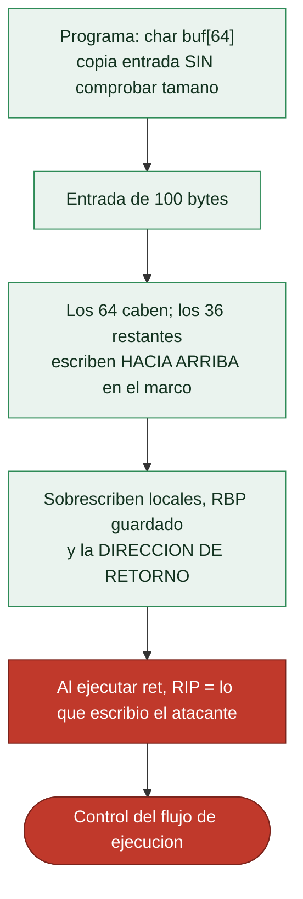

# Clase 119 — Buffer overflow en stack: teoría

> Parte: **5 — Explotación de sistemas y binarios** · Fuente: *Erickson, Hacking 2e* · *Aleph One, "Smashing the Stack"*
> ⏱️ Duración estimada: **100 min** · Nivel: **Intermedio**

---

## 🎯 Objetivo

Entender con precisión **por qué** y **cómo** un buffer overflow en el stack corrompe la dirección
de retorno y permite secuestrar el flujo de ejecución. Esta clase es teórica: sienta el modelo mental
(layout de memoria, escritura fuera de límites, control de `RIP`) que aplicarás prácticamente en la
clase 120. Sin este mapa conceptual, la explotación es prueba y error a ciegas.

## 📚 Resultados de aprendizaje

Al finalizar, el alumno podrá:

1. **Explicar** cómo una escritura sin verificación de longitud sobrepasa un buffer local.
2. **Dibujar** el layout del stack y señalar qué bytes controlan `RIP`.
3. **Definir** el *offset* al retorno y por qué es el número clave del exploit.
4. **Clasificar** funciones peligrosas de C (`gets`, `strcpy`, `sprintf`, `scanf %s`).
5. **Relacionar** el overflow con las mitigaciones que lo dificultan (adelanto de la clase 122).

## 🗺️ Temas

| # | Tema | Por qué importa |
| --- | --- | --- |
| 1 | Buffers en el stack | Dónde se guardan y su tamaño fijo |
| 2 | Escritura fuera de límites | La causa raíz del bug |
| 3 | Sobrescritura de saved RBP y ret | Camino hacia el control de RIP |
| 4 | Concepto de offset | Cuántos bytes hasta el retorno |
| 5 | Control de RIP → control de flujo | El objetivo del exploit |
| 6 | Funciones peligrosas de C | Dónde nacen estos bugs |
| 7 | Impacto y variantes | Local vs remoto, DoS vs RCE |
| 8 | Panorama de mitigaciones | Por qué hoy no basta lo básico |

## 🧠 Explicación en profundidad

### El fallo fundacional: escribir más allá del buffer

El **buffer overflow de stack** es la vulnerabilidad que fundó la disciplina del *exploiting*, y su
mecánica es sencilla de enunciar: un programa reserva un **buffer** de tamaño fijo en la pila y
luego escribe en él **más datos de los que caben**, sin comprobar el límite. Como la pila crece
hacia direcciones bajas pero los datos se escriben hacia direcciones **altas**, el exceso avanza
sobre lo que hay *por encima* del buffer en el marco: primero otras variables locales, después el
**`RBP` guardado**, y finalmente la **dirección de retorno**. Ahí está el premio, porque esa
dirección es la que `ret` cargará en `RIP` cuando la función termine.



### El offset: la distancia que hay que medir

El concepto operativo central es el **offset**: **cuántos bytes hay que escribir** desde el inicio
del buffer hasta llegar a la dirección de retorno. Es el número que convierte "hay un overflow" en
"controlo `RIP`", porque un payload se construye como *offset* bytes de relleno seguidos de la
dirección a la que se quiere saltar. En un marco típico, el offset es el tamaño del buffer más el
espacio de otras locales más los 8 bytes del `RBP` guardado, pero rara vez se calcula a mano: se
mide con el **patrón de De Bruijn** de la [Clase 118](../118-debugging-con-gdb-y-pwndbg/README.md)
(`cyclic`), que da el offset exacto de un solo intento. Controlar `RIP` **es** controlar el flujo:
a partir de ahí el exploit decide a dónde saltar —a shellcode propio, a una función existente, a
una cadena ROP—, y ese "a dónde" es lo que ocupa el resto de la parte.

### El pecado de C: funciones que no comprueban límites

La causa raíz vive en el lenguaje. C y C++ **no comprueban los límites de los arrays** por diseño
—en aras del rendimiento y del control—, y confían en que el programador lo haga. La biblioteca
estándar heredó un conjunto de **funciones peligrosas** que copian sin conocer el tamaño del
destino: **`gets`** (irreparable, lee hasta un salto de línea sin límite: hoy está eliminada del
estándar), **`strcpy`**, **`strcat`**, **`sprintf`** y **`scanf("%s")`**. Reconocerlas al leer
código fuente o decompilado es el primer instinto del cazador de vulnerabilidades (Clase 137). Sus
alternativas acotadas —`strncpy`, `snprintf`, `fgets`— reciben el tamaño del destino y son la
defensa a nivel de código, aunque tienen sus propias trampas (un `strncpy` puede dejar la cadena
sin terminador nulo).

### Del control de RIP al impacto, y el panorama de defensas

Que el overflow sea *explotable* y *hasta qué punto* depende de varios factores: cuánto se puede
escribir, qué **bytes están prohibidos** (un `strcpy` se corta en el byte nulo, así que las
direcciones con `00` son problemáticas), y qué **mitigaciones** hay activas. Y aquí la clase cierra
poniendo el mapa de lo que viene: el buffer overflow "clásico" —desbordar, inyectar shellcode en la
pila y saltar a él— **ya no funciona en sistemas modernos** por un conjunto de defensas que la
[Clase 122](../122-protecciones-modernas-aslr-dep-nx-stack-canaries-y-pie/README.md) detalla: **DEP/NX**
impide ejecutar la pila, **ASLR** aleatoriza las direcciones, el **stack canary** detecta la
sobrescritura antes del `ret`, y **PIE** aleatoriza también el propio binario. Por eso las técnicas
modernas —ret2libc (123), ROP (124)— **reutilizan código existente** en lugar de inyectarlo. La
teoría del buffer overflow es el cimiento; todo lo demás es cómo sortear las defensas que se
construyeron para pararlo.

## 📖 Definiciones y características

- **Buffer overflow:** escritura de más datos de los que caben en un buffer, invadiendo memoria
  adyacente. *Clave:* en el stack, esa memoria suele ser saved RBP y la dirección de retorno.
- **Out-of-bounds write:** acceso de escritura fuera del rango válido de un objeto. *Clave:* CWE-787,
  consistentemente entre las debilidades más peligrosas.
- **Offset al retorno:** distancia en bytes desde el inicio del buffer hasta la dirección de retorno.
  *Clave:* `tamaño_buffer + padding + saved RBP`.
- **Control de RIP:** lograr que la CPU ejecute una dirección elegida por el atacante. *Clave:* con
  RIP controlado se salta a shellcode, `win()`, o una cadena ROP.
- **Función insegura:** rutina que copia sin límite (`gets`, `strcpy`, `strcat`, `sprintf`). *Clave:*
  sus versiones acotadas (`fgets`, `strncpy`, `snprintf`) mitigan el problema.
- **NOP sled:** relleno de instrucciones `nop` que amplía el margen de acierto al saltar a shellcode.
  *Clave:* útil cuando la dirección exacta es incierta.

## 📔 Glosario

| Término | Definición concisa |
|---------|--------------------|
| Buffer | Región de tamaño fijo reservada para datos |
| Buffer overflow | Escribir más datos de los que caben en el buffer |
| Escritura fuera de límites | El exceso sobrescribe memoria adyacente |
| Saved RBP | Copia del RBP anterior, adyacente a la dirección de retorno |
| Offset | Bytes desde el inicio del buffer hasta la dirección de retorno |
| Control de RIP | Objetivo: fijar la dirección a la que salta `ret` |
| Funciones peligrosas | `gets`, `strcpy`, `strcat`, `sprintf`, `scanf("%s")` |
| gets | Lee sin límite; eliminada del estándar de C |
| Alternativas acotadas | `strncpy`, `snprintf`, `fgets` reciben el tamaño |
| Bytes prohibidos (badchars) | Bytes que rompen el payload (p. ej. el nulo en strcpy) |
| DEP / NX | Impide ejecutar código en la pila |
| ASLR | Aleatoriza las direcciones de memoria |
| Stack canary | Valor centinela que detecta la sobrescritura |
| PIE | Aleatoriza la dirección de carga del propio binario |
| Reutilización de código | ret2libc y ROP en vez de inyectar shellcode |

## 🧰 Herramientas y preparación

Esta clase es conceptual, pero conviene tener listos GDB+pwndbg (clase 118) y un editor. Prepara un
diagrama en papel o en un `.md` del stack para razonar los offsets.

```bash
# Repasa las protecciones que trae un binario cualquiera:
checksec --file=/bin/ls    # instalar: pip install pwntools (trae checksec)
```

## 🧪 Laboratorio guiado

> Ejercicio conceptual-aplicado (sin lanzar exploit todavía).

1. Toma el binario `vuln` de la clase 118 y ábrelo en pwndbg.

2. Desensambla `vuln` y anota el tamaño del **frame** que reserva el prólogo (`sub rsp, 0x50` → 80 bytes). Ojo: eso **no** es el tamaño del buffer. El buffer vive en `[rbp-0x40]` (64 bytes); el offset desde su inicio hasta la dirección de retorno es 64 + 8 (RBP guardado) = **72**, el valor que confirmarás con `cyclic` (coherente con las clases 118 y 120).

3. Dibuja en papel el frame de `vuln` de arriba (direcciones altas) a abajo:

   ```text
   [ ret address ]  <- rbp+8   (objetivo)
   [ saved RBP   ]  <- rbp
   [ buf[63..0]  ]  <- rbp-0x40 ... crece hacia rbp
   ```

4. Calcula el offset teórico al retorno y contrástalo con el valor que hallaste con `cyclic` en la 118.

5. Identifica en el código fuente qué función provoca el overflow (`gets`) y qué la haría segura (`fgets`).

6. Ejecuta `checksec ./vuln` y anota qué mitigaciones están **desactivadas** (NX, canary, PIE) y por qué
   eso hace el binario explotable — lo aprovecharás en la clase 120.

7. Escribe un breve informe (5-8 líneas) explicando la cadena causa→efecto del bug.

## ✍️ Ejercicios

1. Explica por qué `strncpy(dst, src, sizeof(dst))` no siempre es seguro (terminación nula).
2. Dado un buffer de 32 bytes y saved RBP de 8, ¿cuál es el offset al retorno en x64?
3. Lista cinco funciones de C inseguras y su reemplazo acotado.
4. Describe la diferencia entre un overflow que causa DoS y uno que logra RCE.
5. ¿Por qué un NOP sled aumenta la fiabilidad? ¿Cuándo no ayuda?
6. Relaciona cada mitigación (NX, canary, ASLR, PIE) con qué parte del ataque bloquea.

## 📝 Reto verificable

Redacta y entrega un diagrama del stack frame de `vuln` con offsets numéricos exactos y una frase
que indique cuántos bytes hay que escribir para alcanzar (sin sobrescribir aún) la dirección de retorno.

**Criterio de aceptación:** el offset del diagrama coincide con el que confirma `cyclic -l` en GDB, y
señalas correctamente la posición de saved RBP y ret address.

## ⚠️ Errores comunes

| Síntoma / mensaje | Causa y cómo arreglar |
| --- | --- |
| Offset calculado ≠ real | Olvidaste el saved RBP (8 bytes) o el padding de alineación |
| "Mi overflow no controla RIP" | Hay stack canary; lo verás en checksec (clase 122) |
| Confundir dirección alta/baja | El stack crece hacia abajo; dibújalo siempre |
| Creer que `strncpy` es infalible | Puede dejar la cadena sin `\0`; revisa longitudes |
| Pensar que todo overflow = RCE | Muchos solo causan crash/DoS; depende del control logrado |

## ❓ Preguntas frecuentes

**❓ ¿Por qué sobrescribir el retorno y no otra cosa?** Porque `ret` carga esa dirección en `RIP`
directamente, dándote control de flujo sin trucos adicionales.

**❓ ¿Esto sigue funcionando en binarios modernos?** No tal cual: canarios, NX, ASLR y PIE lo
complican. Por eso primero se estudia en un binario sin protecciones.

**❓ ¿Es lo mismo overflow en stack que en heap?** No; el heap tiene metadatos y mecánica distinta
(clases 126-127).

## 🔗 Referencias

- Aleph One, "Smashing the Stack for Fun and Profit", *Phrack* 49 — <http://phrack.org/issues/49/14.html>
- Erickson, J. *Hacking: The Art of Exploitation, 2e*, cap. 0x3. No Starch Press.
- CWE-787: Out-of-bounds Write — <https://cwe.mitre.org/data/definitions/787.html>
- OWASP, Buffer Overflow — <https://owasp.org/www-community/vulnerabilities/Buffer_Overflow>

## 📥 Material descargable

- 📄 [Guía en PDF](./clase-119-guia.pdf) — versión imprimible de esta clase.
- 🎞️ [Presentación (PPTX)](./clase-119-presentacion.pptx) — deck para proyectar en clase.

## ⬅️ Clase anterior

[Clase 118 — Debugging con GDB y pwndbg](../118-debugging-con-gdb-y-pwndbg/README.md)

## ➡️ Siguiente clase

[Clase 120 — Buffer overflow en stack: explotación práctica](../120-buffer-overflow-en-stack-explotacion-practica/README.md)
