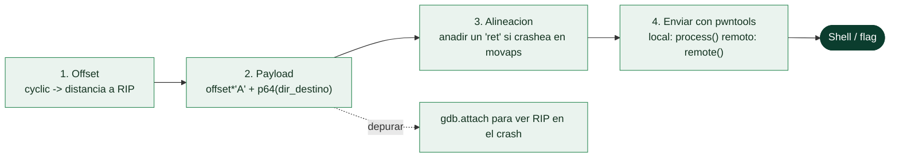

# Clase 120 — Buffer overflow en stack: explotación práctica

> Parte: **5 — Explotación de sistemas y binarios** · Fuente: *Erickson, Hacking 2e* · docs de pwntools
> ⏱️ Duración estimada: **140 min** · Nivel: **Intermedio**

---

## 🎯 Objetivo

Convertir la teoría de la clase 119 en un exploit real y reproducible. Construirás el payload que
desborda el buffer, sobrescribe la dirección de retorno y redirige la ejecución a una función objetivo
(`win()`), primero a mano con `python -c` y luego de forma limpia con **pwntools**. Es tu primer
control efectivo de `RIP`.

> ⚠️ **Ética:** el binario es tuyo, compilado en tu VM. No apliques esto a software de terceros sin
> autorización explícita por escrito.

## 📚 Resultados de aprendizaje

Al finalizar, el alumno podrá:

1. **Calcular** el offset al retorno y **construir** el payload de relleno + dirección.
2. **Redirigir** la ejecución a una función objetivo controlando `RIP`.
3. **Automatizar** el exploit con pwntools (`process`, `p64`, `sendline`, `recv`).
4. **Gestionar** la alineación del stack a 16 bytes cuando el retorno lo exige.
5. **Depurar** un exploit que falla usando GDB acoplado.

## 🗺️ Temas

| # | Tema | Por qué importa |
| --- | --- | --- |
| 1 | Recolección del offset | Base del payload |
| 2 | Estructura del payload | padding + dirección de retorno |
| 3 | p64/p32 y endianness | Empaquetar direcciones correctamente |
| 4 | ret2win | Saltar a una función existente |
| 5 | Alineación a 16 bytes (movaps) | Evita crashes en libc/x64 |
| 6 | pwntools básico | Automatización robusta del ataque |
| 7 | Depuración con gdb.attach | Ver por qué falla |
| 8 | De local a remoto | `remote()` para retos en red |

## 🧠 Explicación en profundidad

### De la teoría al exploit que abre una shell

Esta clase materializa el buffer overflow de la anterior en un exploit funcional contra un binario
sencillo —típicamente sin las mitigaciones modernas, para aislar la técnica—. El flujo de trabajo es
metódico y se repite en casi todos los retos de *pwn*: medir el offset, construir el payload,
sobrescribir la dirección de retorno con la dirección deseada, y verificar. El objetivo pedagógico
clásico es **`ret2win`**: el binario contiene una función "ganadora" (que imprime la flag o lanza una
shell) que nunca se llama, y el exploit consiste en desbordar y **redirigir `RIP` a esa función**.



### Construir el payload: relleno más dirección, en el orden correcto

Con el offset ya medido (`cyclic`, Clase 118), el payload tiene una estructura simple: **`offset`
bytes de relleno** (típicamente `b"A" * offset`) seguidos de la **dirección de destino** empaquetada
en little-endian. Aquí es donde `pwntools` se vuelve imprescindible: **`p64(dir)`** convierte un
número de 64 bits en sus 8 bytes en el orden correcto —construir esto a mano invirtiendo bytes es
propenso a error—, y `p32` hace lo propio en 32 bits. El payload completo suele ser tan conciso como
`payload = b"A"*72 + p64(win_addr)`. Entender que esos 72 bytes son relleno **hasta** la dirección de
retorno, y que los 8 siguientes **son** la dirección de retorno, es el modelo mental que hace que
todo encaje.

### El error que desconcierta: la alineación de 16 bytes

En x64, el fallo más frustrante del principiante aparece justo cuando el exploit "debería"
funcionar: se redirige `RIP` a la función correcta, pero el programa **crashea dentro de ella** con
un SIGSEGV. La causa casi siempre es la **desalineación de la pila** de la [Clase 117](../117-el-stack-los-registros-y-las-convenciones-de-llamada/README.md): la ABI
exige `RSP` alineado a 16 bytes en un `call`, y las instrucciones SSE (`movaps`) que usan `system`,
`printf` y otras funciones de libc lanzan un fallo si no lo está. La solución es tan sencilla como
desconcertante era el síntoma: **añadir la dirección de un gadget `ret`** (un simple `ret`, fácil de
encontrar) **antes** de la dirección de destino, que consume 8 bytes de la pila y la realinea. Saber
esto de antemano ahorra horas de depuración de un exploit que era correcto salvo por 8 bytes.

### pwntools, depuración y el salto a remoto

**pwntools** es la librería de Python que estructura todo exploit moderno, y sus primitivas básicas
son las que se usan aquí. `process("./bin")` lanza el binario local; `p.sendline(payload)` envía el
ataque; `p.recvline()` lee la respuesta; `p.interactive()` entrega una shell interactiva cuando el
exploit tiene éxito. Para depurar, **`gdb.attach(p)`** engancha GDB al proceso en marcha, permitiendo
poner breakpoints y observar el estado justo cuando se produce el overflow —la forma de entender por
qué un payload no funciona—. Y el salto que importa profesionalmente: el mismo script que usa
`process()` en local funciona con **`remote("host", puerto)`** contra el servicio remoto de un CTF o
un objetivo real, cambiando una sola línea. Ese paso de **local a remoto** es lo que convierte un
ejercicio de laboratorio en un exploit de verdad, y depende de que las condiciones (versión de libc,
direcciones) coincidan —el motivo de las técnicas de *info leak* y gestión de libc de las clases
posteriores—.

## 📖 Definiciones y características

- **Payload:** secuencia de bytes que envías al programa para explotarlo. *Clave:* aquí es
  `b"A"*offset + p64(dir_objetivo)`.
- **ret2win:** técnica didáctica que salta a una función ganadora ya presente en el binario. *Clave:*
  no necesita shellcode ni bypass de NX.
- **`p64`/`p32`:** funciones de pwntools que empaquetan un entero en little-endian. *Clave:* evitan
  errores manuales de orden de bytes.
- **Alineación de stack:** System V exige `RSP` múltiplo de 16 antes de un `call`. *Clave:* si falla,
  instrucciones SSE (`movaps`) en libc provocan segfault; se corrige añadiendo un gadget `ret`.
- **pwntools:** framework Python para escribir exploits. *Clave:* `context.binary`, `process`,
  `recvuntil`, `sendline`, `p64`, `cyclic`.

## 📔 Glosario

| Término | Definición concisa |
|---------|--------------------|
| ret2win | Redirigir RIP a una función "ganadora" del propio binario |
| Recolección del offset | Medir la distancia a RIP con `cyclic` |
| Payload | Relleno + dirección de destino en little-endian |
| Relleno (padding) | Bytes de relación hasta la dirección de retorno |
| p64 / p32 | Empaquetan una dirección en bytes little-endian |
| pwntools | Librería de Python para construir y lanzar exploits |
| process() | Lanza el binario local |
| remote() | Conecta al servicio remoto; misma lógica que local |
| sendline / recvline | Enviar y recibir datos del proceso |
| interactive() | Entrega una shell interactiva tras el éxito |
| gdb.attach() | Engancha GDB al proceso para depurar el exploit |
| Alineación a 16 bytes | Requisito de la ABI; su falta crashea en libc |
| Gadget ret de relleno | Un `ret` extra que realinea la pila |
| movaps SIGSEGV | Síntoma del desalineamiento de pila |
| Local a remoto | Cambiar `process` por `remote` para atacar el servicio real |

## 🧰 Herramientas y preparación

```bash
pip install pwntools
python3 -c "import pwn; print(pwn.__version__)"
```

Usa el `vuln` de las clases 118-119 (compilado con `-fno-stack-protector -no-pie`).

## 🧪 Laboratorio guiado

> Entorno propio.

1. Confirma el offset con pwndbg (`cyclic 200` → `cyclic -l <valor>`). Supón que es **72**.

2. Averigua la dirección de `win`: `objdump -d vuln | grep '<win>:'` o en pwntools `elf.symbols.win`.

3. Prueba el payload manual:

   ```bash
   python3 -c 'import sys;sys.stdout.buffer.write(b"A"*72 + (0x401156).to_bytes(8,"little"))' | ./vuln
   ```

4. Escríbelo en pwntools (`exploit.py`):

   ```python
   from pwn import *
   context.binary = elf = ELF("./vuln")
   p = process("./vuln")
   payload = b"A"*72 + p64(elf.symbols.win)
   p.sendline(payload)
   print(p.recvall(timeout=1).decode(errors="ignore"))
   ```

5. Si crashea justo al entrar en `win`, es alineación: inserta un gadget `ret` antes de la dirección:

   ```python
   ret = next(elf.search(asm("ret"), executable=True))
   payload = b"A"*72 + p64(ret) + p64(elf.symbols.win)
   ```

6. Depura acoplando GDB: cambia `process(...)` por `gdb.debug("./vuln", "break win")` y observa `RIP`.

7. Cuando funcione, verás el mensaje de `win()` (control de flujo logrado).

## ✍️ Ejercicios

1. Reproduce el exploit contra el mismo binario recompilado en 32 bits (`-m32`, usa `p32`).
2. Cambia el nombre/tamaño del buffer, recalcula el offset y adapta el script.
3. Añade manejo con `recvuntil` para sincronizar con un prompt del programa.
4. Modifica el binario para que `win` reciba un argumento y pásalo vía registro/stack.
5. Explica por qué el gadget `ret` corrige la alineación.
6. Convierte el exploit local a `remote("127.0.0.1", 1337)` sirviendo el binario con `socat`.

## 📝 Reto verificable

Entrega `exploit.py` que, contra tu binario `vuln`, imprima la salida de `win()` de forma fiable en
al menos 5 ejecuciones seguidas.

**Criterio de aceptación:** `for i in $(seq 5); do python3 exploit.py; done` muestra el mensaje de
`win()` las 5 veces, sin segfaults.

## ⚠️ Errores comunes

| Síntoma / mensaje | Causa y cómo arreglar |
| --- | --- |
| Segfault dentro de `win` (movaps) | Stack desalineado; añade un gadget `ret` extra |
| RIP = 0x4141414141414141 | Offset correcto pero dirección mal empaquetada; usa `p64` |
| RIP casi bien pero desplazado | Offset off-by-8; recuenta saved RBP |
| Funciona en GDB pero no fuera | Diferencias de entorno/ASLR; usa `env={}` y desactiva ASLR |
| `EOFError` en pwntools | El proceso murió antes; revisa timing con `recvuntil` |

## ❓ Preguntas frecuentes

**❓ ¿Por qué funciona en GDB y no en la terminal?** GDB desactiva ASLR y añade variables de entorno
que desplazan el stack. Iguala el entorno o usa direcciones estables (`-no-pie`).

**❓ ¿Necesito shellcode aquí?** No: ret2win reutiliza una función existente. El shellcode llega en la
clase 121.

**❓ ¿Y si el binario tiene canary?** El payload lineal se detecta; hay que filtrarlo primero
(clases 122-123).

## 🔗 Referencias

- pwntools docs — <https://docs.pwntools.com/>
- Erickson, J. *Hacking: The Art of Exploitation, 2e*. No Starch Press.
- Nightmare — ret2win writeups — <https://guyinatuxedo.github.io/>
- ROP Emporium (ret2win) — <https://ropemporium.com/challenge/ret2win.html>

## 📥 Material descargable

- 📄 [Guía en PDF](./clase-120-guia.pdf) — versión imprimible de esta clase.
- 🎞️ [Presentación (PPTX)](./clase-120-presentacion.pptx) — deck para proyectar en clase.

## ⬅️ Clase anterior

[Clase 119 — Buffer overflow en stack: teoría](../119-buffer-overflow-en-stack-teoria/README.md)

## ➡️ Siguiente clase

[Clase 121 — Escritura de shellcode](../121-escritura-de-shellcode/README.md)
