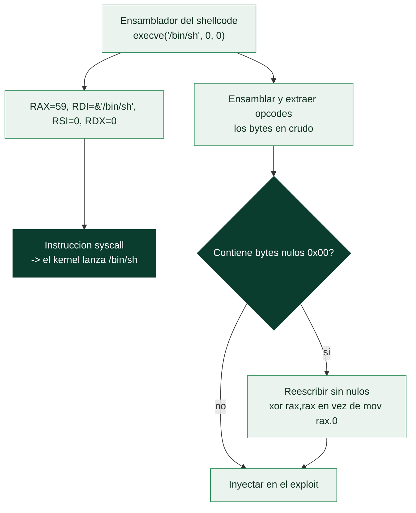

# Clase 121 — Escritura de shellcode

> Parte: **5 — Explotación de sistemas y binarios** · Fuente: *Anley et al., The Shellcoder's Handbook* · *Erickson, Hacking 2e*
> ⏱️ Duración estimada: **130 min** · Nivel: **Intermedio**

---

## 🎯 Objetivo

Escribir shellcode propio: código máquina que, inyectado en un proceso, ejecuta una acción del
atacante (típicamente lanzar `/bin/sh`). Aprenderás a invocar syscalls de Linux desde ensamblador,
a extraer los opcodes, a eliminar **bytes nulos** que romperían las copias de cadenas y a probar el
shellcode con un cargador. Es la carga útil clásica del binary exploitation.

> ⚠️ **Ética:** shellcode solo en binarios y VMs propias. Su uso contra sistemas ajenos sin permiso
> es delito.

## 📚 Resultados de aprendizaje

Al finalizar, el alumno podrá:

1. **Escribir** en NASM un `execve("/bin/sh")` como shellcode de 64 bits.
2. **Extraer** los opcodes y **cargarlos** desde un programa de prueba en C.
3. **Identificar y eliminar** bytes nulos (`\x00`) usando trucos de registros.
4. **Generar** shellcode con `msfvenom`/`pwn.shellcraft` y compararlo con el propio.
5. **Depurar** shellcode que no ejecuta con GDB.

## 🗺️ Temas

| # | Tema | Por qué importa |
| --- | --- | --- |
| 1 | Syscalls de Linux x64 | Interfaz para pedir servicios al kernel |
| 2 | execve para lanzar shell | El objetivo más común |
| 3 | Registros por syscall (RAX, RDI…) | Dónde van número y argumentos |
| 4 | Bytes nulos y cómo evitarlos | Rompen strcpy/gets si aparecen |
| 5 | Extracción de opcodes | Pasar de .asm a bytes |
| 6 | Cargador de pruebas | Ejecutar shellcode aislado |
| 7 | shellcraft / msfvenom | Alternativas listas para usar |
| 8 | execstack y su papel | El shellcode necesita memoria ejecutable |

## 🧠 Explicación en profundidad

### El código que quieres que la CPU ejecute cuando controlas RIP

Una vez que se controla `RIP`, hay que decidir **qué ejecutar**. El **shellcode** es la respuesta
clásica: una secuencia de instrucciones en código máquina, normalmente diseñada para **lanzar una
shell** (`/bin/sh`), que se inyecta en la memoria del proceso y a la que se salta. Escribir
shellcode obliga a bajar al nivel más fundamental —hablar directamente con el **kernel** mediante
**llamadas al sistema** ([Clase 023](../../parte-0-fundamentos-y-prerrequisitos/023-sistemas-operativos-procesos-memoria-y-syscalls/README.md))—, sin la comodidad de la biblioteca estándar,
porque en el contexto de un exploit no hay un `libc` amistoso al que llamar de forma normal.

### La syscall execve: cómo se pide una shell al kernel

Lanzar una shell se reduce a una llamada al sistema: **`execve("/bin/sh", NULL, NULL)`**, que
reemplaza el proceso actual por `/bin/sh`. En Linux x64, invocar una syscall a mano sigue un
protocolo estricto que hay que conocer: se pone el **número de la syscall en `RAX`** (`execve` es la
59), los **argumentos en `RDI`, `RSI`, `RDX`** (la convención de la [Clase 117](117-el-stack-los-registros-y-las-convenciones-de-llamada/README.md), pero para
syscalls), y se ejecuta la instrucción **`syscall`**. Así, un shellcode de `execve` consiste en:
colocar la dirección de la cadena `"/bin/sh"` en `RDI`, poner a cero `RSI` y `RDX`, cargar 59 en
`RAX` y ejecutar `syscall`. Entender este esqueleto convierte el shellcode de una cadena mágica de
bytes copiada de Internet en algo que se comprende y se puede adaptar.



### El enemigo del shellcode: los bytes nulos

El problema técnico que domina la escritura de shellcode es evitar **bytes prohibidos**, y el más
común es el **byte nulo (`0x00`)**. La razón es la [Clase 119](119-buffer-overflow-en-stack-teoria/README.md): la mayoría de los overflows se
producen a través de funciones de cadena (`strcpy`, `gets`) que **se detienen en el primer byte
nulo**, así que un shellcode que contenga un `00` se copiará truncado y no funcionará. Por eso el
shellcode se escribe con trucos que evitan ceros: para poner a cero un registro se usa `xor rax,
rax` (cuyos opcodes no tienen nulos) en lugar de `mov rax, 0` (que sí los tiene); las constantes
pequeñas se manipulan para no generar bytes altos nulos; la cadena `"/bin/sh"` se construye en la
pila con instrucciones en vez de referenciarla directamente. Este arte —escribir código funcional
esquivando ciertos bytes— es lo que distingue un shellcode de laboratorio de uno que sobrevive a las
restricciones de un exploit real.

### De escribirlo a probarlo, y las herramientas que lo generan

El flujo práctico tiene tres pasos. Se **escribe el ensamblador**, se **ensambla y se extraen los
opcodes** (los bytes en crudo que se inyectarán), y se **prueba** con un pequeño cargador —un
programa que copia el shellcode a una región de memoria y salta a él— para confirmar que abre la
shell. Aquí importa **`execstack`**: por defecto la pila es no ejecutable (DEP/NX, [Clase 122](122-protecciones-modernas-aslr-dep-nx-stack-canaries-y-pie/README.md)),
así que para probar shellcode inyectado en la pila hay que compilar el cargador con la pila
ejecutable, un recordatorio de por qué el shellcode-en-la-pila clásico ya no funciona en sistemas
modernos. Para no escribir todo a mano existen generadores: **`shellcraft`** de pwntools produce
shellcode para arquitecturas y objetivos comunes con una línea, y **`msfvenom`** ([Clase 075](../../parte-3-hacking-etico-y-pentesting-metodologia/075-msfvenom-generacion-de-payloads/README.md)) genera
payloads con opciones de codificación. Pero entender cómo se construye a mano es lo que permite
adaptarlo cuando el generador no encaja con las restricciones del reto —badchars concretos, tamaño
limitado, arquitectura rara—, que es justo cuando el shellcode importa.

## 📖 Definiciones y características

- **Shellcode:** secuencia de opcodes autocontenida que realiza una acción al ejecutarse. *Clave:*
  suele evitar dependencias y direcciones absolutas.
- **Syscall:** llamada al kernel; en x64 se invoca con `syscall` y el número en `RAX`. *Clave:* `execve`
  es la 59; `exit` la 60.
- **Byte nulo (`\x00`):** termina cadenas en C; si aparece en el shellcode, funciones como `strcpy`
  lo truncan. *Clave:* se evita con `xor reg, reg` en vez de `mov reg, 0`.
- **NOP sled:** relleno de `\x90` que da margen al salto. *Clave:* aumenta fiabilidad ante direcciones
  inciertas.
- **execstack / NX:** para ejecutar shellcode en el stack, la página debe ser ejecutable. *Clave:* hoy
  NX lo impide; por eso primero se practica con `-z execstack`.
- **shellcraft:** módulo de pwntools que genera shellcode parametrizable. *Clave:* `pwn.asm(pwn.shellcraft.sh())`.

## 📔 Glosario

| Término | Definición concisa |
|---------|--------------------|
| Shellcode | Código máquina que se inyecta y ejecuta, típico para lanzar shell |
| Syscall | Llamada al sistema; la vía directa al kernel |
| execve | Syscall que reemplaza el proceso por otro (`/bin/sh`) |
| Número de syscall | Va en RAX (execve = 59 en x64) |
| Registros de syscall | RAX (número), RDI/RSI/RDX (argumentos) |
| Opcodes | Bytes en crudo de las instrucciones |
| Byte nulo (0x00) | Bad character que trunca cadenas; hay que evitarlo |
| xor rax, rax | Poner a cero sin generar bytes nulos |
| Cadena en la pila | Construir "/bin/sh" con instrucciones para evitar nulos |
| Cargador de pruebas | Programa que ejecuta el shellcode para validarlo |
| execstack | Marca la pila como ejecutable para probar shellcode |
| DEP/NX | Por defecto impide ejecutar la pila |
| shellcraft | Generador de shellcode de pwntools |
| msfvenom | Generador de payloads de Metasploit |
| Badchars | Bytes prohibidos que el shellcode debe esquivar |

## 🧰 Herramientas y preparación

```bash
sudo apt install -y nasm
pip install pwntools
# msfvenom viene con Metasploit (opcional)
```

Trabaja en la VM aislada. Los binarios de prueba se compilan con `-z execstack` **solo para el laboratorio**.

## 🧪 Laboratorio guiado

> Entorno propio.

1. Escribe `sh.asm` (execve("/bin/sh", NULL, NULL)):

   ```asm
   section .text
   global _start
   _start:
       xor  rsi, rsi            ; argv = NULL  (sin bytes nulos)
       push rsi
       mov  rdi, 0x68732f2f6e69622f ; "/bin//sh" (8 bytes, sin byte nulo)
       push rdi
       mov  rdi, rsp            ; rdi -> "/bin/sh"
       xor  rdx, rdx            ; envp = NULL
       push 59
       pop  rax                 ; syscall execve
       syscall
   ```

2. Ensambla y prueba como binario:

   ```bash
   nasm -f elf64 sh.asm -o sh.o && ld sh.o -o sh && ./sh   # debe abrir una shell
   ```

3. Extrae los opcodes:

   ```bash
   objdump -d sh -M intel | grep '^ ' | cut -f2 | tr -d ' \n' | sed 's/../\\x&/g'; echo
   ```

4. Verifica que **no hay `\x00`**. Si aparece, sustituye `mov reg, 0` por `xor reg, reg`.

5. Cárgalo desde C para probar en un contexto de exploit:

   ```c
   char sc[] = "\x48\x31\xf6..."; // pega aquí tus bytes
   int main(){ ((void(*)())sc)(); }
   ```

   ```bash
   gcc -z execstack -no-pie loader.c -o loader && ./loader
   ```

6. Compara con pwntools: `python3 -c 'from pwn import *; context.arch="amd64"; print(asm(shellcraft.sh()))'`.

7. Depura con GDB (`break *sc`, `stepi`) si el shellcode no lanza la shell.

## ✍️ Ejercicios

1. Reescribe el shellcode para que ejecute `/bin/ls` en vez de una shell.
2. Elimina cualquier byte nulo introducido y explica la técnica usada.
3. Mide la longitud en bytes de tu shellcode y compárala con el de `msfvenom`.
4. Escribe un shellcode que solo haga `exit(7)` y verifícalo con `echo $?`.
5. Genera un shellcode con `msfvenom -p linux/x64/exec CMD=id -f c` y analízalo.
6. Añade un NOP sled y explica cuándo aporta fiabilidad.

## 📝 Reto verificable

Entrega un shellcode de 64 bits **sin bytes nulos** que lance `/bin/sh`, junto con el cargador C que
lo ejecuta.

**Criterio de aceptación:** `./loader` abre una shell interactiva y `python3 -c 'print(b"...".count(b"\x00"))'`
sobre tus bytes devuelve `0`.

## ⚠️ Errores comunes

| Síntoma / mensaje | Causa y cómo arreglar |
| --- | --- |
| Segfault en vez de shell | NX activo; compila el loader con `-z execstack` (laboratorio) |
| El shellcode se trunca | Contiene `\x00`; usa `xor`/`push`+`pop` para inmediatos |
| "/bin/sh" mal formado | Endianness incorrecta al empujar la cadena |
| execve devuelve -1 | Argumentos mal colocados (RDI/RSI/RDX) |
| Funciona suelto pero no inyectado | Direcciones/entorno distintos; usa registros relativos a RSP |

## ❓ Preguntas frecuentes

**❓ ¿Por qué me obsesiono con los bytes nulos?** Porque la mayoría de overflows nacen de funciones de
cadena que se detienen en `\x00`, cortando tu payload.

**❓ ¿Puedo usar shellcode de Internet?** Para aprender, escribe el tuyo. En CTF a menudo se usa
`shellcraft`, pero entender la mecánica es el objetivo.

**❓ ¿El shellcode en el stack sigue siendo viable?** Rara vez: NX lo bloquea. Se estudia para entender
la base; luego se pasa a ROP/ret2libc.

## 🔗 Referencias

- Anley et al. *The Shellcoder's Handbook, 2e*. Wiley.
- Erickson, J. *Hacking: The Art of Exploitation, 2e*, cap. 0x5. No Starch Press.
- Linux syscall table (x86-64) — <https://filippo.io/linux-syscall-table/>
- pwntools shellcraft — <https://docs.pwntools.com/en/stable/shellcraft.html>

## 📥 Material descargable

- 📄 [Guía en PDF](./clase-121-guia.pdf) — versión imprimible de esta clase.
- 🎞️ [Presentación (PPTX)](./clase-121-presentacion.pptx) — deck para proyectar en clase.

## ⬅️ Clase anterior

[Clase 120 — Buffer overflow en stack: explotación práctica](../120-buffer-overflow-en-stack-explotacion-practica/README.md)

## ➡️ Siguiente clase

[Clase 122 — Protecciones modernas: ASLR, DEP/NX, stack canaries y PIE](../122-protecciones-modernas-aslr-dep-nx-stack-canaries-y-pie/README.md)
