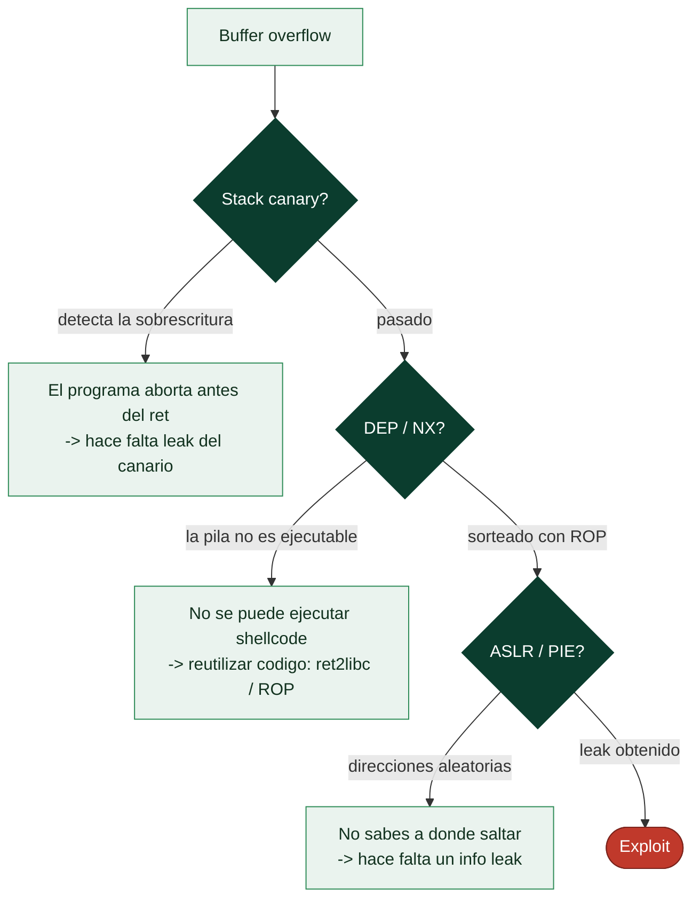

# Clase 122 — Protecciones modernas: ASLR, DEP/NX, stack canaries y PIE

> Parte: **5 — Explotación de sistemas y binarios** · Fuente: *Andriesse, Practical Binary Analysis* · docs GCC/Linux
> ⏱️ Duración estimada: **110 min** · Nivel: **Intermedio**

---

## 🎯 Objetivo

Conocer las mitigaciones que la explotación moderna debe superar: **ASLR** (aleatorización de
direcciones), **DEP/NX** (memoria no ejecutable), **stack canaries** (detección de overflow) y **PIE**
(ejecutable posicionalmente independiente). Sabrás qué bloquea cada una, cómo verificarlas con
`checksec` y qué debilidad deja abierta cada mitigación, preparando el terreno para ret2libc (123)
y ROP (124).

## 📚 Resultados de aprendizaje

Al finalizar, el alumno podrá:

1. **Explicar** el mecanismo de ASLR, NX, canary y PIE y qué ataque frena cada uno.
2. **Verificar** las protecciones de un binario con `checksec`.
3. **Activar/desactivar** cada mitigación al compilar con GCC.
4. **Identificar** la debilidad residual de cada protección (fuga de direcciones, ROP, etc.).
5. **Reconocer** cómo se combinan para elevar el coste del atacante (defensa en profundidad).

## 🗺️ Temas

| # | Tema | Por qué importa |
| --- | --- | --- |
| 1 | ASLR | Aleatoriza stack/heap/lib/mmap |
| 2 | DEP/NX | Impide ejecutar datos (mata shellcode en stack) |
| 3 | Stack canary | Detecta sobrescritura del retorno |
| 4 | PIE | Aleatoriza también el código del binario |
| 5 | RELRO | Protege la GOT |
| 6 | checksec | Auditar todo de un vistazo |
| 7 | Flags de GCC | Cómo se activa cada una |
| 8 | Debilidades residuales | Por qué siguen cayendo binarios |

## 🧠 Explicación en profundidad

### Por qué el exploit clásico ya no funciona: cuatro capas de defensa

El buffer overflow "de manual" —desbordar, inyectar shellcode en la pila y saltar a él— dejó de
funcionar hace dos décadas gracias a un conjunto de **mitigaciones** que hoy vienen activas por
defecto. Entenderlas es imprescindible por dos razones: para saber **qué impide** cada una (y por
tanto qué técnica de bypass hace falta) y para leer la postura de seguridad de un binario. Cada
defensa ataca un eslabón distinto de la cadena de explotación, y por eso la explotación moderna
consiste en **combinar bypasses**, no en un solo truco.



### DEP/NX y el stack canary: no ejecutar y detectar

**DEP/NX** (*Data Execution Prevention* / *No-eXecute*) marca las regiones de datos —incluida la
pila y el heap— como **no ejecutables**. Es una protección por hardware (el bit NX de la MMU) que
mata de raíz el shellcode inyectado en la pila: aunque el atacante escriba su código ahí y salte a
él, la CPU se niega a ejecutarlo. Su consecuencia directa es el giro de toda la explotación moderna
hacia la **reutilización de código** —ret2libc (123) y ROP (124) ejecutan código que **ya es
ejecutable** en lugar de inyectar el suyo—.

El **stack canary** (o *stack cookie*) ataca el overflow en su punto: el compilador coloca un
**valor aleatorio secreto** entre las variables locales y la dirección de retorno, y el epílogo de
la función **comprueba que ese valor no ha cambiado** antes de ejecutar `ret`. Como un overflow que
alcanza la dirección de retorno tiene que atravesar el canario, lo sobrescribe, la comprobación
falla y el programa **aborta** (`stack smashing detected`) antes de que el atacante tome el control.
Su debilidad: el canario es constante durante la ejecución del proceso, así que si el atacante
consigue **leerlo** (con un *info leak* o un format string, clase 125) puede **reescribirlo con su
propio valor** y el overflow pasa desapercibido.

### ASLR y PIE: aleatorizar dónde está todo

**ASLR** (*Address Space Layout Randomization*) aleatoriza en cada ejecución las **direcciones base**
de la pila, el heap y las bibliotecas compartidas. Su efecto es que el atacante **no sabe a qué
dirección saltar**: la dirección de `system` en libc, o de su shellcode, cambia cada vez. **PIE**
(*Position-Independent Executable*) extiende esa aleatorización al **propio binario** —sin PIE, el
código del programa está en una dirección fija y predecible; con PIE, también se mueve—. La
consecuencia común de ambas es que la explotación moderna casi siempre necesita un **info leak**:
una vulnerabilidad que **revele una dirección** en tiempo de ejecución, a partir de la cual se
calculan las demás (porque las distancias *dentro* de una región no cambian, solo su base). Sin
leak, no hay a dónde saltar de forma fiable.

### checksec, RELRO y la lectura de la postura del binario

Antes de atacar hay que saber **qué defensas hay activas**, y la herramienta es **`checksec`** (de
pwntools o pwndbg), que reporta de un vistazo si el binario tiene canary, NX, PIE y **RELRO**. El
**RELRO** (*RELocation Read-Only*) protege la **GOT** (*Global Offset Table*, la tabla de punteros a
funciones de libc): *partial RELRO* deja la GOT escribible (vector de la clase 125), mientras que
*full RELRO* la hace de solo lectura, cerrando la sobrescritura de la GOT. Leer la salida de
`checksec` es el primer paso de cualquier reto de pwn, porque **dicta la estrategia**: sin canary y
sin NX, sirve el shellcode clásico; con todo activado, hará falta un leak, ROP y quizá un ataque a
la GOT o al heap. La lección de la clase es que la explotación moderna no derrota una defensa, sino
**una pila de defensas encadenadas**, y cada una de las clases siguientes enseña a sortear una.

## 📖 Definiciones y características

- **ASLR:** aleatoriza las direcciones base de librerías, stack y heap en cada ejecución. *Clave:* una
  **fuga de dirección** (info leak) lo derrota al revelar una base.
- **DEP/NX (No-eXecute):** marca páginas de datos como no ejecutables. *Clave:* impide shellcode en
  stack/heap; se evade reutilizando código (ret2libc, ROP).
- **Stack canary:** valor aleatorio colocado antes del retorno; se verifica en el epílogo. *Clave:* un
  overflow lineal lo altera y aborta el programa (`stack smashing detected`).
- **PIE:** compila el ejecutable como posicionable, permitiendo aleatorizar su base con ASLR. *Clave:*
  obliga a filtrar también la base del binario.
- **RELRO:** hace la GOT de solo lectura (Full RELRO) para evitar sobrescrituras. *Clave:* Partial vs
  Full cambia la superficie de ataque.
- **checksec:** utilidad (pwntools/pwndbg) que reporta NX, canary, PIE, RELRO. *Clave:* primer paso de
  cualquier análisis de exploit.

## 📔 Glosario

| Término | Definición concisa |
|---------|--------------------|
| Mitigación | Defensa del compilador o del SO contra la explotación |
| DEP / NX | Marca los datos como no ejecutables (bit NX) |
| Reutilización de código | ret2libc/ROP, respuesta a NX |
| Stack canary | Valor secreto que detecta la sobrescritura de la pila |
| Stack smashing detected | Mensaje al fallar la comprobación del canario |
| Leak del canario | Leer el canario para reescribirlo y evadirlo |
| ASLR | Aleatoriza las bases de pila, heap y librerías |
| PIE | Aleatoriza también la dirección del propio binario |
| Info leak | Vulnerabilidad que revela una dirección en ejecución |
| Base de una región | Dirección de inicio; las distancias internas son fijas |
| checksec | Herramienta que reporta las mitigaciones activas |
| RELRO | Protege la GOT (partial: escribible; full: solo lectura) |
| GOT | Tabla de punteros a funciones de libc |
| Bypass encadenado | Combinar leak + ROP + ataque a GOT/heap |

## 🧰 Herramientas y preparación

```bash
pip install pwntools          # trae checksec
sudo apt install -y gcc
cat /proc/sys/kernel/randomize_va_space   # 2 = ASLR completo
```

## 🧪 Laboratorio guiado

> Entorno propio.

1. Compila el mismo `vuln.c` con distintas protecciones y compáralas:

   ```bash
   gcc vuln.c -o v_full                                   # todas las mitigaciones por defecto
   gcc -fno-stack-protector vuln.c -o v_nocanary
   gcc -no-pie -fno-stack-protector vuln.c -o v_nopie
   gcc -z execstack -no-pie -fno-stack-protector vuln.c -o v_open
   ```

2. Audita cada uno:

   ```bash
   for b in v_full v_nocanary v_nopie v_open; do echo "== $b =="; checksec --file=$b; done
   ```

3. Observa el canary en acción: alimenta un overflow largo a `v_full` y verás `*** stack smashing detected ***`.

4. Comprueba ASLR: ejecuta `ldd v_full` dos veces con ASLR activo y nota que la base de libc cambia
   (o usa `cat /proc/self/maps` en un pequeño script).

5. Desactiva ASLR temporalmente y confirma que las direcciones se estabilizan:

   ```bash
   echo 0 | sudo tee /proc/sys/kernel/randomize_va_space
   # ...pruebas... luego revertir:
   echo 2 | sudo tee /proc/sys/kernel/randomize_va_space
   ```

6. Desensambla el prólogo/epílogo de `v_full` y localiza la carga del canary desde `fs:0x28` y su
   comprobación antes de `ret`.

7. Anota, para cada mitigación, qué técnica de las siguientes clases la evade.

## ✍️ Ejercicios

1. Rellena una tabla mitigación → ataque que bloquea → debilidad residual.
2. Explica por qué NX no impide ret2libc.
3. Muestra en el desensamblado dónde se lee y compara el canary.
4. Diferencia Partial RELRO de Full RELRO y su impacto en ataques a la GOT.
5. Con ASLR activo, ejecuta 3 veces y registra la base de libc para ver la aleatorización.
6. ¿Por qué PIE eleva el coste incluso con una fuga de libc?

## 📝 Reto verificable

Genera cuatro binarios del mismo fuente con combinaciones distintas de protecciones y entrega la
salida de `checksec` de cada uno, clasificando cuál es más difícil de explotar y por qué.

**Criterio de aceptación:** identificas correctamente qué binario tiene NX+Canary+PIE+Full RELRO y
justificas el orden de dificultad con base en las debilidades residuales.

## ⚠️ Errores comunes

| Síntoma / mensaje | Causa y cómo arreglar |
| --- | --- |
| `stack smashing detected` | El canary detectó tu overflow; necesitas filtrarlo primero |
| Direcciones cambian cada corrida | ASLR/PIE activos; hace falta un info leak |
| Shellcode en stack no ejecuta | NX activo; usa ret2libc o ROP |
| checksec dice "No canary" pero crashea igual | Otra mitigación (NX/PIE) está frenando el exploit |
| Olvidas revertir ASLR a 2 | Deja la VM menos segura; restaura tras el laboratorio |

## ❓ Preguntas frecuentes

**❓ ¿Con todas activas es imposible explotar?** No, pero sube mucho el coste: normalmente hace falta
una fuga de información y cadenas ROP.

**❓ ¿El canary protege variables locales?** Protege la dirección de retorno; una escritura dirigida
que salte el canary aún puede corromper otras cosas.

**❓ ¿PIE y ASLR son lo mismo?** No: ASLR aleatoriza librerías/stack/heap; PIE permite aleatorizar
además el propio ejecutable.

## 🔗 Referencias

- Andriesse, D. *Practical Binary Analysis*. No Starch Press.
- checksec.sh — <https://github.com/slimm609/checksec.sh>
- Linux ASLR (randomize_va_space) — <https://www.kernel.org/doc/Documentation/sysctl/kernel.txt>
- GCC stack protector — <https://gcc.gnu.org/onlinedocs/gcc/Instrumentation-Options.html>

## 📥 Material descargable

- 📄 [Guía en PDF](./clase-122-guia.pdf) — versión imprimible de esta clase.
- 🎞️ [Presentación (PPTX)](./clase-122-presentacion.pptx) — deck para proyectar en clase.

## ⬅️ Clase anterior

[Clase 121 — Escritura de shellcode](../121-escritura-de-shellcode/README.md)

## ➡️ Siguiente clase

[Clase 123 — Bypass de protecciones: ret2libc](../123-bypass-de-protecciones-ret2libc/README.md)
