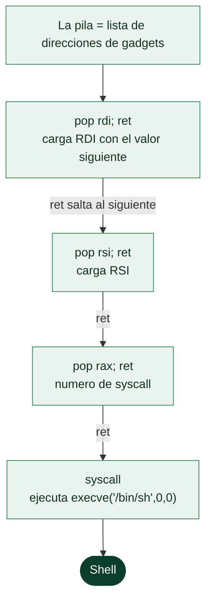

# Clase 124 — Return-Oriented Programming (ROP)

> Parte: **5 — Explotación de sistemas y binarios** · Fuente: *Shacham, "The Geometry of Innocent Flesh…"* · docs pwntools
> ⏱️ Duración estimada: **140 min** · Nivel: **Avanzado**

---

## 🎯 Objetivo

Dominar **ROP**, la generalización de ret2libc: encadenar múltiples *gadgets* (fragmentos que terminan
en `ret`) para construir cómputo arbitrario sin inyectar código, evadiendo NX por completo. Aprenderás
a buscar gadgets, a razonar sobre el flujo de una cadena y a realizar un **ret2syscall**/`execve` con
`ROPgadget` y el motor `ROP` de pwntools.

> ⚠️ **Ética:** solo en binarios propios o retos de CTF autorizados.

## 📚 Resultados de aprendizaje

Al finalizar, el alumno podrá:

1. **Definir** qué es un gadget y cómo `ret` encadena varios.
2. **Buscar** gadgets útiles con `ROPgadget`/`ropper`.
3. **Construir** una cadena que cargue registros y ejecute una syscall (`execve`).
4. **Usar** el autogenerador `ROP()` de pwntools.
5. **Depurar** cadenas ROP paso a paso en GDB.

## 🗺️ Temas

| # | Tema | Por qué importa |
| --- | --- | --- |
| 1 | Gadgets y el rol de `ret` | Unidad y pegamento de la cadena |
| 2 | Turing-completitud de ROP | Se puede computar casi todo |
| 3 | Búsqueda de gadgets | Materia prima del exploit |
| 4 | Cargar registros (pop) | Preparar argumentos de syscall |
| 5 | ret2syscall / execve | Objetivo sin depender de libc externa |
| 6 | Cadenas con pwntools ROP() | Automatización de alto nivel |
| 7 | Stack pivoting | Cuando el espacio es limitado |
| 8 | Depurar cadenas | Ver cada gadget ejecutarse |

## 🧠 Explicación en profundidad

### Programar con trozos del programa que ya existe

El **Return-Oriented Programming** es la generalización de ret2libc y la técnica que define la
explotación moderna. La idea es radical: en lugar de saltar a **una** función existente, el atacante
encadena decenas de **gadgets** —fragmentos cortos de código que ya están en el binario y terminan
en `ret`— para construir **cualquier comportamiento que quiera**, instrucción a instrucción, sin
inyectar un solo byte de código nuevo. Como el código reutilizado ya es ejecutable, ROP **derrota
por completo a DEP/NX**: no hay nada que ejecutar en una región no ejecutable, solo saltos a código
que siempre lo fue.

### Por qué ret es el pegamento, y por qué basta con eso

El mecanismo se apoya en una observación elegante. Un **gadget** es una secuencia como `pop rdi;
ret` o `mov [rax], rbx; ret`: hace algo pequeño y **termina en `ret`**. La clave es que `ret`
**desapila la siguiente dirección de la pila a `RIP`**, así que si el atacante llena la pila con una
**lista de direcciones de gadgets**, cada `ret` salta al siguiente, encadenándolos como las cuentas
de un collar. La pila deja de contener datos y pasa a ser un **programa**: una secuencia de "haz
esto, luego esto". Se ha demostrado que, en un binario suficientemente grande, el conjunto de
gadgets disponibles es **Turing-completo** —se puede computar cualquier cosa—, aunque en la práctica
el objetivo suele ser modesto: preparar los registros para una syscall o para `system`.



### ret2syscall: montar una llamada al sistema con gadgets

El objetivo más común de una cadena ROP es **ret2syscall**: preparar todos los registros para
invocar `execve("/bin/sh", NULL, NULL)` directamente al kernel, sin depender de `system`. Requiere
cargar `RAX=59`, `RDI=&"/bin/sh"`, `RSI=0`, `RDX=0` y luego ejecutar un gadget `syscall`. Cada carga
es un gadget `pop`: `pop rax; ret` con el valor 59 en la pila justo detrás, `pop rdi; ret` con la
dirección de la cadena, y así. La cadena completa es una secuencia cuidadosamente ordenada de
direcciones de gadgets y valores intercalados, y construirla a mano sería tedioso y frágil —de ahí
que se automatice—.

### Encontrar gadgets, construir cadenas y el stack pivot

El flujo práctico tiene herramientas dedicadas. Para **buscar gadgets** se usa **ROPgadget** o
**ropper**, que escanean el binario y listan todas las secuencias útiles que terminan en `ret`. Para
**construir la cadena**, el módulo **`ROP`** de pwntools es casi mágico: `rop.call('execve', [...])`
o `rop.rdi = valor` localizan los gadgets necesarios y ensamblan la cadena automáticamente,
resolviendo el orden. Un concepto avanzado que conviene conocer es el **stack pivot**: cuando el
espacio del overflow es demasiado pequeño para una cadena ROP larga, se usa un gadget que **cambia
`RSP`** (como `xchg rsp, rax` o `leave; ret`) para "mover la pila" a una región más grande que el
atacante controla —un buffer en el heap, por ejemplo—, donde ha colocado la cadena completa.
**Depurar** cadenas ROP es su propio arte: se pone un breakpoint en el primer gadget y se avanza con
`stepi` observando cómo cada `ret` salta al siguiente y cómo se van llenando los registros, lo que
convierte una cadena que "no funciona" en un problema localizable. ROP es la técnica más importante
de la explotación moderna, y todo lo que viene después —format string para el leak, heap para el
control, kernel— acaba apoyándose en ella.

## 📖 Definiciones y características

- **Gadget:** secuencia corta de instrucciones que finaliza en `ret` (o `jmp`/`call` controlado).
  *Clave:* `pop rdi; ret` carga un valor y devuelve el control a la cadena.
- **Cadena ROP:** lista de direcciones de gadgets (y datos) colocada en el stack. *Clave:* cada `ret`
  toma la siguiente dirección del stack.
- **ret2syscall:** cadena que prepara `RAX/RDI/RSI/RDX` y ejecuta `syscall` para `execve("/bin/sh")`.
  *Clave:* no necesita `system` de libc.
- **Stack pivot:** gadget que mueve `RSP` a memoria controlada (`xchg rsp, rax`, `leave; ret`).
  *Clave:* útil con overflow pequeño pero buffer grande en otro sitio.
- **ROPgadget / ropper:** herramientas que listan gadgets de un binario o librería. *Clave:* filtrar
  por la instrucción deseada.
- **pwntools ROP():** constructor que resuelve gadgets y ensambla la cadena. *Clave:* `rop.execve(...)`,
  `rop.chain()`.

## 📔 Glosario

| Término | Definición concisa |
|---------|--------------------|
| ROP | Encadenar gadgets existentes para construir comportamiento |
| Gadget | Secuencia corta que termina en `ret` |
| ret como pegamento | Cada `ret` salta al siguiente gadget de la pila |
| Pila como programa | La pila contiene la lista de direcciones de gadgets |
| Turing-completitud | Con suficientes gadgets se computa cualquier cosa |
| Derrota a NX | Reutiliza código ya ejecutable; no inyecta nada |
| ret2syscall | Cadena que prepara y ejecuta una syscall (execve) |
| pop rax; ret | Gadget para cargar el número de syscall |
| ROPgadget / ropper | Herramientas que buscan gadgets en el binario |
| ROP() de pwntools | Construye cadenas localizando gadgets automáticamente |
| Stack pivot | Cambiar RSP a una región mayor para cadenas largas |
| leave; ret | Gadget típico de pivote de pila |
| Depurar cadenas ROP | Avanzar con stepi viendo cada salto y registro |
| Cadena ROP | Secuencia ordenada de gadgets y valores en la pila |

## 🧰 Herramientas y preparación

```bash
pip install pwntools ROPgadget ropper
sudo apt install -y gdb
```

Usa un binario estático o con NX activo para practicar (`gcc -static -fno-stack-protector -no-pie`).

## 🧪 Laboratorio guiado

> Entorno propio.

1. Compila un objetivo con muchos gadgets (binario estático):

   ```bash
   gcc -static -no-pie -fno-stack-protector vuln.c -o ropme
   checksec ./ropme
   ```

2. Busca gadgets clave:

   ```bash
   ROPgadget --binary ropme | grep -E ": pop rdi ; ret|: pop rsi ; ret|: pop rdx ; ret|: syscall"
   ROPgadget --binary ropme --string '/bin/sh'   # o coloca tú la cadena en .bss
   ```

3. Construye una cadena `execve("/bin/sh", 0, 0)` a mano:

   - `pop rdi; ret` → dirección de `"/bin/sh"`
   - `pop rsi; ret` → 0
   - `pop rdx; ret` → 0
   - `pop rax; ret` → 59
   - `syscall`

4. Hazlo con pwntools automáticamente:

   ```python
   from pwn import *
   elf = context.binary = ELF("./ropme")
   rop = ROP(elf)
   binsh = next(elf.search(b"/bin/sh")) or 0  # o escribe /bin/sh en .bss con rop.write
   rop.execve(binsh, 0, 0)
   payload = b"A"*72 + rop.chain()
   p = process("./ropme"); p.sendline(payload); p.interactive()
   ```

5. Depura acoplando GDB (`gdb.attach(p)`) y observa cómo cada `ret` avanza por la cadena en `telescope`.

6. Si falta `/bin/sh` en el binario, usa `rop.write` para colocarla en `.bss` antes del `execve`.

## ✍️ Ejercicios

1. Escribe a mano (sin `ROP()`) la cadena execve y verifícala en GDB.
2. Usa `ropper` en lugar de `ROPgadget` y compara resultados.
3. Implementa un stack pivot con `leave; ret` hacia un buffer en `.bss`.
4. Construye una cadena que llame a `mprotect` para hacer ejecutable una región (ret2mprotect).
5. Explica por qué ROP es Turing-completo con gadgets suficientes.
6. Mide cuántos gadgets `pop` necesitas para 4 argumentos de syscall.

## 📝 Reto verificable

Entrega un exploit ROP que ejecute `execve("/bin/sh", NULL, NULL)` mediante syscall contra tu binario
estático, sin usar `system` de libc.

**Criterio de aceptación:** obtienes shell interactiva; la cadena incluye gadgets `pop rdi/rsi/rdx/rax`
y un `syscall`, verificable en el `telescope` de la cadena.

## ⚠️ Errores comunes

| Síntoma / mensaje | Causa y cómo arreglar |
| --- | --- |
| Crash a mitad de cadena | Un gadget tenía efectos colaterales (modifica otro registro) |
| No hay `pop rdx; ret` | Usa un gadget compuesto o `xor`/otro que ponga RDX a 0 |
| `/bin/sh` no está en el binario | Escríbela en `.bss` con `rop.write` |
| syscall no dispara execve | RAX no vale 59, o argumentos mal ordenados |
| Cadena demasiado larga para el buffer | Aplica stack pivot a una región mayor |

## ❓ Preguntas frecuentes

**❓ ¿ROP o ret2libc?** ret2libc es un caso simple; ROP generaliza a cómputo arbitrario y no depende
de tener `system`.

**❓ ¿Cómo elijo gadgets sin efectos colaterales?** Prefiere los más cortos y revisa cada instrucción
intermedia; los "clean gadgets" son los ideales.

**❓ ¿Sirve ROP contra CFI?** Control-Flow Integrity y CET/shadow stacks lo dificultan; es la frontera
actual de la investigación.

## 🔗 Referencias

- Shacham, H. "The Geometry of Innocent Flesh on the Bone: Return-into-libc without Function Calls" (CCS 2007).
- pwntools ROP — <https://docs.pwntools.com/en/stable/rop/rop.html>
- ROP Emporium — <https://ropemporium.com/>
- ROPgadget — <https://github.com/JonathanSalwan/ROPgadget>

## 📥 Material descargable

- 📄 [Guía en PDF](./clase-124-guia.pdf) — versión imprimible de esta clase.
- 🎞️ [Presentación (PPTX)](./clase-124-presentacion.pptx) — deck para proyectar en clase.

## ⬅️ Clase anterior

[Clase 123 — Bypass de protecciones: ret2libc](../123-bypass-de-protecciones-ret2libc/README.md)

## ➡️ Siguiente clase

[Clase 125 — Vulnerabilidades de format string](../125-vulnerabilidades-de-format-string/README.md)
