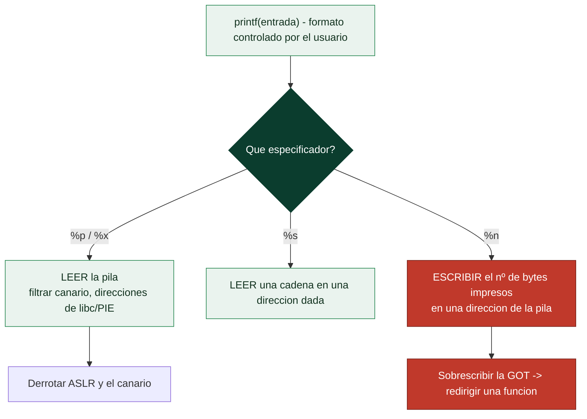

# Clase 125 — Vulnerabilidades de format string

> Parte: **5 — Explotación de sistemas y binarios** · Fuente: *Erickson, Hacking 2e* · CWE-134
> ⏱️ Duración estimada: **120 min** · Nivel: **Avanzado**

---

## 🎯 Objetivo

Entender y explotar las vulnerabilidades de **cadena de formato**, que aparecen cuando datos del
usuario llegan sin control al primer argumento de `printf`/`fprintf`/`syslog`. Aprenderás a usar `%p`
para leer la pila (info leak) y `%n` para escribir memoria arbitraria, dos primitivas potentísimas que
permiten filtrar canarios/direcciones y sobrescribir la GOT.

> ⚠️ **Ética:** solo en binarios de laboratorio o retos autorizados.

## 📚 Resultados de aprendizaje

Al finalizar, el alumno podrá:

1. **Reconocer** el patrón vulnerable (`printf(user_input)`).
2. **Filtrar** memoria con `%p`/`%x` y localizar el offset del argumento controlado.
3. **Escribir** valores con `%n`/`%hn` en direcciones elegidas.
4. **Sobrescribir** una entrada de la GOT para secuestrar el flujo.
5. **Automatizar** el ataque con `fmtstr_payload` de pwntools.

## 🗺️ Temas

| # | Tema | Por qué importa |
| --- | --- | --- |
| 1 | Cómo funciona printf y sus especificadores | Origen del bug |
| 2 | %p/%x para leer la pila | Primitiva de lectura / info leak |
| 3 | Offset de argumento | Dónde cae tu entrada en la pila |
| 4 | %n para escribir | Primitiva de escritura arbitraria |
| 5 | Escritura con %hn/%hhn | Escrituras parciales controladas |
| 6 | Sobrescritura de la GOT | Convertir escritura en control de flujo |
| 7 | fmtstr_payload | Automatización con pwntools |
| 8 | Mitigaciones (FORTIFY, -Wformat) | Cómo se previene |

## 🧠 Explicación en profundidad

### Cuando el usuario controla la cadena de formato

La vulnerabilidad de **format string** nace de un uso incorrecto de `printf` y su familia. La forma
correcta es `printf("%s", entrada)`, con una cadena de formato **fija** y la entrada como argumento.
La forma vulnerable es `printf(entrada)`, pasando la **entrada del usuario directamente como cadena
de formato**. La diferencia es enorme: si el usuario controla la cadena de formato, controla los
**especificadores** (`%x`, `%p`, `%s`, `%n`), que le dan la capacidad de **leer** y —lo más grave—
**escribir** en la memoria del proceso. Es un fallo doble: permite tanto la fuga de información como
la escritura arbitraria, y por eso es una de las primitivas más versátiles del *exploiting*.



### Leer la pila: la primitiva de fuga de información

`printf` espera que sus argumentos estén donde la convención de llamada los pone (registros y
pila). Cuando el atacante pone especificadores pero **no hay argumentos reales**, `printf` los toma
de todos modos **de la pila**, imprimiendo lo que haya ahí. Así, una entrada como `%p %p %p %p ...`
**vuelca el contenido de la pila** palabra a palabra: se ven direcciones de libc, del binario (PIE),
y —crucialmente— el **canario de la pila** (clase 122). Esto convierte el format string en una
**máquina de info leaks**, la pieza que faltaba para derrotar ASLR y el canary. El primer paso
práctico es encontrar el **offset del argumento**: enviar `AAAA %p %p %p...` y contar en qué
posición aparece `0x41414141`, lo que dice qué índice de `%N$p` apunta a la entrada controlada por
el atacante.

### %n: de leer a escribir en memoria arbitraria

El especificador que eleva el format string de "grave" a "crítico" es **`%n`**, que en lugar de
imprimir **escribe**: guarda el **número de bytes impresos hasta ese momento** en la dirección
apuntada por su argumento. Combinándolo con el control de la pila, el atacante coloca en la pila la
**dirección donde quiere escribir** y controla cuántos bytes se imprimen antes del `%n` (con
especificadores de ancho como `%100c`), logrando **escribir un valor arbitrario en una dirección
arbitraria** —la primitiva más poderosa del exploiting—. Como escribir un valor grande de golpe
requeriría imprimir millones de bytes, se usan las variantes **`%hn`** (escribe 2 bytes) y **`%hhn`**
(1 byte) para construir el valor por partes, escribiendo byte a byte con anchos manejables.

### El objetivo clásico y la defensa

Con una primitiva de escritura arbitraria, el objetivo canónico es **sobrescribir la GOT** (clase
122): reemplazar el puntero de una función de libc (como `printf` o `exit`) por la dirección de
`system` o de una cadena ROP, de modo que la próxima llamada a esa función ejecute lo que el atacante
quiere. Esto solo funciona con *partial RELRO* (GOT escribible); con *full RELRO* hay que buscar
otros objetivos. Construir manualmente el payload de escritura es tedioso —hay que calcular anchos y
ordenar escrituras—, así que **pwntools** lo automatiza con **`fmtstr_payload(offset, {dir: valor})`**,
que genera la cadena de formato completa dado el offset del argumento y un diccionario de
dirección→valor. La **defensa** es tajante y de código: **nunca pasar entrada del usuario como cadena
de formato** —usar siempre `printf("%s", entrada)`—; los compiladores modernos ayudan con `-Wformat`
(avisa del uso peligroso) y **FORTIFY** (`_FORTIFY_SOURCE`), que restringe `%n` en cadenas de formato
escribibles. Es, como casi todo en esta parte, un fallo de **no separar datos de control**: la cadena
de formato es código, y darle al usuario control sobre ella es darle control sobre el programa.

## 📖 Definiciones y características

- **Format string bug:** el usuario controla la cadena de formato de `printf`. *Clave:* CWE-134;
  permite lectura y escritura de memoria.
- **`%p`/`%x`:** vuelcan argumentos que `printf` cree recibir, en realidad valores de la pila. *Clave:*
  base del info leak.
- **Offset del argumento:** posición (`%N$p`) donde aparece tu buffer en la pila. *Clave:* se localiza
  enviando `AAAA %p %p %p...` y buscando `0x41414141`.
- **`%n`:** escribe en la dirección apuntada el número de bytes ya impresos. *Clave:* convierte formato
  en escritura arbitraria.
- **`%hn`/`%hhn`:** escriben 2 bytes / 1 byte, permitiendo controlar el valor por partes. *Clave:*
  evita imprimir millones de caracteres.
- **fmtstr_payload:** genera el payload de escritura automáticamente. *Clave:* `fmtstr_payload(offset,
  {addr: value})`.

## 📔 Glosario

| Término | Definición concisa |
|---------|--------------------|
| Format string | Vulnerabilidad por pasar entrada como cadena de formato |
| `printf(entrada)` | Uso vulnerable; lo correcto es `printf("%s", entrada)` |
| Especificador | `%x`, `%p`, `%s`, `%n` de la familia printf |
| %p / %x | Leen valores de la pila; base del info leak |
| Volcado de pila | `%p %p %p...` imprime el contenido de la pila |
| Offset de argumento | Índice `%N$p` que apunta a la entrada del atacante |
| Leak del canario | Format string revela el stack canary |
| %n | Escribe el número de bytes impresos en una dirección |
| %hn / %hhn | Escriben 2 y 1 byte; para construir valores por partes |
| Ancho (%100c) | Controla cuántos bytes se imprimen antes de `%n` |
| Escritura arbitraria | Escribir cualquier valor en cualquier dirección |
| Sobrescritura de la GOT | Objetivo clásico: redirigir una función de libc |
| fmtstr_payload | pwntools genera el payload de escritura automáticamente |
| FORTIFY / -Wformat | Mitigaciones del compilador contra format string |

## 🧰 Herramientas y preparación

```bash
pip install pwntools
gcc -fno-stack-protector -no-pie -o fmt fmt.c   # binario de práctica
```

Ejemplo vulnerable `fmt.c`:

```c
#include <stdio.h>
int main(){ char b[128]; fgets(b,128,stdin); printf(b); return 0; }
```

## 🧪 Laboratorio guiado

> Entorno propio.

1. Confirma la vulnerabilidad enviando `%p %p %p %p`: verás valores de la pila en vez del texto literal.

2. Localiza el offset de tu buffer:

   ```bash
   printf 'AAAABBBB %1$p %2$p %3$p %4$p %5$p %6$p\n' | ./fmt
   ```

   Cuenta hasta ver `0x42424242...` o `0x41414141`; ese índice `N` es tu offset.

3. Fuga de una dirección de la GOT para derrotar ASLR:

   ```python
   from pwn import *
   elf = context.binary = ELF("./fmt")
   p = process("./fmt")
   p.sendline(b"%7$s".ljust(8) + p64(elf.got["printf"]))  # ajusta offset
   ```

4. Escritura arbitraria con `%n` para sobrescribir la GOT (`printf`→`system`) usando pwntools:

   ```python
   payload = fmtstr_payload(6, {elf.got["exit"]: elf.symbols["win"]})
   p.sendline(payload)
   ```

   (Ajusta el offset `6` al que hallaste en el paso 2.)

5. Verifica en GDB que la entrada de la GOT cambió (`x/gx &printf@got`).

6. Si el binario tiene FORTIFY_SOURCE, observa que `%n` en formato escribible es rechazado y comenta la
   mitigación.

## ✍️ Ejercicios

1. Determina el offset del argumento controlado en tu binario.
2. Filtra el stack canary de un binario con canary usando `%p`.
3. Escribe el valor `0xdeadbeef` en una variable global con `%n`.
4. Sobrescribe la GOT de `puts` con la dirección de `win`.
5. Compara payload manual vs `fmtstr_payload`.
6. Recompila con `-D_FORTIFY_SOURCE=2 -O2` y explica qué cambia.

## 📝 Reto verificable

Entrega un exploit que, mediante una única cadena de formato, sobrescriba una entrada de la GOT para
desviar la ejecución a `win()`.

**Criterio de aceptación:** al ejecutar el binario con tu entrada, se llama a `win()` (mensaje visible),
y muestras en GDB la entrada GOT modificada.

## ⚠️ Errores comunes

| Síntoma / mensaje | Causa y cómo arreglar |
| --- | --- |
| `%p` imprime el texto literal | No es vulnerable, o `printf` recibe formato fijo |
| Offset incorrecto | Recuenta con `%N$p`; considera alineación del buffer |
| `%n` provoca crash | La dirección destino no es escribible o FORTIFY lo bloquea |
| Escritura enorme y lenta | Usa `%hn`/`%hhn` para escrituras parciales |
| Valor escrito equivocado | El contador de `printf` no coincide; ajusta el ancho |

## ❓ Preguntas frecuentes

**❓ ¿Por qué `%n` es tan peligroso?** Porque convierte una función de impresión en una primitiva de
escritura arbitraria de memoria.

**❓ ¿Sigue apareciendo este bug?** Sí, sobre todo en C legacy y logging; `-Wformat-security` ayuda a
detectarlo en compilación.

**❓ ¿Puedo leer y escribir en el mismo payload?** Sí, combinando `%s`/`%p` (lectura) con `%n`
(escritura), aunque suele dividirse en fases.

## 🔗 Referencias

- CWE-134: Use of Externally-Controlled Format String — <https://cwe.mitre.org/data/definitions/134.html>
- Erickson, J. *Hacking: The Art of Exploitation, 2e*. No Starch Press.
- pwntools fmtstr — <https://docs.pwntools.com/en/stable/fmtstr.html>
- scut/team teso, "Exploiting Format String Vulnerabilities" (paper clásico).

## 📥 Material descargable

- 📄 [Guía en PDF](./clase-125-guia.pdf) — versión imprimible de esta clase.
- 🎞️ [Presentación (PPTX)](./clase-125-presentacion.pptx) — deck para proyectar en clase.

## ⬅️ Clase anterior

[Clase 124 — Return-Oriented Programming (ROP)](../124-return-oriented-programming-rop/README.md)

## ➡️ Siguiente clase

[Clase 126 — Explotación de heap: fundamentos](../126-explotacion-de-heap-fundamentos/README.md)
