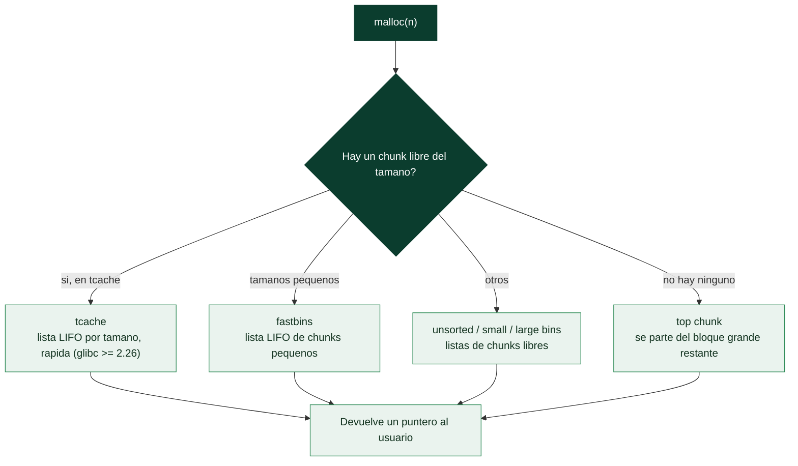

# Clase 126 — Explotación de heap: fundamentos

> Parte: **5 — Explotación de sistemas y binarios** · Fuente: *The Shellcoder's Handbook* · glibc malloc internals
> ⏱️ Duración estimada: **130 min** · Nivel: **Avanzado**

---

## 🎯 Objetivo

Entender cómo funciona el **heap** de glibc (ptmalloc2): chunks, cabeceras de tamaño, bins y arenas.
Sin este modelo mental, las técnicas de explotación de heap (UAF, double free, tcache poisoning) son
magia negra. Aprenderás a inspeccionar el heap en vivo con pwndbg y a razonar sobre cómo `malloc`/`free`
reorganizan la memoria.

> ⚠️ **Ética:** solo en laboratorio propio.

## 📚 Resultados de aprendizaje

Al finalizar, el alumno podrá:

1. **Describir** la estructura de un chunk: `prev_size`, `size`, flags, datos.
2. **Explicar** los tipos de bins (tcache, fast, small, large, unsorted).
3. **Inspeccionar** el heap con `heap`, `bins`, `vis_heap_chunks` de pwndbg.
4. **Predecir** cómo `malloc`/`free` reutilizan memoria.
5. **Reconocer** dónde nacen las corrupciones de heap.

## 🗺️ Temas

| # | Tema | Por qué importa |
| --- | --- | --- |
| 1 | Arena y heap | Estructura global del asignador |
| 2 | Chunk: size y flags (PREV_INUSE) | Metadatos que se corrompen |
| 3 | tcache (glibc ≥ 2.26) | Bin más explotado hoy |
| 4 | fastbins | Listas LIFO de chunks pequeños |
| 5 | unsorted/small/large bins | Reciclaje y consolidación |
| 6 | top chunk | Frontera del heap |
| 7 | Herramientas pwndbg de heap | Ver todo en vivo |
| 8 | Fuentes de corrupción | Base de UAF/double free/overflow |

## 🧠 Explicación en profundidad

### Otra región, otra clase entera de vulnerabilidades

Hasta ahora la explotación ha vivido en la **pila**. El **heap** es la otra gran región de memoria
—la de la asignación dinámica, `malloc`/`free` en C, `new`/`delete` en C++— y tiene sus propias
vulnerabilidades, más complejas pero igual de graves. La diferencia esencial: en la pila la
disposición es rígida y la conoce el compilador; en el heap, el **gestor de memoria** (el
*allocator*) decide dinámicamente dónde colocar cada asignación, siguiendo estructuras de datos
internas que el atacante puede **corromper y manipular**. Entender esas estructuras es el
prerrequisito de todo lo que sigue, porque la explotación de heap consiste en **engañar al
allocator** para que haga algo que no debería.

En Linux, el allocator por defecto es **ptmalloc** (parte de glibc), y organiza la memoria en
**arenas** (regiones que atienden a hilos distintos para reducir contención). La unidad básica es el
**chunk**: un bloque de memoria con **metadatos** delante. Un chunk asignado tiene una cabecera con
su **tamaño** (`size`) y unos **flags** en los bits bajos —el más importante es **`PREV_INUSE`**, que
indica si el chunk anterior está en uso—. Esa mezcla de metadatos y datos, todos en la misma región
que el usuario escribe, es la raíz de la explotabilidad: un overflow en un chunk pisa los metadatos
del siguiente.



### Los bins: cómo el allocator recicla la memoria liberada

Cuando se libera un chunk con `free`, no se devuelve al sistema operativo: el allocator lo guarda en
una **lista de libres** (*bin*) para reutilizarlo rápido en la próxima petición del mismo tamaño.
Conocer los tipos de bin es la mitad de la explotación de heap. El **tcache** (*thread cache*,
introducido en glibc 2.26) es una caché por hilo, muy rápida, organizada como listas **LIFO** por
tamaño; es el primer sitio donde busca `malloc` y el objetivo de los ataques modernos de heap. Los
**fastbins** guardan chunks pequeños en listas LIFO. Los **unsorted, small y large bins** manejan el
resto con políticas distintas. Y el **top chunk** es el gran bloque contiguo de memoria libre del
que se recorta cuando ningún bin sirve. La mecánica clave que explotan casi todos los ataques: estas
listas se enlazan mediante **punteros que viven dentro de los propios chunks liberados** (donde antes
estaban los datos del usuario), así que si el atacante controla el contenido de un chunk liberado,
controla esos punteros —y con ellos, a dónde entregará memoria el próximo `malloc`—.

### De la teoría a la corrupción: los orígenes de los bugs

La explotación de heap es más difícil que la de pila porque requiere **manipular el estado del
allocator** con una secuencia precisa de `malloc` y `free` (el llamado *heap grooming* o *feng
shui*): colocar los chunks en las posiciones adecuadas para que la corrupción tenga el efecto
deseado. Las **fuentes de corrupción** son las vulnerabilidades que la habilitan, y cada una tiene su
clase: el **heap overflow** (escribir más allá de un chunk, pisando los metadatos del siguiente); el
**use-after-free** y el **double free** (clase 127, usar o liberar un chunk ya liberado); y los
**integer overflows** en el cálculo del tamaño (clase 128, que hacen que `malloc` reserve menos de lo
pedido). El instrumento indispensable para trabajar aquí es **pwndbg**, cuyos comandos de heap
(`heap`, `bins`, `tcache`, `vis_heap_chunks`) **visualizan** los chunks, sus tamaños, sus flags y el
estado de cada bin —sin esa visibilidad, el heap es opaco—. La lección de fundamentos es que el heap
no es un caos, sino un sistema con reglas precisas, y explotarlo es aprender esas reglas mejor de lo
que las conoce el programa víctima.

## 📖 Definiciones y características

- **Chunk:** unidad de asignación del heap con cabecera (`size`) y datos. *Clave:* el bit `PREV_INUSE`
  indica si el chunk previo está en uso.
- **tcache:** caché por-hilo de chunks liberados (glibc moderna). *Clave:* LIFO, con puntero `next`
  manipulable → tcache poisoning.
- **fastbin:** lista LIFO de chunks pequeños que no se consolidan de inmediato. *Clave:* histórico
  objetivo de fastbin dup.
- **unsorted bin:** lista temporal de chunks recién liberados antes de clasificarlos. *Clave:* filtra
  punteros de libc (info leak vía `fd`/`bk`).
- **top chunk:** chunk que representa el espacio libre restante. *Clave:* corromper su `size` habilita
  el "house of force".
- **PREV_INUSE / consolidación:** al liberar, chunks adyacentes libres se fusionan. *Clave:* falsear
  metadatos engaña a la consolidación.

## 📔 Glosario

| Término | Definición concisa |
|---------|--------------------|
| Heap | Región de asignación dinámica (malloc/free) |
| Allocator | Gestor que decide dónde colocar cada asignación |
| ptmalloc | Allocator por defecto de glibc |
| Arena | Región del heap que atiende a un conjunto de hilos |
| Chunk | Bloque de memoria con metadatos delante |
| size / flags | Tamaño del chunk y bits de estado en la cabecera |
| PREV_INUSE | Flag que indica si el chunk anterior está en uso |
| Bin | Lista de chunks libres para reutilizar |
| tcache | Caché por hilo, LIFO por tamaño (glibc ≥ 2.26) |
| fastbins | Listas LIFO de chunks pequeños |
| unsorted/small/large bins | Otras listas de chunks libres |
| top chunk | Bloque grande contiguo del que se recorta |
| Punteros en chunks liberados | Enlaces de las listas; objetivo de la corrupción |
| Heap grooming / feng shui | Ordenar los chunks con malloc/free precisos |
| vis_heap_chunks | Comando de pwndbg que visualiza el heap |

## 🧰 Herramientas y preparación

```bash
pip install pwntools
# pwndbg incluye comandos de heap; verifica versión de glibc:
ldd --version | head -1
```

Compila un programa de práctica que reserve y libere chunks con `malloc`/`free`.

## 🧪 Laboratorio guiado

> Entorno propio.

1. Programa `heapdemo.c`:

   ```c
   #include <stdlib.h>
   #include <string.h>
   int main(){
       char *a = malloc(0x30); strcpy(a,"AAAA");
       char *b = malloc(0x30); strcpy(b,"BBBB");
       free(a); free(b);
       char *c = malloc(0x30);   // reutiliza el último liberado (tcache LIFO)
       return 0;
   }
   ```

2. Depura en pwndbg poniendo breakpoints tras cada `malloc`/`free`:

   ```gdb
   pwndbg> break main
   pwndbg> run
   pwndbg> heap          # muestra la lista de chunks
   pwndbg> vis_heap_chunks
   ```

3. Tras los dos `free`, observa `bins` y verás `a` y `b` en el **tcache** del tamaño 0x40.

4. Comprueba el orden LIFO: `c` reutiliza la dirección de `b` (el último liberado).

5. Examina la cabecera de un chunk con `x/4gx <dir_chunk-0x10>` e identifica `prev_size` y `size`
   (con el bit `PREV_INUSE`).

6. Repite reservando chunks grandes (0x500) para verlos ir al unsorted/large bin y nota los punteros
   `fd`/`bk` hacia libc (útiles para leaks en clases siguientes).

## ✍️ Ejercicios

1. Dibuja el layout de dos chunks contiguos indicando dónde está `size` de cada uno.
2. Muestra con pwndbg el contenido del tcache tras liberar 3 chunks iguales.
3. Explica por qué tcache es LIFO y qué implica para la reutilización.
4. Reserva un chunk > 0x408 y observa a qué bin va al liberarlo.
5. Localiza el top chunk y su `size` en `vis_heap_chunks`.
6. Identifica el `next` de un chunk en tcache (dónde apunta).

## 📝 Reto verificable

Con un programa que reserve y libere varios chunks, demuestra en pwndbg que el tcache es LIFO
prediciendo qué dirección devolverá el siguiente `malloc`.

**Criterio de aceptación:** predices correctamente la dirección devuelta por un `malloc` posterior
basándote en el estado del tcache mostrado por `bins`.

## ⚠️ Errores comunes

| Síntoma / mensaje | Causa y cómo arreglar |
| --- | --- |
| No ves tcache | glibc antigua (<2.26); revisa versión |
| `size` "raro" (+1) | El bit PREV_INUSE está puesto; enmascara con `& ~0x7` |
| Chunks no se consolidan | tcache/fastbin no consolidan; usa tamaños mayores |
| Direcciones cambian | ASLR; desactívalo para estudiar el layout |
| Confundir datos con metadatos | El usuario ve el puntero a datos, no a la cabecera |

## ❓ Preguntas frecuentes

**❓ ¿Por qué estudiar glibc y no otro asignador?** Es el más común en Linux/CTF. jemalloc/tcmalloc
tienen internals distintos.

**❓ ¿El tamaño que pido es el tamaño del chunk?** No: se redondea e incluye metadatos; `malloc(0x30)`
suele dar un chunk de 0x40.

**❓ ¿Necesito memorizar todos los bins?** Domina tcache y fastbins primero; son los más explotados en
glibc moderna.

## 🔗 Referencias

- The Shellcoder's Handbook, cap. de heap. Wiley.
- glibc malloc internals (sploitfun) — <https://sploitfun.wordpress.com/2015/02/10/understanding-glibc-malloc/>
- how2heap (Shellphish) — <https://github.com/shellphish/how2heap>
- Azeria Labs, heap exploitation — <https://azeria-labs.com/heap-exploitation-part-1/>

## 📥 Material descargable

- 📄 [Guía en PDF](./clase-126-guia.pdf) — versión imprimible de esta clase.
- 🎞️ [Presentación (PPTX)](./clase-126-presentacion.pptx) — deck para proyectar en clase.

## ⬅️ Clase anterior

[Clase 125 — Vulnerabilidades de format string](../125-vulnerabilidades-de-format-string/README.md)

## ➡️ Siguiente clase

[Clase 127 — Heap: use-after-free y double free](../127-heap-use-after-free-y-double-free/README.md)
