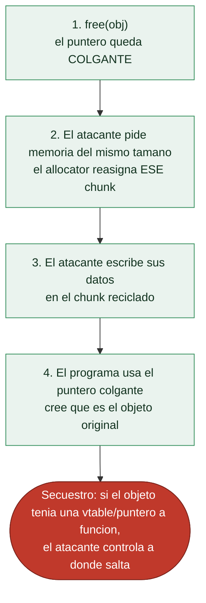

# Clase 127 — Heap: use-after-free y double free

> Parte: **5 — Explotación de sistemas y binarios** · Fuente: *The Shellcoder's Handbook* · how2heap (Shellphish)
> ⏱️ Duración estimada: **140 min** · Nivel: **Experto**

---

## 🎯 Objetivo

Explotar dos de las corrupciones de heap más frecuentes: **use-after-free (UAF)**, donde se usa un
puntero a memoria ya liberada, y **double free**, donde se libera dos veces el mismo chunk. Verás cómo
el UAF permite leer/escribir datos ajenos y secuestrar punteros de función, y cómo un double free en
tcache (**tcache poisoning**) logra escritura arbitraria para redirigir `malloc` a una dirección elegida.

> ⚠️ **Ética:** solo en laboratorio propio o CTF autorizado.

## 📚 Resultados de aprendizaje

Al finalizar, el alumno podrá:

1. **Explicar** las causas de UAF y double free y su impacto.
2. **Aprovechar** un UAF para leer/escribir sobre un objeto reasignado.
3. **Realizar** tcache poisoning a partir de un double free.
4. **Redirigir** `malloc` a una dirección arbitraria (p. ej. `__free_hook`/GOT).
5. **Detectar** estos bugs con ASan.

## 🗺️ Temas

| # | Tema | Por qué importa |
| --- | --- | --- |
| 1 | Puntero colgante (dangling) | Raíz del UAF |
| 2 | Reasignación del chunk | Cómo se solapan objetos |
| 3 | Secuestro de vtable/punteros | UAF → control de flujo |
| 4 | Double free en tcache | Base del poisoning |
| 5 | tcache key (mitigación) | Detección de double free en glibc ≥2.29 |
| 6 | tcache poisoning | Escritura del `next` → malloc arbitrario |
| 7 | Objetivos: __free_hook, GOT | Convertir en RCE |
| 8 | Detección con ASan | Cazar el bug en desarrollo |

## 🧠 Explicación en profundidad

### Usar lo que ya devolviste: el use-after-free

El **use-after-free** (UAF) es hoy una de las vulnerabilidades más explotadas del mundo real
(navegadores, kernels), y su lógica es sutil. Cuando un programa libera memoria con `free`, el
puntero que apuntaba a ella **sigue existiendo** —se convierte en un **puntero colgante** (*dangling
pointer*)—, pero la memoria ya no le pertenece: el allocator puede reasignarla a otra cosa. Un UAF
ocurre cuando el programa **usa ese puntero colgante** después del `free`, accediendo a memoria que
ahora contiene datos distintos. La explotación consiste en un baile de tres pasos: el programa libera
un objeto, el atacante consigue que el allocator **reasigne ese mismo chunk** a un objeto que él
controla (pidiendo memoria del mismo tamaño), y luego el programa usa el puntero colgante creyendo
que apunta al objeto original —pero lee o escribe los datos del atacante—.



### Por qué el UAF suele terminar en control de ejecución

El UAF es tan potente porque los objetos de C++ (y muchas estructuras de C) contienen **punteros a
funciones**, y el más jugoso es la **vtable**: una tabla de punteros a los métodos virtuales de un
objeto. Si el atacante recicla un chunk liberado con datos que él controla, y el programa luego
**llama a un método** del objeto colgante, la CPU salta a la dirección que el atacante puso en la
"vtable" falsa —control de ejecución directo—. Este patrón —liberar un objeto con vtable, reciclarlo
con una vtable falsa, provocar una llamada a método— es la explotación de UAF canónica y la que ha
comprometido navegadores durante años. No siempre hace falta una vtable: cualquier puntero de función
o dato sensible dentro del objeto reciclado sirve.

### Double free: liberar dos veces para envenenar las listas

El **double free** —liberar el mismo chunk dos veces— es un tipo relacionado de corrupción que ataca
directamente las **listas de bins** de la clase 126. Al liberar un chunk dos veces, queda **dos veces
en la lista de libres** (por ejemplo el tcache), de modo que dos `malloc` sucesivos devuelven el
**mismo puntero** a dos objetos distintos —un solapamiento que el atacante explota—. La técnica
moderna es el **tcache poisoning**: aprovechando que el tcache enlaza sus chunks libres con un puntero
`next` que vive **dentro del chunk**, el atacante libera un chunk, **sobrescribe ese puntero `next`**
con una dirección arbitraria, y en los siguientes `malloc` el allocator entrega... esa dirección
arbitraria. Es una primitiva de **escritura donde el atacante quiera**, obtenida engañando al tcache.

### Las mitigaciones del tcache y la detección

glibc endureció el tcache tras la oleada de estos ataques, y conocer las mitigaciones es parte del
tema. La **tcache key** es un valor que se escribe en cada chunk al liberarlo; antes de meterlo en la
lista, `free` comprueba si esa key ya está presente, lo que **detecta el double free** más obvio y
aborta. Versiones más recientes añaden el **safe-linking**, que ofusca los punteros `next` del tcache
(los cifra con la dirección del propio chunk) para dificultar el tcache poisoning —el atacante ya no
puede escribir una dirección limpia, tiene que conocer o filtrar el "cifrado"—. Estas defensas no
eliminan los ataques, los encarecen: la explotación de heap moderna es una carrera entre técnicas de
corrupción y mitigaciones del allocator. Del lado del **desarrollo**, la defensa raíz es no usar
punteros colgantes —poner el puntero a `NULL` tras `free` y no reusarlo—, y las herramientas de
detección como **AddressSanitizer (ASan)**, que instrumenta el binario para **detectar UAF y double
free en el momento en que ocurren** durante las pruebas, son hoy indispensables en el desarrollo de
C/C++ seguro y en el *fuzzing* de la clase 136.

## 📖 Definiciones y características

- **Use-after-free:** uso de memoria tras `free`. *Clave:* CWE-416; si el chunk se reasigna, escribes
  sobre otro objeto.
- **Puntero colgante:** referencia que sobrevive al `free`. *Clave:* no ponerlo a `NULL` es la causa
  típica.
- **Double free:** liberar dos veces el mismo puntero. *Clave:* corrompe la lista del bin, permitiendo
  devolver el mismo chunk dos veces.
- **tcache poisoning:** sobrescribir el puntero `next` de un chunk en tcache. *Clave:* el siguiente
  `malloc` de ese tamaño devuelve la dirección que elijas.
- **tcache key:** campo que glibc moderna usa para detectar double free en tcache. *Clave:* hay que
  falsearlo o usar otra ruta.
- **__free_hook / __malloc_hook:** punteros de función históricos usados como objetivo de escritura.
  *Clave:* eliminados en glibc ≥2.34; hoy se apunta a GOT/estructuras alternativas.

## 📔 Glosario

| Término | Definición concisa |
|---------|--------------------|
| Use-after-free (UAF) | Usar un puntero a memoria ya liberada |
| Puntero colgante | Puntero que sobrevive al `free` de su memoria |
| Reasignación | El allocator entrega el chunk liberado a otra petición |
| Reciclar el chunk | Pedir memoria del mismo tamaño para controlar el contenido |
| vtable | Tabla de punteros a métodos virtuales de un objeto |
| Secuestro de vtable | Vtable falsa que redirige una llamada a método |
| Double free | Liberar el mismo chunk dos veces |
| Solapamiento | Dos malloc devuelven el mismo puntero |
| tcache poisoning | Sobrescribir el `next` del tcache para malloc arbitrario |
| Puntero next | Enlace de la lista tcache, dentro del chunk |
| Escritura arbitraria | Primitiva que da el tcache poisoning |
| tcache key | Valor que detecta el double free obvio |
| safe-linking | Ofusca los punteros next del tcache |
| AddressSanitizer (ASan) | Detecta UAF y double free durante las pruebas |

## 🧰 Herramientas y preparación

```bash
pip install pwntools
# ASan para detección:
gcc -fsanitize=address -g uaf.c -o uaf_asan
ldd --version | head -1     # conocer la versión de glibc y sus mitigaciones
```

## 🧪 Laboratorio guiado

> Entorno propio.

1. **UAF** — programa `uaf.c`:

   ```c
   #include <stdio.h>
   #include <stdlib.h>
   #include <string.h>
   int main(){
       char *a = malloc(0x40);
       free(a);                 // a queda colgante
       char *b = malloc(0x40);  // reutiliza el mismo chunk
       strcpy(b, "datos de b");
       printf("a ahora lee: %s\n", a);  // UAF: a y b son la misma memoria
   }
   ```

   Ejecuta y observa que `a` "ve" lo que escribió `b`.

2. Detecta el bug con ASan: `./uaf_asan` reporta `heap-use-after-free` con backtrace.

3. **Double free / tcache poisoning** en pwndbg (glibc que lo permita):

   - Reserva dos chunks del mismo tamaño, libéralos y provoca el double free controlado.
   - Sobrescribe el `next` del chunk en tcache con la dirección objetivo:

   ```python
   from pwn import *
   # ...interacción con el binario de reto...
   # tras el double free, escribimos el next del chunk liberado:
   edit(idx, p64(target_addr))   # target_addr = &__free_hook o entrada GOT
   malloc(size)                  # saca el chunk falso al frente
   malloc(size)                  # este malloc devuelve target_addr
   ```

4. Escribe en el chunk devuelto para colocar `system` en `__free_hook` (o el equivalente moderno) y
   dispara un `free` sobre un chunk que contenga `"/bin/sh"`.

5. Verifica en GDB que `malloc` devolvió tu dirección objetivo (`vis_heap_chunks`, `bins`).

6. Comenta cómo la `tcache key` de glibc moderna obligaría a un paso extra para el double free.

## ✍️ Ejercicios

1. Corrige el `uaf.c` poniendo el puntero a `NULL` tras `free` y confirma con ASan.
2. Explica por qué el chunk reasignado solapa los dos punteros.
3. Realiza tcache poisoning apuntando a una variable global conocida.
4. Investiga la `tcache key` y cómo detecta el double free.
5. Enumera objetivos de escritura viables en tu versión de glibc.
6. Compara la salida de ASan con la de Valgrind para el mismo UAF.

## 📝 Reto verificable

En un binario de reto con UAF/double free, logra que un `malloc` devuelva una dirección que tú elijas
mediante tcache poisoning.

**Criterio de aceptación:** demuestras en GDB que un `malloc` retorna la dirección objetivo, y (si el
reto lo permite) obtienes ejecución de código o lectura de la flag.

## ⚠️ Errores comunes

| Síntoma / mensaje | Causa y cómo arreglar |
| --- | --- |
| `free(): double free detected in tcache 2` | tcache key activa; falséala o usa fastbin |
| El poisoning no cambia malloc | El `next` mal alineado o tamaño de bin incorrecto |
| Crash al liberar chunk falso | Metadatos inválidos; ajusta `size` y alineación |
| `__free_hook` no existe | glibc ≥2.34; apunta a GOT/estructuras alternativas |
| ASan no detecta nada | No compilaste con `-fsanitize=address` |

## ❓ Preguntas frecuentes

**❓ ¿UAF siempre da RCE?** No siempre; depende de si el objeto reasignado contiene punteros de función
o datos sensibles.

**❓ ¿Sigue funcionando el ataque a `__free_hook`?** No en glibc ≥2.34 (los hooks fueron eliminados);
hay que buscar objetivos modernos.

**❓ ¿Cómo evito estos bugs al programar?** Pon punteros a `NULL` tras `free`, usa smart pointers en
C++ y compila con ASan en CI.

## 🔗 Referencias

- CWE-416: Use After Free — <https://cwe.mitre.org/data/definitions/416.html>
- how2heap (Shellphish) — <https://github.com/shellphish/how2heap>
- The Shellcoder's Handbook, cap. de heap. Wiley.
- AddressSanitizer — <https://github.com/google/sanitizers/wiki/AddressSanitizer>

## 📥 Material descargable

- 📄 [Guía en PDF](./clase-127-guia.pdf) — versión imprimible de esta clase.
- 🎞️ [Presentación (PPTX)](./clase-127-presentacion.pptx) — deck para proyectar en clase.

## ⬅️ Clase anterior

[Clase 126 — Explotación de heap: fundamentos](../126-explotacion-de-heap-fundamentos/README.md)

## ➡️ Siguiente clase

[Clase 128 — Integer overflows y errores aritméticos](../128-integer-overflows-y-errores-aritmeticos/README.md)
