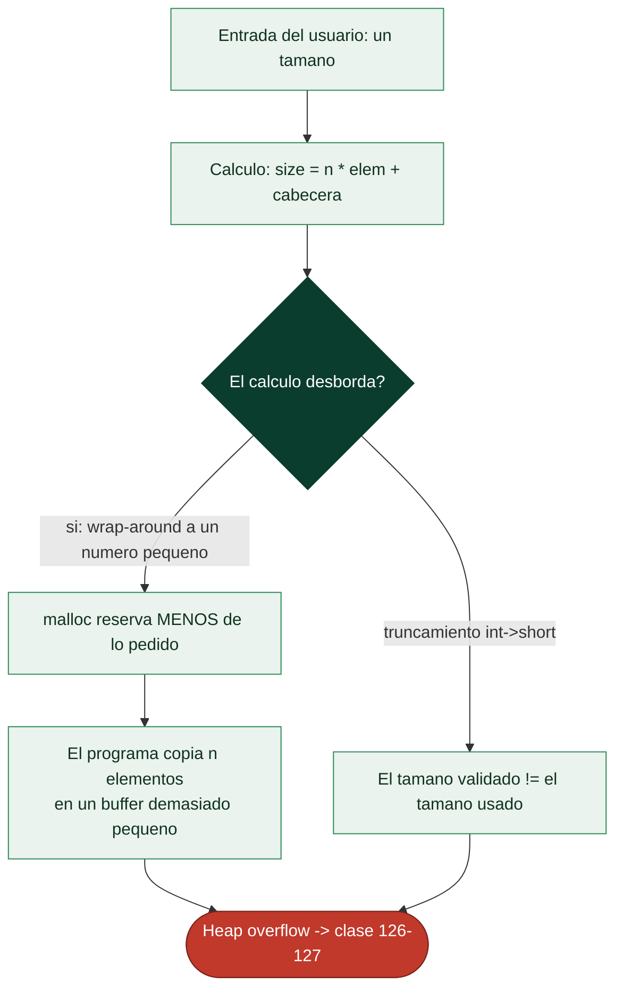

# Clase 128 — Integer overflows y errores aritméticos

> Parte: **5 — Explotación de sistemas y binarios** · Fuente: *The Shellcoder's Handbook* · CWE-190/191
> ⏱️ Duración estimada: **100 min** · Nivel: **Intermedio**

---

## 🎯 Objetivo

Comprender cómo los errores aritméticos con enteros (**overflow**, **underflow**, **truncamiento**,
**confusión signed/unsigned**) se convierten en vulnerabilidades de memoria: una multiplicación de
tamaño que se desborda genera un `malloc` demasiado pequeño y, después, un overflow de heap. Aprenderás
a detectar estos patrones y a explotarlos indirectamente.

> ⚠️ **Ética:** solo en laboratorio propio.

## 📚 Resultados de aprendizaje

Al finalizar, el alumno podrá:

1. **Explicar** overflow, underflow, truncamiento y confusión de signo.
2. **Identificar** cálculos de tamaño vulnerables antes de `malloc`/`memcpy`.
3. **Provocar** un heap overflow a partir de un integer overflow.
4. **Detectar** estos bugs con UBSan y análisis de código.
5. **Programar** comprobaciones aritméticas seguras.

## 🗺️ Temas

| # | Tema | Por qué importa |
| --- | --- | --- |
| 1 | Representación de enteros y wrap-around | Base del comportamiento |
| 2 | Signed vs unsigned | Comparaciones que se invierten |
| 3 | Truncamiento (int→short) | Pérdida de bits altos |
| 4 | Overflow en cálculo de tamaño | `n*size` que se desborda |
| 5 | De integer bug a heap overflow | La cadena de explotación |
| 6 | Off-by-one | Un byte fuera de límite |
| 7 | UBSan | Detección en desarrollo |
| 8 | Aritmética segura | `__builtin_mul_overflow`, límites |

## 🧠 Explicación en profundidad

### El error que no crashea pero prepara el desastre

Los **errores aritméticos con enteros** rara vez son explotables por sí solos: su gravedad está en
que **habilitan** otras vulnerabilidades, típicamente un overflow de buffer o de heap. La causa es
que los enteros de un ordenador tienen **tamaño fijo** y **no pueden representar cualquier valor**:
un `unsigned int` de 32 bits solo llega hasta 4 294 967 295, y al sumarle uno **da la vuelta**
(*wrap-around*) a 0. Ese comportamiento —perfectamente definido para los `unsigned`— produce
resultados sorprendentes cuando el programador no lo anticipa, y esos resultados sorprendentes se
convierten en fallos de memoria.



### Signed, unsigned y truncamiento: tres trampas relacionadas

Hay tres formas en que la aritmética de enteros traiciona al programador. El **wrap-around**
(desbordamiento) ya visto: una suma o multiplicación que supera el máximo del tipo y "da la vuelta".
La confusión **signed/unsigned**: un mismo patrón de bits se interpreta como positivo o como un
número enorme según el tipo, de modo que una comprobación `if (len < BUFSIZE)` con `len` firmado se
puede burlar pasando un valor **negativo** que, reinterpretado como `unsigned` en la copia posterior,
se vuelve gigantesco. Y el **truncamiento**: asignar un `int` de 32 bits a un `short` de 16
descarta los bits altos, de modo que el valor **comprobado** (32 bits) y el valor **usado** (16 bits)
pueden diferir. Las tres comparten una firma: **el número que se valida no es el número que se usa**.

### El patrón clásico: overflow en el cálculo del tamaño

El caso explotable por excelencia es un **overflow en el cálculo del tamaño de una asignación**.
Considérese `malloc(n * sizeof(elem))` donde `n` viene del usuario: si `n` es lo bastante grande, la
multiplicación **desborda** y produce un número **pequeño**, así que `malloc` reserva un buffer
diminuto —pero el programa, creyendo que reservó espacio para `n` elementos, **copia los n
elementos** y desborda el heap. El atacante no ha tocado la copia; ha manipulado la **aritmética
previa** para que la reserva sea insuficiente. Es el puente entre un "bug numérico" inofensivo en
apariencia y un heap overflow de la clase 126. El **off-by-one** —equivocarse en uno al calcular un
límite (`<=` en vez de `<`, reservar `n` bytes para una cadena de `n` caracteres olvidando el
terminador nulo)— es un primo cercano: un solo byte de más, que a menudo es exactamente el byte de
metadatos del chunk siguiente o el byte bajo de un puntero, suficiente para explotar.

### Detectar y prevenir

Como estos bugs no crashean por sí mismos, son difíciles de encontrar por observación. La herramienta
clave es **UBSan** (*UndefinedBehaviorSanitizer*), que instrumenta el binario para **detectar
overflows de enteros con signo y otros comportamientos indefinidos en tiempo de ejecución** durante
las pruebas y el fuzzing (clase 136) —hace visible el momento exacto del wrap-around—. La **defensa**
a nivel de código es la **aritmética segura**: comprobar los límites **antes** de operar (¿cabe la
multiplicación en el tipo?), usar funciones de multiplicación con detección de overflow
(`__builtin_mul_overflow` en GCC/Clang), elegir tipos con el ancho adecuado y evitar mezclar signed y
unsigned. La lección conecta con toda la parte: la seguridad de memoria en C/C++ depende de detalles
que el lenguaje no comprueba por ti, y un descuido aritmético de una línea puede ser el primer eslabón
de una cadena que termina en RCE.

## 📖 Definiciones y características

- **Integer overflow:** el resultado excede el máximo del tipo y "da la vuelta". *Clave:* CWE-190;
  `0xFFFFFFFF + 1 = 0` en `uint32`.
- **Underflow:** una resta cae por debajo de 0 en unsigned → número enorme. *Clave:* `len - 1` con
  `len=0` da `SIZE_MAX`.
- **Truncamiento:** asignar un valor a un tipo más pequeño pierde bits altos. *Clave:* `int`→`short`
  puede pasar un tamaño grande a uno pequeño.
- **Confusión signed/unsigned:** una comparación firmada trata un negativo como válido. *Clave:*
  `if (len < MAX)` con `len` negativo pasa el chequeo y luego se usa como unsigned enorme.
- **Off-by-one:** escribir un elemento de más (típico `<=` en vez de `<`). *Clave:* puede sobrescribir
  el byte de metadatos del chunk siguiente.

## 📔 Glosario

| Término | Definición concisa |
|---------|--------------------|
| Error aritmético | Bug de enteros que habilita otra vulnerabilidad |
| Tamaño fijo | Los enteros no representan cualquier valor |
| Wrap-around | El valor da la vuelta al superar el máximo del tipo |
| Overflow de entero | Resultado que excede la capacidad del tipo |
| Signed / unsigned | Interpretación del mismo patrón de bits |
| Bypass con negativo | Un valor firmado negativo que se vuelve enorme sin signo |
| Truncamiento | Asignar a un tipo más pequeño descarta bits altos |
| Validado ≠ usado | El número comprobado difiere del realmente usado |
| Overflow en el tamaño | La reserva desborda y queda pequeña; copia posterior desborda |
| Puente a heap overflow | El bug numérico habilita la corrupción de memoria |
| Off-by-one | Error de uno en un límite; a menudo pisa metadatos |
| UBSan | Sanitizer que detecta overflows de enteros en pruebas |
| Aritmética segura | Comprobar límites antes de operar |
| __builtin_mul_overflow | Multiplicación con detección de overflow |

## 🧰 Herramientas y preparación

```bash
gcc -fsanitize=undefined -g intov.c -o intov_ubsan
gcc -fsanitize=address -g intov.c -o intov_asan
```

## 🧪 Laboratorio guiado

> Entorno propio.

1. Cálculo de tamaño vulnerable `intov.c`:

   ```c
   #include <stdio.h>
   #include <stdlib.h>
   #include <string.h>
   char *dup_items(unsigned n){
       // BUG: n * 8 puede desbordar en 32 bits -> buffer minúsculo
       unsigned size = n * 8;
       char *buf = malloc(size);
       for (unsigned i = 0; i < n; i++) memcpy(buf + i*8, "AAAAAAAA", 8); // heap overflow
       return buf;
   }
   int main(int argc, char **argv){ dup_items(strtoul(argv[1],0,10)); }
   ```

2. Ejecuta con un `n` que provoque wrap-around (`n = 0x20000000` = 536870912) y observa el crash. El
   producto `n * 8` se evalúa en `unsigned int` (32 bits) por las conversiones aritméticas usuales, así
   que se desborda **también en un binario nativo de 64 bits**: no necesitas compilar a 32 bits.

3. Confirma el diagnóstico. Ojo: el overflow **unsigned** es comportamiento *definido*
   (wrap-around), así que `-fsanitize=undefined` (UBSan) **no** lo reporta. Para verlo hace
   falta el sanitizer específico de clang:

   ```bash
   clang -fsanitize=unsigned-integer-overflow -g intov.c -o intov
   ./intov 536870912       # ahora sí: "unsigned integer overflow"
   # (Alternativa: la consecuencia real —el heap overflow— se observa con ASan en el paso 4.)
   ```

4. Con ASan, observa el `heap-buffer-overflow` que sigue al `malloc` insuficiente.

5. Corrige con aritmética segura:

   ```c
   unsigned size;
   if (__builtin_mul_overflow(n, 8u, &size)) return NULL;
   ```

6. Ejercicio de confusión de signo: cambia el parámetro a `int` y pasa un valor negativo; observa cómo
   supera un chequeo `len < MAX` y luego explota como unsigned.

## ✍️ Ejercicios

1. Muestra un ejemplo de underflow (`len=0; len-1`) y su valor resultante.
2. Escribe un chequeo previo a `malloc` que rechace el overflow.
3. Provoca un truncamiento int→short y explica la pérdida de bits.
4. Detecta con UBSan un overflow signed y explica por qué es UB.
5. Encuentra un off-by-one en un bucle `for(i<=n)`.
6. Analiza un CVE real de integer overflow y resume la cadena hasta el heap overflow.

## 📝 Reto verificable

Toma `intov.c`, demuestra el heap overflow con ASan y luego repáralo con `__builtin_mul_overflow`,
probando que el mismo `n` malicioso ya no corrompe memoria.

**Criterio de aceptación:** antes del fix ASan reporta `heap-buffer-overflow`; después, el programa
rechaza el tamaño y ASan no reporta nada.

## ⚠️ Errores comunes

| Síntoma / mensaje | Causa y cómo arreglar |
| --- | --- |
| Esperabas que no se desbordara en 64 bits | `n * 8` se evalúa en `unsigned int` (32 bits) por las conversiones usuales, así que se desborda igual en un binario de 64 bits. Solo con operandos de 64 bits (`size_t`) haría falta un `n` mucho mayor |
| Chequeo `if (a+b < a)` optimizado | UB en signed; usa unsigned o `__builtin_*_overflow` |
| UBSan no reporta | No compilaste con `-fsanitize=undefined` |
| Valor negativo "pasa" el límite | Comparación signed; convierte a unsigned con cuidado |
| memcpy tamaño enorme | Underflow en el cálculo; valida antes |

## ❓ Preguntas frecuentes

**❓ ¿Un integer overflow es explotable por sí solo?** Normalmente no: su peligro está en alimentar
después un `malloc`/`memcpy`/índice.

**❓ ¿signed overflow es UB?** Sí en C: el compilador puede asumir que no ocurre, generando bugs
sutiles. Unsigned hace wrap definido.

**❓ ¿Cómo protejo mi código?** Valida tamaños con builtins de overflow, usa `size_t` correctamente y
activa UBSan en CI.

## 🔗 Referencias

- CWE-190: Integer Overflow or Wraparound — <https://cwe.mitre.org/data/definitions/190.html>
- CWE-191: Integer Underflow — <https://cwe.mitre.org/data/definitions/191.html>
- UndefinedBehaviorSanitizer — <https://clang.llvm.org/docs/UndefinedBehaviorSanitizer.html>
- The Shellcoder's Handbook, cap. de integer bugs. Wiley.

## 📥 Material descargable

- 📄 [Guía en PDF](./clase-128-guia.pdf) — versión imprimible de esta clase.
- 🎞️ [Presentación (PPTX)](./clase-128-presentacion.pptx) — deck para proyectar en clase.

## ⬅️ Clase anterior

[Clase 127 — Heap: use-after-free y double free](../127-heap-use-after-free-y-double-free/README.md)

## ➡️ Siguiente clase

[Clase 129 — Explotación en Windows: manejo de SEH](../129-explotacion-en-windows-manejo-de-seh/README.md)
