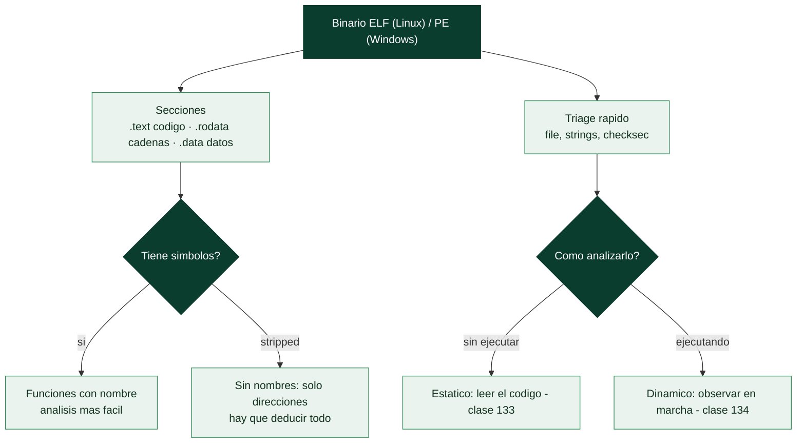

# Clase 130 — Ingeniería inversa: introducción

> Parte: **5 — Explotación de sistemas y binarios** · Fuente: *Andriesse, Practical Binary Analysis* · *Eilam, Reversing*
> ⏱️ Duración estimada: **110 min** · Nivel: **Intermedio**

---

## 🎯 Objetivo

Sentar las bases de la **ingeniería inversa** de software: qué es, para qué sirve (análisis de malware,
descubrimiento de vulnerabilidades, interoperabilidad, CTF), y qué contiene un binario ejecutable. Verás
los formatos ELF (Linux) y PE (Windows), las secciones, símbolos y strings, y el flujo general de un
análisis: reconocimiento estático rápido antes de abrir un desensamblador.

> ⚠️ **Ética:** aplica ingeniería inversa solo a binarios propios, de práctica o cuya licencia/permiso
> lo autoricen. Respeta la ley y los términos de uso.

## 📚 Resultados de aprendizaje

Al finalizar, el alumno podrá:

1. **Definir** ingeniería inversa y sus casos de uso legítimos.
2. **Describir** la estructura de un ELF y un PE (cabeceras, secciones, símbolos).
3. **Aplicar** triage estático con `file`, `strings`, `nm`, `readelf`, `objdump`.
4. **Distinguir** análisis estático de dinámico y cuándo usar cada uno.
5. **Planificar** una metodología de reversing por objetivos.

## 🗺️ Temas

| # | Tema | Por qué importa |
| --- | --- | --- |
| 1 | Qué es y usos legítimos | Marco y ética |
| 2 | Formato ELF | Binarios de Linux/CTF |
| 3 | Formato PE | Binarios de Windows/malware |
| 4 | Secciones (.text/.data/.rodata) | Dónde vive código y datos |
| 5 | Símbolos y stripping | Cuánta ayuda te da el binario |
| 6 | strings y triage rápido | Primeras pistas |
| 7 | Estático vs dinámico | Estrategia de análisis |
| 8 | Metodología por objetivos | No perderse en binarios grandes |

## 🧠 Explicación en profundidad

### Entender un programa sin su código fuente

La **ingeniería inversa** (RE) es el proceso de **entender cómo funciona un programa a partir de su
forma compilada**, sin acceso al código fuente. Es la otra cara de la explotación: para escribir un
exploit hay que comprender el binario objetivo, y para analizar malware (Parte 6) hay que reconstruir
su comportamiento desde sus bytes. Conviene desactivar de entrada la connotación ilícita: la RE tiene
**usos legítimos y esenciales** —análisis de malware, investigación de vulnerabilidades,
interoperabilidad, auditoría de software sin fuentes, análisis forense— y es una disciplina técnica
neutra. El reto es intelectual: un compilador **descarta** información al traducir el código
(nombres de variables, comentarios, estructura de alto nivel), y la RE intenta **reconstruir** ese
significado desde lo que queda.

### Los formatos de binario: ELF y PE

Un ejecutable no es un montón de instrucciones sueltas, sino un fichero con **estructura**, y conocer
esa estructura es el punto de partida. En **Linux** el formato es **ELF** (*Executable and Linkable
Format*); en **Windows**, **PE** (*Portable Executable*). Ambos organizan el programa en **secciones**
con propósitos distintos: **`.text`** contiene el código ejecutable, **`.data`** los datos
inicializados con valor, **`.rodata`** los datos de solo lectura (cadenas literales, constantes),
**`.bss`** los datos sin inicializar. Saber en qué sección vive cada cosa orienta el análisis: las
cadenas interesantes están en `.rodata`, el código en `.text`. Ambos formatos tienen además una
**tabla de símbolos** que, cuando está presente, asocia direcciones con **nombres** de funciones y
variables —un regalo para el analista—.



### Símbolos, stripping y el primer triaje

El factor que más cambia la dificultad de la RE es si el binario está **stripped** (despojado de
símbolos). Un binario **con símbolos** muestra los nombres de las funciones (`main`, `check_password`,
`decrypt`), lo que hace el análisis mucho más rápido. Un binario **stripped** solo tiene direcciones
(`sub_401230`), y el analista debe **deducir** qué hace cada función por su comportamiento —lo normal
en malware y en retos de CTF, que se strippean a propósito para complicar la tarea—. Antes de abrir un
desensamblador, el **triaje rápido** ahorra tiempo: **`file`** identifica el tipo de binario,
arquitectura y si está stripped; **`strings`** extrae las cadenas de texto legibles, que a menudo
revelan de golpe la función del programa (URLs, mensajes de error, rutas, nombres de funciones de la
librería) o incluso una flag mal escondida; y `checksec` (clase 122) informa de las mitigaciones. Es
sorprendente cuánto se aprende de un binario solo con `strings` antes de leer una sola instrucción.

### Estático frente a dinámico: dos formas de mirar, y una metodología

La RE se aborda por dos caminos complementarios que el resto de la parte desarrolla. El **análisis
estático** (clases 131–133) examina el binario **sin ejecutarlo**: se lee el código desensamblado o
decompilado. Es seguro (no se ejecuta código potencialmente malicioso) y da una visión completa, pero
puede ser lento y lo dificultan la ofuscación y el *packing* (clase 135). El **análisis dinámico**
(clase 134) **ejecuta** el binario en un entorno controlado y observa su comportamiento (qué syscalls
hace, qué memoria toca) —rápido y revelador, pero solo muestra los caminos que efectivamente se
ejecutan y expone al analista a código malicioso, de ahí la necesidad de aislamiento—. La metodología
profesional los **combina** y, sobre todo, trabaja **por objetivos**: no se lee un binario entero de
principio a fin, sino que se parte de una pregunta concreta ("¿cómo valida la contraseña?", "¿qué
hace al arrancar?") y se navega hacia ella usando las cadenas, los símbolos y las referencias
cruzadas como guía. Esa mentalidad dirigida es lo que hace la RE abordable pese a la cantidad
abrumadora de código.

## 📖 Definiciones y características

- **Ingeniería inversa:** proceso de deducir el funcionamiento de un programa a partir de su forma
  compilada. *Clave:* legal y valiosa en seguridad defensiva y ofensiva autorizada.
- **ELF:** formato ejecutable de Linux con cabecera, program headers (carga) y section headers
  (análisis). *Clave:* `readelf -h` muestra tipo, arquitectura y entry point.
- **PE:** formato de Windows (DOS header, PE header, secciones, tabla de importaciones). *Clave:* las
  imports revelan qué APIs usa (indicio de comportamiento).
- **Binario stripped:** sin símbolos de depuración/nombres. *Clave:* dificulta el análisis; hay que
  reconstruir funciones.
- **Triage estático:** primera pasada con herramientas ligeras antes de desensamblar. *Clave:* ahorra
  horas al orientar el análisis.

## 📔 Glosario

| Término | Definición concisa |
|---------|--------------------|
| Ingeniería inversa | Entender un programa desde su forma compilada |
| Usos legítimos | Análisis de malware, RE de vulnerabilidades, forense |
| ELF | Formato de ejecutable de Linux |
| PE | Formato de ejecutable de Windows |
| Sección | Parte del binario con un propósito (.text, .rodata…) |
| .text / .rodata / .data | Código / cadenas y constantes / datos inicializados |
| Tabla de símbolos | Asocia direcciones con nombres de funciones |
| Stripped | Binario sin símbolos; solo direcciones |
| file | Identifica tipo, arquitectura y si está stripped |
| strings | Extrae las cadenas legibles del binario |
| Triaje | Reconocimiento rápido antes del análisis profundo |
| Análisis estático | Examinar el binario sin ejecutarlo |
| Análisis dinámico | Ejecutar el binario y observar su comportamiento |
| Metodología por objetivos | Partir de una pregunta y navegar hacia ella |

## 🧰 Herramientas y preparación

```bash
sudo apt install -y binutils file
pip install pwntools    # checksec
# Para PE en Linux:
sudo apt install -y pev
```

## 🧪 Laboratorio guiado

> Entorno propio.

1. Compila o toma un binario de práctica (`crackme`) y haz el triage:

   ```bash
   file crackme
   checksec --file=crackme
   strings -n 6 crackme | less     # busca prompts, rutas, contraseñas, formatos
   ```

2. Explora la estructura ELF:

   ```bash
   readelf -h crackme            # cabecera, entry point
   readelf -S crackme            # secciones
   readelf -s crackme | head     # símbolos (si no está stripped)
   ```

3. Localiza la función `main` y desensámblala superficialmente:

   ```bash
   objdump -d -M intel crackme | sed -n '/<main>:/,/ret/p' | head -40
   ```

4. Identifica llamadas relevantes (`strcmp`, `puts`, `scanf`) que sugieran la lógica de validación.

5. Para un PE (si dispones de uno de práctica), usa `pev`/`peframe` para listar imports y secciones:

   ```bash
   readpe -i muestra.exe   # importaciones
   ```

6. Escribe un mini-informe: propósito aparente, funciones clave y por dónde continuarías (estático con
   Ghidra o dinámico con GDB).

## ✍️ Ejercicios

1. Diferencia entre program headers y section headers de un ELF.
2. Extrae el entry point con `readelf` y localízalo en el desensamblado.
3. Encuentra una cadena sospechosa con `strings` y razona su función.
4. Determina si un binario está stripped y cómo lo sabes.
5. Lista tres APIs de Windows en un PE y deduce comportamiento.
6. Propón una metodología de reversing para un binario de 2 MB.

## 📝 Reto verificable

Realiza el triage estático completo de un `crackme` e identifica, sin ejecutarlo, cuál es la función
que compara la clave y qué API/rutina usa.

**Criterio de aceptación:** señalas la función de comparación (p. ej. `strcmp`/lógica propia) y
justificas tu conclusión con evidencia de `strings`/`objdump`/`readelf`.

## ⚠️ Errores comunes

| Síntoma / mensaje | Causa y cómo arreglar |
| --- | --- |
| `readelf -s` no muestra nombres | Binario stripped; usa análisis por patrones |
| `strings` no revela nada útil | Cadenas cifradas/ofuscadas; pasa a dinámico |
| Confundir program vs section headers | Program = carga; section = análisis |
| `objdump` da AT&T | Añade `-M intel` |
| Analizar un PE con herramientas ELF | Usa `pev`/`readpe` para PE |

## ❓ Preguntas frecuentes

**❓ ¿Reversing es legal?** El análisis con fines de seguridad, interoperabilidad y sobre binarios
propios/autorizados es legítimo; respeta licencias y jurisdicción.

**❓ ¿Empiezo por estático o dinámico?** Casi siempre triage estático primero; el dinámico confirma y
desvela lo ofuscado.

**❓ ¿Necesito los símbolos?** Ayudan mucho, pero el reversing serio asume binarios stripped y
reconstruye la semántica.

## 🔗 Referencias

- Andriesse, D. *Practical Binary Analysis*, caps. 1-2. No Starch Press.
- Eilam, E. *Reversing: Secrets of Reverse Engineering*. Wiley.
- ELF spec — <https://refspecs.linuxfoundation.org/elf/elf.pdf>
- Microsoft PE format — <https://learn.microsoft.com/windows/win32/debug/pe-format>

## 📥 Material descargable

- 📄 [Guía en PDF](./clase-130-guia.pdf) — versión imprimible de esta clase.
- 🎞️ [Presentación (PPTX)](./clase-130-presentacion.pptx) — deck para proyectar en clase.

## ⬅️ Clase anterior

[Clase 129 — Explotación en Windows: manejo de SEH](../129-explotacion-en-windows-manejo-de-seh/README.md)

## ➡️ Siguiente clase

[Clase 131 — Ghidra para ingeniería inversa](../131-ghidra-para-ingenieria-inversa/README.md)
